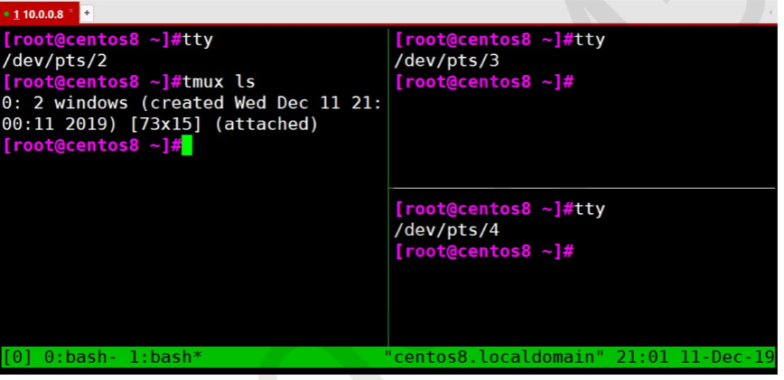

# 一、Linux基础

## 1 用户类型

- root 用户

  一个特殊的管理账户

  也被称为超级用户

  root 已经接近完整的系统控制

  对系统损害几乎有无限的能力

  除非必要不要登录 root 用户

- 普通/非特权用户

  权限有限

  造成损害的能力有限

## 2 终端 terminal

是与计算机相连的一种输入输出设备，它用来显示主机运算的输出，并接受主机要求的输入，通常离计算机较远。根据功能不同，可分为若干类。典型的终端包括显示器键盘套件，打印机打字机套件等。

随着技术的发展，控制台、终端这些不再是单独的物理设备，而是被键盘和显示器替代。现在计算机的 console 控制台和 tty 终端都是虚拟出来的概念。在概念上，键盘和显示器既是 console，也是 tty。至于是什么时候是 console，什么时候是 tty，取决于那一刻在做什么。

这里的虚拟指的是，Linux 操作系统中，以一种设备文件的方式保留 tty 和 console，当使用特定软件连接该主机时，就能看到当前连接所占用的终端设备文件，这样就表示该机器的一个终端被激活，正在使用中。

~~~shell
root@master01:~ 14:26:17 
# ls /dev/tty*
/dev/tty    /dev/tty16  /dev/tty24  /dev/tty32  /dev/tty40  /dev/tty49  /dev/tty57  /dev/tty8       /dev/ttyS14  /dev/ttyS22  /dev/ttyS30
/dev/tty0   /dev/tty17  /dev/tty25  /dev/tty33  /dev/tty41  /dev/tty5   /dev/tty58  /dev/tty9       /dev/ttyS15  /dev/ttyS23  /dev/ttyS31
/dev/tty1   /dev/tty18  /dev/tty26  /dev/tty34  /dev/tty42  /dev/tty50  /dev/tty59  /dev/ttyprintk  /dev/ttyS16  /dev/ttyS24  /dev/ttyS4
/dev/tty10  /dev/tty19  /dev/tty27  /dev/tty35  /dev/tty43  /dev/tty51  /dev/tty6   /dev/ttyS0      /dev/ttyS17  /dev/ttyS25  /dev/ttyS5
/dev/tty11  /dev/tty2   /dev/tty28  /dev/tty36  /dev/tty44  /dev/tty52  /dev/tty60  /dev/ttyS1      /dev/ttyS18  /dev/ttyS26  /dev/ttyS6
/dev/tty12  /dev/tty20  /dev/tty29  /dev/tty37  /dev/tty45  /dev/tty53  /dev/tty61  /dev/ttyS10     /dev/ttyS19  /dev/ttyS27  /dev/ttyS7
/dev/tty13  /dev/tty21  /dev/tty3   /dev/tty38  /dev/tty46  /dev/tty54  /dev/tty62  /dev/ttyS11     /dev/ttyS2   /dev/ttyS28  /dev/ttyS8
/dev/tty14  /dev/tty22  /dev/tty30  /dev/tty39  /dev/tty47  /dev/tty55  /dev/tty63  /dev/ttyS12     /dev/ttyS20  /dev/ttyS29  /dev/ttyS9
/dev/tty15  /dev/tty23  /dev/tty31  /dev/tty4   /dev/tty48  /dev/tty56  /dev/tty7   /dev/ttyS13     /dev/ttyS21  /dev/ttyS3
root@master01:~ 14:26:23 
# ls /dev/pts
0  ptmx
root@master01:~ 14:26:34 
# tty
/dev/pts/0

~~~

### 2.1 终端类型

控制台终端：/dev/console

串行终端：/dev/ttyS#

虚拟终端：tty，/dev/tty tty 可以有多个

伪终端：pty  /dev/pts/#  如：ssh 连接

图形终端：startx，xwindows

### 2.2 查看当前使用的终端

tty 查看当前使用的终端

~~~shell
root@master01:~ 14:26:34 
# tty
/dev/pts/0

~~~

## 3.交互式接口

### 3.1 交互式接口类型

GUI：Graphic User Interface

​	图形化界面

CLI：Command Line Interface

​	shell 程序

### 3.2 什么是 shell

shell 是 Linux 系统的用户界面，提供了用户与内核进行交互操作的一种接口。他用来接收用户输入的命令，并将其送到内核中去执行

shell 也被称为 Linux 的命令解释器，shell 本身是一个程序。将用户输入的命令行拆解为“命令名”和“参数”。接着根据命令名找到对应要执行的程序，对被执行的程序进行初始化。

shell 是一种程序语言，提供了变量、函数、条件判断、循环等开发语言功能。

### 3.3 各种 shell

sh

bash

zsh

tcsh

ksh

### 3.4 bash shell

查看当前使用的 shell

~~~shell
root@master01:~ 15:15:12 
# echo ${SHELL}
/bin/bash

~~~

显示系统所有的 shell

~~~shell
root@master01:~ 15:15:19 
# cat /etc/shells 
# /etc/shells: valid login shells
/bin/sh
/bin/bash
/usr/bin/bash
/bin/rbash
/usr/bin/rbash
/usr/bin/sh
/bin/dash
/usr/bin/dash
/usr/bin/tmux
/usr/bin/screen

~~~

## 4 设置主机名

~~~shell
# 临时生效
hostname NAME

# 永久生效，支持 Centos7 和 Ubuntu18.04 以上版本
hostnamectl set-hostname NAME
~~~

注意事项：

- 修改 hostname 需要 root 权限
- 主机名不支持使用下划线，但支持横线，可以使用字母、横线或数字
- 有些软件对主机名有要求
- 一般按照主机要求设置主机名，通常可以见名知意

## 5 命令提示符

登录 Linux 之后，默认的命令提示符毫无个性，无法明显辨别和显示生产环境，而导致误操作。

可以通过修改 PS1 变量实现个性的提示符格式

\# 表示管理员

$ 表示普通用户

~~~shell
# 查看当前的命令提示符
echo ${PS1}

#如果以root用户登录主机，则默认提示符为，对应的就是 上面的 [\u@\h \W]\$
[root@rocky6666 ~]#

#PS1中的值要单引号引用,如果是双引号，则某些替换符不会被解析
PS1='\e[31m[\u@\h \W]\$\e[0m'

#如果要永久保存，则要写文件
echo "PS1='\e[31;1m[\u@\h \W]\\$ \e[0m'">/etc/profile.d/env.sh
source /etc/profile.d/env.sh

#PS1变量中的常用选项
\d #曰期，格式为"星期 月 日"
\H #完整的主机名。如默认主机名"localhost.localdomain"。
\h #简写的主机名。如默认主机名"localhost"。
\t #24小时制时间，格式为"HH:MM:SS"。
\T #12小时制时间，格式为"HH:MM:SS"。
\A #24小时制时间，格式为"HH:MM"。
\@ #12小时制时间，格式为"HH:MM am/pm"。
\u #当前用户名。
\v #Bash版本信息。
\w #当前所在目录的完整名称。
\W #当前所在目录的最后一个目录。
\# #执行的第几条命令。
\$ #提示符。如果是 root 用户，则会显示提示符为"#"；如果是普通用户，则会显示提示符为"$"

#PS1中的颜色部份
\033[ #开始位
\033[0m #结束位
#上面的\033 可以换成 \e

#颜色设置 \e[ 颜色m 内容 \e[0m 颜色后面要用m结束，多个颜色，用；分割，只要一个m
\e[31m我是红色\e[0m

#各颜色表示方式
字体颜色 背景色
30 40 黑色
31 41 红色
32 42 绿色
33 43 黄色
34 44 蓝色
35 45 紫红色
36 46 青蓝色
37 47 白色

#字体颜色
\e[30m我是黑色\e[0m
\e[31m我是红色\e[0m
\e[32m我是绿色\e[0m
\e[33m我是黄色\e[0m
\e[34m我是蓝色\e[0m
\e[35m我是紫红色\e[0m
\e[36m我是青蓝色\e[0m
\e[37m我是白色\e[0m

#背景颜色
\e[40m我背景是黑色\e[0m
\e[41m我背景是红色\e[0m
\e[42m我背景是绿色\e[0m
\e[43m我背景是黄色\e[0m
\e[44m我背景是蓝色\e[0m
\e[45m我背景是紫红色\e[0m
\e[46m我背景是青蓝色\e[0m
\e[47m我背景是白色\e[0m
#字体颜色+背景颜色组合，字体颜色和背景颜色不分先后，因为值不一样
\e[30;41m红底黑字\e[0m
\e[41;30m红底黑字\e[0m

#特殊效果
0 #关闭效果
1 #高亮显示
3 #斜体
4 #下划线
5 #闪烁,闪烁效果与远程工具所在的环境有关
7 #反白显示
8 #隐藏
9 #删除线

#可组合使用，但如果效果有冲突时，以最后的为准，就是说，后面的效果，会覆盖前面的效果
\e[30;41;5m红底黑字闪烁\e[0m
\e[4;30;41;5m红底黑字下划线闪烁\e[0m
\e[0;4;30;41;5m红底黑字下划线闪烁\e[0m #这里的0;4;5 都表示效果，但后面的4;5覆盖了前面的0
\e[4;30;41;5;0m红底黑字下划线闪烁\e[0m #这样写，4;5的效果都被0去掉了
~~~

在 ubuntu2204 中，设置 PS1，如果要对所有普能用户生效，将 PS1 定义写在 /usr/share/bash-completion/bash_completion 的最下面，如里需要对每个用户单独定义，写在用户家目录的 .bashrc 文件的最下面。

## 6 执行命令

### 6.1 执行命令过程

输入命令后回车，提请shell程序找到键入命令所对应的可执行程序或代码，并由其分析后提交给内核分配资源将其运行起来

### 6.2 shell中可执行的两类命令

- 内部命令：由shell自带的，而且通过某命令形式提供，用户登录后自动加载并常驻内存中
- 外部命令：在文件系统路径下有对应的可执行程序文件，当执行命令时才从磁盘加载至内存中，执行完毕后从内存中删除

**区别指定的命令是内部或外部命令**

~~~shell
type COMMAND

type ls 		#区分是内部命令还是外部命令
type -t echo 	#简写，只给出类型，builtin｜alias｜file|keyword
type -a echo 	#列出所有，有可能是内部命令，也同时会是外部命令
bash -c help 	#查看bash中所有内容（不仅仅是内部命令）
help 			#查看bash中所有内容（不仅仅是内部命令）
enable 			#查看bash中所有内置命令
help echo 		#查看内部命令帮助

xuruizhao@master01:~$ type echo
echo is a shell builtin
xuruizhao@master01:~$ 
xuruizhao@master01:~$ type -t echo
builtin
xuruizhao@master01:~$ type -a echo
echo is a shell builtin
echo is /usr/bin/echo
echo is /bin/echo
xuruizhao@master01:~$ 

xuruizhao@master01:~$ type tree
tree is /usr/bin/tree

~~~

有内部命令，又有外部命令，因为不是所有主机都使用标准 shell，所以常用内部命令会有一个外部命令的备份，防止内部命令执行失败。

在命令执行时，shell 先判断是否是内部命令，如果是，则执行内部命令，如果不是，则去特定目录（PATH 规定的）下寻找外部命令。

bash shell 自身就是一个程序，里面有很多小工具，有用户通过终端连接主机，则该终端就有一个 bash 在后台运行

#### 6.2.1 内部命令相关

~~~shell
help 			#查看所有内部命令及帮助
enable 			#查看所有启用的内部命令
enable cmd 		#启用 cmd 命令
enable -n cmd 	#禁用内部 cmd 命令
enable -n 		#查看所有禁用的内部命令
~~~

#### 6.2.2 执行外部命令

查看外部命令路径

~~~shell
xuruizhao@master01:~$ whereis ls
ls: /usr/bin/ls /usr/share/man/man1/ls.1.gz

xuruizhao@master01:~$ which -a ls
/usr/bin/ls
/bin/ls
xuruizhao@master01:~$ 

~~~

~~~shell
[root@rokcy8 ~]# which ls
alias ls='ls --color=auto'
/usr/bin/ls

#ubuntu中的 which 不显示别名
root@ubuntu2204:~# which ls
/usr/bin/ls

#跳过别名
[root@rokcy8 ~]# which --skip-alias ls
/usr/bin/ls

# -a 表示在所有路径中查找匹配的命令，使用该命令时匹配第一个找到的
[root@rokcy8 ~]# which -a echo
/usr/bin/echo

#查看path
[root@rokcy8 ~]# echo $PATH
/usr/local/sbin:/usr/local/bin:/usr/sbin:/usr/bin:/root/bin
#创建root下的 bin 目录
[root@rokcy8 ~]# mkdir bin
#拷贝 echo 命令到 /root/bin/ 目录下
[root@rokcy8 ~]# cp /usr/bin/echo /root/bin/

[root@rokcy8 ~]# which -a echo
/usr/bin/echo
/root/bin/echo
~~~

**外部命令搜索路径**

~~~shell
#root用户
[root@rokcy8 ~]# echo $PATH
/usr/local/sbin:/usr/local/bin:/usr/sbin:/usr/bin:/root/bin

#普通用户
[root@rokcy8 ~]# su - mage
[mage@rokcy8 ~]$ echo $PATH
/home/mage/.local/bin:/home/mage/bin:/usr/local/bin:/usr/bin:/usr/local/sbin:/usr/bin
~~~

#### 6.2.3 Hash 缓存表

系统初始hash表为空，当外部命令执行时，默认会从PATH路径下寻找该命令，找到后会将这条命令的路径记录到hash表中，当再次使用该命令时，shell解释器首先会查看hash表，存在将执行之，如果不存在，将会去PATH路径下寻找，利用hash缓存表可大大提高命令的调用速率。

- hash 只对当前用户的当前终端进程有效，是一组临时数据;
- 只会缓存外部命令；
- 切换用户后无效;
- 退出重新登录后会被重置;

hash 命令常见用法

~~~shell
hash #显示当前终端进程中的 hash 缓存
hash -l #显示详创建此条 hash 的命令，可作为输入使用
hash -p path name #手动创建 hash
hash -t name #输出路径
hash -d name #删除指定 hash
hash -r # 清空所有的 hash
~~~

~~~shell
xuruizhao@master01:~$ hash
hash: hash table empty
xuruizhao@master01:~$ ls
xuruizhao@master01:~$ pwd
/home/xuruizhao
xuruizhao@master01:~$ ls
xuruizhao@master01:~$ ls
xuruizhao@master01:~$ hash
hits	command
   3	/usr/bin/ls
xuruizhao@master01:~$ 
xuruizhao@master01:~$ cp /usr/bin/ls /tmp/ls123
xuruizhao@master01:~$ hash
hits	command
   1	/usr/bin/cp
   3	/usr/bin/ls
xuruizhao@master01:~$ 

xuruizhao@master01:~$ hash -l
builtin hash -p /usr/bin/cp cp
builtin hash -p /usr/bin/ls ls

# 手动创建 hash
xuruizhao@master01:~$ hash -p /usr/bin/ls hello
xuruizhao@master01:~$ echo 111 > 01.txt
xuruizhao@master01:~$ hello
01.txt
xuruizhao@master01:~$ ls
01.txt
xuruizhao@master01:~$ hash
hits	command
   1	/usr/bin/cp
   2	/usr/bin/ls
   4	/usr/bin/ls
xuruizhao@master01:~$ hash -l
builtin hash -p /usr/bin/cp cp
builtin hash -p /usr/bin/ls hello
builtin hash -p /usr/bin/ls ls
xuruizhao@master01:~$ 

# 输出路径
xuruizhao@master01:~$ hash -t ls
/usr/bin/ls
xuruizhao@master01:~$ 

# 删除指定 hash
xuruizhao@master01:~$ hash -d hello
xuruizhao@master01:~$ hash -l
builtin hash -p /usr/bin/cp cp
builtin hash -p /usr/bin/ls ls
xuruizhao@master01:~$ hash 
hits	command
   1	/usr/bin/cp
   5	/usr/bin/ls
xuruizhao@master01:~$ 

# 清空所有 hash
xuruizhao@master01:~$ hash -r
xuruizhao@master01:~$ hash 
hash: hash table empty
xuruizhao@master01:~$ 

~~~

### 6.3 命令别名

对于经常执行的较长的命令，可以将其定义成较短的别名，以方便执行

~~~shell
alias 				#显示当前shell进程所有可用的命令别名
alias name 			#查看指定别名
alias NAME='VALUE' 	#定义别名NAME，其相当于执行命令VALUE
unalias 			#撤消别名
~~~

示例：

~~~shell
# 列出所有的别名
xuruizhao@master01:~$ alias
alias alert='notify-send --urgency=low -i "$([ $? = 0 ] && echo terminal || echo error)" "$(history|tail -n1|sed -e '\''s/^\s*[0-9]\+\s*//;s/[;&|]\s*alert$//'\'')"'
alias egrep='egrep --color=auto'
alias fgrep='fgrep --color=auto'
alias grep='grep --color=auto'
alias l='ls -CF'
alias la='ls -A'
alias ll='ls -alF'
alias ls='ls --color=auto'
xuruizhao@master01:~$ 

# 查看指定别名
xuruizhao@master01:~$ alias ls
alias ls='ls --color=auto'
xuruizhao@master01:~$ 

# 定义别名
xuruizhao@master01:~$ cd /etc/systemd/network/
xuruizhao@master01:/etc/systemd/network$ pwd
/etc/systemd/network
xuruizhao@master01:/etc/systemd/network$ cd 
xuruizhao@master01:~$ alias cdnet='cd /etc/systemd/network/'
xuruizhao@master01:~$ alias cdnet
alias cdnet='cd /etc/systemd/network/'
xuruizhao@master01:~$ cdnet
xuruizhao@master01:/etc/systemd/network$ pwd 
/etc/systemd/network
xuruizhao@master01:/etc/systemd/network$ 

# 撤销别名
xuruizhao@master01:~$ unalias cdnet
xuruizhao@master01:~$ alias cdnet
-bash: alias: cdnet: not found
xuruizhao@master01:~$ 

# 撤销所有别名
unalias -a
~~~

在命令行中定义的别名，仅对当前shell进程有效
如里需要永久有效，则要写配置文件：

- 仅对当前用户：~/.bashrc
- 对所有用户有效：/etc/bashrc， /etc/bash.bashrc(ubuntu)

编辑配置文件新加的别名不会立即生效，要退出重新登录或在当前进程中重新读取配置文件

~~~shell
source /path/to/config_file
. /path/to/config_file
~~~

如果别名同原命令同名，如果要执行原命令

~~~shell
\ALIASNAME
“ALIASNAME”
‘ALIASNAME’
command ALIASNAME
/path/commmand   # 只适用于外部命令
~~~

**命令执行优先级**
别名 -----> 内部命令 ------>hash--->外部命令

### 6.4 命令格式

~~~shell
COMMAND [OPTIONS...] [ARGUMENTS...]
COMMAND [COMMAND] [COMMAND] ....
COMMAND 		#命令
OPTIONS 		#选项，用于启用或关闭命令的某个或某些功能
ARGUMENTS 		#参数，命令的作用对象，比如:文件名，用户名等
[] 				#表示里面的内容是可选项，也就是说，一条命令，选项和参数是可以都没有的
... 			#表示可以有多个值，也就是说，一条命令，可以有多个选项，或多个参数
~~~

选项有多种风格：

- 短选项：UNIX 风格选项，-c 例如：-l, -h
- 长选项：GNU风格选项，--word 例如：--all, --human
- BSD风格选项：一个字母，例如：z，使用较少

~~~shell
id -u aaa

ls --all

ps -a
~~~

- 多个选项以及多个参数和命令之间使用空白字符分隔
- 取消和结束命令执行：Ctrl+c，Ctrl+d
- 多个命令可以用 ";" 符号分开
- 一个命令可以用\分成多行

## 7 常见命令

### 7.1 查看硬件信息

#### 7.1.1 查看CPU

lscpu 命令可以查看cpu信息

cat /proc/cpuinfo也可看查看到

~~~shell
xuruizhao@master01:~$ lscpu
Architecture:             x86_64
  CPU op-mode(s):         32-bit, 64-bit
  Address sizes:          45 bits physical, 48 bits virtual
  Byte Order:             Little Endian
CPU(s):                   4
  On-line CPU(s) list:    0-3
Vendor ID:                GenuineIntel
  Model name:             13th Gen Intel(R) Core(TM) i5-13500HX
    CPU family:           6
    Model:                191
    Thread(s) per core:   1    # 每个 core 有几个线程
    Core(s) per socket:   2    # 每个槽位有1个 core
    Socket(s):            2    # 服务器面板上有2个 cpu 槽位
    Stepping:             2
    BogoMIPS:             5376.00
    Flags:                ...
Virtualization features:  
  Hypervisor vendor:      VMware
  Virtualization type:    full
Caches (sum of all):      
  L1d:                    192 KiB (4 instances)
  L1i:                    128 KiB (4 instances)
  L2:                     5 MiB (4 instances)
  L3:                     48 MiB (2 instances)
NUMA:                     
  NUMA node(s):           1
  NUMA node0 CPU(s):      0-3

xuruizhao@master01:~$ cat /proc/cpuinfo 
~~~

#### 7.1.2 查看内存

- free
- cat /proc/meminfo
- lsmem

~~~shell
xuruizhao@master01:~$ free -h

xuruizhao@master01:~$ cat /proc/meminfo 
~~~

free 命令补充

~~~shell
# 1s 刷新一次数据
xuruizhao@master01:~$ free -hs 1

# 刷新两次后退出
xuruizhao@master01:~$ free -hc 2

total 		#系统总的可用物理内存大小
used 		#已被使用的物理内存大小
free 		#还有多少物理内存可用
shared 		#被共享使用的物理内存大小
buff/cache 	#被 buffer 和 cache 使用的物理内存大小
available 	#还可以被 应用程序 使用的物理内存大小

#free 是真正尚未被使用的物理内存数量。
#available 是应用程序认为可用内存数量，available = free + buffer + cache (大概的计算方法)

~~~

#### 7.1.3  查看磁盘和分区情况

~~~shell
xuruizhao@master01:~$ lsblk
NAME                 MAJ:MIN RM  SIZE RO TYPE MOUNTPOINTS
loop0                  7:0    0 63.8M  1 loop /snap/core20/2582
loop1                  7:1    0 63.8M  1 loop /snap/core20/2599
loop2                  7:2    0   87M  1 loop /snap/lxd/29351
loop3                  7:3    0 89.4M  1 loop /snap/lxd/31333
loop4                  7:4    0 50.9M  1 loop /snap/snapd/24505
loop5                  7:5    0 49.3M  1 loop /snap/snapd/24792
sda                    8:0    0  100G  0 disk 
├─sda1                 8:1    0    1M  0 part 
├─sda2                 8:2    0    2G  0 part 
└─sda3                 8:3    0   98G  0 part 
  ├─ubuntu--vg-lv--0 253:0    0   94G  0 lvm  /
  └─ubuntu--vg-lv--1 253:1    0    4G  0 lvm  /boot
sr0                   11:0    1    2G  0 rom  
xuruizhao@master01:~$ 
xuruizhao@master01:~$ cat /proc/partitions 
major minor  #blocks  name

   7        0      65296 loop0
   7        1      65296 loop1
   7        2      89128 loop2
   7        3      91548 loop3
   7        4      52116 loop4
   7        5      50476 loop5
   8        0  104857600 sda
   8        1       1024 sda1
   8        2    2097152 sda2
   8        3  102757376 sda3
  11        0    2086842 sr0
 253        0   98566144 dm-0
 253        1    4190208 dm-1
xuruizhao@master01:~$ 

# dm 是 lvm 设备
~~~

### 7.2 查看系统版本信息

#### 7.2.1 查看系统架构

~~~shell
xuruizhao@master01:~$ arch
x86_64
xuruizhao@master01:~$ 
~~~

#### 7.2.2 查看内核版本

~~~shell
xuruizhao@master01:~$ uname -r
5.15.0-140-generic
xuruizhao@master01:~$ 
~~~

#### 7.2.3 查看操作系统发行版本

~~~shell
#CentOS8 查看发行版本
[root@centos8 ~]#cat /etc/redhat-release
CentOS Linux release 8.1.1911 (Core)
[root@centos8 ~]#cat /etc/os-release
NAME="CentOS Linux"
VERSION="8 (Core)"
ID="centos"
ID_LIKE="rhel fedora"
VERSION_ID="8"
PLATFORM_ID="platform:el8"
PRETTY_NAME="CentOS Linux 8 (Core)"
ANSI_COLOR="0;31"
CPE_NAME="cpe:/o:centos:centos:8"
HOME_URL="https://www.centos.org/"
BUG_REPORT_URL="https://bugs.centos.org/"
CENTOS_MANTISBT_PROJECT="CentOS-8"
CENTOS_MANTISBT_PROJECT_VERSION="8"
REDHAT_SUPPORT_PRODUCT="centos"
REDHAT_SUPPORT_PRODUCT_VERSION="8"

[root@centos8 ~]#lsb_release -a
LSB Version: :core-4.1-amd64:core-4.1-noarch
Distributor ID: CentOS
Description: CentOS Linux release 8.1.1911 (Core)
Release: 8.1.1911
Codename: Core

#ubuntu查看发行版本
xuruizhao@master01:~$ cat /etc/os-release 
PRETTY_NAME="Ubuntu 22.04.5 LTS"
NAME="Ubuntu"
VERSION_ID="22.04"
VERSION="22.04.5 LTS (Jammy Jellyfish)"
VERSION_CODENAME=jammy
ID=ubuntu
ID_LIKE=debian
HOME_URL="https://www.ubuntu.com/"
SUPPORT_URL="https://help.ubuntu.com/"
BUG_REPORT_URL="https://bugs.launchpad.net/ubuntu/"
PRIVACY_POLICY_URL="https://www.ubuntu.com/legal/terms-and-policies/privacy-policy"
UBUNTU_CODENAME=jammy
xuruizhao@master01:~$ 
xuruizhao@master01:~$ cat /etc/issue
Ubuntu 22.04.5 LTS \n \l

xuruizhao@master01:~$ 
xuruizhao@master01:~$ lsb_release -a
No LSB modules are available.
Distributor ID:	Ubuntu
Description:	Ubuntu 22.04.5 LTS
Release:	22.04
Codename:	jammy
xuruizhao@master01:~$ 

~~~

### 7.3 日期和时间

Linux 的两种时钟

- 系统时钟：由 Linux 内核通过 CPU 的工作频率进行的
- 硬件时钟：主板

**date 显示和设置系统时间**

~~~shell
Usage: date [OPTION]... [+FORMAT]
or: date [-u|--utc|--universal] [MMDDhhmm[[CC]YY][.ss]]
~~~

~~~shell
xuruizhao@master01:~$ date 
Wed Aug 20 10:06:16 PM CST 2025

# 显示时区信息
xuruizhao@master01:~$ date -R
Wed, 20 Aug 2025 22:06:20 +0800
xuruizhao@master01:~$ 

# 时间戳
# 从 1970 年 1 月 1 日 0 时 0 分 0 秒到现在过了多少秒
xuruizhao@master01:~$ date +%s
1755698829
xuruizhao@master01:~$ 

xuruizhao@master01:~$ date +%F
2025-08-20
xuruizhao@master01:~$ date +"%F %T"
2025-08-20 22:08:45
xuruizhao@master01:~$ date +"%Y %F %T"
2025 2025-08-20 22:08:56
xuruizhao@master01:~$ date +"%Y %m %d"
2025 08 20
xuruizhao@master01:~$ 

~~~

**clock，hwclock 显示硬件时钟**

~~~shell
clock [function] [option...]
hwclock [function] [option...]

#常用选项
-s|--hctosys 	#以硬件时钟为准，校正系统时钟
-w|--systohc 	#以系统时钟为准，校正硬件时钟
~~~

**时区**

~~~shell
xuruizhao@master01:~$ ll /etc/localtime 
lrwxrwxrwx 1 root root 33 May 30 15:21 /etc/localtime -> /usr/share/zoneinfo/Asia/Shanghai
xuruizhao@master01:~$ 

~~~

设置时区

~~~shell
xuruizhao@master01:~$ timedatectl list-timezones

xuruizhao@master01:~$ timedatectl set-timezone Asia/Shanghai
xuruizhao@master01:~$ timedatectl status
               Local time: Wed 2025-08-20 22:13:07 CST
           Universal time: Wed 2025-08-20 14:13:07 UTC
                 RTC time: Wed 2025-08-20 14:13:07
                Time zone: Asia/Shanghai (CST, +0800)
System clock synchronized: yes
              NTP service: active
          RTC in local TZ: no
xuruizhao@master01:~$ 

~~~

**日历**

~~~shell
root@master01:~ 22:14:10 
# cal
    August 2025       
Su Mo Tu We Th Fr Sa  
                1  2  
 3  4  5  6  7  8  9  
10 11 12 13 14 15 16  
17 18 19 20 21 22 23  
24 25 26 27 28 29 30  
31 
~~~

### 7.4 关机和重启

关机

~~~shell
halt
poweroff
init 0
shutdown -h now
~~~

重启

~~~shell
reboot
init 6
shutdown -r now
~~~

关机或重启：shutdown

shutdown 程序会广播己登录的用户，被看作是安全的关机命令

是一个计划关机任务，可撤销

~~~shell
shutdown [OPTION]... [TIME] [MESSAGE]
shutdown 				#一分钟后关机
shutdown +10 			#10分钟后关机
shutdown 01:02 			#1点过两分关机
shutdown -r|--reboot 	#一分钟后重启
shutdown -r now 		#现在重启
shutdown -H|--halt 		#一分钟后调用halt 关机
shutdown -P|--poweroff 	#一分钟后调用poweroff 关机
shutdown -c 			#取消关机计划
~~~

### 7.5 用户登录信息查看命令

- whoami：显示当前登录用户
- who：系统当前所有的登录会话
- w：当前系统所有登录会话及所做的操作

~~~shell
xuruizhao@master01:~$ whoami
xuruizhao
xuruizhao@master01:~$ who am i
root     pts/0        2025-08-20 11:13 (192.168.121.1)
xuruizhao@master01:~$ 

~~~

~~~shell
xuruizhao@master01:~$ who
root     pts/0        2025-08-20 11:13 (192.168.121.1)
xuruizhao@master01:~$ 

~~~

~~~shell
xuruizhao@master01:~$ w
 22:28:51 up 1 day, 20:48,  1 user,  load average: 1.44, 1.38, 1.69
USER     TTY      FROM             LOGIN@   IDLE   JCPU   PCPU WHAT
root     pts/0    192.168.121.1    11:13    1.00s  3.30s  0.02s w
xuruizhao@master01:~$ 

#w [options]
#显示当前所有登录用户的具体信息
w
19:19:03 up 28 min, 2 users, load average: 0.04, 0.05, 0.11
USER TTY FROM LOGIN@ IDLE JCPU PCPU WHAT
root pts/0 192.168.31.236 18:40 2.00s 0.09s 0.00s w
aaa tty2 tty2 18:41 38:45 24.98s 0.04s
/usr/libexec/gsd-disk-utility-notify
#登录名 终端 来源IP 登录时间 空闲时间 当前终端中所有进程使用cpu的时间,不包括后台作业占用的时间 当前进程使用的cpu的时间
#load average 表示平均负载，最近一分钟，最近五分钟，最近15分钟

#查看特定用户
w root
~~~

### 7.6 文本编辑

- nano 
- vim
- gedit 图形化工具

范例: 创建登录提示文件 /etc/motd
参考网站: https://www.bootschool.net/ascii-art

### 7.7 会话管理

命令行的典型使用方式是，打开一个终端窗口（terminal window，以下简称"窗口"），在里面输入命令。用户与计算机的这种临时的交互，称为一次"会话"（session）

会话的一个重要特点是，窗口与其中启动的进程是连在一起的。打开窗口，会话开始；关闭窗口，会话结束，会话内部的进程也会随之终止，不管有没有运行完

一个典型的例子就是，SSH 登录远程计算机，打开一个远程窗口执行命令。这时，网络突然断线，再次登录的时候，是找不回上一次执行的命令的。因为上一次 SSH 会话已经终止了，里面的进程也随之消失了。

为了解决这个问题，会话与窗口可以"解绑"：窗口关闭时，会话并不终止，继续运行，等到以后需要的时候，再让会话"绑定" 其他窗口

终端复用器软件就是会话与窗口的"解绑"工具，将它们彻底分离。

1. 它允许在单个窗口中，同时访问多个会话。这对于同时运行多个命令行程序很有用。
2. 它可以让新窗口"接入"已经存在的会话。
3. 它允许每个会话有多个连接窗口，因此可以多人实时共享会话。
4. 它还支持窗口任意的垂直和水平拆分。

类似的终端复用器还有Screen，Tmux

#### 7.7.1 screen

使用 screen 可以实现会话管理，例如：新建会话、共享会话等

注意：Centos7 来自于 base 源，Centos8 来自 epel 源

~~~shell
# Centos7
yum install -y screen

# Centos8
dnf install -y epel-release
dnf install -y screen

# ubuntu
apt install -y  screen
~~~

screen 命令常见用法：

~~~shell
screen –S [SESSION] 	#创建新screen会话
screen –x [SESSION] 	#加入screen会话
screen -r [SESSION] 	#恢复某screen会话
screen -ls 				#显示所有已经打开的screen会话
Ctrl+a,d 				#剥离当前screen会话
exit 					#退出并关闭screen会话
~~~

~~~shell
[root rockylinux-1 ~] WORK 130 
# cat test.sh 
#!/bin/bash

for i in `seq 1000`;
do
	echo $i
	sleep 1
done
[root rockylinux-1 ~] WORK 0 
# 
[root rockylinux-1 ~] WORK 0 
# screen -S test

[roottest rockylinux-1 ~] WORK 0 
# exit
exit

[screen is terminating]
[root rockylinux-1 ~] WORK 0 
# 
~~~

#### 7.7.2 tmux

tmux 是一个终端复用器（terminal multiplexer），类似 screen，但是更易用，也更强大
Tmux 就是会话与窗口的"解绑"工具，将它们彻底分离，功能如下

- 它允许在单个窗口中，同时访问多个会话。这对于同时运行多个命令行程序很有用。
- 它可以让新窗口"接入"已经存在的会话。
- 它允许每个会话有多个连接窗口，因此可以多人实时共享会话。
- 它还支持窗口任意的垂直和水平拆分

安装

~~~shell
# Centos
yum install -y tmux

# Ubuntu
apt update
apt install -y tmux
~~~

### 7.8 输出信息 echo

#### 7.8.1 echo 基本用法

echo 命令可以将后面跟的字符进行输出

功能：显示字符，echo 会将输入的字符串送往标准输出。输出的字符串间以空白字符隔开, 并在最后加上换行号

~~~shell
#echo: echo [-neE] [字符串]

-n 		#输出完成后不换行
-e 		#转义特定字符串
-E 		#不转义，原样输出，缺省选项

#启用命令选项-e，若字符串中出现以下字符，则特别加以处理，而不会将它当成一般文字输出

\a 		#发出警告声
\b 		#退格键
\c 		#最后不加上换行符号
\e 		#escape，相当于\033
\n 		#换行且光标移至行首
\r 		#回车，即光标移至行首，但不换行
\t 		#插入tab
\\ 		#插入\字符
\0nnn 	#插入nnn（八进制）所代表的ASCII字符
\xHH 	#插入HH（十六进制）所代表的ASCII数字（man 7 ascii
~~~

示例

~~~shell
xuruizhao@docker02:~$ echo "hello world"
hello world
xuruizhao@docker02:~$ echo -n "hello world"
hello worldxuruizhao@docker02:~$ 

xuruizhao@docker02:~$ echo "hello\nworld"
hello\nworld
xuruizhao@docker02:~$ echo -e "hello\nworld"
hello
world
xuruizhao@docker02:~$ 
~~~

显示变量

~~~shell
echo "$VAR_NAME" #用变量值替换，弱引用
echo '$VAR_NAME' #变量不会替换，强引用，原样输出
~~~

~~~shell
xuruizhao@docker02:~$ title=cto
xuruizhao@docker02:~$ echo $title
cto
xuruizhao@docker02:~$ echo "$title"
cto
xuruizhao@docker02:~$ echo ${title}
cto
xuruizhao@docker02:~$ echo '$title'
$title
xuruizhao@docker02:~$ 
xuruizhao@docker02:~$ echo \$PATH
$PATH

~~~

#### 7.8.2 echo 高级用法

在终端中，ANSI 定义了用于屏幕显示的 Escape 屏幕控制码

可以显示具有颜色的字符，其格式如下:

~~~shell
"\033[字符背景颜色;字体颜色;特效m字符串\033[0m"

"\033[41;32mtest\033[0m"

\033[30m -- \033[37m #设置前景色
\033[40m -- \033[47m #设置背景色
~~~

~~~shell
# 字符背景颜色范围: 40--47
40:黑
41:红
42:绿
43:黄
44:蓝
45:紫
46:深绿
47:白色

# 字体颜色: 30--37
30: 黑
31: 红
32: 绿
33: 黄
34: 蓝
35: 紫
36: 深绿
37: 白色
~~~

加颜色只是以下控制码中的一种，下面是常见的一些 ANSI 控制码：

~~~shell
\033[0m #关闭所有属性
\033[1m #设置高亮度
\033[4m #下划线
\033[5m #闪烁
\033[7m #反显
\033[8m #消隐
\033[nA #光标上移n行
\033[nB #光标下移n行
\033[nC #光标右移n列
\033[nD #光标左移n列
\033[x;yH #设置光标位置x行y列
\033[2J #清屏
\033[K #清除从光标到行尾的内容
\033[s #保存光标位置
\033[u #恢复光标位置
\033[?25l #隐藏光标
\033[?25h #显示光标
\033[2J\033[0;0H #清屏且将光标置顶
~~~

## 8字符集和编码及语言环境

许多场合下，字符集与编码这两个概念常被混为一谈，但两者是有差别的。字符集与字符集编码是两个不同层面的概念
charset 是 character set 的简写，即字符集，即二进制和字符的对应关系，不关注最终的存储形式
encoding 是 charset encoding 的简写，即字符集编码，简称编码，实现如何将字符转化为实际的二进制进行存储，编码决定了空间的使用的大小

### 8.1 ASCII 码

计算机内部，所有信息最终都是一个二进制值。上个世纪60年代，美国制定了一套字符编码，对英语字符与二进制位之间的关系，做了统一规定，即 ASCII（American Standard Code for InformationInterchange）码
ASCII 码一共规定了128个字符的编码，占用了一个字节的后面7位，最前面的一位统一规定为 0

Oct 8进制

Dec 10进制 ascii 编码

Hex 16进制

Bin 2进制

Char 字符

查看 ASCII 表

~~~shell
dnf install -y man-pages

man ascii
~~~

### 8.2 Unicode

由于计算机是美国人发明的，因此，最早只有128个字符被编码到计算机里，即 ASCII 编码，但是要处理中文显然一个字节是不够的，至少需要两个字节，而且还不能和ASCII 编码冲突，所以，中国制定了 GB2312 编码，用来把中文编进去。

全世界有上百种语言，日本把日文编到 Shift_JIS 里，韩国把韩文编到 Euc-kr 里，各国有各国的标准，就会不可避免地出现冲突，结果就是，在多语言混合的文本中，显示出来会有乱码

为了表示世界上所有语言中的所有字符。每一个符号都给予一个独一无二的编码数字，Unicode 是一个很大的集合，现在的规模可以容纳100多万个符号。Unicode 仅仅只是一个字符集，规定了每个字符对应的二进制代码，至于这个二进制代码如何存储则没有规定

**Unicode编码方案：**

- UTF-8： 变长，1到4个字节
- UTF-16：变长，2或4个字节
- UTF-32：固定长度，4个字节

UTF-8 是目前互联网上使用最广泛的一种 Unicode 编码方式，可变长存储。使用 1- 4 个字节表示一个字符，根据字符的不同变换长度。编码规则如下：

对于单个字节的字符，第一位设为 0，后面的 7 位对应这个字符的 Unicode 码。因此，对于英文中的 0-127 号字符，与 ASCII 码完全相同。这意味着 ASCII 码的文档可用 UTF-8 编码打开

对于需要使用 N 个字节来表示的字符（N > 1），第一个字节的前 N 位都设为 1，第 N + 1 位设为0，剩余的 N - 1 个字节的前两位都设为 10，剩下的二进制位则使用这个字符的 Unicode 码来填充

### 8.3 语言环境

默认系统为英文环境，可以修改为中文环境，从而查看帮助或提示可以变为中文

范例：临时修改LANG变量实现中文语言提示

~~~shell
xuruizhao@docker02:~$ echo $LANG
en_US.UTF-8
xuruizhao@docker02:~$ 
xuruizhao@docker02:~$ localectl status 
   System Locale: LANG=en_US.UTF-8
       VC Keymap: n/a
      X11 Layout: us
       X11 Model: pc105
xuruizhao@docker02:~$ 
xuruizhao@docker02:~$ localectl list-locales 
C.UTF-8
en_US.UTF-8
xuruizhao@docker02:~$ 

~~~

修改语言

~~~shell
#通用方法
[root@rocky8 ~]# localectl set-locale LANG=zh_CN.utf8

#或者下面方式,CentOS8支持,但ubuntu和Centos7不支持,不建议使用
[root@rocky8 ~]# localectl set-locale zh_CN.utf8
[root@rocky8 ~]# localectl status
System Locale: LANG=zh_CN.utf8
VC Keymap: us
X11 Layout: us
[root@rocky8 ~]#echo $LANG
zh_CN.utf8

#重新登录后可以看到中文环境
[root@rocky8 ~]# exit

~~~

Ubuntu 修改语言环境为中文

~~~shell
[root@ubuntu2204 ~]# localectl status
System Locale: LANG=en_US.UTF-8
VC Keymap: n/a
X11 Layout: us
X11 Model: pc105
[root@ubuntu2204 ~]# apt install language-pack-zh-hans -y
[root@ubuntu2204 ~]# localectl list-locales
C.UTF-8
en_US.UTF-8
zh_CN.UTF-8
zh_SG.UTF-8
[root@ubuntu2204 ~]# localectl set-locale LANG=zh_CN.utf8
~~~

## 9 命令行扩展和被括起来的集合

### 9.1 命令行扩展：`` 和 $()

把一个命令的输出打印给另一个命令的参数，放在``中的一定是有输出信息的命令

~~~shell
$(COMMAND)

`COMMAND`
~~~

变量
双引号，弱引用，可以解析内容
单引号，强引用，原样输出

命令

\`cmd` 展开
$(cmd) 展开

比较 "" '' `` 的区别

~~~shell
[root@ubuntu2204 ~]# echo "echo $HOSTNAME"
echo ubuntu2204

[root@ubuntu2204 ~]# echo 'echo $HOSTNAME'
echo $HOSTNAME

[root@ubuntu2204 ~]# echo `echo $HOSTNAME`
ubuntu2204

#结论：
单引号：强引用,六亲不认，变量和命令都不识别，都当成了普通的字符串,"最傻"
双引号：弱引用,不能识别命令，可以识别变量,"半傻不精"
反向单引号：里面的内容必须是能执行的命令并且有输出信息,变量和命令都识别，并且会将反向单引号的内容
当成命令进行执行后，再交给调用反向单引号的命令继续,"最聪明"
~~~

范例：$( ) 和 ``

~~~shell
xuruizhao@docker02:~$ a=id
xuruizhao@docker02:~$ echo $a
id

xuruizhao@docker02:~$ echo `$a`
uid=1001(xuruizhao) gid=1001(xuruizhao) groups=1001(xuruizhao)
xuruizhao@docker02:~$ echo $($a)
uid=1001(xuruizhao) gid=1001(xuruizhao) groups=1001(xuruizhao)
xuruizhao@docker02:~$ 

~~~

### 9.2 括号扩展 {}

{} 可以实现打印重复字符串的简化形式

~~~shell
{1..9}
{1,3,8}
~~~

~~~shell
xuruizhao@docker02:~$ echo file{1..3}
file1 file2 file3
xuruizhao@docker02:~$ echo file{1,3,6}
file1 file3 file6
xuruizhao@docker02:~$ echo {a..z}
a b c d e f g h i j k l m n o p q r s t u v w x y z
xuruizhao@docker02:~$ 
xuruizhao@docker02:~$ echo {1..100..10}
1 11 21 31 41 51 61 71 81 91
xuruizhao@docker02:~$ 

~~~

关闭和启用 {} 功能

~~~shell
xuruizhao@docker02:~$ echo $-
himBHs
xuruizhao@docker02:~$ set +B
xuruizhao@docker02:~$ echo $-
himHs
xuruizhao@docker02:~$ echo {1..3}
{1..3}
xuruizhao@docker02:~$ set -B
xuruizhao@docker02:~$ echo {1..3}
1 2 3
xuruizhao@docker02:~$ 

~~~

## 10 tab 键补全

tab 键可以实现命令及路径等补全，提高输入效率，避免出错

### 10.1 命令补全

- 内部命令
- 外部命令：bash根据PATH环境变量定义的路径，自左而右在每个路径搜寻以给定命令名称的文件，第一次找到的命令即为要执行的命令
- 命令的子命令补全，需要安装 bash-completion

注意：用户给定的字符串只有一条惟一对应的命令，直接补全，否则，再次Tab会给出列表

### 10.2 路径不全

把用户给出的字符串当做路径开头，并在其指定上级目录下搜索以指定的字符串开头的文件名

如果唯一：直接补全

否则：再次Tab给出列表

## 11 命令行历史

执行某个命令后，系统会在内存中记录下此命令，此时只记录在内存中

当正常退出终端后，内存中记录下来的执行命令的历史，会保存到用户家目录下的 .bash_history 文件中

当用户下次登录，系统会自动将该文件中的内容加载到内存

被写入命令历史的，包括错误的命令

默认记录最近1000条，其配置在 /etc/profile 文件中的 HISTSIZE 字段中，可以根据需要修改

利用命令历史，可以用它来重复执行命令，提高输入效率

命令：history
~~~shell
history [-c] [-d offset] [n]
history -anrw [filename]
history -ps arg [arg...]
#常用选项
-c 				#清空命令历史
-d offset 		#删除历史中指定的第offset个命令
n 				#显示最近的n条历史
-a 				#追加本次会话新执行的命令历史列表至历史文件
-r 				#读历史文件附加到历史列表
-w 				#保存历史列表到指定的历史文件
-n 				#读历史文件中未读过的行到历史列表
-p 				#展开历史参数成多行，但不存在历史列表中
-s 				#展开历史参数成一行，附加在历史列表后
~~~

命令历史相关环境变量

~~~shell
HISTSIZE 												#命令历史记录的条数
HISTFILE 												#指定历史文件，默认为 ~/.bash_history
HISTFILESIZE 											#命令历史文件记录历史的条数
HISTTIMEFORMAT="%F %T `whoami` " 						#显示时间和用户
HISTIGNORE="str1:str2*:…" 								#忽略str1命令，str2开头的历史
HISTCONTROL=ignoredups|ignorespace|ignoreboth|erasedups #控制命令历史的记录方式
ignoredups 												#是默认值，可忽略重复的命令，连续且相同为“重复”
ignorespace 											#忽略所有以空白开头的命令
ignoreboth 												#相当于ignoredups, ignorespace的组合
erasedups 												#删除重复命令

~~~

## 12 调用命令行历史

~~~shell
#重复前一个命令方法
重复前一个命令使用上方向键，并回车执行
按 !! 并回车执行
输入!-1 并回车执行
按 Ctrl+p 并回车执行

!:0 										#执行前一条命令（去除参数）
!n 											#执行history命令输出对应序号n的命令
!-n 										#执行history历史中倒数第n个命令
!string 									#重复前一个以“string”开头的命令
!?string 									#重复前一个包含string的命令
!string:p 									#仅打印命令历史，而不执行
!$:p 										#打印输出 !$ （上一条命令的最后一个参数）的内容
!*:p 										#打印输出 !*（上一条命令的所有参数）的内容
^string 									#删除上一条命令中的第一个string
^string1^string2 							#将上一条命令中的第一个string1替换为string2
!:gs/string1/string2 						#将上一条命令中所有的string1都替换为 string2

使用up（向上）和down（向下）键来上下浏览从前输入的命令
ctrl-r来在命令历史中搜索命令
（reverse-i-search）`’：
Ctrl+g：从历史搜索模式退出

#要重新调用前一个命令中最后一个参数
!$ 					#表示前一个命令中最后一个参数
Esc, . 				#点击Esc键后松开，然后点击 . 键
Alt+ . 				#按住Alt键的同时点击 . 键
command !^ 			#利用上一个命令的第一个参数做command的参数
command !$ 			#利用上一个命令的最后一个参数做command的参数
command !* 			#利用上一个命令的全部参数做command的参数
command !:n 		#利用上一个命令的第n个参数做command的参数
command !n:^ 		#调用第n条命令的第一个参数
command !n:$ 		#调用第n条命令的最后一个参数
command !n:m 		#调用第n条命令的第m个参数
command !n:* 		#调用第n条命令的所有参数
command !string:^ 	#从命令历史中搜索以 string 开头的命令，并获取它的第一个参数
command !string:$ 	#从命令历史中搜索以 string 开头的命令,并获取它的最后一个参数
command !string:n 	#从命令历史中搜索以 string 开头的命令，并获取它的第n个参数
command !string:* 	#从命令历史中搜索以 string 开头的命令，并获取它的所有参数
~~~

## 13 bash的快捷键

~~~shell
Ctrl + l 			#清屏，相当于clear命令
Ctrl + o 			#执行当前命令，并重新显示本命令
Ctrl + s 			#阻止屏幕输出，锁定
Ctrl + q 			#允许屏幕输出，解锁
Ctrl + c 			#终止命令
Ctrl + z 			#挂起命令
Ctrl + a 			#光标移到命令行首，相当于Home
Ctrl + e 			#光标移到命令行尾，相当于End
Ctrl + f 			#光标向右移动一个字符
Ctrl + b 			#光标向左移动一个字符
Ctrl + xx 			#光标在命令行首和光标之间移动
ctrl+ >(方向键) 	  #光标向右移动一个单词尾，相当于 Alt + f
ctrl+ <(方向键) 	  #光标向左移动一个单词首，相当于 Alt + b
Ctrl + u 			#从光标处删除至命令行首
Ctrl + k 			#从光标处删除至命令行尾
Alt + r 			#删除当前整行
Ctrl + w 			#从光标处向左删除至单词首
Alt + d 			#从光标处向右删除至单词尾
Alt + Backspace 	#删除左边单词
Ctrl + d 			#删除光标处的一个字符
Ctrl + h 			#删除光标前的一个字符
Ctrl + y 			#将删除的字符粘贴至光标后
Alt + c 			#从光标处开始向右更改为首字母大写的单词
Alt + u 			#从光标处开始，将右边一个单词更改为大写
Alt + l 			#从光标处开始，将右边一个单词更改为小写
Ctrl + t			#交换光标处和之前的字符位置
Alt + t 			#交换光标处和之前的单词位置
Alt + # 			#提示输入指定字符后，重复显示该字符#次			
~~~

:warning:Alt 组合快捷键经常和其他软件冲突

例如 xshell 中的快捷键

## 14 登录提示

### 14.1 登录前提示

在命令行模式下本地终端(tty1~tty6)登录界面，会有几行提示文字，

这些文字都保存在/etc/issue文件中，可以自行修改

~~~shell
/etc/issue
/etc/issue.d/

#issue 支持转义字符，全部可用的转义字符可以通过 man agetty 查看，这里列出常用的

\d #显示当前系统日期
\S #显示操作系统名称
\m #显示硬件体系结构，如i386、i686等
\n #显示主机名
\o #显示域名
\r #显示内核版本
\t #显示当前系统时间
\u #显示当前登录用户的序列号
~~~

如果是远程终端ssh 登录，则其登录前信息，可以放在/etc/issue.net 中，但是该文件中的内容不支持转义

如果要使用远程终端ssh 登录前的提示信息，还需要修改sshd的相关配置文件
~~~shell
vim /etc/ssh/sshd_config
#Banner none 将此处的banner 指向对应的文件即可
Banner /etc/issue.net
#重启sshd 服务
service sshd restart
~~~

### 14.2 登录后提示

motd：message of the day
当用户从终端登录时，此文件的内容将会显示在终端上，如果shell工具支持中文，也可显示。

内容由使用者定制，经常用于通告信息，欢迎提示等。

但是，此文件只适用于命令行界面，如果是图形界面登录，将不显示此文件内容。

~~~shell
/etc/motd
/etc/motd.d/
~~~

~~~shell
#ubuntu2204中没有该文件，可自行创建
[root@ubuntu2204 ~]# ls /etc/motd
ls: cannot access '/etc/motd': No such file or directory

#登录后的提示来自于此目录下不同文件，如果不需要默认提示，可以将该目录清空
[root@ubuntu2204 ~]# ls /etc/update-motd.d/
00-header 85-fwupd 91-release-upgrade 98-fsck-at-reboot
10-help-text 88-esm-announce 92-unattended-upgrades 98-reboot-required
50-landscape-sysinfo 90-updates-available 95-hwe-eol
50-motd-news 91-contract-ua-esm-status 97-overlayrootMagdu
~~~

# 二、获得帮助

**获取帮助的能力决定了技术的能力！**

- whatis & whereis 命令
- command --help 选项
- man 手册
- 程序自带文档 /usr/share/doc
- 项目官网文档
- 行业网站
- 搜索引擎

## 1 whatis & whereis

whatis 使用数据库来显示命令的简短描述，以及对应的man手册的章节

刚装完系统此命令不可用，其数据要进行初始化，

如果要立即使用，则可手动初始化

~~~shell
#CentOS 7 版本以后
mandb

#CentOS 6 版本之前
makewhatis
~~~

~~~shell
[root@rocky8 ~]# whatis ls
ls (1) - list directory contents
ls (1p) - list directory contents
[root@ubuntu2204 ~]# whatis ls
ls (1) - list directory contents
[root@ubuntu2204 ~]# mandb
Purging old database entries in /usr/share/man...
Processing manual pages under /usr/share/man...
Purging old database entries in /usr/share/man/pt...
......

~~~

whereis 可以列出命令或系统文件路径，以及其对应的man 手册中的文档路径
~~~shell
xuruizhao@docker02:~$ whereis ls
ls: /usr/bin/ls /usr/share/man/man1/ls.1.gz
xuruizhao@docker02:~$ whereis pwd
pwd: /usr/bin/pwd /usr/share/man/man1/pwd.1.gz
xuruizhao@docker02:~$ 
~~~

## 2 查看命令的帮助

### 2.1 内部命令帮助

~~~shell
help COMMAND
#内部命令都在bash中，包括一些全局变量，可以在man手册中查看全部bash信息
man bash
~~~

~~~shell
#直接help，查看所有内部命令帮助
[root@ubuntu2204 ~]# help
[root@ubuntu2204 ~]# type history
history is a shell builtin
[root@ubuntu2204 ~]# help history
history: history [-c] [-d offset] [n] or history -anrw [filename] or history -ps
arg [arg...]
.........
~~~

### 2.2 外部命令及软件帮助

~~~shell
COMMAND --help|-h
man COMMAND
info COMMAND

#程序自身的帮助文档：README、INSTALL、ChangeLog 等
#项目官网文档
#行业网站
#搜索引擎
~~~

## 3 外部命令的 --help 或 -h 选项

显示用法总结和参数列表，大多数命令使用，但并非所有的

~~~shell
[root@ubuntu2204 ~]# ls --help
Usage: ls [OPTION]... [FILE]...
......
......
[root@ubuntu2204 ~]# date --help
Usage: date [OPTION]... [+FORMAT]
......
......
[root@ubuntu2204 ~]# cal -h
Usage: cal [general options] [-jy] [[month] year]
......
......
[root@ubuntu2204 ~]# date -h
date: invalid option -- 'h'
Try 'date --help' for more information.

~~~

格式说明

| 常见用法   | 含义                           |
| ---------- | ------------------------------ |
| []         | 表示是可选项                   |
| CAPS 或 <> | 表示可变数据                   |
| ...        | 表示是一个列表，即可以有多个值 |
| x\|y\|z    | x 或 y 或 z                    |
| -abc       | -a -b -c 多个选项写在一起      |
| {}         | 表示分组                       |

## 4 man 命令

man 是单词 manual 的简写，是Linux系统中的帮助手册和文档
man 是一个外部命令，基本质就是读取特定文件，进行输出，其读取的文件一般位于/usr/share/man/目录下
新安装一个软件或程序后，对应的man手册也会放到/usr/share/man/目录下
几乎每个命令都有man的 “页面“

在线手册

~~~shell
https://man7.org/linux/man-pages/index.html
https://man7.org/linux/man-pages/dir_all_alphabetic.html
~~~

安装

~~~shell
yum install man-pages
~~~

**man 页面分组**

不同类型的帮助称为不同的章节。

~~~shell
xuruizhao@docker02:~$ man man
~~~

标准man 手册一般有以下几个章节:
1. 可执行程序或 shell 命令
2. 系统调用(内核提供的函数)
3. 库调用(程序库中的函数

4. 特殊文件(通常位于 /dev)

5. 文件格式和规范，如 /etc/passwd
6. 游戏
7. 杂项
8. 系统管理命令(通常只针对 root 用户)
9. 内核API

**man 命令的配置文件：**

~~~shell
#CentOS 6 之前版 man 的配置文件
/etc/man.config
#CentOS 7 之后版 man 的配置文件
/etc/man_db.conf
#ubuntu man 的配置文件
/etc/manpath.config
~~~

**man 命令常见用法：**

~~~shell
#man[选项...] [章节] 手册页...

man passwd 		#默认打开第一章帮助
man 5 passwd 	#指定第五章帮助
man 9 passwd 	#总共9个章节，中间的数字不能超过9，如果要找的章节里面没有对应的内容，则会提示没有
man 10 passwd 	#总共9个章节，中间的数字不能超过9，如果是数字大于9，则直接定位到最小的章

man -a passwd 						#打开所有帮助
man -f passwd 						#显示passwd 相关的章节，相当于 whatis passwd
man -k passwd 						#在man 手册中搜索所有与passwd 相关的内容，使用whatis 数据库
man -w ls 							#显示ls的man 文件路径
man -aw passwd 						#显示所有跟passwd有关的man文件路径
man -w 5 passwd 					#显示第5章的passwd的man文件路径
man -M /usr/local/share/man/zh_CN 	#显示中文man 的内容

#常用快捷键
e|ctrl+E|j|ctrl+J|enter｜往下方向键 往下一行
y|ctrl+Y|k|ctrl+K|ctrl+P｜往上方向键 往上一行
z|f|ctrl+F|ctrl+V｜space 往下一屏
w|b|ctrl+B|esc+v 往上一屏
d|ctrl+D 往下半屏
u|ctrl+U 往上半屏
1G 回到首行
G 跳转至结尾
范例: 直接打开man的帮助文件
/abc 向下搜索abc 按n向下跳转，按N向上跳转
?abc 向上搜索abc 按n向下跳转，按N向上跳转
q 退出

#常用关键字及格式
[] 可选项
<> 必选项
a|b 二选一
... 同一内容可出现多次
{ } 分组

#段落说明
NAME #名称及说明
DESCRIPTION #详细说明
SYNOPSIS #使用格式
FILES #相关文件
OPTIONS #选项
AUTHOR #作者
REPORTING BUGS #相关bug信息
COPYRIGHT #版权及开源协议信息
EXAMPLES #使用示例
SEE ALSO #可参考其它部份

#其它命令
#显示man手册文件路径
[root@ubuntu2204 ~]# manpath
/usr/local/man:/usr/local/share/man:/usr/share/man
#指定man手册文件路径
[root@ubuntu2204 ~]# manpath /path/dir
#在指定位置下搜索,自定义安装的软件，用man查看帮助时，可以指定man文件地址
[root@ubuntu2204 ~]# man -M /path/dir/ COMMAND
~~~

直接打开 man 的帮助文件

~~~shell
xuruizhao@docker02:~$ man -w ls
/usr/share/man/man1/ls.1.gz
xuruizhao@docker02:~$ file /usr/share/man/man1/ls.1.gz 
/usr/share/man/man1/ls.1.gz: gzip compressed data, max compression, from Unix, original size modulo 2^32 8048
xuruizhao@docker02:~$ man /usr/share/man/man1/ls.1.gz
xuruizhao@docker02:~$ 

~~~

## 5 info 命令

info 是自由软件基金会的 GNU 项目，是 GNU 的超文本帮助系统,

整个结构类似于一个网站，有导航，支持链接跳转

不带参数，默认进入的是首页

~~~shell
info 	#进入整个info文档
info ls #在info 中查看ls的信息
#常用快捷键
向上方向键 #上移一行
向下方向键 #下移一行
PgUp 	#向上一屏
PgDn #向下一屏
Tab #在链接间滚动
Enter #进入链接查看具体内容
s|/ #搜索
n/p/u/l #进入下/前/上一层/最后一个链接
q #退出
~~~

## 6 命令自身提供的官方使用指南

~~~shell
/usr/share/doc
~~~

多数安装了的软件包的子目录，包括了这些软件的相关原理说明
常见文档：README INSTALL CHANGES
不适合其它地方的文档的位置
配置文件范例
HTML/PDF/PS 格式的文档
授权书详情
范例

~~~shell
xuruizhao@docker02:~$ ll /usr/share/doc/nano/
total 252
drwxr-xr-x    3 root root  4096 May 21 10:23 ./
drwxr-xr-x 1144 root root 36864 Jun  6 10:20 ../
-rw-r--r--    1 root root  2841 Jun 10  2020 AUTHORS
-rw-r--r--    1 root root  1345 Oct 10  2024 changelog.Debian.gz
-rw-r--r--    1 root root  2101 Dec 15  2021 copyright
drwxr-xr-x    2 root root  4096 May 21 10:23 examples/
-rw-r--r--    1 root root 29829 Feb 18  2022 faq.html
-rw-r--r--    1 root root  4612 Dec 15  2021 IMPROVEMENTS.gz
-rw-r--r--    1 root root 99059 Oct 10  2024 nano.html
-rw-r--r--    1 root root 39365 Feb 18  2022 NEWS.gz
-rw-r--r--    1 root root  2302 Feb 18  2022 README.gz
-rw-r--r--    1 root root  2803 Nov 25  2021 THANKS.gz
-rw-r--r--    1 root root    99 Jun 10  2020 TODO
xuruizhao@docker02:~$ ll /usr/share/doc/nano/nano.html 
-rw-r--r-- 1 root root 99059 Oct 10  2024 /usr/share/doc/nano/nano.html
xuruizhao@docker02:~$ 

~~~

## 7 系统及第三方应用官方文档

### 7.1 Linux官方在线文档和知识库

通过发行版官方的文档光盘或网站可以获得安装指南、部署指南、虚拟化指南等

~~~shell
http://www.redhat.com/docs
http://kbase.redhat.com
http://access.redhat.com
https://help.ubuntu.com/lts/serverguide/index.html
http://tldp.org
~~~

### 7.2  通过在线文档获取帮助

~~~shell
http://www.github.com
https://www.kernel.org/doc/html/latest/
http://httpd.apache.org
http://www.nginx.org
https://mariadb.com/kb/en
https://dev.mysql.com/doc/
http://tomcat.apache.org
https://jenkins.io/zh/doc/
https://kubernetes.io/docs/home/
https://docs.openstack.org/train/
http://www.python.org
http://php.net
~~~

## 8 TLDR 命令

当我们在使用一个不熟悉的命令时，可以使用 -h 或 --help 选项来查看帮助，或者使用 man 手册还查看更详细的文档，但这两种方式，会列出所有选项，而有些选项很少使用，根据二八原则，只有一小部份选项才是最常用的，如是基于此，有人开发了一个开源的查看命令工具，此工具只列出命令的常用选项的帮助。

TLDR: Too Long; Didn't Read(太长不看)， 也可以叫作“偷懒的人"

项目主页
https://github.com/tldr-pages/tldr

~~~shell
[root@moudle-ubuntu ~]# apt install -y python3-pip
[root@moudle-ubuntu ~]# pip3 install tldr
[root@moudle-ubuntu ~]# tldr ls

  ls

  List directory contents.
  More information: https://www.gnu.org/software/coreutils/manual/html_node/ls-invocation.html.

  - List files one per line:
    ls -1

  - List all files, including hidden files:
    ls --all

  - List files with a trailing symbol to indicate file type (directory/, symbolic_link@, executable*, ...):
    ls --classify

  - List all files in [l]ong format (permissions, ownership, size, and modification date):
    ls -l --all

  - List files in [l]ong format with size displayed using human-readable units (KiB, MiB, GiB):
    ls -l --human-readable

  - List files in [l]ong format, sorted by [S]ize (descending) recursively:
    ls -lS --recursive

  - List files in [l]ong format, sorted by [t]ime the file was modified and in reverse order (oldest first):
    ls -lt --reverse

  - Only list directories:
    ls --directory */

~~~

## 9 相关网站和搜索

http://www.google.com
http://www.slideshare.net

