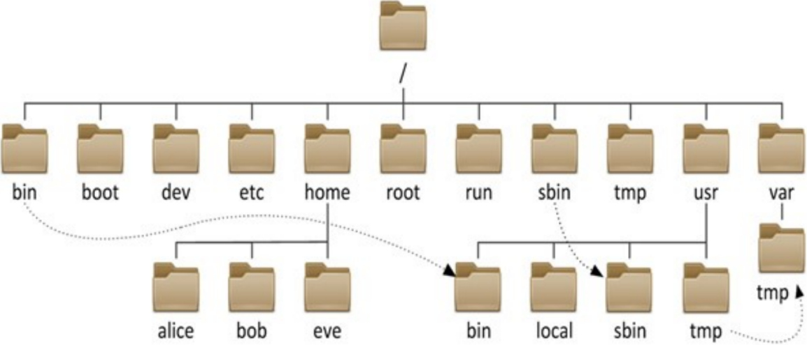
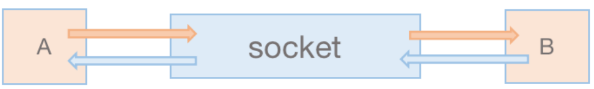
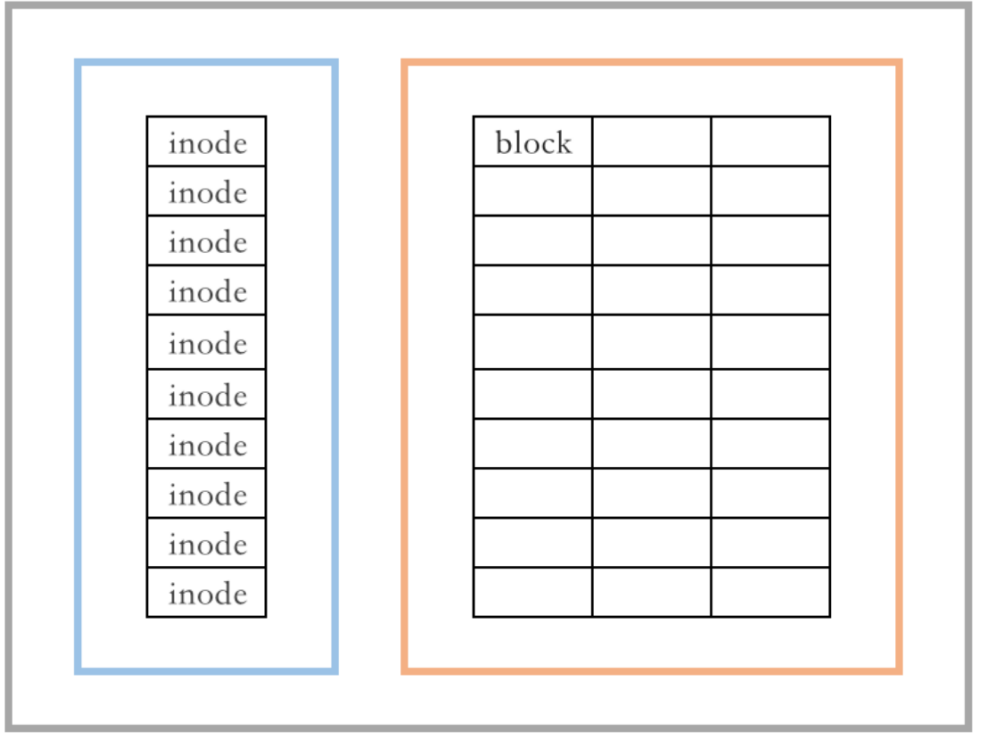
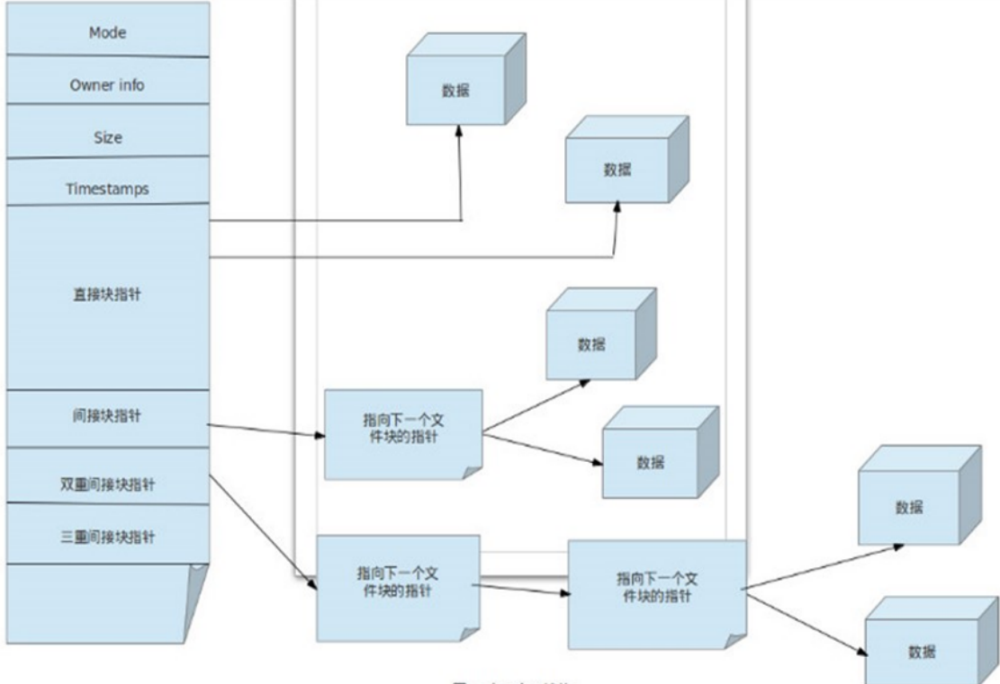
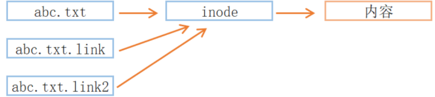
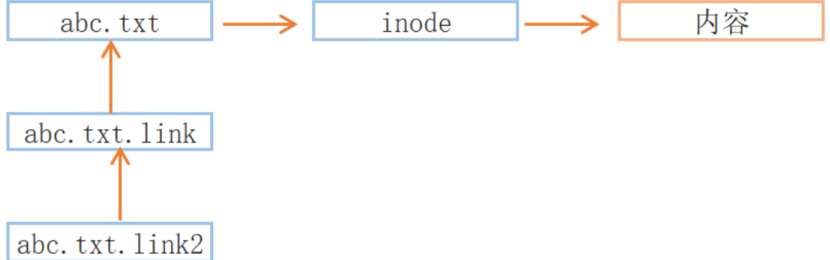
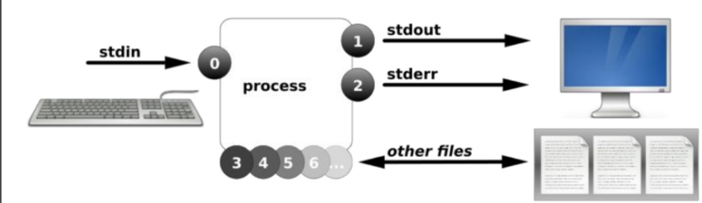

[TOC]

# 一、文件系统目录结构

==Linux 内核 + GNU 开源软件 = Linux 发行版==

**FHS 文件系统**

FHS（Filesystem Hierarchy Standard：文件系统层次化标准），是由 Linux 基金会维护的，帮助发行版厂商和开发者们使用共同的标准来约定其发行的Linux系统或开发的软件遵守共同的文件和目录标准。

FHS 是多数 Linux 版本采用的文件组织形式，采用树形结构组织文件。FHS 定义了系统中每个区域的用途、所需要的最小构成的文件和目录，同时还给出了例外处理与矛盾处理。

官方网站：https://www.pathname.com/fhs/

## 1 文件系统的目录结构

- 文件和目录被组织成一个单根倒置树结构
- 文件系统从根目录下开始，用“/”表示
- 根文件系统(rootfs)：root filesystem 
- 标准Linux文件系统（如：ext4），文件名称大小写敏感，例如：MAIL, Mail, mail, mAiL 
- 以 . 开头的文件为隐藏文件
- 路径分隔的 / 
- 文件名最长255个字节
- 包括路径在内文件名称最长4095个字节
- 蓝色-->目录 绿色-->可执行文件 红色-->压缩文件 浅蓝色-->链接文件 灰色-->其他文件
- 除了斜杠和NUL,所有字符都有效，但使用特殊字符的目录名和文件不推荐使用，有些字符需要用引号来引用
- 每个文件都有两类相关数据：元数据：metadata，即属性， 数据：data，即文件内容

## 2 常见的文件系统目录功能

~~~shell
/boot #引导文件存放目录，内核文件(vmlinuz)、引导加载器(bootloader, grub)都存放于此目录
/bin #所有用户使用的基本命令；不能关联至独立分区，OS启动即会用到的程序
/sbin #管理类的基本命令；不能关联至独立分区，OS启动即会用到的程序      
/lib #启动时程序依赖的基本共享库文件以及内核模块文件(/lib/modules)
/lib64 #专用于x86_64系统上的辅助共享库文件存放位置
/etc #配置文件目录
/home/USERNAME #普通用户家目录
/root #管理员的家目录
/media #便携式移动设备挂载点
/mnt #临时文件系统挂载点
/dev #设备文件及特殊文件存储位置, b:block device，随机访问,c:character 
device，线性访问
/opt #第三方应用程序的安装位置
/srv #系统上运行的服务用到的数据
/tmp #临时文件存储位置
/usr #universal shared, read-only data
/usr/bin #保证系统拥有完整功能而提供的应用程序
/usr/sbin #同上
/usr/lib #32位使用
/usr/lib64 #只存在64位系统
/usr/include #C程序的头文件(header files)
/usr/share #结构化独立的数据，例如doc, man等
/var #variable data files,可变数据目录
/var/cache #应用程序缓存数据目录
/var/lib #应用程序状态信息数据
/var/local #专用于为/usr/local下的应用程序存储可变数据
/var/lock #锁文件
/var/log #日志目录及文件
/var/opt #专用于为/opt下的应用程序存储可变数据
/var/run #运行中的进程相关数据,通常用于存储进程pid文件
/var/spool #应用程序数据池
/var/tmp #保存系统两次重启之间产生的临时数据
/proc #用于输出内核与进程信息相关的虚拟文件系统
/sys #用于输出当前系统上硬件设备相关信息虚拟文件系统
/selinux #security enhanced Linux，selinux相关的安全策略等信息的存储位置
~~~

## 3 应用程序的组成部分

| 文件类型   | 常用目录                                                     |
| ---------- | ------------------------------------------------------------ |
| 二进制文件 | /bin, /sbin, /usr/bin, /usr/sbin, /usr/local/bin, /usr/local/sbin |
| 库文件     | /lib, /lib64, /usr/lib, /usr/lib64, /usr/local/lib, /usr/local/lib64 |
| 配置文件   | /etc, /etc/DIRECTORY, /usr/local/etc                         |
| 帮助文件   | /usr/share/man, /usr/share/doc, /usr/local/share/man, /usr/local/share/doc |

## 4 新版本目录结构变化

- /bin 和 /usr/bin
- /sbin 和 /usr/sbin
- /lib 和 /usr/lib
- /lib64 和 /usr/lib64

## 5 Linux 下的文件类型

### 5.1 linux 系统中的文件类型标识符

| 文件类型     | 标识符 | 说明      |
| ------------ | ------ | --------- |
| 普通文件     | -      |           |
| 目录文件     | d      | directory |
| 符号链接文件 | l      | link      |
| 块设备文件   | b      | block     |
| 字符设备文件 | c      | character |
| 管道文件     | p      | pipe      |
| 套接字文件   | s      | socket    |

~~~shell
[root@moudle-ubuntu ~]# ls -l /run
total 32
-rw-------  1 root  root     0 Aug 21 16:43 agetty.reload
drwxr-xr-x  2 avahi avahi   80 Aug 21 16:43 avahi-daemon
drwxr-xr-x  2 root  root    80 Aug 22 15:55 blkid
drwxr-xr-x  4 root  root   320 Aug 22 14:59 cloud-init
drwxr-xr-x  2 root  root    80 Aug 21 16:43 console-setup
drwxr-xr-x  3 root  root    60 Aug 21 16:42 credentials
-rw-r--r--  1 root  root     4 Aug 21 16:43 crond.pid
----------  1 root  root     0 Aug 21 16:43 crond.reboot
drwx------  2 root  root    40 Aug 21 16:43 cryptsetup
...

~~~

### 5.2 linux 系统中的文件类型颜色标识

linux 系统中，每种颜色，都有对应的含义，可以根据文件在终端中显示的颜色，来判断是什么类型的文件

颜色与文件类型对应关系，由配置文件定义，可更改（此处的文件类型，可以理解为文件格式）

| 文件类型         | 颜色   |
| ---------------- | ------ |
| 普通文件         | 白色   |
| 目录文件         | 蓝色   |
| 符号链接文件     | 浅蓝色 |
| 块设备文件       | 黄色   |
| 管道文件         | 青黄色 |
| 套接字文件       | 粉红色 |
| 图片文件         | 粉红色 |
| 压缩文件或文件包 | 红色   |
| 其他文件         | 灰色   |

~~~shell
# Rocky Linux
[root rockylinux-1 ~] WORK 0 
# ll /etc/DIR_COLORS
-rw-r--r--. 1 root root 4673 Apr 24  2023 /etc/DIR_COLORS
[root rockylinux-1 ~] WORK 0 
# 

# Ubuntu 中默认没有这个文件
#ubuntu 中的颜色是在 dircolors 命令中定义的
[root@moudle-ubuntu ~]# dircolors -p
# Configuration file for dircolors, a utility to help you set the
# LS_COLORS environment variable used by GNU ls with the --color option.
# Copyright (C) 1996-2020 Free Software Foundation, Inc.
# Copying and distribution of this file, with or without modification,
# are permitted provided the copyright notice and this notice are preserved.
# The keywords COLOR, OPTIONS, and EIGHTBIT (honored by the
# slackware version of dircolors) are recognized but ignored.
# Below are TERM entries, which can be a glob patterns, to match
# against the TERM environment variable to determine if it is colorizable.
TERM Eterm
TERM ansi
TERM *color*
TERM con[0-9]*x[0-9]*

#无法直接修改
[root@moudle-ubuntu ~]# whereis dircolors 
dircolors: /usr/bin/dircolors /usr/share/man/man1/dircolors.1.gz
[root@moudle-ubuntu ~]# file /usr/bin/dircolors 
/usr/bin/dircolors: ELF 64-bit LSB pie executable, x86-64, version 1 (SYSV), dynamically linked, interpreter /lib64/ld-linux-x86-64.so.2, BuildID[sha1]=03680a76920d495c10bd4cd8b2b633b3275a7b85, for GNU/Linux 3.2.0, stripped
[root@moudle-ubuntu ~]# 
#在ubuntu 中定义颜色，类似于别名定义，加在 .bashrc 中即可
~~~

### 5.3 管道文件

所谓管道，是指用于连接一个读进程和一个写进程，以实现它们之间通信的共享文件，又称 pipe 文件。

### 5.4 套接字文件

Socket 本身有“插座”的意思，在 Unix/Linux 环境下，用于表示进程间网络通信的特殊文件类型。本质为内核借助缓冲区形成的伪文件。

# 二、文件操作命令

## 1 显示当前工作目录

每个 shell 和系统进程都有一个当前的工作目录 CWD：current work directory 

显示当前 shell CWD 的绝对路径

pwd 命令: printing working directory

~~~shell
pwd [-LP]

#常用选项
-P #显示真实物理路径
-L #显示链接路径（默认）
# 在一般的目录下不会有不同，只有进入链接文件后才有不同
~~~

~~~shell
[root@moudle-ubuntu ~]# pwd 
/root
[root@moudle-ubuntu ~]# cd /etc/netplan/
[root@moudle-ubuntu netplan]# pwd 
/etc/netplan
[root@moudle-ubuntu netplan]# 
[root@moudle-ubuntu bin]# pwd 
/bin
[root@moudle-ubuntu bin]# pwd -P
/usr/bin
[root@moudle-ubuntu bin]# pwd -L
/bin
[root@moudle-ubuntu bin]# cd 
[root@moudle-ubuntu ~]# ll -d /bin
lrwxrwxrwx 1 root root 7 Feb 17  2024 /bin -> usr/bin/
~~~

## 2 相对路径和绝对路径

描述一个文件位置有两种方式

**绝对路径**

1. 以正斜杠/ 即根目录开始

2. 描述完整的文件的位置路径

3. 可用于任何想指定一个文件名的时候

**相对路径**

1. 不以斜线开始，而是以当前所在的位置开始

2. 一般情况下，是指相对于当前工作目录的路径，特殊场景下，是相对于某目录的位置

3. 可以作为一个简短的形式指定一个文件名

**基名** **&** **目录名**

基名：basename，只取文件名而不要路径

目录名：dirname，只取路径，不要文件名

~~~shell
[root@moudle-ubuntu ~]# basename /etc/apt/apt.conf.d/
apt.conf.d
[root@moudle-ubuntu ~]# dirname /etc/apt/apt.conf.d/
/etc/apt
[root@ubuntu2204 ~]# dirname /etc/apt/apt.conf.d/01autoremove
/etc/apt/apt.conf.d
[root@ubuntu2204 ~]# basename /etc/apt/apt.conf.d/01autoremove
01autoremove
~~~

~~~shell
[root@moudle-ubuntu ~]#  basename http://nginx.org/download/nginx-1.18.0.tar.gz
nginx-1.18.0.tar.gz
[root@moudle-ubuntu ~]# basename http://nginx.org/download/nginx-1.18.0.tar.gz.tar.gz
nginx-1.18.0.tar.gz.tar.gz
[root@moudle-ubuntu ~]# basename -s .tar.gz http://nginx.org/download/nginx-1.18.0.tar.gz
nginx-1.18.0
[root@moudle-ubuntu ~]# 
[root@moudle-ubuntu ~]# basename -s .tar.gz http://nginx.org/download/nginx-1.18.0.tar.gz.tar.gz
nginx-1.18.0.tar.gz
[root@moudle-ubuntu ~]# 

~~~

~~~shell
[root@moudle-ubuntu ~]# url=http://nginx.org/download/nginx-1.18.0.tar.gz
[root@moudle-ubuntu ~]# wget $url
--2025-08-24 16:10:56--  http://nginx.org/download/nginx-1.18.0.tar.gz
Resolving nginx.org (nginx.org)... 3.125.197.172, 52.58.199.22, 2a05:d014:5c0:2601::6, ...
Connecting to nginx.org (nginx.org)|3.125.197.172|:80... connected.
HTTP request sent, awaiting response... 200 OK
Length: 1039530 (1015K) [application/octet-stream]
Saving to: ‘nginx-1.18.0.tar.gz’

nginx-1.18.0.tar.gz                  100%[===================================================================>]   1015K   790KB/s    in 1.3s    

2025-08-24 16:10:58 (790 KB/s) - ‘nginx-1.18.0.tar.gz’ saved [1039530/1039530]

[root@moudle-ubuntu ~]# tar xf `basename $url`
[root@moudle-ubuntu ~]# ls
nginx-1.18.0  nginx-1.18.0.tar.gz
~~~

## 3 更改目录

~~~shell
cd [-L|[-P [-e]] [-@]] [dir]

#常用选项
-L #切换至链接目录，默认选项
-P #切换至真实目录，而非链接目录

cd .. #切换至父目录
cd - #切换到上一个目录
cd | cd ~ #切换至当前用户家目录
cd ~username #切换至指定用户家目录
~~~

~~~shell
[root@ubuntu2204 ~]# cd /etc/netplan/
[root@ubuntu2204 netplan]# pwd
/etc/netplan
[root@ubuntu2204 netplan]# cd ../../root
[root@ubuntu2204 ~]# pwd
/root
[root@ubuntu2204 ~]# cd /bin/
[root@ubuntu2204 bin]# pwd
/bin
[root@ubuntu2204 bin]# pwd -P
/usr/bin
[root@ubuntu2204 bin]# cd -P /bin
[root@ubuntu2204 bin]# pwd
/usr/bin

~~~

相关环境变量

~~~shell
$PWD #当前目录
$OLDPWD   #上一次目录
[root@moudle-ubuntu ~]# cd /etc
[root@moudle-ubuntu etc]# echo $PWD
/etc
[root@moudle-ubuntu etc]# echo $OLDPWD
/root
[root@moudle-ubuntu etc]# 

~~~

## 4 列出目录内容

~~~shell
ls [OPTION]... [FILE]...

#常用选项
-a|--all 			#包含隐藏文件
-l 					#显示额外的信息
-R|--recursive 		#目录递归显示
-d|--directory 		#仅显示当前目录
-1 					#数字1，文件分行显示
-S 					#按从大到小排序
-t 					#按mtime排序，时间新的靠前
-u 					#配合-t选项，显示并按atime从新到旧排序
-U 					#按目录存放顺序显示
-X 					#按文件后缀排序
-F|--classify 		#对不同类型文件显示时附加不同的符号：*/=>@|
~~~

**说明：**

1. ls 查看不同后缀文件时的颜色由 /etc/DIR_COLORS 和@LS_COLORS变量定义

2. ls -l 看到文件的大小，不一定是实际文件真正占用空间的大小

3. ll 是 ls命令的一个别名，在centos 和 ubuntu 系统中，该别名的参数不一样

~~~shell
[root@moudle-ubuntu ~]# alias ll
alias ll='ls -alF'
[root@moudle-ubuntu ~]# 
[root rockylinux-1 ~] WORK 0 
# alias ll
alias ll='ls -l --color=auto'
[root rockylinux-1 ~] WORK 0 
# 

~~~

## 5 查看文件状态 stat

一个文件有两部份信息：元数据和具体内容

~~~shell
stat [OPTION]... FILE...
#常用选项
-t｜--terse		    #使用简洁格式显示
-f|--file-system	#显示相关的文件系统信息，所谓文件系统，对应的就是windows下面的硬盘分区
-c|--format 		#使用特定格式输出
~~~

每个文件有三个时间戳属性

| 属性  |             | 说明                                                         |
| ----- | ----------- | ------------------------------------------------------------ |
| atime | access time | 访问时间，即读取文件内容时间，此字段值会延时更新，以降低 IO 负载 |
| mtime | modify time | 修改内容的时间                                               |
| ctime | change time | 元数据发生变化的时间                                         |

~~~shell
[root@moudle-ubuntu ~]# stat /usr/bin/ls
  File: /usr/bin/ls
  Size: 138216    	Blocks: 272        IO Block: 4096   regular file
Device: fd00h/64768d	Inode: 2753288     Links: 1
Access: (0755/-rwxr-xr-x)  Uid: (    0/    root)   Gid: (    0/    root)
Access: 2025-08-24 15:51:14.511565610 +0800
Modify: 2024-01-08 22:56:36.000000000 +0800
Change: 2024-08-22 18:05:53.412005601 +0800
 Birth: 2024-08-22 18:05:53.404005601 +0800
[root@moudle-ubuntu ~]# 

# 目录页是一个文件
[root@moudle-ubuntu ~]# stat /
  File: /
  Size: 4096      	Blocks: 8          IO Block: 4096   directory
Device: fd00h/64768d	Inode: 2           Links: 20
Access: (0755/drwxr-xr-x)  Uid: (    0/    root)   Gid: (    0/    root)
Access: 2025-08-24 15:52:12.042878680 +0800
Modify: 2024-08-22 18:06:50.940007028 +0800
Change: 2024-08-22 18:06:50.940007028 +0800
 Birth: 2024-08-22 18:05:50.000000000 +0800
[root@moudle-ubuntu ~]# 

# 查看文件所在分区的信息
[root@moudle-ubuntu ~]# stat -f /etc/fstab 
  File: "/etc/fstab"
    ID: 640438857703c534 Namelen: 255     Type: ext2/ext3
Block size: 4096       Fundamental block size: 4096
Blocks: Total: 12563592   Free: 10179337   Available: 9533040
Inodes: Total: 3211264    Free: 3050574
[root@moudle-ubuntu ~]# 

[root@moudle-ubuntu ~]# stat -c "%a-%i-%n" /etc/fstab
644-1835710-/etc/fstab
~~~

## 6 确定文件内容

文件可以包含多种类型的数据，使用file命令检查文件的类型，然后确定适当的打开命令或应用程序使用格式：

~~~shell
file [options] <filename>...

#常用选项
-b|--brief 					#只显示结果，不显示文件名
-f|--files-from FILE 		#从指定文件中获取要处理的文件名
-F|--separator STRING 		#指定分割符
-L|--dereference 			#跟随软链接

[root@ubuntu2204 ~]# cat test.sh
#!/bin/bash
echo "hello world"
[root@ubuntu2204 ~]# file test.sh
test.sh: Bourne-Again shell script, ASCII

[root@moudle-ubuntu ~]# file /etc/fstab 
/etc/fstab: ASCII text
[root@moudle-ubuntu ~]# file -b /etc/fstab 
ASCII text
[root@moudle-ubuntu ~]# 

~~~

windows的文本格式和Linux的文本格式的区别

~~~shell
[root@moudle-ubuntu ~]# cat linux.txt 
a
b
c
[root@moudle-ubuntu ~]# cat win.txt 
a
b
c[root@moudle-ubuntu ~]# file linux.txt 
linux.txt: ASCII text
[root@moudle-ubuntu ~]# file win.txt 
win.txt: ASCII text, with CRLF line terminators
[root@moudle-ubuntu ~]# 
[root@moudle-ubuntu ~]# ls -lh win.txt linux.txt 
-rw-r--r-- 1 root root 6 Aug 24 21:28 linux.txt
-rw-r--r-- 1 root root 7 Aug 24 21:29 win.txt

[root@moudle-ubuntu ~]# cat -A win.txt 
a^M$
b^M$
c[root@moudle-ubuntu ~]# cat -A linux.txt 
a$
b$
c$
[root@moudle-ubuntu ~]# 

# 将 Windows 格式的文件转化为 Linux 格式文件
[root@moudle-ubuntu ~]# apt install -y dos2unix
[root@moudle-ubuntu ~]# dos2unix win.txt 
dos2unix: converting file win.txt to Unix format...
[root@moudle-ubuntu ~]# file win.txt 
win.txt: ASCII text
[root@moudle-ubuntu ~]# file linux.txt 
linux.txt: ASCII text
[root@moudle-ubuntu ~]# 

~~~

## 7 文件通配符模式 wildcard pattern

文件通配符可以用来匹配符合条件的多个文件，方便批量管理文件

通配符采用特定的符号，表示特定的含义，此特定符号称为元 meta 字符

常见的通配符如下：

~~~shell
* 			#匹配零个或多个字符，但不匹配 "." 开头的文件，即隐藏文件
? 			#匹配任何单个字符,一个汉字也算一个字符，
~ 			#当前用户家目录
. 			#当前工作目录
~+ 			#当前工作目录
~-   		#前一个工作目录
~xu 		#用户 xu 家目录
[0-9] 		#匹配数字范围
[a-z] 		#一个字母
[A-Z] 		#一个字母
[wang] 		#匹配列表中的任何的一个字符
[^wang] 	#匹配列表中的所有字符以外的字符
[^a-z] 		#匹配列表中的所有字符以外的字符
~~~

另外还有在Linux系统中预定义的字符类表示法如下：man 7 glob

~~~shell
[:digit:] 		#任意数字，相当于0-9
[:lower:] 		#任意小写字母,表示 a-z
[:upper:] 		#任意大写字母,表示 A-Z 
[:alpha:] 		#任意大小写字母
[:alnum:] 		#任意数字或字母
[:blank:] 		#水平空白字符
[:space:] 		#水平或垂直空白字符
[:punct:] 		#标点符号
[:print:] 		#可打印字符
[:cntrl:] 		#控制（非打印）字符
[:graph:] 		#图形字符
[:xdigit:]		#十六进制字符

# 在使用时要使用双小括号
ls [[:digit:]]
~~~

范例：

~~~shell
#匹配以a开头的
[root@ubuntu2204 ~]# ll a*
#匹配包含a的
[root@ubuntu2204 ~]# ll *a*
#匹配任意单字符文件名的文件
[root@ubuntu2204 ~]# ll ?
-rw-r--r-- 1 root root 0 Jul 10 22:34 a
-rw-r--r-- 1 root root 0 Jul 10 22:34 哈 #匹配两个字符
[root@ubuntu2204 ~]# ll ??
-rw-r--r-- 1 root root 0 Jul 10 22:34 ab
-rw-r--r-- 1 root root 0 Jul 10 22:34 12
-rw-r--r-- 1 root root 0 Jul 10 22:34 xi
~~~

{} 和 [] 的区别

[] 在使用时会先进行一个查找的工作，将存在内容输出

{} 不会提前进行，直接输出，没有则报错

~~~shell
[root@moudle-ubuntu test]# ls
[root@moudle-ubuntu test]# touch {3..5}
[root@moudle-ubuntu test]# ls
3  4  5
[root@moudle-ubuntu test]# ls {1..5}
ls: cannot access '1': No such file or directory
ls: cannot access '2': No such file or directory
3  4  5
[root@moudle-ubuntu test]# ls [1-5]
3  4  5
[root@moudle-ubuntu test]# 

~~~

## 8 创建空文件和刷新时间

touch 命令可以用来创建空文件或刷新文件的时间

格式：

~~~shell
touch [OPTION]... FILE...
#常用选项
-a 							# 改变 atime,ctime
-m 							# 改变 mtime,ctime
-h|--no-dereference 		# touch链接文件时，默认是操作其指向的目标文件，此选项表示操作链接文件本身
-r|--reference   			# 使用某个文件的更新时间和修改时间作为当前文件的更新时间和修改时间
-d|--date 					# 指定修改时间和访问时间，而不是采用当前系统时间
-t [[CC]YY]MMDDhhmm[.ss] 	# --time=WORD
--time=STRING 				# 指定修改项 access|atime 等同于 -a， modify|mtime 等同于 -m
-c|--no-create 				# 如果文件不存在，不创建
~~~

~~~shell
[root@moudle-ubuntu test]# touch  1.txt
[root@moudle-ubuntu test]# stat 1.txt 
  File: 1.txt
  Size: 0         	Blocks: 0          IO Block: 4096   regular empty file
Device: fd00h/64768d	Inode: 1311222     Links: 1
Access: (0644/-rw-r--r--)  Uid: (    0/    root)   Gid: (    0/    root)
Access: 2025-08-24 21:57:56.278788413 +0800
Modify: 2025-08-24 21:57:56.278788413 +0800
Change: 2025-08-24 21:57:56.278788413 +0800
 Birth: 2025-08-24 21:57:56.278788413 +0800
[root@moudle-ubuntu test]# touch  1.txt 
[root@moudle-ubuntu test]# stat 1.txt 
  File: 1.txt
  Size: 0         	Blocks: 0          IO Block: 4096   regular empty file
Device: fd00h/64768d	Inode: 1311222     Links: 1
Access: (0644/-rw-r--r--)  Uid: (    0/    root)   Gid: (    0/    root)
Access: 2025-08-24 21:58:06.951161885 +0800
Modify: 2025-08-24 21:58:06.951161885 +0800
Change: 2025-08-24 21:58:06.951161885 +0800
 Birth: 2025-08-24 21:57:56.278788413 +0800
[root@moudle-ubuntu test]# 

~~~

~~~shell
[root@moudle-ubuntu test]# ln -s 1.txt 2.txt 

[root@moudle-ubuntu test]# ll 2.txt 
lrwxrwxrwx 1 root root 5 Aug 24 21:59 2.txt -> 1.txt
[root@moudle-ubuntu test]# 

# 如果直接 touch 2.txt 则改变的是 1.txt（原文件）
[root@moudle-ubuntu test]# stat 2.txt 
  File: 2.txt -> 1.txt
  Size: 5         	Blocks: 0          IO Block: 4096   symbolic link
Device: fd00h/64768d	Inode: 1311223     Links: 1
Access: (0777/lrwxrwxrwx)  Uid: (    0/    root)   Gid: (    0/    root)
Access: 2025-08-24 21:59:35.395319517 +0800
Modify: 2025-08-24 21:59:34.363262547 +0800
Change: 2025-08-24 21:59:34.363262547 +0800
 Birth: 2025-08-24 21:59:34.363262547 +0800
[root@moudle-ubuntu test]# touch 2.txt 
[root@moudle-ubuntu test]# stat 2.txt 
  File: 2.txt -> 1.txt
  Size: 5         	Blocks: 0          IO Block: 4096   symbolic link
Device: fd00h/64768d	Inode: 1311223     Links: 1
Access: (0777/lrwxrwxrwx)  Uid: (    0/    root)   Gid: (    0/    root)
Access: 2025-08-24 21:59:35.395319517 +0800
Modify: 2025-08-24 21:59:34.363262547 +0800
Change: 2025-08-24 21:59:34.363262547 +0800
 Birth: 2025-08-24 21:59:34.363262547 +0800
[root@moudle-ubuntu test]# stat 1.txt 
  File: 1.txt
  Size: 0         	Blocks: 0          IO Block: 4096   regular empty file
Device: fd00h/64768d	Inode: 1311222     Links: 1
Access: (0644/-rw-r--r--)  Uid: (    0/    root)   Gid: (    0/    root)
Access: 2025-08-24 22:00:42.707320311 +0800
Modify: 2025-08-24 22:00:42.707320311 +0800
Change: 2025-08-24 22:00:42.707320311 +0800
 Birth: 2025-08-24 21:57:56.278788413 +0800
[root@moudle-ubuntu test]# 

# 对链接文件加 -h 参数，则改变的是 链接文件
[root@moudle-ubuntu test]# stat 2.txt 
  File: 2.txt -> 1.txt
  Size: 5         	Blocks: 0          IO Block: 4096   symbolic link
Device: fd00h/64768d	Inode: 1311223     Links: 1
Access: (0777/lrwxrwxrwx)  Uid: (    0/    root)   Gid: (    0/    root)
Access: 2025-08-24 21:59:35.395319517 +0800
Modify: 2025-08-24 21:59:34.363262547 +0800
Change: 2025-08-24 21:59:34.363262547 +0800
 Birth: 2025-08-24 21:59:34.363262547 +0800
[root@moudle-ubuntu test]# touch  -h 2.txt 
[root@moudle-ubuntu test]# stat 2.txt 
  File: 2.txt -> 1.txt
  Size: 5         	Blocks: 0          IO Block: 4096   symbolic link
Device: fd00h/64768d	Inode: 1311223     Links: 1
Access: (0777/lrwxrwxrwx)  Uid: (    0/    root)   Gid: (    0/    root)
Access: 2025-08-24 22:01:30.106388947 +0800
Modify: 2025-08-24 22:01:30.106388947 +0800
Change: 2025-08-24 22:01:30.106388947 +0800
 Birth: 2025-08-24 21:59:34.363262547 +0800
[root@moudle-ubuntu test]# 

~~~

## 9 复制文件和目录

利用 cp（copy）命令可以实现文件或目录的复制

~~~shell
cp [OPTION]... [-T] SOURCE DEST
cp [OPTION]... SOURCE... DIRECTORY
cp [OPTION]... -t DIRECTORY SOURCE...

#常用选项
-i|--interactive 		#如果目标文件己存在，则提示是否覆盖
-n|--no-clobber 		#如果目标文件己存在，则跳过此文件复制
-R|-r|--recursive 		#递归复制，可用于目录的复制
-a|--archive 			#保留所有属性 相当于 dpR 选项组合
-s|--symbolic-link 		#不复制文件，而是创建链接
-p 						#同时复制访问时间，修改时间，权限等属性,同 --preserve=mode,ownership,timestamps
--preserve[=ATTR_LIST] 	#选择属性，默认为 mode,ownership,timestamps
-u|--update 			#当源文件比目标文件新时，才执行复制操作
-v|--verbose 			#显示复制过程
-b 						#先备份再覆盖
--backup=numbered 		#目标存在，覆盖前先备份加数字后缀，形式为 filename.~#~ ，可以保留多个版本
~~~

~~~shell
mode 		#权限
ownership 	#属主属组
timestamp 	#时间戳
links 		#保留链接
xattr 		#保留自定义属性
context 	#保留selinux属性
all 		#所有属性
~~~

| 源/目标              | 不存在                                                    | 存在且为文件                                                 | 存在且为目录                                                 |
| -------------------- | --------------------------------------------------------- | ------------------------------------------------------------ | ------------------------------------------------------------ |
| 一个文件             | 新建 DEST，并将 SRC 中内容填充至 DEST 中                  | 将 SRC 中的内容覆盖至 DEST 中 注意数据丢失风险！ 建议用 –i 选项 | 在DEST下新建与原文件同名的文件，并将SRC中内容填充至新文件中  |
| 多个文件             | 提示错误                                                  | 提示错误                                                     | 在 DEST 下新建与原文件同名的文件，并将原文件内容复制进新文件中 |
| 买了必须使用 -r 选项 | 创建指定 DEST 同名目录，复制 SRC 目录中所有文件至 DEST 下 | 提示错误                                                     | 在 DEST 下新建与原目录同名的目录，并将 SRC 中内容复制至新目录中 |

~~~shell
[root@moudle-ubuntu test]# cp /etc/issue .
[root@moudle-ubuntu test]# ls -l
total 4
-rw-r--r-- 1 root root 26 Aug 25 10:20 issue
[root@moudle-ubuntu test]# 

# 保留属主属组，时间戳
[root@moudle-ubuntu test]# ls -l /etc/issue
-rw-r--r-- 1 root root 26 Feb 14  2024 /etc/issue
[root@moudle-ubuntu test]# cp -p /etc/issue issue 
[root@moudle-ubuntu test]# ls -l
total 4
-rw-r--r-- 1 root root 26 Feb 14  2024 issue
[root@moudle-ubuntu test]# 

# cp 复制目录时需要加 -r 参数
[root@moudle-ubuntu test]# cp /etc/ssh/ .
cp: -r not specified; omitting directory '/etc/ssh/'
[root@moudle-ubuntu test]# cp -r /etc/ssh/ .
[root@moudle-ubuntu test]# ls
issue  ssh
[root@moudle-ubuntu test]# 

~~~

复制时如果覆盖，先备份再覆盖

~~~shell
[root@moudle-ubuntu test]# echo 123 > 1.txt
[root@moudle-ubuntu test]# ls
1.txt
[root@moudle-ubuntu test]# cat 1.txt 
123
[root@moudle-ubuntu test]# cp 1.txt 2.txt
[root@moudle-ubuntu test]# cp -i 1.txt 2.txt
cp: overwrite '2.txt'? y
[root@moudle-ubuntu test]# cat 2.txt 
123
[root@moudle-ubuntu test]# 

# 备份，并且询问是否覆盖
[root@moudle-ubuntu test]# echo aaa > 1.txt 
[root@moudle-ubuntu test]# cat 1.txt 
aaa
[root@moudle-ubuntu test]# cat 2.txt 
123
[root@moudle-ubuntu test]# cp -bi 1.txt 2.txt 
cp: overwrite '2.txt'? y
[root@moudle-ubuntu test]# ls -l
total 12
-rw-r--r-- 1 root root 4 Aug 25 10:24 1.txt
-rw-r--r-- 1 root root 4 Aug 25 10:24 2.txt
-rw-r--r-- 1 root root 4 Aug 25 10:23 2.txt~
[root@moudle-ubuntu test]# cat 2.txt
aaa
[root@moudle-ubuntu test]# cat 2.txt~
123
[root@moudle-ubuntu test]# 
# 默认 -b 参数只能保留一次备份数据
[root@moudle-ubuntu test]# echo ccc > 1.txt 
[root@moudle-ubuntu test]# cp -bi 1.txt 2.txt 
cp: overwrite '2.txt'? y
[root@moudle-ubuntu test]# cat 2.txt
ccc
[root@moudle-ubuntu test]# cat 2.txt~
ddd
[root@moudle-ubuntu test]# 

# 保留多版本备份
# --backup=number
[root@moudle-ubuntu test]# ls
[root@moudle-ubuntu test]# echo 111 > 1.txt
[root@moudle-ubuntu test]# cat 1.txt 
111
[root@moudle-ubuntu test]# ls
1.txt
[root@moudle-ubuntu test]# cp --backup=numbered 1.txt 2.txt
[root@moudle-ubuntu test]# ls -l
total 8
-rw-r--r-- 1 root root 4 Aug 25 10:26 1.txt
-rw-r--r-- 1 root root 4 Aug 25 10:34 2.txt
[root@moudle-ubuntu test]# cat 1.txt 
111
[root@moudle-ubuntu test]# cat 2.txt 
111
[root@moudle-ubuntu test]# echo 222 > 1.txt 
[root@moudle-ubuntu test]# cp --backup=numbered 1.txt 2.txt
[root@moudle-ubuntu test]# ls -l
total 12
-rw-r--r-- 1 root root 4 Aug 25 10:34 1.txt
-rw-r--r-- 1 root root 4 Aug 25 10:34 2.txt
-rw-r--r-- 1 root root 4 Aug 25 10:34 2.txt.~1~
[root@moudle-ubuntu test]# cat 1.txt 
222
[root@moudle-ubuntu test]# cat 2..txt 
cat: 2..txt: No such file or directory
[root@moudle-ubuntu test]# cat 2.txt 
222
[root@moudle-ubuntu test]# cat 2.txt.~1~ 
111
[root@moudle-ubuntu test]# echo 333 > 1.txt 
[root@moudle-ubuntu test]# ls -l
total 12
-rw-r--r-- 1 root root 4 Aug 25 10:34 1.txt
-rw-r--r-- 1 root root 4 Aug 25 10:34 2.txt
-rw-r--r-- 1 root root 4 Aug 25 10:34 2.txt.~1~
[root@moudle-ubuntu test]# cp --backup=numbered 1.txt 2.txt
[root@moudle-ubuntu test]# ls
1.txt  2.txt  2.txt.~1~  2.txt.~2~
[root@moudle-ubuntu test]# ls -l
total 16
-rw-r--r-- 1 root root 4 Aug 25 10:34 1.txt
-rw-r--r-- 1 root root 4 Aug 25 10:35 2.txt
-rw-r--r-- 1 root root 4 Aug 25 10:34 2.txt.~1~
-rw-r--r-- 1 root root 4 Aug 25 10:34 2.txt.~2~
[root@moudle-ubuntu test]# cat 2.txt.~1~ 
111
[root@moudle-ubuntu test]# cat 2.txt.~2~ 
222
[root@moudle-ubuntu test]# cat 2.txt
333

~~~

## 10 移动和重命名文件

mv 命令可以实现文件或目录的移动和改名

同一分区移动数据，速度很快，数据位置没有变化

不同分区移动数据，速度相对慢，数据位置发生了变化

格式：

~~~shell
mv [OPTION]... [-T] SOURCE DEST
mv [OPTION]... SOURCE... DIRECTORY
mv [OPTION]... -t DIRECTORY SOURCE...
# 常用选项
-b 					# 如果目标存在，则先备份
-n|--no-clobber 	# 如果目标文件己存在，则跳过此文件移动
-i|--interactive 	# 如果目标文件己存在，则提示是否覆盖
-u|--update 		# 当源文件比目标文件新时，才执行移动操作
-v|--verbose 		# 显示移动过程
~~~

~~~shell
# 移动前备份
[root@moudle-ubuntu test]# touch {a..b}.txt
[root@moudle-ubuntu test]# ls
a.txt  b.txt
[root@moudle-ubuntu test]# mv -b a.txt b.txt 
[root@moudle-ubuntu test]# ls
b.txt  b.txt~

# 移动多个文件到目录
[root@moudle-ubuntu test]# cp /etc/issue /etc/ssh/sshd_config
sshd_config           sshd_config.d/        sshd_config.ucf-dist  
[root@moudle-ubuntu test]# cp /etc/issue /etc/ssh/sshd_config .
[root@moudle-ubuntu test]# ls
b.txt  b.txt~  issue  sshd_config
[root@moudle-ubuntu test]# 

~~~

利用 rename 可以批量修改文件名

**在 Ubuntu 中和 Rocky 中使用方式不同**

~~~shell
rename [options] <expression> <replacement> <file>...
#常用选项
-v|--verbose     	#显示过程
-s|--symlink     	#如果目标是链接文件，则是重命名其指向
-n|--no-act       	#不做任何改变
-o|--no-overwrite 	#不覆盖己存在文件
~~~

~~~shell
# Ubuntu
[root@moudle-ubuntu test]# touch f-{1..3}.{conf,log}
[root@moudle-ubuntu test]# ls
f-1.conf  f-1.log  f-2.conf  f-2.log  f-3.conf  f-3.log
[root@moudle-ubuntu test]# rename 's/conf$/conf.bak/' f*
[root@moudle-ubuntu test]# ls
f-1.conf.bak  f-1.log  f-2.conf.bak  f-2.log  f-3.conf.bak  f-3.log
[root@moudle-ubuntu test]# 

# rocky
[root rockylinux-1 ~/test] WORK 0 
# touch f-{1..3}.{conf,log}
[root rockylinux-1 ~/test] WORK 0 
# ls
f-1.conf  f-1.log  f-2.conf  f-2.log  f-3.conf  f-3.log
[root rockylinux-1 ~/test] WORK 0 
# rename 'conf' 'conf.bak' f*
[root rockylinux-1 ~/test] WORK 0 
# ls
f-1.conf.bak  f-1.log  f-2.conf.bak  f-2.log  f-3.conf.bak  f-3.log
[root rockylinux-1 ~/test] WORK 0 
# 
~~~

## 11 删除文件

使用 rm 命令可以删除文件和目录

注意：此命令非常危险，慎重使用，建议使用 mv 代替 rm

~~~shell
rm [OPTION]... [FILE]...

#常用选项
-i 					#删除前确认
-f|--force 			#不确认直接删除
-r|-R|--recursive	#递归删除
-d|--dir 			#删除空目录
--no-preserve-root 	#强删根目录
~~~

~~~shell
#无法直接删根
[root@rocky86 ~]# rm -rf /
rm: it is dangerous to operate recursively on '/'
rm: use --no-preserve-root to override this failsafe
[root@ubuntu2204 ~]# rm -rf /
rm: it is dangerous to operate recursively on '/'
rm: use --no-preserve-root to override this failsafe

#删除根下所有内容
[root@ubuntu2204 ~]# rm -rf /*
#删除所有以a开头的文件
[root@ubuntu2204 ~]# rm -f a*
#删除当前目录下所有内容
[root@ubuntu2204 ~]# rm -rf *
~~~

删除特殊文件

~~~shell
[root@ubuntu2204 0508]# ls
-f
#删不掉
[root@ubuntu2204 0508]# rm -f
[root@ubuntu2204 0508]# ls
-f
#删不掉
[root@ubuntu2204 0508]# rm -rf -f
[root@ubuntu2204 0508]# ls
-f
#删不掉
[root@ubuntu2204 0508]# rm -rf *
[root@ubuntu2204 0508]# ls
-f
[root@ubuntu2204 0508]#rm -rf ./-f
[root@ubuntu2204 0508]# ls
[root@ubuntu2204 0508]# rm -- -f
[root@ubuntu2204 0508]# ls

[root@ubuntu2204 0508]# touch '~'
[root@ubuntu2204 0508]# ls
'~'
[root@ubuntu2204 0508]# rm -f ~
rm: cannot remove '/root': Is a directory
[root@ubuntu2204 0508]# rm -- ~
rm: cannot remove '/root': Is a directory
[root@ubuntu2204 0508]# rm -f ./~

~~~

## 12 目录操作

### 12.1 显示目录树 tree

~~~shell
tree [-acdfghilnpqrstuvxACDFJQNSUX] [-H baseHREF] [-T title ]
#常用选项
-a 			#显示所有，包括隐藏目录和文件
-d 			#只显示目录
-f 			#显示所有内容的完整路径
-F 			#在执行文件，目录，Socket，符号链接，管道文件，各自加上"*","/","=","@","|"号
-g 			#显示文件属组，没找到组名，以gid代替
-u 			#显示文件属主，没找到用户名，以uid代替
-p 			#显示内容权限
-s 			#显示内容大小
-i 			#不以层级结构显示
-n 			#不显示颜色
-t 			#显示时用修改时间排序
-r 			#以默认显示顺序的反向规则显示，默认以数字，首字母的顺序规则来显示
-o filename #将显示的内容输出到指定文件中
-L n 		#只显示n层目录
-D 			#显示内容修改时间
-C 			#显示色彩
~~~

~~~shell
yum install -y tree
apt install -y tree

#显示当前目录的树
[root@ubuntu2204 ~]# tree
[root@ubuntu2204 ~]# tree dir1/
#仅显示两层目录
[root@ubuntu2204 ~]# tree -d -L 2 /
~~~

### 12.2 创建目录 mkdir

~~~shell
mkdir [OPTION]... DIRECTORY...

#常用选项
-m|--mode #目录权限属性
-p|--parents #如果要创建的目录父级目录不存在，则一起创建，是递归的意思
-v|--verbose #显示创建过程
~~~

~~~shell
# 指定权限创建目录
[root@moudle-ubuntu test]# mkdir -m=777 xixi
[root@moudle-ubuntu test]# ls -ld xixi
drwxrwxrwx 2 root root 4096 Aug 25 11:03 xixi
[root@moudle-ubuntu test]# 

# 递归创建目录
[root@moudle-ubuntu test]# mkdir -p 01/02/03/04
[root@moudle-ubuntu test]# tree 01
01
└── 02
    └── 03
        └── 04

3 directories, 0 files
[root@moudle-ubuntu test]# 

~~~

### 12.3 删除空目录 rmdir

rmdir 只能删除空目录，如果想删除非空目录，可以使用 rm -r 命令，递归删除目录树

~~~shell
rmdir [OPTION]... DIRECTORY...

#常用选项
--ignore-fail-on-non-empty #忽略非空错误提示
-p|--parents #连着父目录一起删除
-v|--verbose #显示删除过程
~~~

范例：从外层开始创建，从里层开始删除

~~~shell
[root@moudle-ubuntu test]#  mkdir -pv a/b/c/d
mkdir: created directory 'a'
mkdir: created directory 'a/b'
mkdir: created directory 'a/b/c'
mkdir: created directory 'a/b/c/d'
[root@moudle-ubuntu test]# rmdir -pv a/b/c/d
rmdir: removing directory, 'a/b/c/d'
rmdir: removing directory, 'a/b/c'
rmdir: removing directory, 'a/b'
rmdir: removing directory, 'a'
[root@moudle-ubuntu test]# 

~~~

# 三、文件元数据和节点表结构

## 3.1 inode 表结构

在Linux系统中，一切皆文件，

每个文件，又分为文件元数据和具体内容两部份，

一个文件元数据和其具体内容数据，在磁盘分区上，是分开存放的。

这种存储文件元数据的区域就叫 inode，中文译作 "索引节点"，

每个文件都有一个inode和n(n>=1)个block 数据块，inode 存储文件元数据，数据块存储文件具体内容数据，

磁盘在格式化时，系统会自动将磁盘分为两个区域，

一个是 inode 区（inode table），用来存放文件的 inode，

另一个是数据区，分成很多个block(块)，用来存放文件的具体内容数据，

一个磁盘分区上有多少个inode和多少个block，由系统自行决定，跟文件系统，磁盘分区大小，数据块大小有关，

一个磁盘分区，能存放多少个文件，由文件大小，磁盘分区大小，inode数量决定，

inode 编号可重复使用，当删除一个文件之后，其inode 编号会被回收，供下次新文件使用，

每一个inode表记录对应的保存了以下信息：

- inode number（索引节点编号）
- 文件类型
- 权限
- 属主属组
- 链接数
- 文件大小
- 各时间戳
- 指向具体数据块的指针
- 有关文件的其他数据

**以指针大小为4字节，block 大小为4KB为前置条件**

指针大小和 block 块大小跟操作系统平台，以及文件系统有关；

**直接指针**

12个直接指针，直接指向具体数据块，如果 block 大小为 4096(4K)，则直接指针可以保存 48KB 的文件

**间接指针**

1个间接指针，指向一个数据块，只不过该 block 上保存的是指针，而不是具体数据

如果 block 大小为 4096(4K)，一个指针占用4字节，所以此处可以存储 4096/4=1024个 block 地址；

则可以存储的数据大小为 1024*4096=4MB 

**双重间接指针**

1个双重间接指针，指向一个数据块，只不过该 block 上保存的是指针，而不是具体数据

如果block 大小为 4096(4K)，一个指针占用4字节，所以此处可以存储 4096/4=1024个 block 地址；

同理，其指向的 1024个 block 上，也都是存储的指针地址；

则此处可以存储的数据大小为 1024x1024x4096=4GB

**三重间接指针**

1个三重间接指针，指向一个数据块，只不过该 block 上保存的是指针，而不是具体数据

如果 block 大小为 4096(4K)，一个指针占用4字节，所以此处可以存储 4096/4=1024个 block 地址；

同理，其指向的 1024个 block 上，也都是存储的指针地址

则此处可以存储的数据大小为 1024x1024x1024x4096=4TB

**单文件最大容量**

12x直接指针 + 间接指针 + 双重间接指针 + 三重间接指针

**目录**

目录是个特殊文件，目录文件的内容保存了此目录中文件的列表及 inode number 对应关系

- 文件引用一个是 inode 号
- 人是通过文件名来引用一个文件
- 一个目录是目录下的文件名和文件 inode 号之间的映射

==文件名不再 inode 中==

文件名存在于该文件的上级目录中

**cp 和 inode**

cp 命令：

- 分配一个空闲的 inode 号，在 inode 表中生成新条目
- 在目录中创建一个目录项，将名称与 inode 编号关联
- 拷贝数据生成新的文件

~~~shell
root@master01:~/test 14:23:45 
# touch a.txt
root@master01:~/test 14:23:49 
# ls -li
total 0
4718658 -rw-r--r-- 1 root root 0 Sep  1 14:23 a.txt
root@master01:~/test 14:23:52 
# cp a.txt b.txt
root@master01:~/test 14:24:02 
# ls -li
total 0
4718658 -rw-r--r-- 1 root root 0 Sep  1 14:23 a.txt
4718681 -rw-r--r-- 1 root root 0 Sep  1 14:24 b.txt
root@master01:~/test 14:24:04 
# cp a.txt c.txt
root@master01:~/test 14:24:10 
# ls -li
total 0
4718658 -rw-r--r-- 1 root root 0 Sep  1 14:23 a.txt
4718681 -rw-r--r-- 1 root root 0 Sep  1 14:24 b.txt
4718684 -rw-r--r-- 1 root root 0 Sep  1 14:24 c.txt
root@master01:~/test 14:24:12 
~~~

**rm 和 inode**

rm 命令：

- 链接数递减，从而释放的 inode 号可以被重用
- 把数据块放在空闲列表中
- 删除目录项
- 数据实际上不会马上被删除，但当另一个文件使用数据块时将被覆盖

~~~shell
root@master01:~/test 14:24:10 
# ls -li
total 0
4718658 -rw-r--r-- 1 root root 0 Sep  1 14:23 a.txt
4718681 -rw-r--r-- 1 root root 0 Sep  1 14:24 b.txt
4718684 -rw-r--r-- 1 root root 0 Sep  1 14:24 c.txt
root@master01:~/test 14:24:12 
# rm -f c.txt 
root@master01:~/test 14:24:56 
# ls -li
total 0
4718658 -rw-r--r-- 1 root root 0 Sep  1 14:23 a.txt
4718681 -rw-r--r-- 1 root root 0 Sep  1 14:24 b.txt
root@master01:~/test 14:24:58 
# touch d.txt
root@master01:~/test 14:25:04 
# ls -li
total 0
4718658 -rw-r--r-- 1 root root 0 Sep  1 14:23 a.txt
4718681 -rw-r--r-- 1 root root 0 Sep  1 14:24 b.txt
4718684 -rw-r--r-- 1 root root 0 Sep  1 14:25 d.txt
root@master01:~/test 14:25:05 
# 
~~~

**mv 和 inode**

- 如果mv命令的目标和源在相同的文件系统，作为mv 命令
  - 用新的文件名创建对应新的目录项
  - 删除旧目录条目对应的旧的文件名
  - 不影响inode表（除时间戳）或磁盘上的数据位置：没有数据被移动！
- 如果目标和源在一个不同的文件系统， mv相当于cp和rm

查看文件系统类型

~~~shell
[root rockylinux-1 ~] WORK 0 
# df -Th
Filesystem                Type      Size  Used Avail Use% Mounted on
devtmpfs                  devtmpfs  4.0M     0  4.0M   0% /dev
tmpfs                     tmpfs     1.8G     0  1.8G   0% /dev/shm
tmpfs                     tmpfs     724M  9.1M  715M   2% /run
/dev/mapper/rl_bogon-root xfs        96G  2.2G   94G   3% /
/dev/nvme0n1p1            xfs       195M  164M   31M  85% /boot
tmpfs                     tmpfs     362M     0  362M   0% /run/user/0
[root rockylinux-1 ~] WORK 0 
# cat /etc/fstab 

#
# /etc/fstab
# Created by anaconda on Thu Jun 26 14:47:12 2025
#
# Accessible filesystems, by reference, are maintained under '/dev/disk/'.
# See man pages fstab(5), findfs(8), mount(8) and/or blkid(8) for more info.
#
# After editing this file, run 'systemctl daemon-reload' to update systemd
# units generated from this file.
#
/dev/mapper/rl_bogon-root /                       xfs     defaults        0 0
UUID=9cbf6de3-1198-478a-870c-c4980d4ade5f /boot                   xfs     defaults        0 0
/dev/mapper/rl_bogon-swap none                    swap    defaults        0 0
[root rockylinux-1 ~] WORK 0 
# 

~~~

查看分区inode

~~~shell
[root rockylinux-1 ~] WORK 127 
# df -i
Filesystem                  Inodes IUsed    IFree IUse% Mounted on
devtmpfs                    457595   429   457166    1% /dev
tmpfs                       462890     1   462889    1% /dev/shm
tmpfs                       819200   747   818453    1% /run
/dev/mapper/rl_bogon-root 50227200 37161 50190039    1% /
/dev/nvme0n1p1               63680   357    63323    1% /boot
tmpfs                        92578    17    92561    1% /run/user/0
[root rockylinux-1 ~] WORK 0 
# df -i /boot
Filesystem     Inodes IUsed IFree IUse% Mounted on
/dev/nvme0n1p1  63680   357 63323    1% /boot
[root rockylinux-1 ~] WORK 0 
# 

~~~

查看文件inode

~~~shell
[root rockylinux-1 ~/test] WORK 0 
# ls -il
total 0
202444556 -rw-r--r-- 1 root root 0 Aug 25 10:46 f-1.conf.bak
202444557 -rw-r--r-- 1 root root 0 Aug 25 10:46 f-1.log
202444558 -rw-r--r-- 1 root root 0 Aug 25 10:46 f-2.conf.bak
202444559 -rw-r--r-- 1 root root 0 Aug 25 10:46 f-2.log
202444560 -rw-r--r-- 1 root root 0 Aug 25 10:46 f-3.conf.bak
202444561 -rw-r--r-- 1 root root 0 Aug 25 10:46 f-3.log
[root rockylinux-1 ~/test] WORK 0 
# stat f-1.conf.bak 
  File: f-1.conf.bak
  Size: 0         	Blocks: 0          IO Block: 4096   regular empty file
Device: fd00h/64768d	Inode: 202444556   Links: 1
Access: (0644/-rw-r--r--)  Uid: (    0/    root)   Gid: (    0/    root)
Access: 2025-08-25 10:46:11.512101829 +0800
Modify: 2025-08-25 10:46:11.512101829 +0800
Change: 2025-08-25 10:46:27.351314410 +0800
 Birth: 2025-08-25 10:46:11.512101829 +0800
[root rockylinux-1 ~/test] WORK 0 
# stat -c "%i" f-1.conf.bak
202444556

~~~

**inode 编号耗尽&磁盘打满**

~~~shell

#分区越大，可用的节点编号就越多，当前分区有多少个节点编号，就是说能在当前分区上创建多少个文件
#如果当前分区上的节点编号用光，则无法再创建新文件，系统会提示 “No space left on device”
#如果当前分区上的空间用光，同样无法创建新文件，系统同样提示 “No space left on device”
echo test-{1..523977}.txt | xargs touch #创建大量空文件耗尽inode号
cp /dev/zero /tmp/ #创真实大文件把硬盘打满
df -i #查看磁盘分区inode编号使用情况
df -lh #查看磁盘分区使用情况

~~~

删除大文件

~~~shell
[root@ubuntu2204 ~]# cat /dev/null > /var/log/huge.log
~~~

## 3.2 硬链接

hard link

硬链接的作用是允许一个文件拥有多个有效的路径名，

新增一个文件，指向某个文件的 inode，这样，这两个文件就互为硬链接，

也就是多个文件名，都是指向同一个 inode，这是硬链接的本质。

硬链接特性

- 创建硬链接会在对应的目录中增加额外的记录项以引用文件
- 对应于同一文件系统上一个物理文件
- 每个文件引用相同的inode号
- 创建时链接数递增
- 删除文件时：rm命令递减计数的链接，文件要存在，至少有一个链接数，当链接数为零时，该文件被删除
- 不能跨越驱动器或分区
- 不支持对目录创建硬链接

格式

~~~shell
ln filename filename
~~~

~~~shell
root@master01:~/test 15:50:39 
# touch a.txt
root@master01:~/test 15:50:43 
# ln a.txt b.txt
root@master01:~/test 15:50:54 
# ls -li
total 4
4718681 -rw-r--r-- 2 root root    0 Sep  1 15:50 a.txt
4718681 -rw-r--r-- 2 root root    0 Sep  1 15:50 b.txt
4718658 drwxr-xr-x 2 root root 4096 Sep  1 15:49 dirt
root@master01:~/test 15:50:57 
# echo 111 > a.txt 
root@master01:~/test 15:51:07 
# cat b.txt 
111
~~~

~~~shell
# . 表示当前目录，目录名也表示当前目录，所以是有2次引用
# .. 表示上级目录，上级目录名引用一次，上级目录中的 . 引用一次，子目录中的 .. 引用一次，所是是
3次引用
[root@ubuntu2204 dira]# ll -ai
total 8
395371 drwxr-xr-x 2 root root 4096 May  9 14:34 ./
395370 drwxr-xr-x 3 root root 4096 May  9 14:34 ../
~~~

## 3.3 符号 symbolic（或软链接）链接

symbolic link，也称为符号链接，类似于windows 中的快捷方式，

软链接是建立一个独立的文件，这个文件的指向的是目标的文件名。

软链接特点

- 一个符号链接的内容是它引用文件的名称
- 可以对目录创建软链接
- 可以跨分区的文件实现
- 指向的是另一个文件的路径；其大小为指向的路径字符串的长度；不增加或减少目标文件 inode 的引用计数
- 软链接如果使用相对路径，是相对于源文件的路径，而非相对于当前目录
- 删除软链接本身,不会删除源目录内容
- 删除源目录的文件,不会删除链接文件

格式

~~~shell
ln -s filename linkname
~~~

查看软链接

~~~shell
root@master01:~/test 15:51:08 
# ll /bin/sh
lrwxrwxrwx 1 root root 4 Mar 23  2022 /bin/sh -> dash*
root@master01:~/test 15:59:08 
# readlink /bin/sh
dash
root@master01:~/test 15:59:16 
# 

~~~

~~~shell
# 创建跨目录的软链接时，源文件不能以当前路径为准，要以目标文件的路径为准
root@master01:~/test 16:00:44 
# ln -sv a.txt /boot/a.link
'/boot/a.link' -> 'a.txt'
root@master01:~/test 16:01:03 
# ll /boot/a.link
lrwxrwxrwx 1 root root 5 Sep  1 16:01 /boot/a.link -> a.txt
root@master01:~/test 16:01:06 
# cat /boot/a.link
cat: /boot/a.link: No such file or directory
root@master01:~/test 16:01:10 
# 

root@master01:~/test 16:01:44 
# ln -sv /root/test/a.txt /boot/a.link
'/boot/a.link' -> '/root/test/a.txt'
root@master01:~/test 16:01:48 
# ls -l /boot/a.link
lrwxrwxrwx 1 root root 16 Sep  1 16:01 /boot/a.link -> /root/test/a.txt
root@master01:~/test 16:01:51 
# cat /boot/a.link
111
root@master01:~/test 16:01:53 
# 

~~~

删除软链接

~~~shell
root@master01:~/test 16:02:37 
# ls dirt/
1  2
root@master01:~/test 16:02:38 
# ln -sv dirt dir.link
'dir.link' -> 'dirt'
root@master01:~/test 16:02:53 
# ls
a.txt  dir.link  dirt
root@master01:~/test 16:02:54 
# ls -l
total 8
-rw-r--r-- 1 root root    4 Sep  1 15:51 a.txt
lrwxrwxrwx 1 root root    4 Sep  1 16:02 dir.link -> dirt
drwxr-xr-x 2 root root 4096 Sep  1 16:02 dirt
# 删除链接文件
root@master01:~/test 16:02:56 
# rm -f dir.link
root@master01:~/test 16:03:15 
# ls
a.txt  dirt
root@master01:~/test 16:03:17 
# ls dirt/
1  2
root@master01:~/test 16:03:19 
# 

#这样是删除链接指向的目录
root@master01:~/test 16:03:41 
# ln -sv dirt dir.link
'dir.link' -> 'dirt'
root@master01:~/test 16:03:53 
# rm -rf dir.link/
root@master01:~/test 16:03:56 
# ls
a.txt  dir.link  dirt
root@master01:~/test 16:03:58 
# ls dir
dir.link/ dirt/     
root@master01:~/test 16:03:58 
# ls dirt/
root@master01:~/test 16:04:06 
# 

~~~

## 3.4 软链接和硬链接的区别

| 选项       | 硬链接                                            | 软链接                     |
| ---------- | ------------------------------------------------- | -------------------------- |
| 本质       | 本质是同一个文件，inode 号相同                    | 本质是两个不同文件         |
| 跨设备     | 不支持                                            | 支持                       |
| inode      | 相同                                              | 不同                       |
| 链接数     | 创建新的硬链接,链接数会增加,删除硬链接,链接数减少 | 创建或删除，链接数不会变化 |
| 文件夹     | 不支持                                            | 支持                       |
| 文件类型   | 和源文件相同                                      | 链接文件，和源文件无关     |
| 删除源文件 | 链接数减一，但是链接文件的访问不受影响            | 链接文件将无法访问         |

# 四、重定向和管道

## 4.1 标准输入和输出

Linux系统中有三个最基本的IO设备

1. 标准输入设备(stdin)：对应终端键盘

2. 标准输出设备(stdout)：对应终端的显示器

3. 标准错误输出设备(stderr)：对应终端的显示器

在Linux系统中，一切皆文件，所以，这三个设备也是以文件的形式存在于系统中；

程序从标准输入文件中获取数据，再将运行结果和错误信息输出到标准输出设备和标准错误输出设备；

~~~shell
root@master01:~/test 16:04:06 
# ll /dev/std*
lrwxrwxrwx 1 root root 15 Aug 12 15:38 /dev/stderr -> /proc/self/fd/2
lrwxrwxrwx 1 root root 15 Aug 12 15:38 /dev/stdin -> /proc/self/fd/0
lrwxrwxrwx 1 root root 15 Aug 12 15:38 /dev/stdout -> /proc/self/fd/1
root@master01:~/test 16:27:33 
# ll /proc/self/fd
total 0
dr-x------ 2 root root  0 Sep  1 16:28 ./
dr-xr-xr-x 9 root root  0 Sep  1 16:28 ../
lrwx------ 1 root root 64 Sep  1 16:28 0 -> /dev/pts/0
lrwx------ 1 root root 64 Sep  1 16:28 1 -> /dev/pts/0
lrwx------ 1 root root 64 Sep  1 16:28 2 -> /dev/pts/0
lr-x------ 1 root root 64 Sep  1 16:28 3 -> /proc/2444189/fd/
root@master01:~/test 16:28:02 
# tty
/dev/pts/0
root@master01:~/test 16:28:07 

~~~

## 4.2 I/O 重定向 redirect

重定向：redirect

I/O重定向：将默认的输入，输出或错误对应的设备改变，指向新的目标

### 4.2.1 标准输出和错误重新定向

STDOUT 和 STDERR 默认是使用当前终端，但也可以重定向到指定终端或指定文件

格式：

~~~shell
COMMAND OPERATOR FILE|DEVICE
#覆盖操作符，如果文件存在，会被覆盖
> 			#把STDOUT重定向到文件
1>    		#同上
2> 			#把STDERR重定向到文件
&> 			#把标准输出和错误都重定向
>& 			#和上面功能一样，建议使用上面方式

#追加操作符，在原有文件的基础上追加内容
>> 			#追加标准输出重定向至文件
1>> 		#同上
2>> 		#追加标准错误重定向至文件

# 标准输出和错误输出，输出到不同的文件
command > test.txt 2> test1.txt
~~~

### 4.2.2 标准输入重定向

#### 4.2.2.1 标准输入重定向

标准输入重定向是使用文件来代替键盘的输入，

从文件中读取数据，代替当前终端的输入设备输入的数据，

此处要严格区分命令是否支持标准输入，标准输入和参数是两个概念；

怎么判断命令能使用标准输入重定向？

不跟任何选项参数，直接回车，看是否等待标准输入，如果是，则该命令可以使用标准输入重定向。

~~~shell
[root@ubuntu2204 ~]# cat a.txt 
1+2+3+4+5+6+7+8+9+10
#标准输入重定向
[root@ubuntu2204 ~]# bc < a.txt 
55
#标准输入输出重定向
[root@ubuntu2204 ~]# bc < a.txt > rs.txt
[root@ubuntu2204 ~]# cat rs.txt 
55
#多行执行
[root@ubuntu2204 ~]# seq -s + 10 > a.txt;bc<a.txt>rs.txt
[root@ubuntu2204 ~]# cat rs.txt 
55
#等价于 cat a.txt
[root@ubuntu2204 ~]# cat < a.txt 
1+2+3+4+5+6+7+8+9+10
#先输入重定向，再输出重定向
[root@ubuntu2204 ~]#cat < a.txt > b.txt
[root@ubuntu2204 ~]#cat b.txt 
1+2+3+4+5+6+7+8+9+10
#输入重定向，再将输入内容输出重定向
[root@ubuntu2204 ~]# cat > abc.txt
~~~

#### 4.2.2.2 标准输入多行重定向

使用 "<<终止词" 命令从键盘把多行重导向给 STDIN，直到终止词位置之前的所有文本都发送给 STDIN，有时被称为就地文本（here documents）,其中终止词可以是任何一个或多个符号，比如：!，@，$，EOF（End Of File），magedu等，其中EOF比较常用

~~~shell
[root@ubuntu2204 ~]# cat <<EOF
> 123
> 456
> EOF
123
456
[root@ubuntu2204 ~]# bc <<EOF
> 2+3
> 3^4
> EOF
5
81
~~~

多行覆盖

~~~shell
[root@ubuntu2204 ~]# cat > abc.txt <<EOF
> 123
> 456
> 789
> EOF
[root@ubuntu2204 ~]# cat abc.txt 
123
456
789
~~~

#### 4.2.2.3 重定向高级写法

##### 4.2.2.3.1  cmd <<< "string"

含义是 here-string ，表示传给给cmd的stdin的内容从这里开始是一个字符串。

~~~shell
root@master01:~/test 17:24:39 
# cat <<< "abc"
abc
root@master01:~/test 17:24:47 
# bc <<< "1+2+4"
7
root@master01:~/test 17:24:54 
# tr 'a-z' 'A-Z' <<< "hello world"
HELLO WORLD
root@master01:~/test 17:25:16 
# 

~~~

执行命令作重定向输入

~~~shell
root@master01:~/test 17:25:50 
# bc <<< `seq -s "+" 5`
15
root@master01:~/test 17:25:59 
# 

~~~

##### 4.2.2.3.2 cmd1 < <(cmd2)

名称为 Process substitution ,是由两个部分组成

<(cmd2) 表示把 cmd2 的输出写入一个临时文件, 注意：< 符号 与（ 

符号之间没有空格

cmd1 < 这是一个标准的stdin重定向

把两个合起来，就是把 cmd2 的输出 stdout 传递给 cmd1 作为输入 stdin, 中间通过临时文件做传递

~~~shell
root@master01:~/test 17:27:17 
# bc < <(echo 1+2+3)
6

~~~

查看中间文件

~~~shell
root@master01:~/test 17:27:33 
# ll <(hostname)
lr-x------ 1 root root 64 Sep  1 17:28 /dev/fd/63 -> 'pipe:[8247719]'
root@master01:~/test 17:28:04 
# 
~~~

#### 4.2.2.4 tr 命令

用于转换字符、删除字符和压缩重复的字符。它从标准输入读取数据并将结果输出到标准输出

~~~shell
tr [OPTION]... SET1 [SET2]
#常用选项
-c|-C|--complement 		#用SET2替换SET1中没有包含的字符
-d|--delete         	#删除SET1中所有的字符，不转换
-s|--squeeze-repeats 	#压缩SET1中重复的字符，即删除重复的字符
-t|--truncate-set1   	#将SET1用SET2替换，SET2中不够的，就不处理

#常用通配符
[:alnum:] #字母和数字
[:alpha:] #字母
[:digit:] #数字
[:lower:] #小写字母
[:upper:] #大写字母
[:space:] #空白字符
[:print:] #可打印字符
[:punct:] #标点符号
[:graph:] #图形字符
[:cntrl:] #控制（非打印）字符
[:xdigit:] #十六进制字符
~~~

~~~shell
root@master01:~/test 17:28:49 
# echo 1231234 | tr 123 abc
abcabc4
root@master01:~/test 17:29:11 
# 
#小写转大写
[root@ubuntu2204 ~]# tr a-z A-Z
123abcd
123ABCD
[root@ubuntu2204 ~]# tr [:lower:] [:upper:]
123abc
123ABC
#非123就替换成x
[root@ubuntu2204 ~]# tr -c 123 x 
13579
13xxxx
#非2-5的内容替换成 x
[root@ubuntu2204 ~]# tr -c '2-5' x 
123456789
x2345xxxxx
#删除2-5
[root@ubuntu2204 ~]# tr -d '2-5' 
1234567
167
#删除大写字母
[root@ubuntu2204 ~]# tr -d [:upper:]
123abcABC456 
123abc456

#将issue文件中的小写字母换成大写，然后输出
[root@ubuntu2204 ~]# tr [:lower:] [:upper:] </etc/issue
UBUNTU 22.04 LTS \N \L
#将issue文件中的小写字母换成大写，然后重定向输出到文件
[root@ubuntu2204 ~]# tr [:lower:] [:upper:] </etc/issue > tr.tx

#命令重定向
[root@ubuntu2204 ~]# tr -s ' ' <<<`df
#同上
[root@ubuntu2204 ~]# tr -s ' ' < <(df)
~~~

## 4.3 管道

### 4.3.1 管道

管道(pipe)：名顾思义，水管，从一端进去，再从另一端出来。

在shell 中，可以将两个或多个命令(程序|进程)连接起来，将前一个命令的输出作为后一个命令的输入，就像拿水管将两个命令连起来；

使用管道，要求前一个命令必须支持标准输出，后一个命令必须支持标准输入；

~~~shell
COMMAND1|COMMAND2|COMMAND3|...
~~~

功能说明：

- 将命令1的STDOUT发送给命令2的STDIN，命令2的STDOUT发送到命令3的STDIN 
- 所有命令会在当前shell进程的子shell进程中执行
- 组合多种工具的功能

注意：STDERR 默认不能通过管道转发，可利用2>&1 或 |& 实现，格式如下

~~~shell
COMMAND1 2>&1 | COMMAND2 
COMMAND1 |& COMMAND2
~~~

~~~shell
root@master01:~/test 17:33:05 
# echo $PATH
/usr/local/sbin:/usr/local/bin:/usr/sbin:/usr/bin:/sbin:/bin:/usr/games:/usr/local/games:/snap/bin
root@master01:~/test 17:33:08 
# echo $PATH | tr -s ':' '\n'
/usr/local/sbin
/usr/local/bin
/usr/sbin
/usr/bin
/sbin
/bin
/usr/games
/usr/local/games
/snap/bin
root@master01:~/test 17:33:19 
# 

~~~

### 4.3.2 tee 命令

将标准输入复制到每个指定文件，并显示到标准输出

~~~shell
tee [OPTION]... [FILE]...
#常用选项
-a|--append             	#内容追加到给定的文件而非覆盖
-i|--ignore-interrupts 		#忽略中断信号
-p                     		#对写入非管道的行为排查错误，其使用的是 warn-nopipe
--output-error[=模式]     	#设置写入出错时的行为 (warn|warn-nopipe|exit|exitnopipe)

cmd1 | tee [-a ] filename | cmd2
~~~

~~~shell
root@master01:~/test 17:35:43 
# echo 123 | tee tee.log
123
root@master01:~/test 17:35:47 
# cat tee.log
123
root@master01:~/test 17:35:50 
# 
root@master01:~/test 17:36:45 
# echo hello  | tee tee.log | tr  'a-z' 'A-Z'
HELLO
root@master01:~/test 17:36:59 
# cat tee.log 
hello
root@master01:~/test 17:37:00 
# 
root@master01:~/test 17:37:00 
# echo hello  |  tr  'a-z' 'A-Z' | tee tee.log 
HELLO
root@master01:~/test 17:37:31 
# cat tee.log
HELLO
root@master01:~/test 17:37:34 
# 

~~~

追加

~~~shell
root@master01:~/test 17:37:34 
# echo world  |  tr  'a-z' 'A-Z' | tee tee.log 
WORLD
root@master01:~/test 17:37:59 
# cat tee.log
WORLD
root@master01:~/test 17:38:03 
# echo hello  |  tr  'a-z' 'A-Z' | tee -a tee.log 
HELLO
root@master01:~/test 17:38:10 
# cat tee.log
WORLD
HELLO
root@master01:~/test 17:38:13 
# 

~~~

