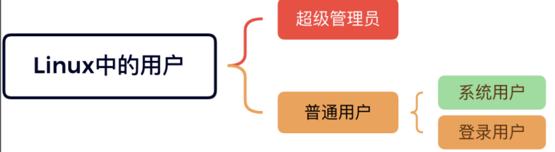
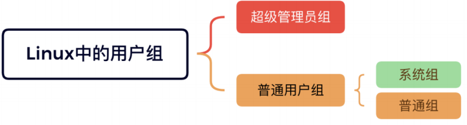
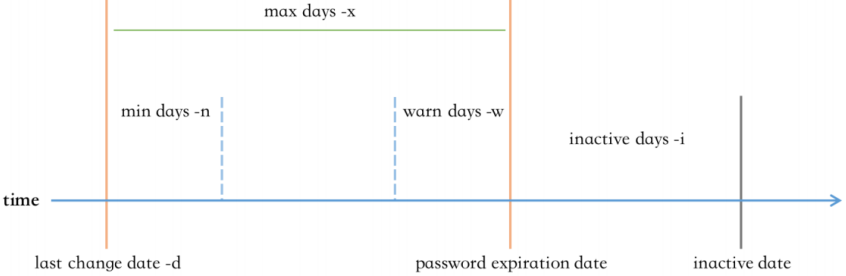
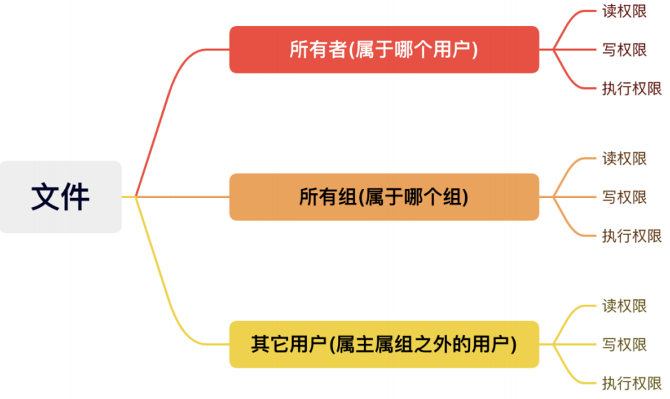
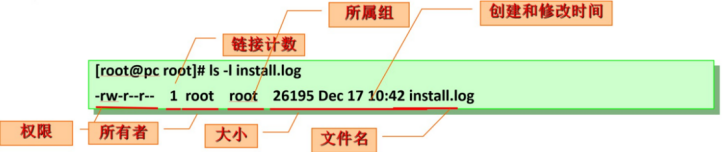

[TOC]

# 一、Linux 安全模型

资源分派：

- Authentication：认证，验证用户身份
  - 查询是否存在该用户
  - 如果用户存在，认证密码是否正确
- Authorization：授权，不同的用户设置不同权限
  - root
  - 普通用户
- Accouting：审计 ，事后行为

在Linux系统中，当用户登录成功时，系统会自动分配令牌 token，包括：用户标识和组成员等信息。

3A认证：

又称AAA认证，是一套针对网络设备的网络访问控制策略安全模型。

~~~shell
# 用于审计的登录日志
# Rocky
[root rockylinux-1 ~] WORK 0 
# cat /var/log/secure
Sep  1 13:49:54 rockylinux-1 sshd[23192]: pam_unix(sshd:auth): authentication failure; logname= uid=0 euid=0 tty=ssh ruser= rhost=192.168.121.231  user=root
Sep  1 13:49:56 rockylinux-1 sshd[23192]: Failed password for root from 192.168.121.231 port 47356 ssh2
Sep  1 13:50:07 rockylinux-1 sshd[23192]: Failed password for root from 192.168.121.231 port 47356 ssh2
Sep  1 13:50:23 rockylinux-1 sshd[23192]: Failed password for root from 192.168.121.231 port 47356 ssh2
Sep  1 13:50:23 rockylinux-1 sshd[23192]: Connection closed by authenticating user root 192.168.121.231 port 47356 [preauth]
Sep  1 13:50:23 rockylinux-1 sshd[23192]: PAM 2 more authentication failures; logname= uid=0 euid=0 tty=ssh ruser= rhost=192.168.121.231  user=root
Sep  1 13:50:52 rockylinux-1 sshd[23194]: pam_unix(sshd:auth): authentication failure; logname= uid=0 euid=0 tty=ssh ruser= rhost=192.168.121.231  user=root
Sep  1 13:50:54 rockylinux-1 sshd[23194]: Failed password for root from 192.168.121.231 port 40240 ssh2
Sep  1 13:51:19 rockylinux-1 sshd[23194]: Failed password for root from 192.168.121.231 port 40240 ssh2
Sep  1 13:51:27 rockylinux-1 sshd[23194]: Failed password for root from 192.168.121.231 port 40240 ssh2
Sep  1 13:51:27 rockylinux-1 sshd[23194]: Connection closed by authenticating user root 192.168.121.231 port 40240 [preauth]
Sep  1 13:51:27 rockylinux-1 sshd[23194]: PAM 2 more authentication failures; logname= uid=0 euid=0 tty=ssh ruser= rhost=192.168.121.231  user=root
Sep  1 13:52:00 rockylinux-1 sshd[23196]: pam_unix(sshd:auth): authentication failure; logname= uid=0 euid=0 tty=ssh ruser= rhost=192.168.121.231  user=root
Sep  1 13:52:02 rockylinux-1 sshd[23196]: Failed password for root from 192.168.121.231 port 42496 ssh2
Sep  1 13:52:23 rockylinux-1 passwd[23199]: pam_unix(passwd:chauthtok): password changed for root
Sep  1 13:52:27 rockylinux-1 sshd[23196]: Accepted password for root from 192.168.121.231 port 42496 ssh2
Sep  1 13:52:27 rockylinux-1 sshd[23196]: pam_unix(sshd:session): session opened for user root(uid=0) by (uid=0)
Sep  1 17:41:43 rockylinux-1 sshd[23203]: Received disconnect from 192.168.121.231 port 42496:11: disconnected by user
Sep  1 17:41:43 rockylinux-1 sshd[23203]: Disconnected from user root 192.168.121.231 port 42496
Sep  1 17:41:43 rockylinux-1 sshd[23196]: pam_unix(sshd:session): session closed for user root
Sep  1 22:27:39 rockylinux-1 sshd[23595]: Accepted password for root from 192.168.121.231 port 58670 ssh2
Sep  1 22:27:40 rockylinux-1 sshd[23595]: pam_unix(sshd:session): session opened for user root(uid=0) by (uid=0)

# Ubuntu
root@master01:~ 22:30:14 
# tail /var/log/auth.log
Sep  1 21:17:01 master01 CRON[2659995]: pam_unix(cron:session): session opened for user root(uid=0) by (uid=0)
Sep  1 21:17:01 master01 CRON[2659995]: pam_unix(cron:session): session closed for user root
Sep  1 22:17:01 master01 CRON[2704793]: pam_unix(cron:session): session opened for user root(uid=0) by (uid=0)
Sep  1 22:17:01 master01 CRON[2704793]: pam_unix(cron:session): session closed for user root
Sep  1 22:26:36 master01 sshd[2579285]: pam_unix(sshd:session): session closed for user root
Sep  1 22:26:36 master01 systemd-logind[954]: Session 101 logged out. Waiting for processes to exit.
Sep  1 22:26:36 master01 systemd-logind[954]: Removed session 101.
Sep  1 22:26:39 master01 sshd[2711836]: Accepted password for root from 192.168.121.1 port 57355 ssh2
Sep  1 22:26:39 master01 sshd[2711836]: pam_unix(sshd:session): session opened for user root(uid=0) by (uid=0)
Sep  1 22:26:39 master01 systemd-logind[954]: New session 105 of user root.
root@master01:~ 22:30:20 

~~~

## 1.1 用户

Linux系统是多用户系统，可以同时存在多个用户，每个用户之间都是互相隔离的。

在Linux系统中，每个用户是通过User Id （UID）来唯一标识的

- 管理员：root, 0 

- 普通用户：1-60000 自动分配

  系统用户：1-499 （CentOS 6以前）, 1-999 （CentOS 7以后） 对守护进程获取资源进行权限分配

  登录用户：500+ （CentOS6以前）, 1000+（CentOS7以后） 给用户进行交互式登录使用

在 Linux 中，root 以下，都是普能用户，其用户 id 为1-60000

| 用户类型             | 用户名       | 用户 id                                    | 作用                               |
| -------------------- | ------------ | ------------------------------------------ | ---------------------------------- |
| 超级管理员           | root（可改） | 0                                          | 超级管理员                         |
| 普通用户---系统用户  | 自定义       | 1-499(CentOS6及以前)，1-999(CentOS7及以后) | 给后台程序使用，像 nginx，mysql 等 |
| 普通用户 -- 登录用户 | 自定义       | 500+(CentOS6及以前)，1000+(CentOS7及以后)  | 给用户进行交互式登录               |

## 1.2 用户组

Linux 中可以将一个或多个用户加入用户组中，组就是包含0个或多个用户的集合，用户组是通过 Group ID（GID） 来唯一标识的。

- 管理员组：root, 0

- 普通组：

  系统组：1-499（CentOS 6以前）, 1-999（CentOS7以后）, 对守护进程获取资源进行权限分配

  普通组：500+（CentOS 6以前）, 1000+（CentOS7以后）, 给用户使用

| 组类型              | 组名   | 组 id                                      | 作用             |
| ------------------- | ------ | ------------------------------------------ | ---------------- |
| 超级管理员组        | root   | 0                                          | 给超级管理员使用 |
| 普通用户组---系统组 | 自定义 | 1-499(CentOS6及以前)，1-999(CentOS7及以后) | 给后台用户使用   |
| 普通用户组---普通组 | 自定义 | 500+(CentOS6及以前)，1000+(CentOS7及以后)  | 给登录用户使用   |

## 1.3 用户和用户组的关系

- 一个用户至少有一个组，也可以有多个组；
- 一个组至少有0个用户，也可以有多个用户；
- 用户的主要组(primary group)：又称私有组，一个用户必须属于且只有一个主组，创建用户时，默认会创建与其同名的组作为主组；
- 用户的附加组(supplementary group)：又称辅助组，一个用户可以属于0个或多个附加组；
- 使用组，可以对用户进行批量管理，比如对一个组授权，则该组下所有的用户能能继承这个组的权限；

~~~shell
root@master01:~ 22:30:20 
# id xuruizhao 
uid=1000(xuruizhao) gid=1000(xuruizhao) groups=1000(xuruizhao),4(adm),24(cdrom),27(sudo),30(dip),46(plugdev),110(lxd)

~~~

## 1.4 安全上下文

**Linux 安全上下文 Context：** 

在Linux系统中，运行中的程序（即进程process），都是以进程发起者的身份运行；

进程所能够访问的资源权限取决于进程的运行者的身份；

**首先，什么是程序**

一个程序或一个命令，本质上也是一个可执行的二进制文件或一个可执行的脚本文件；

在服务器上有很多文件，只有那些特定的，可以被执行的二进制文件，才能被称为程序；

**其次，什么是进程**

运行中的程序，就是进程；

**第三，程序，进程，用户之间的关系是怎样的**

只有可以被执行的文件，才能叫作程序；

对于同一个程序，也不是所有用户都可以运行的，这要取决于当前用户对该程序有没有可执行权限；

用户张三，运行了某个程序，那么，张三就发起了一个进程，该进程的发起者，就是张三，该进程是以

张三的身份在运行；

打个比方，在交通工具中，只有能在天上飞的，才能叫作飞机；

对于同一架飞机，也不是所有人都能上去的，这要取决于有没有买机票，有没有登机牌；

**第四，进程的访问资源**

一个进程能不能访问某些资源，是由进程发起者决定的（跟进程本身的程序文件无关），比如某进程要

读写某个文件，则要看该进程发起者有没有权限读取该文件；

一个旅客能不能坐头等舱，是由旅客自己决定的，跟飞机本身无关；

~~~ini
#reboot命令，只有root用户才有权限执行
[root@ubuntu2204 ~]# reboot
Connection closing...Socket close.
Connection closed by foreign host.
Disconnected from remote host(rocky8.5-2-153) at 11:19:02.
Type `help' to learn how to use Xshell prompt.
#普通用户无权限执行
[root@ubuntu2204 ~]# su - test
test@ubuntu2204 reboot
User root is logged in on sshd.
Please retry operation after closing inhibitors and logging out other users.
Alternatively, ignore inhibitors and users with 'systemctl reboot -i'.

#root 和普通用户都能执行cat命令，但对于某些文件，只有root 用户才能打开
[root@ubuntu2204 ~]# cat /etc/shadow
root:$6$10pvyo2c4EI8tYh1$PT2yiAT6nrxs9rtjhQFWfDuHyFaV5HARXzn9YZ6wpJKveHccpl5Qolj
t7iIlmHxWuy//::0:99999:7:::
bin:*:18700:0:99999:7:::
daemon:*:18700:0:99999:7:::
adm:*:18700:0:99999:7:::
......
jose@ubuntu2204 cat /etc/shadow
cat: /etc/shadow: Permission denied
~~~

# 二、用户和组的配置文件

## 2.1 用户和组的主要配置文件

- /etc/passwd：用户及其属性信息(名称、UID、主组ID等）
- /etc/shadow：用户密码及其相关属性
- /etc/group：组及其属性信息
- /etc/gshadow：组密码及其相关属性

## 2.2 passwd 文件格式

~~~shell
[root@moudle-ubuntu ~]# whatis passwd
passwd (1)           - change user password
passwd (1ssl)        - OpenSSL application commands
passwd (5)           - the password file

man 5 passwd #查看帮助手册
#文件格式
#login name:password:UID:GID:GECOS:directory:shell
root:x:0:0:root:/root:/bin/bash
ftp:x:14:50:FTP User:/var/ftp:/sbin/nologin
mage:x:1002:1002::/home/mage:/bin/bash
login name 		#登录用户名
password 		#密码位，x只是表示一个占位符，可为空
UID 			#用户ID，0 表示超级管理员
GID 			#所属组ID
GECOS 			#用户全名或注释，描述信息，可为空
directory 		#用户家目录，在创建用户时，默认会创建在/home 目录下
shell 			#用户默认shell，/sbin/nologin 表示不用登录的 shell，一般用 chsh 命令修改 chsh -s /bin/csh test
~~~

修改用户shell

~~~shell
[root@moudle-ubuntu ~]# useradd xuruizhao -m -s /bin/bash
[root@moudle-ubuntu ~]# id xuruizhao 
uid=1001(xuruizhao) gid=1001(xuruizhao) groups=1001(xuruizhao)
[root@moudle-ubuntu ~]# su - xuruizhao 
xuruizhao@moudle-ubuntu:~$ echo $SHELL
/bin/bash
xuruizhao@moudle-ubuntu:~$ grep xuruizhao /etc/passwd
xuruizhao:x:1001:1001::/home/xuruizhao:/bin/bash
xuruizhao@moudle-ubuntu:~$ exit
logout
[root@moudle-ubuntu ~]# chsh -s /bin/sh xuruizhao 
[root@moudle-ubuntu ~]# su - xuruizhao 
$ echo $SHELL
/bin/sh
$ 

~~~

## 2.3 shadow 文件格式

此文件中存储的是用户密码信息，任何用户都无权限

~~~shell
[root@moudle-ubuntu ~]# ll /etc/shadow
-rw-r----- 1 root shadow 1449 Sep  2 10:15 /etc/shadow
[root@moudle-ubuntu ~]# whatis shadow
shadow (5)           - shadowed password file
[root@moudle-ubuntu ~]# man 5 shadow 
[root@moudle-ubuntu ~]# 

#文件格式
#login name:encrypted password:date of last password change:minimum password age:maximum password age:password warning period:password inactivity period:account expiration date:reserved field
root:$6$lwdNTBEpfKFnUipo$Zm4JTG7vVVg6lJaMJ7sPTqmbc/I6GGMIjp7yO.rd6TsKb0lEeRHn4q7Z/LWJvV/FAWgTJVta9Gd78NPVNfld.1::0:99999:7:::
ftp:*:18700:0:99999:7:::
postfix:!!:19424::::::

login name  					#登录用户名
encrypted password  			#加密后的密文，一般用 sha512 加密，可为空，!表示该用户被锁定，不能登录系统
date of last password change  	#上次修改密码的时间，自1970年开始，0表示下次登录之后就要改密码，为空表示密码时效功能无效
minimum password age  			#最小时间间隔，当前密码最少能使用多少天，0表示随时可被变更
maximum password age  			#最大时间间隔，当前密码最多能使用多少天，99999表示可以一直使用
password warning period  		#警告时间，密码过期前几天开始提醒用户，默认为7
password inactivity period    	#不活动时间，密码过期几天后帐号会被锁定，在此期间，用户仍然可以登录，为空表示不使用此规则
account expiration date       	#失效时间，从1970年1月1日算起，多少天后帐号失效，为空表示永不过期
reserved field      			#保留字段，无意义
~~~

所有伪用户的密码都是 "!!" 或 "*"，代表没有密码是不能登录的，新建用户还没设密码时为!!，禁用账号，可以直接在密码字段前加 

## 2.4 group 文件格式

~~~shell
man group
#文件格式
#group_name:password:GID:user_list
ftp:x:50:
mage:x:1002:
group_name     	#组名
password   		#组密码，当用户加组时，需要用此密码验证
GID       		#组ID
user_list 		#用户列表，多个用户用,分隔, 此处的用户将当前组作为附加组
~~~

## 2.5 gshadow 文件格式

~~~~shell
man gshadow
#文件格式
#group name:encrypted password:administrators:members
ftp:::
mage:!::
group name 				#组名
encrypted password 		#组密码，加密后的密文，!表示还没设密码
administrators 			#组管理员
members 				#用户列表，多个用户用,分隔, 此处的用户将当前组作为附加组
~~~~

## 2.6 文件操作

可以直接用编辑工具来修改上述文件，但由于跟用户和权限有关的文件具有敏感性，所以系统提供了专用的工具来修改这几个文件。

**vipw & vigr**

~~~shell
#vipw|vigr
#编辑/etc/passwd，/etc/group，/etc/shadow，/etc/gshadow

#vipw 默认编辑 /etc/passwd 文件
#vigr 默认编辑 /etc/group 文件
-g|--group   	#编辑 group 文件
-p|--passwd   	#编辑 passwd 文件
-s|--shadow   	#编辑 /etc/shadow 或 /etc/gshadow 文件

[root@moudle-ubuntu ~]# vipw

Select an editor.  To change later, run 'select-editor'.
  1. /bin/nano        <---- easiest
  2. /usr/bin/vim.basic
  3. /usr/bin/vim.tiny
  4. /bin/ed

Choose 1-4 [1]: 1
vipw: /etc/passwd is unchanged

~~~

**pwck & grpck**

~~~shell
#pwck [options] [passwd [shadow]]
#对用户相关配置文件进行检查，默认检查文件为 /etc/passwd
-q|--quiet           	#只报告错误，忽略警告
-r|--read-only       	#显示错误和警告，但不改变文件
-R|--root CHROOT_DIR 	#chroot 到的目录
-s|--sort             	#通过 UID 排序项目

#grpck [options] [group [gshadow]]
#对用户组相关配置文件进行检查，默认检查文件为 /etc/group，/etc/gshadow
-r|--read-only          #显示错误和警告，但不改变文件
-R|--root CHROOT_DIR    #chroot 到的目录
-s|--sort               #通过 UID 排序项目
~~~

**getent**

~~~shell
getent passwd|shadow|group|gshadow [uname]
#根据用户名查看配置项

[root@moudle-ubuntu ~]# getent passwd xuruizhao 
xuruizhao:x:1001:1001::/home/xuruizhao:/bin/sh
[root@moudle-ubuntu ~]# 
~~~

# 三、用户和组管理命令

用户管理命令

- useradd 
- usermod
- userdel 

组帐号维护命令

- groupadd 
- groupmod 
- groupdel

## 3.1 用户创建

useradd 命令可以创建新的Linux用户

格式：

~~~shell
useradd [options] LOGIN
useradd -D
useradd -D [options]
#常见选项
-u|--uid UID             		#指定UID
-g|--gid GID             		#指定用户组，-g groupname|--gid GID
-c|--comment COMMENT         	#新账户的 GECOS 字段
-d|--home-dir HOME_DIR       	#指定家目录，可以是不存在的，指定家目录，并不代表创建家目录
-s|--shell SHELL         		#指定 shell，可用shell在/etc/shells 中可以查看
-r|--system               		#创建系统用户,CentOS 6之前 ID<500，CentOS7 以后ID<1000，不会创建登录用户相关信息
-m|--create-home         		#创建家目录，一般用于登录用户
-M|--no-create-home       		#不创建家目录，一般用于不用登录的用户
-p|--password PASSWORD   		#设置密码，这里的密码是以明文的形式存在于/etc/shadow 文件中
-o|--non-unique           		#允许使用重复的 UID 创建用户
-G|--groups GROUP1[,GROUP2,...] #为用户指明附加组，组须事先存在
-N|--no-user-group       		#不创建同名的组,使用users组做主组
-D|--defaults               	#显示或更改默认的 useradd 配置，默认配置文件是 /etc/default/useradd
-e|--expiredate EXPIRE_DATE 	#指定账户的过期日期 YYYY-MM-DD 格式
-f|--inactive INACTIVE       	#密码过期之后，账户被彻底禁用之前的天数，0 表示密码过期立即禁用，-1表示不使用此功能
-k|--skel SKEL_DIR 				#指定家目录模板，创建家目录，会生成一些默认文件，如果指定，就从该目录复制文件，默认是/etc/skel/，要配合-m
-K|--key KEY=VALUE   			#不使用 /etc/login.defs 中的默认值，自己指定，比如 -K UID_MIN=100 
-l|--no-log-init 				#不将用户添加到最近登录和登录失败记录，前面讲到的3a认证审计，就在此处 lastlog|lastb|cat /var/log/secure
~~~

~~~shell
# 创建用户前先创建组，确保组 id 是已知的

# 不可占用已经存在的组 id
[root@moudle-ubuntu ~]# groupadd -g 2 xxx
groupadd: GID '2' already exists
[root@moudle-ubuntu ~]# 

# 创建系统组
[root@moudle-ubuntu ~]# groupadd  -g 336 mysql
[root@moudle-ubuntu ~]# grep mysql /etc/group
mysql:x:336:
[root@moudle-ubuntu ~]# getent group mysql
mysql:x:336:
[root@moudle-ubuntu ~]# 

# 创建用户
[root@moudle-ubuntu ~]# useradd -u 336 -g mysql -s /sbin/nologin -d /data/mysql -M -r mysql
[root@moudle-ubuntu ~]# id mysql
uid=336(mysql) gid=336(mysql) groups=336(mysql)
[root@moudle-ubuntu ~]# getent passwd  mysql
mysql:x:336:336::/data/mysql:/sbin/nologin
[root@moudle-ubuntu ~]# 
[root@moudle-ubuntu ~]# getent shadow mysql
mysql:!:20333::::::
[root@moudle-ubuntu ~]# 

~~~

默认创建

~~~shell
[root@moudle-ubuntu ~]# useradd  tom
[root@moudle-ubuntu ~]# getent passwd  tom
tom:x:1002:1002::/home/tom:/bin/sh
[root@moudle-ubuntu ~]#
[root@moudle-ubuntu ~]# getent shadow tom 
tom:!:20333:0:99999:7:::
[root@moudle-ubuntu ~]# getent group tom
tom:x:1002:
[root@moudle-ubuntu ~]# getent gshadow tom
tom:!::
[root@moudle-ubuntu ~]# 

# 再 Ubuntu 中默认不会创建用户的家目录
[root@moudle-ubuntu ~]# ll /home/tom
ls: cannot access '/home/tom': No such file or directory
[root@moudle-ubuntu ~]# 

# 再 rocky Linux 默认创建用户家目录
[root rockylinux-1 ~] WORK 0 
# useradd tom
[root rockylinux-1 ~] WORK 0 
# ll /home/tom 
total 0
[root rockylinux-1 ~] WORK 0 
# ll /home/tom -d
drwx------ 2 tom tom 62 Sep  2 14:20 /home/tom
[root rockylinux-1 ~] WORK 0 
# 

~~~

useradd 命令默认值设定由 /etc/default/useradd 定义

~~~shell
[root rockylinux-1 ~] WORK 0 
# cat /etc/default/useradd 
# useradd defaults file
GROUP=100 # useradd 不指定组,且 /etc/login.defs 中的 USERGROUPS_ENAB 为 no 或 useradd -N 时，group 为100
HOME=/home # 默认家目录父目录
INACTIVE=-1 # 对应 /etc/shadow 文件第7列，即用户密码过期后的帐号锁定的宽限期,-1表示不锁定
EXPIRE= # #对应 /etc/shadow 文件第8列，即用户帐号的有效期
SHELL=/bin/bash # 默认 bash
SKEL=/etc/skel # 用于生成新建用户家目录的模版文件
CREATE_MAIL_SPOOL=yes # 默认创建收件箱
~~~

显示或更改默认设置

~~~shell
#useradd -D 
#useradd –D -s SHELL
#useradd –D –b BASE_DIR
#useradd –D –g GROUP

[root@moudle-ubuntu ~]# useradd -D
GROUP=100
HOME=/home
INACTIVE=-1
EXPIRE=
SHELL=/bin/sh
SKEL=/etc/skel
CREATE_MAIL_SPOOL=no
[root@moudle-ubuntu ~]# 

# 更改默认 shell
[root@moudle-ubuntu ~]# useradd -D -s /bin/bash
[root@moudle-ubuntu ~]# useradd -D
GROUP=100
HOME=/home
INACTIVE=-1
EXPIRE=
SHELL=/bin/bash
SKEL=/etc/skel
CREATE_MAIL_SPOOL=no
[root@moudle-ubuntu ~]# useradd -m dev 
[root@moudle-ubuntu ~]# getent passwd dev
dev:x:1003:1003::/home/dev:/bin/bash
[root@moudle-ubuntu ~]# 

~~~

家目录模板

~~~shell
[root@moudle-ubuntu ~]# ll /etc/skel/
total 28
drwxr-xr-x   2 root root  4096 Aug 22  2024 ./
drwxr-xr-x 130 root root 12288 Sep  2 14:25 ../
-rw-r--r--   1 root root   220 Jan  7  2022 .bash_logout
-rw-r--r--   1 root root  3771 Jan  7  2022 .bashrc
-rw-r--r--   1 root root   807 Jan  7  2022 .profile
[root@moudle-ubuntu ~]# 

[root rockylinux-1 ~] WORK 0 
# ll /etc/skel/ -a
total 24
drwxr-xr-x.  2 root root   62 Jun 26 22:59 .
drwxr-xr-x. 81 root root 8192 Sep  2 14:20 ..
-rw-r--r--.  1 root root   18 Jan 24  2023 .bash_logout
-rw-r--r--.  1 root root  141 Jan 24  2023 .bash_profile
-rw-r--r--.  1 root root  492 Jan 24  2023 .bashrc
[root rockylinux-1 ~] WORK 0 
# 

~~~

新建用户的相关文件

- /etc/default/useradd 
- /etc/skel/* 
- /etc/login.defs

批量创建用户

~~~shell
newusers file
~~~

~~~shell
[root@moudle-ubuntu ~]# cat user.txt
u1:123456:1024:1024::/home/u1:/bin/bash
u2:123456:1025:1025::/home/u2:/bin/bash
[root@moudle-ubuntu ~]# newusers user.txt
[root@moudle-ubuntu ~]# id u1
uid=1024(u1) gid=1024(u1) groups=1024(u1)
[root@moudle-ubuntu ~]# id u2
uid=1025(u2) gid=1025(u2) groups=1025(u2)
[root@moudle-ubuntu ~]# getent passwd u1 u2
u1:x:1024:1024::/home/u1:/bin/bash
u2:x:1025:1025::/home/u2:/bin/bash

~~~

批量修改用户口令

~~~shell
chpasswd < file
~~~

~~~shell
[root@moudle-ubuntu ~]# echo -e 'u1:123\nu2:123' > pass.txt
[root@moudle-ubuntu ~]# cat pass.txt
u1:123
u2:123
# 标准输入重定向
[root@moudle-ubuntu ~]# chpasswd < pass.txt
[root@moudle-ubuntu ~]# su - u1
u1@moudle-ubuntu:~$ su - u2
Password: 
u2@moudle-ubuntu:~$ su - u1
Password: 
u1@moudle-ubuntu:~$ exit
logout
u2@moudle-ubuntu:~$ exit
logout
u1@moudle-ubuntu:~$ exit
logout
[root@moudle-ubuntu ~]# 

# 多行重定向
[root@moudle-ubuntu ~]# chpasswd <<EOF
> u1:1234
> u2:1234
> EOF

# 管道重定向
[root@moudle-ubuntu ~]# echo -e 'u1:123\nu2:123' | chpasswd
~~~

Rocky Linux 生成 sha512 加密密码

~~~shell
[root rockylinux-1 ~] WORK 0 
# openssl  passwd -6 123
$6$bvg7MAe6wTVZfd90$pLkXPaO6V4LktXpgKvVU7CwQrfDVemtnBRojDuoZl0OmwlWY8DDNXUoiRVfn1sFDuG1wNumfVN.WQcE0/1Z/R.
[root rockylinux-1 ~] WORK 0 
# 

~~~

Ubuntu 生成 sha512 加密密码

~~~shell
[root@moudle-ubuntu ~]# openssl passwd -6 123
$6$.bFdoZgOe5WfI.sV$o5AftGCPtVa0pCL3IxWbsVqeAdlT2CZwM7U4ggz2HLUnpxUK9mamVEv9j.aIZE.hXu8oKPkvWzTn0S/U88mFd/
[root@moudle-ubuntu ~]# 

~~~

## 3.2 用户属性修改

usermod 命令可以修改用户属性

格式：

~~~shell
usermod [options] LOGIN
#常见选项
-c|--comment COMMENT         # 修改注释
-d|--home HOME_DIR           # 修改家目录
-e|--expiredate EXPIRE_DATE  # 修改过期的日期，YYYY-MM-DD 格式
-f|--inactive INACTIVE       # 密码过期之后，账户被彻底禁用之前的天数，0 表示密码过期立即禁用，-1表示不使用此功能
-g|--gid GROUP               # 修改组
-G|--groups GROUPS           # groupName|GID... 新附加组，原来的附加组将会被覆盖；若保留原有，则要同时使用-a选项
-a|--append GROUP            # 将用户追加至上边 -G 中提到的附加组中，并不从其它组中删除此用户
-l|--login LOGIN             # 新的登录名称
-L|--lock                    # 锁定用户帐号，在/etc/shadow 密码栏的增加 !
-m|--move-home               # 将家目录内容移至新位置，和 -d 一起使用
-o|--non-unique              # 允许使用重复的(非唯一的) UID
-p|--password PASSWORD       # 修改密码，这里是明文，如果要在此处修改密码，则要用加密后的字符串
-s|--shell SHELL             # 修改 shell
-u|--uid UID                 # 修改 UID
-U|--unlock                  # 解锁用户帐号，将 /etc/shadow 密码栏的!拿掉
~~~

修改用户信息

~~~shell
[root@moudle-ubuntu ~]# id tom
uid=1002(tom) gid=1002(tom) groups=1002(tom)
# 将 tom 的用户名改为 tim
[root@moudle-ubuntu ~]# usermod -c "tom to tim" -l tim tom
[root@moudle-ubuntu ~]# id tom
id: ‘tom’: no such user
[root@moudle-ubuntu ~]# id tim
uid=1002(tim) gid=1002(tom) groups=1002(tom)
[root@moudle-ubuntu ~]# 

~~~

锁定用户

用户被锁定之后将无法登录

~~~shell
[root@moudle-ubuntu ~]# passwd tim
New password: 
Retype new password: 
passwd: password updated successfully
[root@moudle-ubuntu ~]# getent shadow tim
tim:$y$j9T$MKBrnwHvKD.oEhpyhC4pM.$xfG.Op1GNZFLzu98s2t6tlWjebOI/MlTAwz1vq0p4K/:20333:0:99999:7:::
[root@moudle-ubuntu ~]# 
# 锁定 tim 用户
[root@moudle-ubuntu ~]# usermod -L tim 
[root@moudle-ubuntu ~]# getent shadow tim
tim:!$y$j9T$MKBrnwHvKD.oEhpyhC4pM.$xfG.Op1GNZFLzu98s2t6tlWjebOI/MlTAwz1vq0p4K/:20333:0:99999:7:::
[root@moudle-ubuntu ~]# 

~~~

解锁用户

~~~shell
[root@moudle-ubuntu ~]# usermod -U tim
[root@moudle-ubuntu ~]# getent shadow tim
tim:$y$j9T$MKBrnwHvKD.oEhpyhC4pM.$xfG.Op1GNZFLzu98s2t6tlWjebOI/MlTAwz1vq0p4K/:20333:0:99999:7:::
[root@moudle-ubuntu ~]# 

~~~

centos 允许空密码用户登录，所以两个 !!，无法用 -U 选项解锁

所谓解锁，只针对于有密码的用户来说，但是，可以直接修改/etc/shadow 文件，将密码栏置空产生空密码用户

~~~shell
[root rockylinux-1 ~] WORK 0 
# getent  shadow tom
tom:!!:20333:0:99999:7:::
[root rockylinux-1 ~] WORK 0 
# usermod -L tom
[root rockylinux-1 ~] WORK 0 
# getent  shadow tom
tom:!!:20333:0:99999:7:::
[root rockylinux-1 ~] WORK 0 
# usermod -U tom
usermod: unlocking the user's password would result in a passwordless account.
You should set a password with usermod -p to unlock this user's password.
[root rockylinux-1 ~] WORK 1
~~~

## 3.3 删除用户

userdel 可删除 Linux 用户

格式：

~~~shell
userdel [options] LOGIN

#常见选项
-f|--force     # 强制删除，哪怕用户正在登录状态
-r|--remove    # 删除家目录和邮件目录
~~~

示例：

~~~shell
# 创建用户并设置密码
[root@moudle-ubuntu ~]# useradd zhangsan -m

[root@moudle-ubuntu ~]# getent passwd zhangsan 
zhangsan:x:1026:1026::/home/zhangsan:/bin/bash
[root@moudle-ubuntu ~]# echo zhangsan:123 | chpasswd 
[root@moudle-ubuntu ~]# ll /home/zhangsan/ -d
drwxr-x--- 2 zhangsan zhangsan 4096 Sep  2 14:59 /home/zhangsan//
[root@moudle-ubuntu ~]# ll /home/zhangsan/ 
total 20
drwxr-x--- 2 zhangsan zhangsan 4096 Sep  2 14:59 ./
drwxr-xr-x 8 root     root     4096 Sep  2 14:59 ../
-rw-r--r-- 1 zhangsan zhangsan  220 Jan  7  2022 .bash_logout
-rw-r--r-- 1 zhangsan zhangsan 3771 Jan  7  2022 .bashrc
-rw-r--r-- 1 zhangsan zhangsan  807 Jan  7  2022 .profile

# 在另一个终端登录张三
[root@moudle-ubuntu ~]# su - zhangsan 
zhangsan@moudle-ubuntu:~$ id
uid=1026(zhangsan) gid=1026(zhangsan) groups=1026(zhangsan)
zhangsan@moudle-ubuntu:~$ 

# 不能直接删除登录中的用户
[root@moudle-ubuntu ~]# userdel zhangsan 
userdel: user zhangsan is currently used by process 135588
[root@moudle-ubuntu ~]# 

# 强制删除
[root@moudle-ubuntu ~]# userdel -f zhangsan 
userdel: user zhangsan is currently used by process 135588
[root@moudle-ubuntu ~]# id zhangsan 
id: ‘zhangsan’: no such user
[root@moudle-ubuntu ~]# 

zhangsan@moudle-ubuntu:~$ whoami
whoami: cannot find name for user ID 1026
zhangsan@moudle-ubuntu:~$ id
uid=1026 gid=1026 groups=1026
zhangsan@moudle-ubuntu:~$ 

~~~

==用户被删除后，其名下的文件无法显示属主属组，只能显示 UID== 

~~~shell
[root@moudle-ubuntu ~]# ll -d /home/zhangsan/
drwxr-x--- 2 1026 1026 4096 Sep  2 14:59 /home/zhangsan//
[root@moudle-ubuntu ~]#
~~~

==如果新建用户，使用了原用户的 UID，则可以继承原用户文件==

~~~shell
[root@moudle-ubuntu ~]# useradd lisi -m
[root@moudle-ubuntu ~]# ll /home/{lisi,zhangsan} -d
drwxr-x--- 2 lisi lisi 4096 Sep  2 15:04 /home/lisi/
drwxr-x--- 2 lisi lisi 4096 Sep  2 14:59 /home/zhangsan/
[root@moudle-ubuntu ~]# 

~~~

删除用户文件

~~~shell
[root@moudle-ubuntu ~]# userdel -r lisi
userdel: lisi mail spool (/var/mail/lisi) not found
[root@moudle-ubuntu ~]# 
[root@moudle-ubuntu ~]# ll /home/lisi -d
ls: cannot access '/home/lisi': No such file or directory
[root@moudle-ubuntu ~]# 
~~~

## 3.4 查看用户相关的 id 信息

id 命令可以查看用户的 UID，GID 等信息

格式：

~~~shell
id [OPTION]... [USER]
#常见选项
-a           	# 显示详细信息，默认选项
-Z|--context 	# 仅显示安全上下文信息，要开启selinux 配置才有
-g|--group     	# 仅显示GID，就是只显示主组ID
-G|--groups   	# 显示主组和附加组ID，就是所有组ID
-n|--name     	# 显示用户名或组名，要组合使用 -nu|-ng|-nG
-u|--user     	# 仅显示UID
~~~

示例

~~~shell
# centos8中如果没有关闭 selinux，会出现安全上下文相关内容
[root rockylinux-1 ~] WORK 0 
# id -a
uid=0(root) gid=0(root) groups=0(root)
[root rockylinux-1 ~] WORK 0 
# id   
uid=0(root) gid=0(root) groups=0(root)
[root rockylinux-1 ~] WORK 0 
# id -nu
root
[root rockylinux-1 ~] WORK 0 
# id -ng
root
[root rockylinux-1 ~] WORK 0 
# id -nG
root
[root rockylinux-1 ~] WORK 0 
# 
~~~

## 3.5 切换用户或以其他用户身份执行命令

如果在当前登录终端中，要执行某条命令，但当前登录用户又没有可执行权限或没有某些资源权限；

则在此种情况下，我们可以：

1. 让有权限的用户登录终端，再执行相应的操作；

2. 在当前终端终，临时切换，以有权限的用户的身份去执行命令；

su: 即 switch user，命令可以切换用户身份，并且以指定用户的身份执行命令

格式：

~~~shell
su [options...] [-] [user [args...]]
#常见选项
-m|-p|--preserve-environment 	# 不重置环境变量
-g|--group group                # 指定主组，只有root 切普通用户才能指定此参数
-|-l|--login                 	# 完全切换
-c|--command command            # 不切换用户，而是临时使用该用户权限和环境执行命令
--session-command command       # 使用上同 -c 选项，但不会创建会话
-f|--fast                     	# 向shell 传递 -f 选项(csh 或 tcsh)
-s|--shell shell           		# 切换用户后，指定新环境的shell环境，必须在 /etc/shells 中存在
-P|--pty                     	# 开一个新的终端
~~~

切换用户的方式：

- su UserName：非登录式切换，即不会读取目标用户的配置文件，不改变当前工作目录，即不完全切换
- su - UserName：登录式切换，会读取目标用户的配置文件，切换至自已的家目录，即完全切换

说明：root su 至其他用户无须密码；非 root 用户切换时需要密码

注意：su 切换新用户后，使用 exit 退回至旧的用户身份，而不要再用 su 切换至旧用户，否则会生成很多的bash子进程，环境可能会混乱。

完全切换和不完全切换的区别

~~~shell
[root rockylinux-1 ~] WORK 0 
# su tom
[tom rockylinux-1 /root] WORK 0 
# env | grep root
PWD=/root
PATH=/home/tom/.local/bin:/home/tom/bin:/root/.local/bin:/root/bin:/usr/local/sbin:/usr/local/bin:/usr/sbin:/usr/bin
MAIL=/var/spool/mail/root
[tom rockylinux-1 /root] WORK 0 
# exit
exit
[root rockylinux-1 ~] WORK 0 
# su - tom
Last login: Tue Sep  2 15:21:36 CST 2025 on pts/0
[tom rockylinux-1 ~] WORK 0 
# env | grep root
[tom rockylinux-1 ~] WORK 0 
# 

~~~

直接以另一个用户执行命令，而不切换用户

~~~shell
[root rockylinux-1 ~] WORK 1 
# su - tom
Last login: Tue Sep  2 15:21:48 CST 2025 on pts/0
[tom rockylinux-1 ~] WORK 0 
# touch 1.txt
[tom rockylinux-1 ~] WORK 0 
# ll 
total 0
-rw-r--r-- 1 tom tom 0 Sep  2 15:22 1.txt
[tom rockylinux-1 ~] WORK 0 
# 

# 简化执行
[root rockylinux-1 ~] WORK 0 
# su - tom -c "touch 2.txt"
[root rockylinux-1 ~] WORK 0 
# su - tom
Last login: Tue Sep  2 15:22:54 CST 2025 on pts/0
[tom rockylinux-1 ~] WORK 0 
# ll 2.txt
-rw-r--r-- 1 tom tom 0 Sep  2 15:22 2.txt
[tom rockylinux-1 ~] WORK 0 
# 

[root rockylinux-1 ~] WORK 0 
# su - tom -c "id"
uid=1001(tom) gid=1001(tom) groups=1001(tom)
[root rockylinux-1 ~] WORK 0 
# 

~~~

使用 /sbin/nologin shell 的用户无法切换，ubnutn 中 使用 /bin/false shell 的用户同样无法切换

~~~shell
[root@rocky8 ~]# getent passwd mysql
mysql:x:336:336::/data/mysql:/sbin/nologin
[root@rocky8 ~]# su - mysql
This account is currently not available.
[root@rocky8 ~]# su - mysql -c "echo nologin"
This account is currently not available.

#但可以指定可切换的Shell
[root@rocky8 ~]# su - mysql -s /bin/bash
[mysql@rocky8 ~]$ id
uid=336(mysql) gid=336(mysql) groups=336(mysql)
[root@rocky8 ~]# su - mysql -s /bin/bash -c "echo nologin"
nologin
~~~

## 3.6 设置密码

passwd 可以修改用户密码

~~~shell
passwd [OPTION...] <accountName>
#常用选项
-k|--keep-tokens       # 保持身份验证令牌不过期
-d|--delete            # 删除用户密码，也删除密码锁，仅root有权限操作
-l|--lock              # 锁定用户密码，仅root有权限操作
-u|--unlock            # 解锁用户密码，仅root有权限操作
-e|--expire            # 终止用户密码，此操作完成后，用户下次登录成功后要立马修改，仅root有权限操作
-f|--force             # 强制执行操作
-x|--maximum=DAYS      # 指定用户密码最长有效期，仅root有权限操作
-n|--minimum=DAYS      # 指定用户密码最短有效期，仅root有权限操作
-w|--warning=DAYS      # 在密码过期前多少天开始提醒用户，仅root有权限操作
-i|--inactive=DAYS     # 当密码过期后经过多少天该用户账号会被禁用，仅root有权限操作
-S|--status            # 查询用户的密码状态，仅root有权限操作
--stdin                # 从标准输入接收密码,Ubuntu无此选项
~~~

普通用户修改自己密码，要先验证当前使用的密码

~~~shell
[root@moudle-ubuntu ~]# su - tim
su: warning: cannot change directory to /home/tom: No such file or directory
$ passwd
Changing password for tim.
Current password: 
New password: 
Retype new password: 
passwd: password updated successfully
$ pwd
/root
$ 

~~~

root修改其它用户密码

~~~shell
[root@moudle-ubuntu ~]# passwd tim
New password: 
Retype new password: 
passwd: password updated successfully

~~~

修改密码其实就是更新 /etc/shadow 文件

非交互式修改用户密码

~~~shell
# 适用于 RedHat 系列的 Linux 版本
[root rockylinux-1 ~] WORK 0 
# echo 123  | passwd --stdin tom
Changing password for user tom.
passwd: all authentication tokens updated successfully.
[root rockylinux-1 ~] WORK 0 
# passwd --stdin tom <<< 111
Changing password for user tom.
passwd: all authentication tokens updated successfully.
[root rockylinux-1 ~] WORK 0 
# 

#Ubuntu中 passwd 无 --stdin 选项
#此写法在centos中也支持,更通用
root@ubuntu20:~# echo -e '123456\n123456' | passwd tom
New password: Retype new password: passwd: password updated successfully
~~~

设置用户下次必须更改密码

~~~shell
root@moudle-ubuntu ~]# passwd -e tim
passwd: password expiry information changed.
[root@moudle-ubuntu ~]# su - tim
You are required to change your password immediately (administrator enforced).
Changing password for tim.
Current password: 
New password: 
Retype new password: 

~~~

## 3.7 修改用户密码策略

chage 可以修改用户密码策略

格式：

~~~shell
chage [options] LOGIN

#常见选项
-d LAST_DAY               		#更改密码的时间
-m|--mindays MIN_DAYS
-M|--maxdays MAX_DAYS
-W|--warndays WARN_DAYS
-I|--inactive INACTIVE 			#密码过期后的宽限期
-E|--expiredate EXPIRE_DATE 	#用户的有效期
-l 								#显示密码策略
~~~

查看用户密码策略

~~~shell
[root@moudle-ubuntu ~]# chage -l tim
Last password change					: Sep 02, 2025
Password expires					: never
Password inactive					: never
Account expires						: never
Minimum number of days between password change		: 0
Maximum number of days between password change		: 99999
Number of days of warning before password expires	: 7
[root@moudle-ubuntu ~]# 
[root@moudle-ubuntu ~]# chage  tim
Changing the aging information for tim
Enter the new value, or press ENTER for the default

	Minimum Password Age [0]: 3
	Maximum Password Age [99999]: 42
	Last Password Change (YYYY-MM-DD) [2025-09-02]: 
	Password Expiration Warning [7]: 10
	Password Inactive [-1]: 20
	Account Expiration Date (YYYY-MM-DD) [-1]: 
[root@moudle-ubuntu ~]# chage -l tim
Last password change					: Sep 02, 2025
Password expires					: Oct 14, 2025
Password inactive					: Nov 03, 2025
Account expires						: never
Minimum number of days between password change		: 3
Maximum number of days between password change		: 42
Number of days of warning before password expires	: 10
[root@moudle-ubuntu ~]# 
[root@moudle-ubuntu ~]# getent shadow tim
tim:$y$j9T$mGdYxyyzXJIVNWGewNZk//$NAjOezYXIeENI8O/qSytNVogzw49bNCQSMFfkZNFhI/:20333:3:42:10:20::
[root@moudle-ubuntu ~]# 

# 只修改单项
[root@moudle-ubuntu ~]# chage -d 2026-06-25 tim
[root@moudle-ubuntu ~]# getent shadow tim
tim:$y$j9T$mGdYxyyzXJIVNWGewNZk//$NAjOezYXIeENI8O/qSytNVogzw49bNCQSMFfkZNFhI/:20629:3:42:10:20::
[root@moudle-ubuntu ~]# 

~~~

密码文件中各时间字段的表示：

## 3.8 创建组

groupadd 实现创建组

~~~shell
groupadd [options] GROUP
#常见选项
-f|--force              # 如果组已经存在则成功退出
-g|--gid GID            # 新建组时指定组ID，默认是系统分配，指定值不要超过[GID_MIN，GID_MAX]
-K|--key KEY=VALUE      # 不使用 /etc/login.defs 中的默认值，自己指定，比如 -K GID_MIN=100 
-o|--non-unique         # 允许创建有重复 GID 的组
-p|--password PASSWORD  # 为新组使用此加密过的密码，这里要用加密后的密文，不然就是直接是明文在/etc/gshadow 里面
-r|--system             # 创建一个系统组 CentOS 6之前: ID<500，CentOS 7以后: ID<1000
~~~

示例：

~~~shell
[root@ubuntu2204 ~]# groupadd -g 48 -r apache
[root@ubuntu2204 ~]# getent group apache
apache:x:48:

#不加 -f 会提示己存在
[root@ubuntu2204 ~]# groupadd apache
groupadd: group 'apache' already exists

# -f 直接结束
[root@ubuntu2204 ~]# groupadd -f apache
~~~

## 3.9 修改组

groupmod 组属性修改

格式：

~~~shell
groupmod [options] GROUP
#常见选项
-g|--gid GID                 # 将组 ID 改为 GID
-n|--new-name NEW_GROUP      # 改名为 NEW_GROUP
-o|--non-unique              # 允许使用重复的 GID
-p|--password PASSWORD       # 将密码更改为(加密过的) PASSWORD
~~~

示例

~~~shell
[root@ubuntu2204 ~]# getent group apache
apache:x:48:
[root@ubuntu2204 ~]# groupmod -g 123 apache
[root@ubuntu2204 ~]# getent group apache
apache:x:123:
[root@ubuntu2204 ~]# groupmod -n apache2 apache
[root@ubuntu2204 ~]# getent group apache2
apache2:x:123:
~~~

## 3.10 删除组

groupdel 可以删除组

格式:

~~~shell
groupdel [options] GROUP
#常见选项
-f|--force # 强制删除，即使是用户的主组也强制删除组,但会导致无主组的用户不可用无法登录
~~~

示例

~~~shell
[root@ubuntu2204 ~]# groupdel apache2
[root@ubuntu2204 ~]# getent group apache2
[root@ubuntu2204 ~]# groupdel tom
groupdel: cannot remove the primary group of user 'tom'
#-f 强制删除有用户的组
# 强制删除之后，显示该组名的地方，只能显示该组ID，如果此时新建与组ID相同的新组，则被删除的组的数据会被新组关联
[root@ubuntu2204 ~]# groupdel -f tom
[root@ubuntu2204 ~]# id tom
uid=1001(tom) gid=1001 groups=1001
~~~

删除组：如果该组下有用户将组作为主组，则不能删除

删除用户：会把与其同ID的主组也给删了，前提是该组下没有其它用户

## 3.11 更改组成员和密码

gpasswd 命令，可以更改组密码，也可以修改附加组的成员关系

组没有密码的情况下，加组只能由root来操作

格式：

~~~shell
gpasswd [option] GROUP
#常见选项
-a|--add USER           		#向组中添加用户
-d|--delete USER         		#从组中移除用户
-r|--delete-password     		#删除组密码
-R｜--restrict           	   #向其成员限制访问组 GROUP
-M｜--members USER,...       	#批量加组
-A｜--administrators ADMIN,...   #批量设组管理员
~~~

示例

~~~shell
[root@ubuntu2204 ~]# id jose
uid=1001(jose) gid=1001(jose) groups=1001(jose)
[root@ubuntu2204 ~]# groups jose
jose : jose
#创建新组
[root@ubuntu2204 ~]# groupadd group1
[root@ubuntu2204 ~]# getent gshadow group1
group1:!::
#给用户加组
[root@ubuntu2204 ~]# gpasswd -a jose group1
Adding user jose to group group1
[root@ubuntu2204 ~]# getent gshadow group1
group1:!::jose
#查看用户的组
[root@ubuntu2204 ~]# id jose
uid=1001(jose) gid=1001(jose) groups=1001(jose),1026(group1)

[root@ubuntu2204 ~]# groups jose
jose : jose group1
~~~

## 3.12 更改和查看组成员

groupmems 可以管理附加组的成员关系

格式：

~~~shell
groupmems [options] [action]
#常见选项
-g|--group groupname   	# 更改为指定组 (只有root)
-a|--add username     	# 指定用户加入组
-d|--delete username 	# 从组中删除用户
-p|--purge             	# 从组中清除所有成员
-l|--list             	# 显示组成员列表
~~~

示例

~~~shell
#列出以group1 组为附加组的用户
[root@ubuntu2204 ~]# groupmems -g group1 -l
#将jose 加到group1 组
[root@ubuntu2204 ~]# groupmems -g group1 -a jose
[root@ubuntu2204 ~]# groupmems -g group1 -l
jose 
[root@ubuntu2204 ~]# id jose
uid=1000(jose) gid=1000(jose) groups=1000(jose),1004(group1)
~~~

groups 可查看用户组关系

格式

~~~shell
#查看用户所属组列表
groups [OPTION].[USERNAME]...
~~~

临时切换组

~~~shell
#newgrp [-] [group]
#临时切换用户组，这里就要用到上面gpasswd 给组设置的密码
#普通用户切组需要密码，root用户切组不需要密码
newprp mage #切换之后创建的文件属组就是mage
~~~

# 四、文件权限管理

## 4.1 Linux 中的权限体系介绍

在Linux系统中，一切皆文件；

对文件来讲，系统中的用户，分属于三类不同的角色，分别是属主，属组，其它用户；

而每个角色用户，对该文件的权限，也分三种，分别是读，写，执行；

三种角色：

| roles                                    | 英文表示           | 字符表示 |
| ---------------------------------------- | ------------------ | -------- |
| 属主：所有者                             | owner\|OWNER\|user | u        |
| 属组：属于哪个组                         | group\|GROUP       | g        |
| 其他用户：不是所有者，也不在属组中的用户 | other\|OTHER       | o        |

三种权限：

| 权限     | 英文表示            | 字符表示 | 八进制表示 |
| -------- | ------------------- | -------- | ---------- |
| 读权限   | read\|Readable      | r        | 4          |
| 写权限   | write\|Writable     | w        | 2          |
| 执行权限 | execute\|Executable | x        | 1          |

程序访问文件时的权限，取决于此程序的发起者

- 进程的发起者，同文件的属主：则应用文件属主权限
- 进程的发起者，属于文件属组；则应用文件属组权限
- 应用文件“其它”权限

## 4.2 文件所有者和属组属性操作

### 4.2.1 设置文件的所有者 chown

chown 命令可以修改文件的属主，也可以修改文件属组

格式：

~~~shell
chown [OPTION]... [OWNER][:[GROUP]] FILE...
chown [OPTION]... --reference=RFILE FILE...

#用法说明
OWNER   	#只修改所有者
OWNER:GROUP #同时修改所有者和属组
:GROUP   	#只修改属组，冒号也可用 . 替换

#常用选项
-c|--changes          #同-v选项，但只显示更新成功的信息
-f|--silent|--quiet   #不显示错误信息
-v|--verbose          #显示过程
--dereference         #修改的是符号链接指向的文件，而不是链接文件本身
-h|--no-dereference   #修改的是符号链接文件，而不是其指向的目标文件(只有当前系统支持修改符号链接文件属性时，此项才有效)
--from=user:group     #根据原属主属组来修改，相当于一个查询条件
--no-preserve-root    #不特别对待“/”，意思就是将根目录当成普通目录来执行，默认如此，所以不要对根目录进行操作
--preserve-root       #不允许在"/"上递归操作
--reference=RFILE     #根据其它文件权限来操作，就是复制该文件的属主属组信息给指定文件
-R|--recursive        #递归操作

#下列选项配合 -R 使用
-H                    #如果参数是指向目录的软链接，则只修改指向的目录，不改变目录里面文件的属主属组
-L                    #更改所有遇到的符号链接指向的目录
-P                    #不更改符号链接指向的目录
~~~

示例：修改属主

~~~shell
[root@moudle-ubuntu ~]# ls user.txt -l 
-rw-r--r-- 1 root root 80 Sep  2 14:28 user.txt
[root@moudle-ubuntu ~]# 

# 只修改属主
[root@moudle-ubuntu ~]# chown tim user.txt 
[root@moudle-ubuntu ~]# ls -l user.txt 
-rw-r--r-- 1 tim root 80 Sep  2 14:28 user.txt
[root@moudle-ubuntu ~]# 

# 同时修改属主和属组
[root@moudle-ubuntu ~]# ls -l user.txt 
-rw-r--r-- 1 root root 80 Sep  2 14:28 user.txt
[root@moudle-ubuntu ~]# chown tim: user.txt 
[root@moudle-ubuntu ~]# chown tim. user.txt 
[root@moudle-ubuntu ~]# ls -l user.txt 
-rw-r--r-- 1 tim tom 80 Sep  2 14:28 user.txt
[root@moudle-ubuntu ~]# id tim
uid=1002(tim) gid=1002(tom) groups=1002(tom)
[root@moudle-ubuntu ~]# 
#上述写法，使用的组，是属主用户的主组

# 使用UID来修改属主,UID不支持省略写法
[root@moudle-ubuntu ~]# ls -l user.txt 
-rw-r--r-- 1 tim tom 80 Sep  2 14:28 user.txt
[root@moudle-ubuntu ~]# chown 0  user.txt 
[root@moudle-ubuntu ~]# ls -l user.txt 
-rw-r--r-- 1 root tom 80 Sep  2 14:28 user.txt
[root@moudle-ubuntu ~]# 
root@moudle-ubuntu ~]# chown 0.  user.txt 
chown: invalid user: ‘0.’
[root@moudle-ubuntu ~]# chown 0:  user.txt 
chown: invalid spec: ‘0:’
[root@moudle-ubuntu ~]# 
~~~

示例：修改属组

~~~shell
[root@moudle-ubuntu test]# touch b{1..6}.txt
[root@moudle-ubuntu test]# ls -l
total 0
-rw-r--r-- 1 root root 0 Sep  2 18:52 b1.txt
-rw-r--r-- 1 root root 0 Sep  2 18:52 b2.txt
-rw-r--r-- 1 root root 0 Sep  2 18:52 b3.txt
-rw-r--r-- 1 root root 0 Sep  2 18:52 b4.txt
-rw-r--r-- 1 root root 0 Sep  2 18:52 b5.txt
-rw-r--r-- 1 root root 0 Sep  2 18:52 b6.txt
[root@moudle-ubuntu test]# chown :tom b1.txt 
[root@moudle-ubuntu test]# chown .tom b2.txt 
[root@moudle-ubuntu test]# ls -l
total 0
-rw-r--r-- 1 root tom  0 Sep  2 18:52 b1.txt
-rw-r--r-- 1 root tom  0 Sep  2 18:52 b2.txt
-rw-r--r-- 1 root root 0 Sep  2 18:52 b3.txt
-rw-r--r-- 1 root root 0 Sep  2 18:52 b4.txt
-rw-r--r-- 1 root root 0 Sep  2 18:52 b5.txt
-rw-r--r-- 1 root root 0 Sep  2 18:52 b6.txt
[root@moudle-ubuntu test]# 

#以GID修改
[root@moudle-ubuntu test]# chown :1002 b3.txt 
[root@moudle-ubuntu test]# chown .1002 b4.txt 
[root@moudle-ubuntu test]# ls -l b3.txt b4.txt 
-rw-r--r-- 1 root tom 0 Sep  2 18:52 b3.txt
-rw-r--r-- 1 root tom 0 Sep  2 18:52 b4.txt
[root@moudle-ubuntu test]# 

~~~

范例：同时修改

~~~shell
[root@moudle-ubuntu test]# touch c{1..6}.txt
[root@moudle-ubuntu test]# ls -l 
total 0
-rw-r--r-- 1 root root 0 Sep  2 18:55 c1.txt
-rw-r--r-- 1 root root 0 Sep  2 18:55 c2.txt
-rw-r--r-- 1 root root 0 Sep  2 18:55 c3.txt
-rw-r--r-- 1 root root 0 Sep  2 18:55 c4.txt
-rw-r--r-- 1 root root 0 Sep  2 18:55 c5.txt
-rw-r--r-- 1 root root 0 Sep  2 18:55 c6.txt
[root@moudle-ubuntu test]# chown tim:root c1.txt 
[root@moudle-ubuntu test]# ls -l c1.txt 
-rw-r--r-- 1 tim root 0 Sep  2 18:55 c1.txt

# 如果组不存在则报错
[root@moudle-ubuntu test]# chown tim:xxx c1.txt 
chown: invalid group: ‘tim:xxx’
[root@moudle-ubuntu test]# 

~~~

按照文件修改

~~~shell
[root@moudle-ubuntu test]# ls -l 
total 0
-rw-r--r-- 1 tim  root 0 Sep  2 18:55 c1.txt
-rw-r--r-- 1 root root 0 Sep  2 18:55 c2.txt
-rw-r--r-- 1 root root 0 Sep  2 18:55 c3.txt
-rw-r--r-- 1 root root 0 Sep  2 18:55 c4.txt
-rw-r--r-- 1 root root 0 Sep  2 18:55 c5.txt
-rw-r--r-- 1 root root 0 Sep  2 18:55 c6.txt
[root@moudle-ubuntu test]# chown --reference c1.txt c2.txt 
[root@moudle-ubuntu test]# ls -l c1.txt c2.txt 
-rw-r--r-- 1 tim root 0 Sep  2 18:55 c1.txt
-rw-r--r-- 1 tim root 0 Sep  2 18:55 c2.txt
[root@moudle-ubuntu test]# 

~~~

递归修改

~~~shell
chown -R tim:tom dir/
~~~

### 4.2.2 设置文件的数组信息 chgrp

chgrp 命令可以只修改文件的属组

格式：

~~~shell
chgrp [OPTION]... GROUP FILE...
chgrp [OPTION]... --reference=RFILE FILE...
#常用选项
-c|--changes          # 同-v选项，但只显示更新成功的信息
-f|--silent|--quiet   # 不显示错误信息
-v|--verbose          # 显示过程
--dereference         # 修改的是符号链接指向的文件，而不是链接文件本身
-h|--no-dereference   # 修改的是符号链接文件，而不是其指向的目标文件(只有当前系统支持修改符号链接文件属性时，此项才有效)
--no-preserve-root    # 不特别对待“/”，意思就是将家目录当成普通目录来执行，默认如此，所以不要对根目录进行操作
--preserve-root       # 不允许在"/"上递归操作
--reference=RFILE     # 根据其它文件权限来操作，就是复制该文件的属主属组信息给指定文件
-R|--recursive        # 递归操作
 
#下列选项配合 -R 使用， 
-H                    # 如果参数是指向目录的软链接，则只修改指向的目录，不改变目录里面文件的属主属组
-L                    # 更改所有遇到的符号链接指向的目录
-P                    # 不更改符号链接指向的目录
~~~

示例：

~~~shell
[root@moudle-ubuntu test]# touch f{1..3}.txt
[root@moudle-ubuntu test]# ls
f1.txt  f2.txt  f3.txt
[root@moudle-ubuntu test]# ls -l
total 0
-rw-r--r-- 1 root root 0 Sep  2 22:35 f1.txt
-rw-r--r-- 1 root root 0 Sep  2 22:35 f2.txt
-rw-r--r-- 1 root root 0 Sep  2 22:35 f3.txt
[root@moudle-ubuntu test]# 
[root@moudle-ubuntu test]# chgrp tom f1.txt 
[root@moudle-ubuntu test]# ls -l
total 0
-rw-r--r-- 1 root tom  0 Sep  2 22:35 f1.txt
-rw-r--r-- 1 root root 0 Sep  2 22:35 f2.txt
-rw-r--r-- 1 root root 0 Sep  2 22:35 f3.txt
[root@moudle-ubuntu test]# chgrp 1002 f2.txt 
[root@moudle-ubuntu test]# ls -l
total 0
-rw-r--r-- 1 root tom  0 Sep  2 22:35 f1.txt
-rw-r--r-- 1 root tom  0 Sep  2 22:35 f2.txt
-rw-r--r-- 1 root root 0 Sep  2 22:35 f3.txt
[root@moudle-ubuntu test]# 

~~~

~~~shell
# 修改a.link 指向的文件的属主属组
[root@moudle-ubuntu test]# touch a
[root@moudle-ubuntu test]# ln -sv a a.link
'a.link' -> 'a'
[root@moudle-ubuntu test]# ls -l
total 0
-rw-r--r-- 1 root root 0 Sep  2 22:36 a
lrwxrwxrwx 1 root root 1 Sep  2 22:37 a.link -> a
[root@moudle-ubuntu test]# chgrp --dereference tom a.link 
[root@moudle-ubuntu test]# ls
a  a.link
[root@moudle-ubuntu test]# ls -l 
total 0
-rw-r--r-- 1 root tom  0 Sep  2 22:36 a
lrwxrwxrwx 1 root root 1 Sep  2 22:37 a.link -> a
[root@moudle-ubuntu test]# 

# 修改a.link 本身的属主属组
[root@moudle-ubuntu test]# chgrp --no-dereference tom a.link 
[root@moudle-ubuntu test]# ls -l
total 0
-rw-r--r-- 1 root tom 0 Sep  2 22:36 a
lrwxrwxrwx 1 root tom 1 Sep  2 22:37 a.link -> a
[root@moudle-ubuntu test]# 

~~~

## 4.3 文件权限

### 4.3.1 文件权限说明

**角色定义**

| 角色  | 在命令中的字符 | 备注                           |
| ----- | -------------- | ------------------------------ |
| owner | u              | 属主                           |
| group | g              | 属组                           |
| other | o              | 其他用户                       |
| all   | a              | 所有人，包括属主属组和其他用户 |

**赋值写法**

| 在命令中的字符 | 备注                        |
| -------------- | --------------------------- |
| +              | 增加某些权限                |
| -              | 撤销某些权限                |
| =              | 只保留 = 后的权限，覆盖写法 |

**权限表示方法**

| 权限       | 在命令中的字符 | 八进制数字表示 | 备注     |
| ---------- | -------------- | -------------- | -------- |
| readable   | r              | 4              | 读权限   |
| writeable  | w              | 2              | 写权限   |
| executable | x              | 1              | 执行权限 |

**常用写法**

~~~shell
u+r 	#属主加读权限
g-x     #属组去掉执行权限
ug=rx   #属主属组权限改为读和执行
o=     	#other用户无任何权限   
a=rwx   #所有用户都有读写执行权限
u+r,g-x #同时指定
~~~

注意：

- 用户的最终权限，是从左向右进行顺序匹配，即，所有者，所属组，其他人，一旦匹配权限立即生效，不再向右查看其权限
- r 和 w 权限对root 用户无效，对没有读写权限的文件，root用户也可读可写
- 只要所有者，所属组或 other 三者之一有x权限，root 就可以执行

**权限作用**

| 权限 | 对文件                   | 对目录                                                       |
| ---- | ------------------------ | ------------------------------------------------------------ |
| r    | 可查看文件内容           | 可以读取目录中的文件名，但是文件的元数据无法查看             |
| w    | 可以修改文件中的内容     | 可以在目录中创建和删除文件                                   |
| x    | 可以执行，发起为一个进程 | 可以进入目录，可查看文件元数据，可以查看文件内容，属于目录的最小权限 |

**数学法的权限**

| 字符表示 | 二进制表示 | 八进制表示 | 备注           |
| -------- | ---------- | ---------- | -------------- |
| ---      | 000        | 0          | 没有任何权限   |
| --x      | 001        | 1          | 可执行         |
| -w-      | 010        | 2          | 可写           |
| r--      | 100        | 4          | 可读           |
| -wx      | 011        | 3          | 可写可执行     |
| r-x      | 101        | 5          | 可读可执行     |
| rw-      | 110        | 6          | 可读可写       |
| rwx      | 111        | 7          | 可读可写可执行 |

### 4.3.2 修改文件权限 chmod

格式

~~~shell
chmod [OPTION]... MODE[,MODE]... FILE...
chmod [OPTION]... OCTAL-MODE FILE...
chmod [OPTION]... --reference=RFILE FILE...

#常用选项
-c|--changes         	# 同-v选项，但只显示更新成功的信息
-f|--silent|--quiet   	# 不显示错误信息
-v|--verbose         	# 显示过程
--no-preserve-root   	# 不特别对待“/”，意思就是将家目录当成普通目录来执行，默认如此，所以不要对根目录进行操作
--preserve-root       	# 不允许在"/"上递归操作
--reference=RFILE     	# 根据其它文件权限来操作,就是复制该文件的权限信息给指定文件
-R|--recursive       	# 递归操作

#MODE
who opt permisson
who 			# u|g|o|a
opt 			# + | - | =
permission 		# r|w|x

~~~

修改权限

~~~shell
[root@moudle-ubuntu test]# touch f{1..5}
[root@moudle-ubuntu test]# ls
f1  f2  f3  f4  f5
[root@moudle-ubuntu test]# ls -l
total 0
-rw-r--r-- 1 root root 0 Sep  3 15:44 f1
-rw-r--r-- 1 root root 0 Sep  3 15:44 f2
-rw-r--r-- 1 root root 0 Sep  3 15:44 f3
-rw-r--r-- 1 root root 0 Sep  3 15:44 f4
-rw-r--r-- 1 root root 0 Sep  3 15:44 f5
[root@moudle-ubuntu test]# chmod u=r,g=w,o=x f1
[root@moudle-ubuntu test]# ls -l f1
-r---w---x 1 root root 0 Sep  3 15:44 f1
[root@moudle-ubuntu test]# chmod u+x,g+w,o+x f2
[root@moudle-ubuntu test]# ls -l f2
-rwxrw-r-x 1 root root 0 Sep  3 15:44 f2
[root@moudle-ubuntu test]# 

[root@moudle-ubuntu test]# touch f{1..5}
[root@moudle-ubuntu test]# ls
f1  f2  f3  f4  f5
[root@moudle-ubuntu test]# ls -l
total 0
-rw-r--r-- 1 root root 0 Sep  3 15:44 f1
-rw-r--r-- 1 root root 0 Sep  3 15:44 f2
-rw-r--r-- 1 root root 0 Sep  3 15:44 f3
-rw-r--r-- 1 root root 0 Sep  3 15:44 f4
-rw-r--r-- 1 root root 0 Sep  3 15:44 f5
[root@moudle-ubuntu test]# chmod u=r,g=w,o=x f1
[root@moudle-ubuntu test]# ls -l f1
-r---w---x 1 root root 0 Sep  3 15:44 f1
[root@moudle-ubuntu test]# chmod u+x,g+w,o+x f2
[root@moudle-ubuntu test]# ls -l f2
-rwxrw-r-x 1 root root 0 Sep  3 15:44 f2
[root@moudle-ubuntu test]# 

~~~

数字方式赋予权限

~~~shell
[root@moudle-ubuntu test]# ls -l
total 0
-rw-r--r-- 1 root root 0 Sep  3 15:46 f1
-rw-r--r-- 1 root root 0 Sep  3 15:46 f2
-rw-r--r-- 1 root root 0 Sep  3 15:46 f3
-rw-r--r-- 1 root root 0 Sep  3 15:46 f4
-rw-r--r-- 1 root root 0 Sep  3 15:46 f5
[root@moudle-ubuntu test]# chmod 777 f1
[root@moudle-ubuntu test]# ls -l f1
-rwxrwxrwx 1 root root 0 Sep  3 15:46 f1
[root@moudle-ubuntu test]# chmod 0  f2
[root@moudle-ubuntu test]# ls -l f2
---------- 1 root root 0 Sep  3 15:46 f2
[root@moudle-ubuntu test]# 

~~~

递归操作

~~~shell
[root@moudle-ubuntu test]# mkdir dir1
[root@moudle-ubuntu test]# ls -l dir1/ -d 
drwxr-xr-x 2 root root 4096 Sep  3 15:50 dir1/
[root@moudle-ubuntu test]# cd dir1/
[root@moudle-ubuntu dir1]# !touch
touch f{1..5}
[root@moudle-ubuntu dir1]# cd ..
[root@moudle-ubuntu test]# chmod o+rwx -R dir1/
[root@moudle-ubuntu test]# ls dir1/ -l
total 0
-rw-r--rwx 1 root root 0 Sep  3 15:50 f1
-rw-r--rwx 1 root root 0 Sep  3 15:50 f2
-rw-r--rwx 1 root root 0 Sep  3 15:50 f3
-rw-r--rwx 1 root root 0 Sep  3 15:50 f4
-rw-r--rwx 1 root root 0 Sep  3 15:50 f5
[root@moudle-ubuntu test]# 

# 大写X,只会给子目录加x权限
[root@moudle-ubuntu test]# touch dir1/f{1..3}
[root@moudle-ubuntu test]# chmod o+X -R dir1/
[root@moudle-ubuntu test]# ls -l dir1/
total 4
drwxr-xr-x 3 root root 4096 Sep  3 15:51 dir2
-rw-r--r-- 1 root root    0 Sep  3 15:52 f1
-rw-r--r-- 1 root root    0 Sep  3 15:52 f2
-rw-r--r-- 1 root root    0 Sep  3 15:52 f3
[root@moudle-ubuntu test]# 

~~~

目录权限

~~~shell
xuruizhao@moudle-ubuntu:~$ mkdir dir1
xuruizhao@moudle-ubuntu:~$ !touch
-bash: !touch: event not found
xuruizhao@moudle-ubuntu:~$ touch dir1/{a..b}
xuruizhao@moudle-ubuntu:~$ ls -l dir1/
total 0
-rw-rw-r-- 1 xuruizhao xuruizhao 0 Sep  3 15:56 a
-rw-rw-r-- 1 xuruizhao xuruizhao 0 Sep  3 15:56 b

# 去掉目录所有的权限
xuruizhao@moudle-ubuntu:~$ chmod a= dir1/
xuruizhao@moudle-ubuntu:~$ ls dir1/
ls: cannot open directory 'dir1/': Permission denied
xuruizhao@moudle-ubuntu:~$ ls dir1/ -ld
d--------- 2 xuruizhao xuruizhao 4096 Sep  3 15:56 dir1/
xuruizhao@moudle-ubuntu:~$ 

# +r 权限
xuruizhao@moudle-ubuntu:~$ chmod u+r dir1/
xuruizhao@moudle-ubuntu:~$ ls -ld dir1/
dr-------- 2 xuruizhao xuruizhao 4096 Sep  3 15:56 dir1/
xuruizhao@moudle-ubuntu:~$ ls dir1/
ls: cannot access 'dir1/b': Permission denied
ls: cannot access 'dir1/a': Permission denied
a  b
xuruizhao@moudle-ubuntu:~$ 

# +w 权限
xuruizhao@moudle-ubuntu:~$ chmod u+w dir1/
xuruizhao@moudle-ubuntu:~$ ls -ld dir1/
drw------- 2 xuruizhao xuruizhao 4096 Sep  3 15:56 dir1/
xuruizhao@moudle-ubuntu:~$ touch dir1/c
touch: cannot touch 'dir1/c': Permission denied
xuruizhao@moudle-ubuntu:~$ 

# +x 权限
xuruizhao@moudle-ubuntu:~$ chmod +x dir1/
xuruizhao@moudle-ubuntu:~$ ls dir1/
a  b
xuruizhao@moudle-ubuntu:~$ touch dir1/c
xuruizhao@moudle-ubuntu:~$ ls dir1/
a  b  c
xuruizhao@moudle-ubuntu:~$ 

~~~

## 4.4 新建文件和目录的默认权限

在linux 系统中，新建文件或目录，都有一个默认权限；

umask 值间接影响新建文件和新建目录的权限：

- 新建文件：666-umask，按位对应相减，如果所得结果某位存在执行（奇数）权限，则该位+1；
- 新建目录：777-umask；

~~~shell
umask [-p] [-S] [mode]

#显示或设定文件模式掩码。
-p    #如果省略 MODE 模式，以可重用为输入的格式输入
-S    #以字符显示
~~~

范例：查看umask
~~~shell
[root@moudle-ubuntu test]# umask 
0022
[root@moudle-ubuntu test]# umask  -p
umask 0022
[root@moudle-ubuntu test]# umask  -S
u=rwx,g=rx,o=rx
[root@moudle-ubuntu test]# 

~~~

范例：修改umask

~~~shell
[root@moudle-ubuntu test]# umask 123
[root@moudle-ubuntu test]# umask 
0123
[root@moudle-ubuntu test]# umask u=rw,g=r,o=
[root@moudle-ubuntu test]# umask 
0137
[root@moudle-ubuntu test]# 

~~~

非特权用户 umask 默认是 002

root 的 umask 默认是 022 

持久保存umask

- 全局设置： /etc/bashrc , /etc/bash.bashrc（ubuntu）
- 用户设置：~/.bashrc

## 4.5 Linux 文件系统上的特殊权限

在Linux中，除了rwx 这三种常⻅的权限之外，还有三个特殊权限，分别是 SUID， SGID，Sticky；这三个特殊权限独⽴于rwx权限体系；

特殊权限

- SUID：作用于二进制可执行文件上，用户将继承此程序所有者的权限；
- SGID：作用于二进制可执行文件上，用户将继承此程序所有组的权限；
  - 作用于目录上，此目录中新建的文件的所属组将自动从此目录继承；
- STICKY：作用于目录上，此目录中的文件只能由所有者自已来删除；

| 权限   | 字符表示 | 八进制表示 | 备注                                                    |
| ------ | -------- | ---------- | ------------------------------------------------------- |
| SUID   | s        | 4          | 如果原属主没有可执行权限，再加 SUID 权限，则显示为 S    |
| SGID   | s        | 2          | 如果原属组没有可执行权限，再加 SGID 权限，则显示为 S    |
| STICKY | t        | 1          | 如果 other 没有可执行权限，再加 STICKY 权限，则显示为 T |

### 4.5.1 特殊权限 SUID

前提：进程有属主和属组；文件有属主和属组

- 任何一个可执行程序文件能不能启动为进程，取决发起者对程序文件是否拥有执行权限
- 启动为进程之后，其进程的属主为发起者，进程的属组为发起者所属的组
- 进程访问文件时的权限，取决于进程的发起者

二进制的可执行文件上SUID权限功能：

- 任何一个可执行程序文件能不能启动为进程：取决发起者对程序文件是否拥有执行权限
- 启动为进程之后，其进程的属主为原程序文件的属主
- SUID只对二进制可执行程序有效
- SUID设置在目录上无意义

SUID权限设定：

~~~shell
chmod u+s FILE...
chmod 4xxx FILE
chmod u-s FILE...
~~~

范例：

~~~shell
xuruizhao@moudle-ubuntu:~$ ls /etc/shadow -l
-rw-r----- 1 root shadow 1783 Sep  2 15:58 /etc/shadow
xuruizhao@moudle-ubuntu:~$ cat /etc/shadow
cat: /etc/shadow: Permission denied

# 普通用户无法打开 /etc/shadow  文件,因为没有任何权限，根据前面的学习，我们知道，此文件存放的是用户密码
#但是可以通过passwd 命令来修改密码，也就是说，普通用户可以通过 passwd 命令来修改 /etc/shadow 文件
xuruizhao@moudle-ubuntu:~$ which passwd
/usr/bin/passwd
xuruizhao@moudle-ubuntu:~$ ls -l /usr/bin/passwd 
-rwsr-xr-x 1 root root 59976 Feb  6  2024 /usr/bin/passwd
~~~

~~~shell
[root@moudle-ubuntu ~]# chmod +s /usr/bin/cat
[root@moudle-ubuntu ~]# ls -l /usr/bin/cat
-rwsr-sr-x 1 root root 35288 Jan  8  2024 /usr/bin/cat
[root@moudle-ubuntu ~]# 
# 再给 cat 增加了 suid 权限后普通用户就可以看了
xuruizhao@moudle-ubuntu:~$ cat /etc/shadow
root:$y$j9T$pzNT.nEWwNR2LVbpACPJM/$sGf47oHEjhNYR1yVngAA7REImrqe8O214EjotQyR6q.:19957:0:99999:7:::
daemon:*:19769:0:99999:7:::
bin:*:19769:0:99999:7:::
sys:*:19769:0:99999:7:::
sync:*:19769:0:99999:7:::
games:*:19769:0:99999:7:::
...
~~~

### 4.5.2 特殊权限 SGID

二进制的可执行文件上SGID权限功能：

- 任何一个可执行程序文件能不能启动为进程：取决发起者对程序文件是否拥有执行权限
- 启动为进程之后，其进程的属组为原程序文件的属组

SGID权限设定：

~~~shell
chmod g+s FILE... 
chmod 2xxx FILE
chmod g-s FILE...
~~~

目录上的SGID权限功能：

默认情况下，用户创建文件时，其属组为此用户所属的主组，一旦某目录被设定了SGID，则对此目录有写权限的用户在此目录中创建的文件所属的组为此目录的属组，通常用于创建一个协作目录

范例：

~~~shell
#普通用户 tom 在 /tmp 下创建目录
tom@ubuntu2204:~$ mkdir dir1
tom@ubuntu2204:~$ ll -d dir1/
drwxrwxr-x 2 tom tom 4096 May  9 22:40 dir1//
#普通用户 tom 创建文件
tom@ubuntu2204:~$ touch dir1/tom1.txt
#root 创建文件
[root@ubuntu2204 ~]# touch /home/tom/dir1/root1.txt
#查看
tom@ubuntu2204:~$ ll dir1/*txt
-rw-r--r-- 1 root root 0 May  9 22:43 dir1/root1.txt
-rw-rw-r-- 1 tom tom  0 May  9 22:43 dir1/tom1.txt
#加权限
tom@ubuntu2204:~$ chmod g+s dir1/
#小 s
tom@ubuntu2204:~$ ll dir1/ -d
drwxrwsr-x 2 tom tom 4096 May  9 22:43 dir1//
#再次创建
tom@ubuntu2204:~$ touch dir1/tom2.txt
[root@ubuntu2204 ~]# touch /home/tom/dir1/root2.txt
#查看
tom@ubuntu2204:~$ ll dir1/*txt
-rw-r--r-- 1 root root 0 May  9 22:43 dir1/root1.txt
-rw-r--r-- 1 root tom  0 May  9 22:45 dir1/root2.txt #新建文件属组变成了目录属组
-rw-rw-r-- 1 tom tom  0 May  9 22:43 dir1/tom1.txt
-rw-rw-r-- 1 tom tom  0 May  9 22:45 dir1/tom2.txt
~~~

### 4.5.3 特殊权限位 sticky

具有写权限的目录通常用户可以删除该目录中的任何文件，无论该文件的权限或拥有权

在目录设置Sticky 位，只有文件的所有者或 root 可以删除该文件

sticky 设置在文件上无意义

Sticky权限设定：

~~~shell
chmod o+t DIR...
chmod 1xxx DIR
chmod o-t DIR...
~~~

范例：

~~~shell
#在根目录下创建dir1,权限打满
[root@ubuntu2204 ~]# cd /
[root@ubuntu2204 /]# mkdir dir1
[root@ubuntu2204 /]# chmod a=rwx /dir1/
#不同用户创建
[root@ubuntu2204 /]# touch /dir1/root1.txt
jose@ubuntu2204:~$ touch /dir1/jose1.txt
tom@ubuntu2204:~$ touch /dir1/tom1.txt
[root@ubuntu2204 /]# ll /dir1/ -d
drwxrwxrwx 2 root root 4096 May  9 22:54 /dir1//
#查看，三个文件分属于不同的属主属组
[root@ubuntu2204 /]# ll /dir1/*txt
-rw-rw-r-- 1 jose jose 0 May  9 22:54 /dir1/jose1.txt
-rw-r--r-- 1 root root 0 May  9 22:54 /dir1/root1.txt
-rw-rw-r-- 1 tom tom  0 May  9 22:58 /dir1/tom1.txt
#普通用户可以删除其它用户的文件
tom@ubuntu2204:~$ rm -f /dir1/jose1.txt 
tom@ubuntu2204:~$ rm -f /dir1/tom1.txt 
tom@ubuntu2204:~$ rm -f /dir1/root1.txt
#目录为空
tom@ubuntu2204:~$ ls /dir1/
#加权限
[root@ubuntu2204 /]# chmod o+t /dir1/
[root@ubuntu2204 /]# ll /dir1/ -d
drwxrwxrwt 2 root root 4096 May  9 22:54 /dir1//
#不同用户再次创建
[root@ubuntu2204 /]# touch /dir1/root2.txt
jose@ubuntu2204:~$ touch /dir1/jose2.txt
tom@ubuntu2204:~$ touch /dir1/tom2.txt
#查看，三个文件分属于不同的属主属组
[root@ubuntu2204 /]# ll /dir1/*txt
-rw-rw-r-- 1 jose jose 0 May  9 23:05 /dir1/jose2.txt
-rw-r--r-- 1 root root 0 May  9 23:04 /dir1/root2.txt
-rw-rw-r-- 1 tom tom  0 May  9 23:05 /dir1/tom2.txt
#但普通用户无法删除没权限的文件
tom@ubuntu2204:~$ ls /dir1/
jose2.txt root2.txt tom2.txt
tom@ubuntu2204:~$ rm -f /dir1/jose2.txt 
rm: cannot remove '/dir1/jose2.txt': Operation not permitted
tom@ubuntu2204:~$ rm -f /dir1/root2.txt 
rm: cannot remove '/dir1/root2.txt': Operation not permitted
tom@ubuntu2204:~$ rm -f /dir1/tom2.txt 
tom@ubuntu2204:~$ ls /dir1/
jose2.txt root2.txt
~~~

查看目录中的sticky权限

~~~shell
[root@ubuntu2204 /]# ll -d /dir1/
drwxrwxrwt 2 root root 4096 May  9 23:06 /dir1//
[root@ubuntu2204 /]# file /dir1/
/dir1/: sticky, directory
M57
~~~

### 4.5.4 特殊权限数字法

| **字符表示** | **二进制表示** | **八进制表示** | **备注**         |
| ------------ | -------------- | -------------- | ---------------- |
| \---------   | 000            | 0              | 无任何特殊权限   |
| --------t    | 001            | 1              | Sticky           |
| -----s---    | 010            | 2              | SGID             |
| -----s--t    | 011            | 3              | Sticky SGID      |
| --s------    | 100            | 4              | SUID             |
| --s-----t    | 101            | 5              | Sticky  SUID     |
| --s---s---   | 110            | 6              | SUID SGID        |
| --s--s--t    | 111            | 7              | SUID SGID Sticky |

权限位映射

SUID: user,占据属主的执行权限位

​	s：属主拥有x权限

​	S：属主没有x权限

SGID: group,占据属组的执行权限位

​	s： group拥有x权限

​	S：group没有x权限

Sticky: other,占据other的执行权限位

​	t：other拥有x权限

​	T：other没有x权限

### 4.5.6 文件隐藏权限

格式：

~~~shell
chattr [-pRVf] [-+=aAcCdDeijPsStTuF] [-v version] files...
#常用选项
-p project #设置文件项目编号
-R     #递归执行
-V     #显示过程，并输出chattr 版本
-f     #不输出错误信息
-v version #设置版本
#操作符
+attribute #添加该属性
-attribute #去掉该属性
=attribute #仅有该属性

#常用属性
a #对文件：可追加内容，不可被删除，不可被修改，不可被重命名；对目录，可新建，修改文件，但不可删除文件
A #不更新atime，节省IO
c #文件会被压缩保存
i #对文件：不可被删除不可被修改不可重命名；对目录：可修改查看目录中的文件，不可新建文件，不可删除文件
s #彻底删除文件，用0填充原来的数据块
u #防止误删除，这里是指原来存储该文件的块不会被新的数据覆盖
~~~

显示文件特殊属性

~~~ini
lsattr [-RVadlpv] [files...]
~~~

范例：+i 防止误删除

~~~shell
[root@ubuntu2204 0508]# echo "abcd">a.txt
[root@ubuntu2204 0508]# chattr +i a.txt
[root@ubuntu2204 0508]# ll a.txt 
-rw-r--r-- 1 root root 5 May  9 23:09 a.txt
[root@ubuntu2204 0508]# lsattr a.txt 
----i---------e------- a.txt # i 是手动设置的, e是文件系统自带的，
#不可删除
[root@ubuntu2204 0508]# rm -rf a.txt 
rm: cannot remove 'a.txt': Operation not permitted
[root@ubuntu2204 0508]# rm -rf *
rm: cannot remove 'a.txt': Operation not permitted
#不可覆盖
[root@ubuntu2204 0508]# echo "1234" > a.txt
-bash: a.txt: Operation not permitted
#不可追加
[root@ubuntu2204 0508]# echo "1234" >> a.txt
-bash: a.txt: Operation not permitted
#不可移动
[root@ubuntu2204 0508]# mv a.txt /tmp/
mv: cannot move 'a.txt' to '/tmp/a.txt': Operation not permitted
#不可移动
[root@ubuntu2204 0508]# mv a.txt b.txt
mv: cannot move 'a.txt' to 'b.txt': Operation not permitted
#可复制
[root@ubuntu2204 0508]# cp a.txt /tmp/
#可复制
[root@ubuntu2204 0508]# cp a.txt b.txt
[root@ubuntu2204 0508]# ls
a.txt b.txt
#可查看
[root@ubuntu2204 0508]# cat a.txt 
abcd
~~~

范例：+a 一般用于日志文件

~~~shell
[root@ubuntu2204 0508]# lsattr a.txt 
----i---------e------- a.txt
[root@ubuntu2204 0508]# chattr -i a.txt
[root@ubuntu2204 0508]# chattr +a a.txt
[root@ubuntu2204 0508]# ll a.txt 
-rw-r--r-- 1 root root 5 May  9 23:09 a.txt
[root@ubuntu2204 0508]# lsattr a.txt
-----a--------e------- a.txt
#不可删除
[root@ubuntu2204 0508]# rm -rf a.txt 
rm: cannot remove 'a.txt': Operation not permitted
[root@ubuntu2204 0508]# rm -rf *
rm: cannot remove 'a.txt': Operation not permitted
#不可覆盖
[root@ubuntu2204 0508]# echo "1234" > a.txt
-bash: a.txt: Operation not permitted
#可追加
[root@ubuntu2204 0508]# echo "1234" >> a.txt
#不可移动
[root@ubuntu2204 0508]# mv a.txt b.txt
mv: cannot move 'a.txt' to 'b.txt': Operation not permitted
#可复制
[root@ubuntu2204 0508]# cp a.txt b.txt
#可查看
[root@ubuntu2204 0508]# cat a.txt 
abcd
1234
~~~

## 4.6 访问控制列表 ACL

### 4.6.1 ACL 权限功能

rwx 权限体系中，仅仅只能将用户分成三种角色，如果要对单独用户设置额外的权限，则无法完成；

而ACL可以单独对指定的用户设定各不相同的权限；提供颗粒度更细的权限控制；

CentOS7 默认创建的 xfs 和 ext4 文件系统具有ACL功能

CentOS7 之前版本，默认手工创建的 ext4 文件系统无ACL功能,需手动增加

**ACL 生效顺序：**

~~~shell
所有者，自定义用户，所属组，自定义组，其他人
~~~

### 4.6.2 ACL 相关命令

setfacl 可设置ACL权限

getfacl 可查看设置的ACL权限

~~~shell
setfacl [-bkndRLPvh] [{-m|-x} acl_spec] [{-M|-X} acl_file] file ...
#常用选项
-m|--modify=acl         	# 修改acl权限
-M|--modify-file=file 		# 从文件读取规则
-x|--remove=acl         	# 删除文件acl 权限
-X|--remove-file=file 		# 从文件读取规则
-b|--remove-all         	# 删除文件所有acl权限
-k|--remove-default     	# 删除默认acl规则
--set=acl               	# 用新规则替换旧规则，会删除原有ACL项，用新的替代，一定要包含UGO的设置，不能象 -m一样只有 ACL
--set-file=file         	# 从文件读取新规则
--mask                		# 重新计算mask值
-n|--no-mask           		# 不重新计算mask值
-d|--default           		# 在目录上设置默认acl
-R|--recursive         		# 递归执行
-L|--logical           		# 将acl 应用在软链接指向的目标文件上，与-R一起使用
-P|--physical         		# 将acl 不应用在软链接指向的目标文件上，与-R一起使用
~~~

示例

~~~shell
# 无 ACL 设置
[root@moudle-ubuntu test]# echo 123 > f1
[root@moudle-ubuntu test]# getfacl f1
# file: f1
# owner: root
# group: root
user::rw-
group::r--
other::r--

[root@ubuntu2204 tmp]# echo "abcd">f1
[root@ubuntu2204 tmp]# ll f1 
-rw-r--r-- 1 root root 5 May  9 23:22 f1
[root@ubuntu2204 tmp]# su - tom -c "cat /tmp/f1"
abcd
#无 acl 设置
[root@ubuntu2204 tmp]# getfacl f1
# file: f1
# owner: root
# group: root
user::rwgroup::r--
other::r--

#other 用户可读
[root@ubuntu2204 tmp]# su - tom -c "cat /tmp/f1"
abcd
#设置 tom 无任何权限
[root@ubuntu2204 tmp]# setfacl -m u:tom:- f1
[root@ubuntu2204 tmp]# getfacl f1
# file: f1
# owner: root
# group: root
user::rwuser:tom:---
group::r--
mask::r--
other::r--

#查看文件，多了一个小 +
[root@ubuntu2204 tmp]# ll f1
-rw-r--r--+ 1 root root 5 May  9 23:22 f1
#tom 己经不可读
[root@ubuntu2204 tmp]# su - tom -c "cat /tmp/f1"
cat: /tmp/f1: Permission denied
#其它other可读
[root@ubuntu2204 tmp]# su - jose -c "cat /tmp/f1"
abcd
#但不可写
[root@ubuntu2204 tmp]# su - jose -c "echo 1234 >> /tmp/f1"
-bash: line 1: /tmp/f1: Permission denied
~~~

范例：给组加ACL

~~~shell
[root@ubuntu2204 tmp]# setfacl -m g:tom:rwx f1
[root@ubuntu2204 tmp]# getfacl f1
# file: f1
# owner: root
# group: root
user::rwuser:mage:---
user:jerry:rwgroup::r--
group:tom:rwx
mask::rwx
other::r--
~~~

范例：从文件复制ACL

~~~shell
[root@ubuntu2204 tmp]# getfacl f1 f2
# file: f1
# owner: root
# group: root
user::rw-
ser:mage:---
user:jerry:rw-
roup::r--
group:tom:rwx
mask::rwx
other::r--
# file: f2
# owner: root
# group: root
user::rw-
roup::r--
other::r--
[root@ubuntu2204 tmp]# getfacl f1 | setfacl --set-file=- f2
[root@ubuntu2204 tmp]# getfacl f1 f2
# file: f1
# owner: root
# group: root
user::rw-
user:mage:---
user:jerry:rw-
roup::r--
group:tom:rwx
mask::rwx
other::r--
# file: f2
# owner: root
# group: root
user::rwuser:mage:---
user:jerry:rwgroup::r--
group:tom:rwx
mask::rwx
other::r--

~~~

移除ACL权限

~~~shell
[root@ubuntu2204 tmp]# setfacl -x u:mage f1
[root@ubuntu2204 tmp]# setfacl -x g:tom f1
[root@ubuntu2204 tmp]# getfacl f1
# file: f1
# owner: root
# group: root
user::rw-
user:jerry:rw-
group::r--
mask::rw-
other::r--
~~~

范例：移除文件上所有ACL权限

~~~shell

[root@ubuntu2204 tmp]# ll f1
-rw-rw-r--+ 1 root root 10 Jun 26 20:19 f1
[root@ubuntu2204 tmp]# setfacl -b f1
[root@ubuntu2204 tmp]# getfacl f1
# file: f1
# owner: root
# group: root
user::rwgroup::r--
other::r--
#小+号没了
[root@ubuntu2204 tmp]#ll f1
-rw-r--r--. 1 root root 10 Jun 26 20:19 f1
~~~

