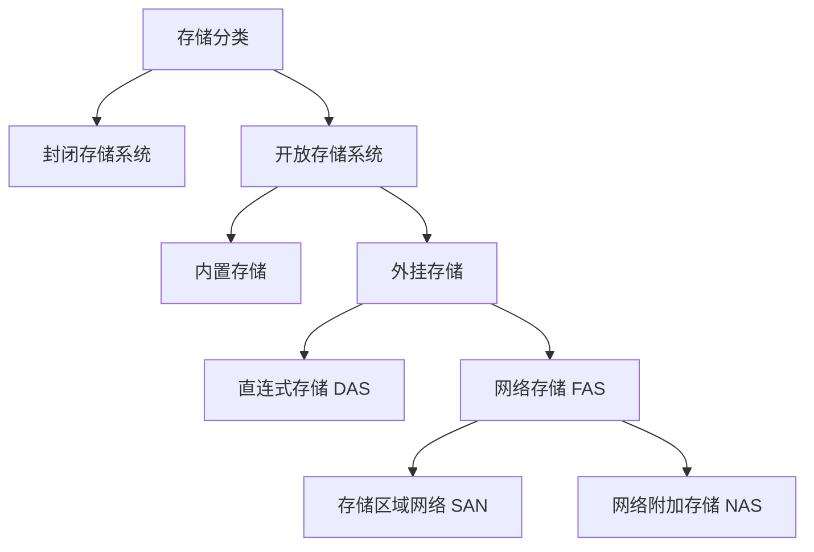

# 一、存储类型
## 1.1 存储分类

> [!NOTE] 开放存储系统
> 开放存储系统采用高速网络，把多套 PC 服务器连接起来，构建一个开放式系统，把这些 PC 作为存储节点，他提供可扩展的接口，方便软件安装以增强系统的功能
> 开放存储系统适用于需要大规模存储、高可扩展和灵活性的场景，如：云计算、大数据处理等领域

> [!NOTE] 封闭存储系统
> 封闭存储系统主要指大型机或专用存储设备的存储架构，这些系统在设计时已经明确其用途和使用功能情景，不提供扩展接口来扩展软件功能
> 封闭存储系统适用于对性能和稳定性要求极高、且不需要频繁扩展存储容量的场景，如金融、电信等行业的关键业务系统。

