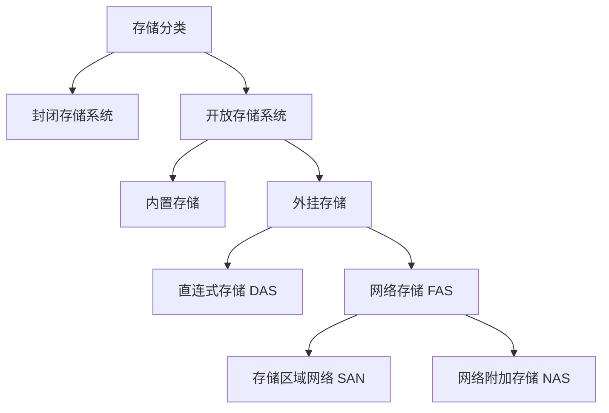
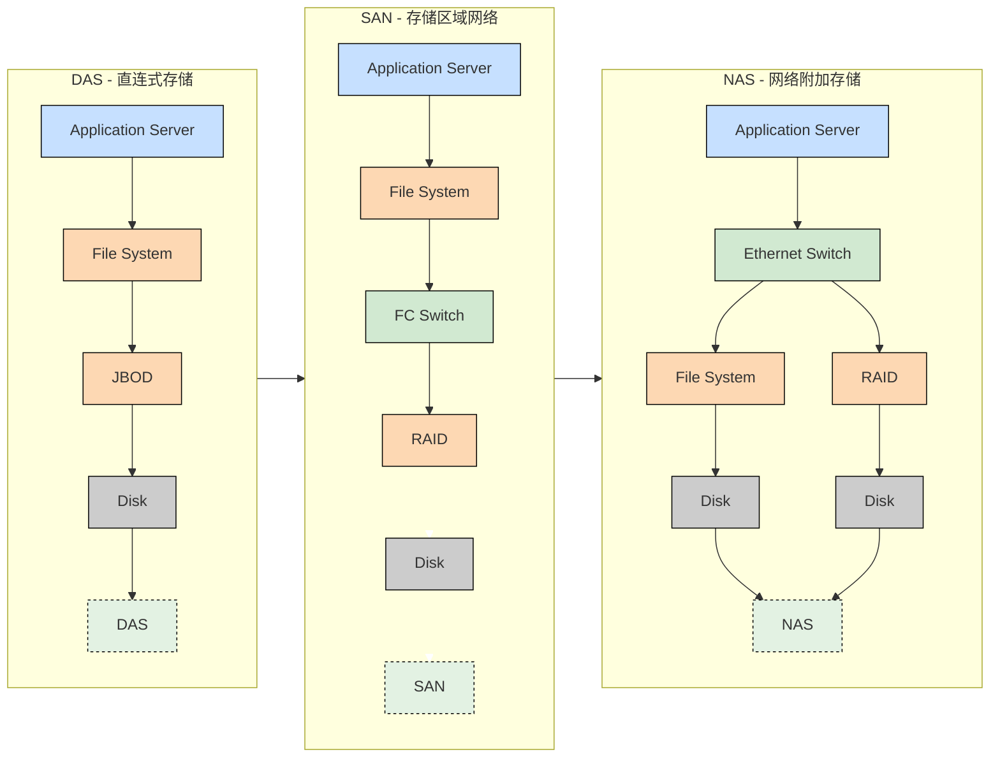
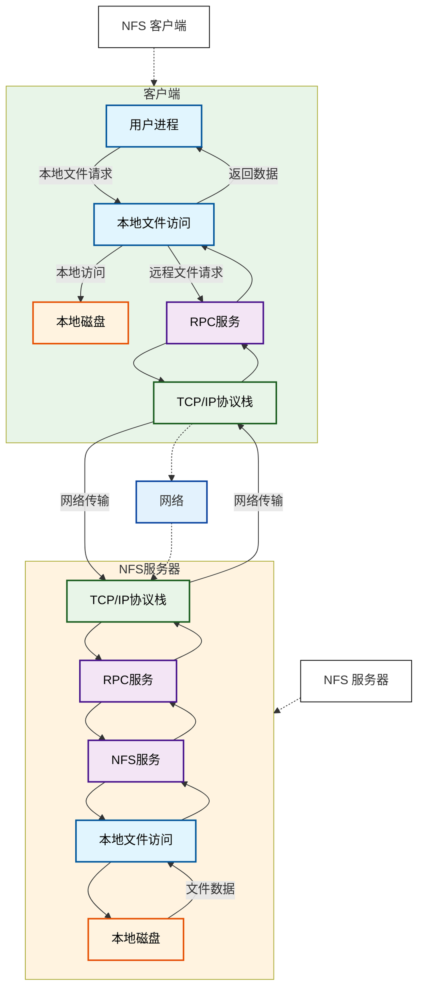

# 一、存储类型
## 1.1 存储分类


> [!abstract] 开放存储系统
> 开放存储系统采用高速网络，把多套 PC 服务器连接起来，构建一个开放式系统，把这些 PC 作为存储节点，他提供可扩展的接口，方便软件安装以增强系统的功能
> 开放存储系统适用于需要大规模存储、高可扩展和灵活性的场景，如：云计算、大数据处理等领域

> [!abstract] 封闭存储系统
> 封闭存储系统主要指大型机或专用存储设备的存储架构，这些系统在设计时已经明确其用途和使用功能情景，不提供扩展接口来扩展软件功能
> 封闭存储系统适用于对性能和稳定性要求极高、且不需要频繁扩展存储容量的场景，如金融、电信等行业的关键业务系统。
## 1.2 存储类型


### 1.2.1 DAS
直连式存储：Direct Attached Storage
> [!NOTE] 直连式存储
> 可以理解为本地文件系统。这种设备直接连接到计算机主板总线上，通常是 SCSI 或 FC 连接，计算机将其识别为一个块设备，例如常见的硬盘，U盘等，也可以连到一个磁盘阵列柜，里面有很多块磁盘。 DAS 只能连接一台服务器，其它服务器无法共享该存储。
### 1.2.2 SAN
存储区域网络：Storage Area Network
>[!note] 存储区域网络
>存储区域网络，这个是通过光纤通道或以太网交换机连接存储阵列和服务器主机，最后成为一个专用的存储网络。SAN 经过十多年历史的发展，已经相当成熟，成为业界的事实标准（但各个厂商的光纤交换技术不完全相同，其服务器和 SAN 存储有兼容性的要求）。
>

存储区域网络（SAN）提供了一种与现有局域网（LAN）连接的高效方式，并能在同一物理通道上支持 SCSI 与 IP 等多种协议。它突破了传统基于 SCSI 的存储架构的限制，具备以下核心优势：
- **独立灵活扩展**：企业可以独立于服务器增长，灵活扩展存储容量，轻松应对数据量的爆炸性增长。
- **集中化存储与直接访问**：其架构允许任何服务器直接访问任何存储阵列，无论数据实际位于何处，从而实现存储资源的集中管理和高效共享。
- **高性能**：得益于光纤通道等技术的应用，SAN 提供了远高于传统存储架构的带宽。

目前主流的 SAN 解决方案主要分为两类：
**1. 光纤通道SAN（FC SAN）**
- 这是最成熟和常见的 SAN 类型，通过专用的光纤通道网络提供高性能、低延迟的数据传输。
- 部署时，通常在服务器上安装光纤通道主机总线适配器（HBA）卡，通过光纤线缆连接至光纤通道交换机，最终接入SAN存储设备。
**2. IP SAN**
- 这是基于以太网和 IP 协议发展而来的方案，主要包括 **iSCSI** 和 **FCIP** 两种技术。其优势在于能够利用现有的IP网络基础设施，成本相对低廉。
- 在IP SAN中，存储设备被分配IP地址，数据通过标准的IP网络进行传输，便于实现跨物理位置的远程访问和管理。
在存储区域网络（SAN）中，连接的设备是否拥有自己的 IP 地址取决于具体的网络架构和技术实现。传统的 SA 架构，如基于光纤通道的 SAN，通常不直接为存储设备分配 IP 地址。在这种架构中，存储设备和服务器之间的通信是通过专用的存储协议（如光纤通道协议）来实现的，这些协议在物理层和数据链路层上工作，并不涉及 IP 层。因此，传统的 SAN 设备通常没有自己的 IP地址。 
### 1.2.3 NAS
网络附加存储：Network Attached Storage
NAS 存储也通常被称为附加存储，顾名思义，就是存储设备通过标准的网络拓扑结构(例如以太网)添加到一群计算机上。与 DAS 以及 SAN 不同，NAS 是文件级的存储方法。采用 NAS 较多的功能是用来进行文件共享。而且随着云计算的发展，一些 NAS 厂商也推出了云存储功能，大大方便了企业和个人用户的使用，NAS 产品是真正即插即用的产品。

NAS 设备一般支持多计算机平台，用户通过网络支持协议可进入相同的文档，因而 NAS 设备无需改造即可用于混合 Unix/Windows NT 局域网内，同时 NAS 的应用非常灵活。

## 1.3 存储方式
### 1.3.1 块存储
块存储（Block Storage Service）设备不能被操作系统直接访问，需要创建分区或逻辑卷，再创建文件系统 (EXT3, EXT4, NTFS 等)，然后再经过挂载，才能使用。对于主机而言，其并不能识别出存储设备是真正的物理设备还是二次划分的逻辑设备（RAID等），块存储不仅仅是直接使用物理设备，间接使用物理设备的也叫块设备。比如虚拟机上创建的虚拟磁盘。

块存储大多数时候是本地存储，读写速度很快，但不利于扩展，数据不能被共享。
### 1.3.2 文件存储
文件存储（File Storage Service）可以分为本地文件存储和网络文件存储。文件存储最明显的特征是支持 POSIX 的文件访问接口，例如 open、read、write、seek、close 等 (这几个是常用的文件操作 API 接口 )，与块存储不同，主机不需要再对文件存储进行格式化和创建文件系统，文件管理功能已由文件存储自行管理。

文件存储的特点是便于扩展和共享，但读写速度较慢
### 1.3.3 对象存储
对象存储（Object Storage Service）也叫基于对象的存储，是一种解决和处理离散单元的方法，可提供基于分布式系统之上的对象形式的数据存储服务。对象存储和我们经常接触到的块和文件系统等存储形态不同，它提供 RESTful API 数据读写接口及丰富的 SDK 接口，并且常以网络服务的形式提供数据的访问。
对象存储不支持随机读写，只能进行全读和全写操作（无法直接在存储上进行数据更改，只能以文件为单位进行获取和删除），如果要修改数据，需要先在本地编辑完成后整文件上传。

亚马逊的对象存储服务叫  S3(simple storage service),阿里云的对象存储叫 OSS(Object Storage Service)。
### 1.3.4 分布式存储
在海量数据和文件的场景下，单一服务器所能连接的物理介质有限，能提供的存储空间和IO性能也是有限的，所以可以通过多台服务器协同工作，每台服务器连接若干物理介质，再配合分布式存储系统和虚拟化技术，将底层多个物理硬件设备组合成一个统一的存储服务。一个分布式存储系统，可以同时提供块存储，文件存储和对象存储这三种存储方式。
# 二、NFS 基础
## 2.1 NFS 简介和性质
>[!info] 简介
>网络文件系统：Network File System (NFS)， 是由 SUN 公司研制的 UNIX 表示层协议，配合客户端和服务端软件，可以在本地挂载远程的存储空间，让本地用户和程序直接访问本地目录从而实现数据和存储空间的共享。
>NFS 中的远程访问是基于 RPC ( Remote Procedure Call Protocol，远程过程调用) 来实现的。
>RPC 采用 C/S 模式，客户机请求程序调用进程发送一个有进程参数的调用信息到服务进程，然后等待应答信息。在服务器端，进程保持睡眠状态直到调用信息到达为止。当一个调用信息到达，服务器获得进程参数，计算结果，发送答复信息，然后等待下一个调用信息，最后，客户端调用进程接收答复信息，获得进程结果，然后调用执行继续进行。

>[!tip] 性质特点
>1 基于 TCP/IP 协议
>NFS 通过网络文件系统协议，允许远程计算机像访问本地文件一样访问和操作远程文件，从而方便了多台计算机之间的文件共享和协作。
>2 跨平台性：
>NFS 被广泛用于 UNIX 和 Linux 操作系统中，同时也可以支持在不同类型的系统之间通过网络进行文件共享，如 FreeBSD、SCO、Solaris 等异构操作系统平台。
>3 简单易操作：
>NFS 提供了透明文件访问以及文件传输的功能，容易扩充新的资源或软件，而不需要改变现有的工作环境。
>4 安全性：
>NFS 的安全性相对较低，因为它主要基于 IP 进行认证，且默认配置下对远程访问的用户（如root 用户）会进行权限压缩（如映射为 nfsnobody 用户），以提高系统的安全性。但这也意味着需要额外的安全措施来确保数据的安全。
## 2.2 NFS 原理


>[!tip] NFS 原理
>NFS 的工作原理基于客户端/服务器架构，由一个客户端程序和服务器程序组成。服务器程序向其他计算机提供对文件系统的访问，该过程称为“输出”。
>NFS 客户端程序对共享文件系统进行访问时，会将其从 NFS 服务器中“输送”出来。文件通常以块为单位进行传输，大小通常为 8KB（尽管它可能会将操作分成更小尺寸的分片）。
>在 NFS 的工作流程中，
>前提：
>- RPC 服务需要先于 NFS 启动，NFS 启动后，就会产生一些随机端口，然后向 RPC 服务去注册这些端口
>- RPC 提供了一组与机器、操作系统以及底层传送协议无关的存取远程文件的操作，使得 NFS能够在不同的计算机系统和设备之间共享文件和资源。
>
>请求建立连接：
>- 客户端首先通过 RPC（Remote Procedure Call，远程过程调用）协议到服务器端的 RPC 上要功能对应的端口号，然后客户端将请求发送给服务器所对应的端口号，并接收服务器返回的响应数据。
>- 此后的数据便不再经过 RPC，旨在客户端和服务端之间进行数据传输

>[!abstract] 应用场景
>多个机器共享一台 CDROM 或其他设备：
通过 NFS，可以将 CDROM 或其他设备挂载到 NFS 服务器上，然后通过网络共享给多个客户端使用。
用户 home 目录的集中管理：
在大型网络中，可以配置一台中心 NFS 服务器用来放置所有用户的 home 目录。这些目录能被输出到网络，以便用户不管在哪台工作站上登录，总能得到相同的home目录。
影视文件的共享：
不同客户端可以在 NFS 上观看影视文件，从而节省本地存储空间。
工作数据的备份：
在客户端完成的工作数据，可以备份保存到 NFS 服务器上用户自己的路径下，以确保数据的安全性和可恢复性。
## 2.3 NFS 和 RPC 的关系
**RPC（Remote Procedure Call，远程过程调用）** 和 **NFS（Network File System，网络文件系统）** 是两个密切相关但**层级不同**的概念。简单来说：
> ✅ **NFS 依赖 RPC 来工作，RPC 是 NFS 的底层通信机制之一。**

| 项目         | RPC                          | NFS                      |
| ---------- | ---------------------------- | ------------------------ |
| **类型**     | **通用通信协议框架**                 | **具体的应用层文件共享协议**         |
| **目的**     | 让程序像调用本地函数一样调用远程机器上的函数       | 让客户端像访问本地文件一样访问远程服务器上的文件 |
| **抽象层级**   | 底层（传输/调用机制）                  | 上层（业务功能：文件系统）            |
| **是否独立使用** | 可用于多种服务（如 NIS、NFS、portmap 等） | 通常依赖 RPC（尤其是 NFSv2/v3    |
### 2.3.1 NFS 如何使用 RPC
#### 2.3.1.1 在 NFS v2 和 v3 中
- NFS **本身不直接处理网络连接**，而是通过 **RPC 机制**来注册服务、传递请求。
- 具体流程：
    1. NFS 服务启动时，向 **`rpcbind`**（旧称 `portmap`）注册自己，并告知监听的端口号。
    2. 客户端先查询 `rpcbind`（端口 111），问：“NFS 服务在哪个端口？”
    3. `rpcbind` 返回 NFS 实际端口（通常是 2049，但也可能动态分配）。
    4. 客户端通过 RPC 调用 NFS 操作（如 `READ`, `WRITE`, `LOOKUP`）。

> 🔧 因此，在 NFSv3 环境中，你必须同时运行：
> 
> - `rpcbind`
> - `nfs-server`
> - `mountd`（也通过 RPC 注册）
#### 2.3.1.2 在 NFS v4 中
- **不再依赖 `rpcbind` 和其他辅助 RPC 服务**
- 所有操作（包括挂载、文件操作、权限）都通过 **单一 TCP 端口（2049）** 完成
- RPC 仍然作为内部调用机制存在，但对用户透明，无需额外配置
✅ 所以：**NFSv4 简化了架构，减少了对 RPC 生态的依赖**。
### 2.3.2 类比理解
| 类比                        | 说明                         |
| ------------------------- | -------------------------- |
| **RPC 像“电话系统”**           | 提供拨号、通话、挂断等基础通信能力          |
| **NFS 像“快递服务”**           | 利用电话系统（RPC）来下单、查询包裹状态、通知派送 |
| 没有电话（RPC），快递公司（NFS）无法高效协调 | 但电话系统本身不是快递服务              |

# 三、NFS 部署
## 3.1 软件部署
### 3.1.1 环境部署
NFS 基于 C/S 模式实现，所以有客户端软件和服务端软件
Ubuntu 和 Rocky Linux 中的软件不同
```bash
# 在 Rocky Linux 中安装，nfs-utils 包含了客户端工具和服务端工具
yum install -y nfs-utils rpcbind

# 在 Ubuntu 中安装服务端软件
apt install -y nfs-kernel-server

# 在 Ubuntu 中安装客户端命令
apt install -y nfs-common
```
服务端依赖包，注册中心，nfs 服务中有大量的组件，部份组件端口并不固定，需要依赖 rpcbind 发布端口
```bash
# 查看软件包
16:33:13 root@xu-ubuntu:~# dpkg -l rpcbind
Desired=Unknown/Install/Remove/Purge/Hold
| Status=Not/Inst/Conf-files/Unpacked/halF-conf/Half-inst/trig-aWait/Trig-pend
|/ Err?=(none)/Reinst-required (Status,Err: uppercase=bad)
||/ Name           Version        Architecture Description
+++-==============-==============-============-=====================================================
ii  rpcbind        1.2.6-7ubuntu2 amd64        converts RPC program numbers into universal addresses

```
### 3.1.2 服务状态
查看服务端口
```bash
16:54:55 root@xu-ubuntu:~# netstat -tunlp  |grep rpc
tcp        0      0 0.0.0.0:53517           0.0.0.0:*               LISTEN      2874/rpc.statd      
tcp        0      0 0.0.0.0:49285           0.0.0.0:*               LISTEN      3337/rpc.mountd     
tcp        0      0 0.0.0.0:50051           0.0.0.0:*               LISTEN      3337/rpc.mountd     
tcp        0      0 0.0.0.0:45595           0.0.0.0:*               LISTEN      3337/rpc.mountd     
tcp6       0      0 :::50643                :::*                    LISTEN      3337/rpc.mountd     
tcp6       0      0 :::51411                :::*                    LISTEN      3337/rpc.mountd     
tcp6       0      0 :::43531                :::*                    LISTEN      3337/rpc.mountd     
tcp6       0      0 :::50725                :::*                    LISTEN      2874/rpc.statd      
udp        0      0 127.0.0.1:930           0.0.0.0:*                           2874/rpc.statd      
udp        0      0 0.0.0.0:33953           0.0.0.0:*                           3337/rpc.mountd     
udp        0      0 0.0.0.0:58611           0.0.0.0:*                           3337/rpc.mountd     
udp        0      0 0.0.0.0:48429           0.0.0.0:*                           3337/rpc.mountd     
udp        0      0 0.0.0.0:38268           0.0.0.0:*                           2874/rpc.statd      
udp6       0      0 :::48179                :::*                                3337/rpc.mountd     
udp6       0      0 :::32835                :::*                                2874/rpc.statd      
udp6       0      0 :::55652                :::*                                3337/rpc.mountd     
udp6       0      0 :::40384                :::*                                3337/rpc.mountd    
```
>[!tip] 进程解读
>rpcbind（也称为portmapper）是 RPC 服务的核心组件，它监听 TCP 和 UDP 的 111 端口，用于将 RPC 程序编号转换为网络地址和端口号。当客户端想要调用远程 RPC 服务时，它会首先联系 rpcbind 来获取服务的实际位置。在您的系统中，rpcbind 正在正常运行，监听 111 端口。
>rpc.statd 是 NFS（网络文件系统）状态监视守护进程的一部分，它用于跟踪NFS客户端和服务器之间的挂载状态，并维护锁和状态信息。虽然它通常不直接监听外部网络（在这里监听的是127.0.0.1，即本地回环地址），但它对于 NFS 服务的正常运行至关重要。
>rpc.mountd 是 NFS 挂载守护进程，它处理来自 NFS 客户端的挂载请求。rpc.mountd 似乎正在监听随机的、高编号的 UDP 端口58332。这是正常的，因为 NFS 的 rpc.mountd 服务可以配置为监听动态分配的端口，以增加安全性。客户端在尝试挂载NFS文件系统时，会首先联系rpcbind 来获取 rpc.mountd 的实际端口号。

<mark style="background: #FFF3A3A6;">每次重启服务，nfs的服务端，端口都在发生改变</mark>
```bash
16:55:36 root@xu-ubuntu:~# systemctl restart nfs-server
16:58:52 root@xu-ubuntu:~# netstat -tunlp  |grep rpc
tcp        0      0 0.0.0.0:53517           0.0.0.0:*               LISTEN      2874/rpc.statd      
tcp        0      0 0.0.0.0:40387           0.0.0.0:*               LISTEN      3986/rpc.mountd     
tcp        0      0 0.0.0.0:46197           0.0.0.0:*               LISTEN      3986/rpc.mountd     
tcp        0      0 0.0.0.0:43739           0.0.0.0:*               LISTEN      3986/rpc.mountd     
tcp6       0      0 :::33913                :::*                    LISTEN      3986/rpc.mountd     
tcp6       0      0 :::53229                :::*                    LISTEN      3986/rpc.mountd     
tcp6       0      0 :::52151                :::*                    LISTEN      3986/rpc.mountd     
tcp6       0      0 :::50725                :::*                    LISTEN      2874/rpc.statd      
udp        0      0 127.0.0.1:930           0.0.0.0:*                           2874/rpc.statd      
udp        0      0 0.0.0.0:38268           0.0.0.0:*                           2874/rpc.statd      
udp        0      0 0.0.0.0:40428           0.0.0.0:*                           3986/rpc.mountd     
udp        0      0 0.0.0.0:55844           0.0.0.0:*                           3986/rpc.mountd     
udp        0      0 0.0.0.0:33375           0.0.0.0:*                           3986/rpc.mountd     
udp6       0      0 :::34521                :::*                                3986/rpc.mountd     
udp6       0      0 :::59275                :::*                                3986/rpc.mountd     
udp6       0      0 :::32835                :::*                                2874/rpc.statd      
udp6       0      0 :::53822                :::*                                3986/rpc.mountd     
16:58:54 root@xu-ubuntu:~# 

---------------------------------------------------------------------------------------
结果显示：
由于服务端监听的端口会发生变化，所以需要依赖 rpcbind 对客户端提供注册服务，rpcbind 端口不会发生变化

---------------------------------------------------------------------------------------
# 查看服务端使用的端口
16:58:54 root@xu-ubuntu:~# rpcinfo -p 
   program vers proto   port  service
    100000    4   tcp    111  portmapper
    100000    3   tcp    111  portmapper
    100000    2   tcp    111  portmapper
    100000    4   udp    111  portmapper
    100000    3   udp    111  portmapper
    100000    2   udp    111  portmapper
    100024    1   udp  38268  status
    100024    1   tcp  53517  status
    100005    1   udp  40428  mountd
    100005    1   tcp  46197  mountd
    100005    2   udp  55844  mountd
    100005    2   tcp  40387  mountd
    100005    3   udp  33375  mountd
    100005    3   tcp  43739  mountd
    100003    3   tcp   2049  nfs
    100003    4   tcp   2049  nfs
    100227    3   tcp   2049  nfs_acl
    100021    1   udp  35217  nlockmgr
    100021    3   udp  35217  nlockmgr
    100021    4   udp  35217  nlockmgr
    100021    1   tcp  39079  nlockmgr
    100021    3   tcp  39079  nlockmgr
    100021    4   tcp  39079  nlockmgr

```
## 3.2 rpcinfo
### 3.2.1 命令参数
rpcinfo 可以访问指定的 RPC 服务器，显示其响应信息，从而查询出在该服务器上注册的 RPC服务,如果不指定主机，则默认是当前主机。
```bash
命令格式
rpcinfo [-opt...] [host]

常用选项
-p [host] # 查看注册在指定主机上的 rpcbind V2 版本的 RPC 服务
-m|-s [host] # 查看 rpcbind 的 RPC 服务，-s 简短格式显示
```
### 3.2.2 命令实践
```bash
# 显示已注册到本机的所有 RPC 服务
17:11:05 root@xu-ubuntu:~# rpcinfo 


# 显示已注册到本机的 rpcbind V2 版本的 RPC 服务
17:11:05 root@xu-ubuntu:~# rpcinfo -p

# 简短格式显示
17:11:05 root@xu-ubuntu:~# rpcinfo -s

# 显示其他服务器的 RPC 服务
17:11:05 root@xu-ubuntu:~# rpcinfo -s 192.168.121.210
```
## 3.3 exportfs
exportfs 命令用于管理本机 NFS 文件系统，默认配置文件是 /etc/exports
```bash
命令格式
exportfs [-adfhioruvs] [host:/path]

常用选项
-a # 全部挂载或者全部卸载
-r # 重新挂载
-u # 卸载
-v # 显示本机共享
```
```bash
# 修改配置后，重载配置
exportfs -r

# 查看加载配置的效果
exportfs -v

# 卸载操作
exportfs -au
```

## 3.4 showmount
可以查看远程主机的共享设置
```bash
命令格式
showmount [ -opt... ] [ host ]

常用选项
-h|--help # 显示帮助
-a|--all # 显示己连接的客户端
-e|--exports # 显示指定 NFS 服务器上的配置列表


╭─[root@ubuntu01] ~
╰─➤ showmount -e 192.168.121.210
Export list for 192.168.121.210:
/data/shared 192.168.121.12,192.168.121.11

```
## 3.5 mount.nfs 
客户端 NFS 服务挂载命令，将远程 NFS 服务器上共享出来的目录挂载到本机，可以直接写成 mount
```bash
命令格式：
mount.nfs remotetarget dir [-rvVwfnsh] [-o nfsoptions]

常用选项
-r # 只读挂载
-v # 显示详细信息
-V # 显示版本
-w # 读写挂载
-n # 不更新 /etc/fstab 文件，默认项
-o # 指定挂载参数


# 常用挂载参数

```