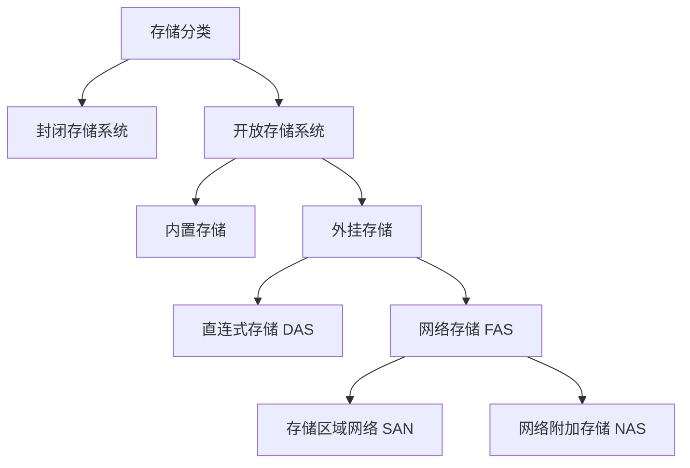
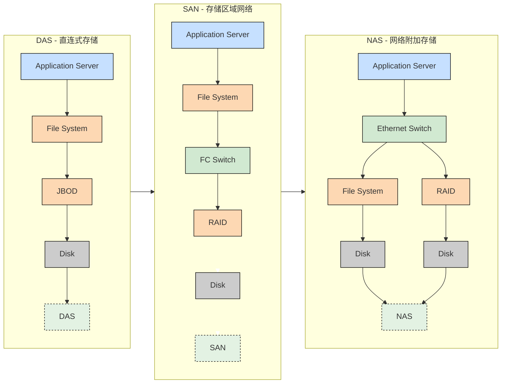

# 一、存储类型
## 1.1 存储分类

> [!abstract] 开放存储系统
> 开放存储系统采用高速网络，把多套 PC 服务器连接起来，构建一个开放式系统，把这些 PC 作为存储节点，他提供可扩展的接口，方便软件安装以增强系统的功能
> 开放存储系统适用于需要大规模存储、高可扩展和灵活性的场景，如：云计算、大数据处理等领域

> [!abstract] 封闭存储系统
> 封闭存储系统主要指大型机或专用存储设备的存储架构，这些系统在设计时已经明确其用途和使用功能情景，不提供扩展接口来扩展软件功能
> 封闭存储系统适用于对性能和稳定性要求极高、且不需要频繁扩展存储容量的场景，如金融、电信等行业的关键业务系统。
## 1.2 存储类型

### 1.2.1 DAS
直连式存储：Direct Attached Storage
> [!NOTE] 直连式存储
> 可以理解为本地文件系统。这种设备直接连接到计算机主板总线上，通常是 SCSI 或 FC 连接，计算机将其识别为一个块设备，例如常见的硬盘，U盘等，也可以连到一个磁盘阵列柜，里面有很多块磁盘。 DAS 只能连接一台服务器，其它服务器无法共享该存储。
### 1.2.2 SAN
存储区域网络：Storage Area Network
>[!note] 存储区域网络
>存储区域网络，这个是通过光纤通道或以太网交换机连接存储阵列和服务器主机，最后成为一个专用的存储网络。SAN 经过十多年历史的发展，已经相当成熟，成为业界的事实标准（但各个厂商的光纤交换技术不完全相同，其服务器和 SAN 存储有兼容性的要求）。
>

存储区域网络（SAN）提供了一种与现有局域网（LAN）连接的高效方式，并能在同一物理通道上支持SCSI与IP等多种协议。它突破了传统基于SCSI的存储架构的限制，具备以下核心优势：
- **独立灵活扩展**：企业可以独立于服务器增长，灵活扩展存储容量，轻松应对数据量的爆炸性增长。
- **集中化存储与直接访问**：其架构允许任何服务器直接访问任何存储阵列，无论数据实际位于何处，从而实现存储资源的集中管理和高效共享。
- **高性能**：得益于光纤通道等技术的应用，SAN提供了远高于传统存储架构的带宽。

目前主流的SAN解决方案主要分为两类：
**1. 光纤通道SAN（FC SAN）**
- 这是最成熟和常见的SAN类型，通过专用的光纤通道网络提供高性能、低延迟的数据传输。
- 部署时，通常在服务器上安装光纤通道主机总线适配器（HBA）卡，通过光纤线缆连接至光纤通道交换机，最终接入SAN存储设备。
**2. IP SAN**
- 这是基于以太网和IP协议发展而来的方案，主要包括**iSCSI**和**FCIP**两种技术。其优势在于能够利用现有的IP网络基础设施，成本相对低廉。
- 在IP SAN中，存储设备被分配IP地址，数据通过标准的IP网络进行传输，便于实现跨物理位置的远程访问和管理。
在存储区域网络（SAN）中，连接的设备是否拥有自己的 IP 地址取决于具体的网络架构和技术实现。传统的 SA 架构，如基于光纤通道的 SAN，通常不直接为存储设备分配IP地址。在这种架构中，存储设备和服务器之间的通信是通过专用的存储协议（如光纤通道协议）来实现的，这些协议在物理层和数据链路层上工作，并不涉及 IP 层。因此，传统的 SAN 设备通常没有自己的 IP地址。 
