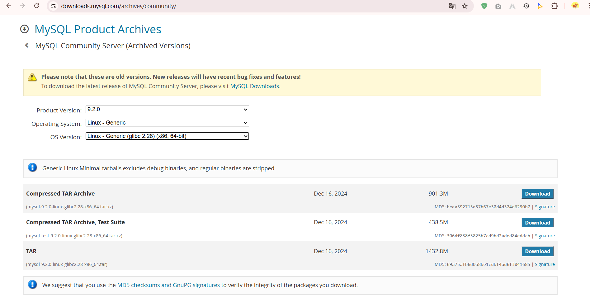
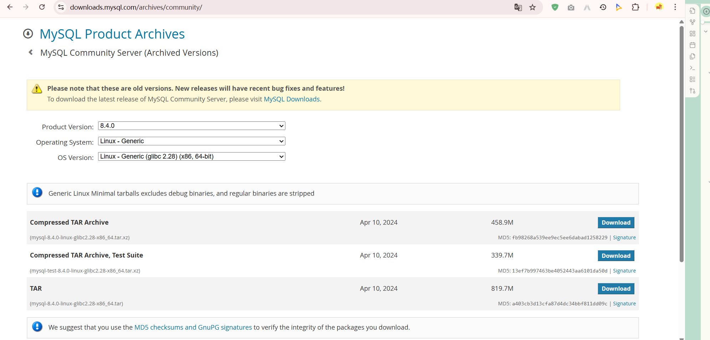
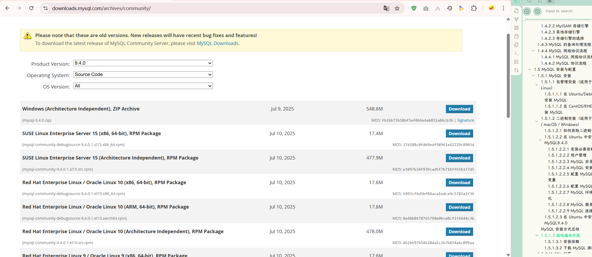
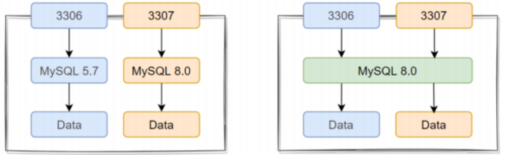
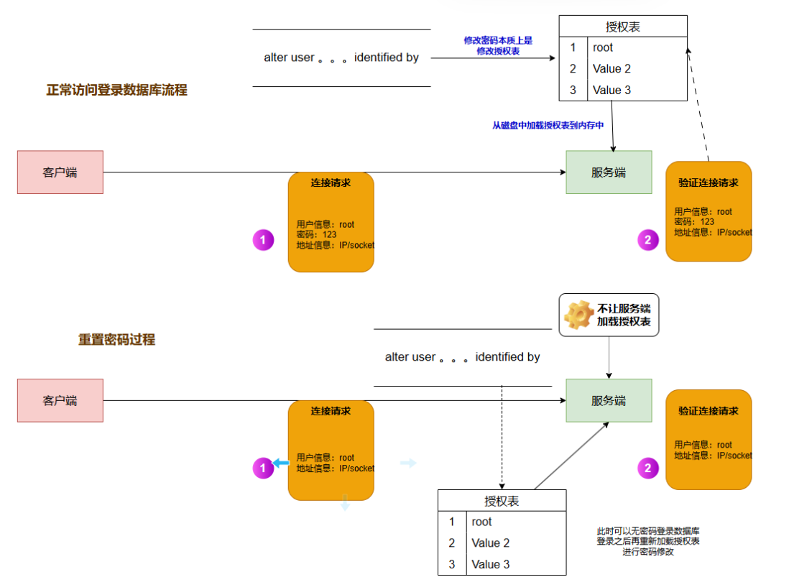

# 一、数据库配置与安装
## 1.1 什么是数据库
数据库是一个系统化的、结构化的数据集合，旨在帮助我们存储、管理和查询数据。数据库通过数据表来组织数据，而表中有若干列（字段），每一行表示一条记录。数据库通常包括数据库管理系统（DBMS）用于管理数据库的操作，如查询、更新、备份等。
## 1.2 MySQL 发展历史
MySQL 是由瑞典 MySQL AB 公司开发的开源关系型数据库管理系统（RDBMS）。MySQL 于1995年首次发布，并成为最受欢迎的开源数据库之一。

- **1995年**：MySQL由 Michael "Monty" Widenius 和 David Axmark 开发，最初的目的是为了提供一个轻量级的数据库系统，满足快速数据存取的需求。
- **2008年**：Sun Microsystems 收购 MySQL。
- **2009年**：Oracle Corporation 收购了 Sun Microsystems，因此 MySQL 归属于 Oracle。
## 1.3 MySQL 与其他数据库（如 PostgreSQL、SQLite）比较
MySQL、PostgreSQL 和 SQLite 是常见的三种关系型数据库，它们各自有不同的特性。

|特性|MySQL|PostgreSQL|SQLite|
|---|---|---|---|
|**许可协议**|开源（GPL）|开源（PostgreSQL许可）|公共领域|
|**事务支持**|支持（通过 InnoDB 引擎）|支持（ACID 完整支持）|支持（ACID 完整支持）|
|**查询优化**|通过索引优化、查询缓存等|强大的查询优化器|优化较少|
|**扩展性**|支持水平扩展，支持复制|支持高级扩展、数据类型扩展|非常有限，适用于轻量级应用|
|**性能**|适合高并发、读密集型应用|适合复杂查询、写密集型应用|适合单机、小型应用|
|**存储引擎**|支持多种引擎（如 InnoDB、MyISAM）|单一引擎（堆栈存储）|无多引擎概念|
<mark style="background: #FF5582A6;">总结</mark>
- **MySQL** 适合高并发、读密集型应用，支持灵活的存储引擎。
- **PostgreSQL** 是功能最全的关系型数据库，适用于复杂查询、事务处理。
- **SQLite** 是轻量级数据库，适合嵌入式应用或小型项目。
## 1.4 MySQL 架构概述
### 1.4.1 客户端/服务器架构（c/s）
MySQL 是基于 **客户端/服务器架构** 设计的，这意味着 MySQL 的客户端和服务器是分离的，客户端发起请求，而服务器处理请求并返回结果。这个架构允许用户和应用程序通过网络连接到数据库，而不需要直接访问数据库的本地文件。
#### 1.4.1.1 客户端/服务器架构流程
- **客户端**：客户端可以是命令行工具、图形化工具（如 MySQL Workbench）、应用程序等，主要负责：
    - 向服务器发起查询请求
    - 接收查询结果并展示给用户
- **服务器**：MySQL 服务器接收客户端的请求并执行以下任务：
    - 解析查询请求
    - 执行 SQL 语句
    - 返回结果给客户端
- **连接与协议**：MySQL 使用一个专用的协议（MySQL Protocol）来实现客户端和服务器之间的通信，常用的协议是 TCP/IP，当然也支持 UNIX 套接字连接。
```bash
      +-----------------------+
      |    MySQL Client       |
      |-----------------------|
      |   - Command Line      |
      |   - MySQL Workbench   |
      |   - Application       |
      +-----------------------+
                |
                | 发送查询请求 (SQL)
                v
      +-----------------------+
      |   MySQL Server        |
      |-----------------------|
      |   - 查询解析器        |
      |   - 优化器            |
      |   - 执行引擎          |
      |   - 存储引擎          |
      +-----------------------+
                |
                | 返回查询结果
                v
      +-----------------------+
      |    MySQL Client       |
      +-----------------------+

```
#### 1.4.1.2 主要组成部分
- **MySQL 客户端**：负责发送 SQL 查询给 MySQL 服务器，接收结果并展示给用户。客户端可以通过命令行、应用程序或图形化工具来执行查询。
- **MySQL 服务器**：接收客户端请求并执行以下工作：
    - **查询解析器**：解析 SQL 查询，检查语法是否正确。
    - **查询优化器**：优化查询，决定查询的执行计划（如选择合适的索引）。
    - **执行引擎**：执行 SQL 语句的具体操作。
    - **存储引擎**：执行数据的存储与检索操作（如 InnoDB、MyISAM 等）
### 1.4.2 存储引擎
MySQL 的存储引擎是 MySQL 服务器处理数据存储的核心组件。每个存储引擎有不同的特性和优化方式，常见的存储引擎包括 **InnoDB** 和 **MyISAM**。
#### 1.4.2.1 InnoDB 存储引擎
- **事务支持**：InnoDB 支持 ACID 事务（原子性、一致性、隔离性、持久性）。
- **行级锁**：InnoDB 支持行级锁，能在并发环境下提高性能。
- **外键约束**：InnoDB 支持外键约束，保证数据的完整性。
- **数据存储**：InnoDB 使用聚簇索引（Clustered Index），数据行存储在索引中。
#### 1.4.2.2 MyISAM 存储引擎
- **表级锁**：MyISAM 只支持表级锁，在高并发环境下可能导致性能问题。
- **没有事务支持**：MyISAM 不支持事务处理，不适用于需要事务支持的应用。
- **快速读取**：MyISAM 适用于读密集型应用，查询速度较快。
#### 1.4.2.3 其他存储引擎
除了 InnoDB 和 MyISAM，MySQL 还支持其他存储引擎，如 MEMORY（用于内存中的临时数据存储）、CSV（用于导入和导出数据）等。
```bash
      +---------------------------+
      |     MySQL Server          |
      |---------------------------|
      |  - 查询解析器             |
      |  - 查询优化器             |
      |  - 执行引擎               |
      +---------------------------+
                |
                | 
        +---------------+           +---------------+
        |  InnoDB       |          |  MyISAM       |
        |  存储引擎     |           |  存储引擎     |
        |  支持事务、行级锁 |    |  表级锁、无事务 |
        +---------------+           +---------------+
                |
                | 
        +----------------------+
        | 数据存储与索引管理    |
        +----------------------+

```
#### 1.4.2.3 存储引擎的选择
- **InnoDB**：如果应用程序需要支持事务处理、外键约束以及高并发写操作，选择 InnoDB 引擎。
- **MyISAM**：适用于需要快速读取的应用，如日志数据存储等不需要事务支持的场景。
### 1.4.3 MySQL 的查询处理流程
MySQL 的查询处理流程可以分为以下几个步骤：

1. **解析**：当客户端发送一个查询请求时，MySQL 会首先检查 SQL 语法，确保 SQL 查询合法。
2. **优化**：查询优化器生成查询执行计划，选择最有效的查询方式和索引。
3. **执行**：执行引擎根据优化器提供的执行计划进行数据操作。
4. **存储引擎**：执行引擎将请求传递给存储引擎，存储引擎负责实际的数据存储与检索。
```bash
    +-------------------+
    |   SQL 查询请求    |
    +-------------------+
              |
              v
    +-------------------+
    |   解析器（Parser） |
    +-------------------+
              |
              v
    +-------------------+
    | 查询优化器（Optimizer）|
    +-------------------+
              |
              v
    +-------------------+
    | 执行引擎（Executor）  |
    +-------------------+
              |
              v
    +-------------------+
    | 存储引擎（Storage Engine） |
    +-------------------+
              |
              v
    +-------------------+
    | 数据存储与检索    |
    +-------------------+

```
### 1.4.4 MySQL 网络协议流程
MySQL 服务器与客户端之间的通信通过 **MySQL 网络协议** 进行。默认情况下，MySQL 通过 TCP/IP 协议进行通信，端口号为 **3306**。

#### 1.4.4.1 MySQL 网络协议流程

1. **连接建立**：客户端通过 TCP/IP 协议连接到 MySQL 服务器，服务器验证客户端的身份。
2. **数据交换**：客户端发送 SQL 查询请求，服务器返回执行结果。
3. **连接关闭**：数据交换完成后，客户端与服务器关闭连接。
#### 1.4.4.2 MySQL 协议流程
```bash
    +---------------------+ 
    |   MySQL Client      |
    +---------------------+
               |
               | 通过 TCP/IP 连接
               v
    +---------------------+
    |    MySQL Server     |
    +---------------------+
               |
               | 数据交互
               v
    +---------------------+
    |   MySQL Client      |
    +---------------------+

```
## 1.5 MySQL 安装与配置
### 1.5.1 MySQL 安装
MySQL 可以通过多种方式进行安装，具体的安装方式取决于操作系统和用户的需求。常见的安装方式包括 **包管理器安装**、**二进制安装**、以及 **源码编译安装**
在安装时一般选择偶数版本，偶数版本一般是上一个奇数版本的稳定版

==确定内核版本==
```bash
[root rockylinux-1 ~] WORK 0 # uname -a
Linux rockylinux-1 5.14.0-362.8.1.el9_3.x86_64 #1 SMP PREEMPT_DYNAMIC Wed Nov 8 17:36:32 UTC 2023 x86_64 x86_64 x86_64 GNU/Linux
```
#### 1.5.1.1 包管理安装（适用于 Linux）
##### 1.5.1.1.1 在 Ubuntu/Debian 上安装 MySQL
使用包管理工具 `apt` 来安装 MySQL。
```bash
# 更新软件源
14:14:22 root@redis02:~# apt update

# 安装 MySQL 服务器
14:15:59 root@redis02:~# apt install mysql-server -y

# 启动 MySQL 服务器
14:41:04 root@redis02:~# systemctl start mysql
14:41:11 root@redis02:~# systemctl status  mysql
● mysql.service - MySQL Community Server
     Loaded: loaded (/usr/lib/systemd/system/mysql.service; enabled; preset: enabled)
     Active: active (running) since Fri 2025-12-19 14:28:29 CST; 12min ago
    Process: 40016 ExecStartPre=/usr/share/mysql/mysql-systemd-start pre (code=exited, status=0/SUCCESS)
   Main PID: 40030 (mysqld)
     Status: "Server is operational"
      Tasks: 37 (limit: 2210)
     Memory: 361.6M (peak: 378.7M)
        CPU: 1min 21.826s
     CGroup: /system.slice/mysql.service
             └─40030 /usr/sbin/mysqld

Dec 19 14:27:46 redis02 systemd[1]: Starting mysql.service - MySQL Community Server...
Dec 19 14:28:29 redis02 systemd[1]: Started mysql.service - MySQL Community Server.

# 安全配置（可选）
mysql_secure_installation

# 登录 MySQL
14:48:41 root@redis02:~# mysql
Welcome to the MySQL monitor.  Commands end with ; or \g.
Your MySQL connection id is 13
Server version: 8.0.44-0ubuntu0.24.04.2 (Ubuntu)

Copyright (c) 2000, 2025, Oracle and/or its affiliates.

Oracle is a registered trademark of Oracle Corporation and/or its
affiliates. Other names may be trademarks of their respective
owners.

Type 'help;' or '\h' for help. Type '\c' to clear the current input statement.

mysql> select version();
+-------------------------+
| version()               |
+-------------------------+
| 8.0.44-0ubuntu0.24.04.2 |
+-------------------------+
1 row in set (0.01 sec)

mysql> 
```
##### 1.5.1.1.2 在 CentOS/RHEL 上安装 MySQL
```bash
# 添加 MySQL 官方仓库
rpm -Uvh https://dev.mysql.com/get/mysql80-community-release-el7-3.noarch.rpm

# 安装 MySQL 服务器
yum install mysql-server -y

# 启动 MySQL
systemctl start mysqld
systemctl status mysqld

# 安全配置
mysql_secure_installation

# 登录 MySQL
mysql
```
#### 1.5.1.2 二进制安装（适用于 Linux / macOS / Windows）
如果你不想使用包管理器安装，或者你想手动控制安装过程，可以选择 **二进制安装**。这种方法适用于所有操作系统，尤其适合需要定制化安装的用户。

传统的二进制包安装需要进行三步：configure --- make  --- make install
而mysql的二进制包是指己经编译完成【也就是说，make 已经做过了】，以压缩包提供下载的文件，下载到本地之后释放到自定义目录，再进行配置即可。
##### 1.5.1.2.1 如何获取二进制包
关于二进制包的下载位置 -- Download Archives
https://downloads.mysql.com/archives/community/


##### 1.5.1.2.2 在 Ubuntu 中安装 MySQL8.4.0
###### 1.5.1.2.2.1 操作系统环境准备
```bash
1、关闭防火墙
# Ubuntu system
14:06:44 root@redis02:~# systemctl disable --now ufw
Synchronizing state of ufw.service with SysV service script with /usr/lib/systemd/systemd-sysv-install.
Executing: /usr/lib/systemd/systemd-sysv-install disable ufw
14:06:55 root@redis02:~# 
# rocky system
[root rockylinux-1 ~] WORK 3 # systemctl disable --now firewalld
[root rockylinux-1 ~] WORK 0 # systemctl status firewalld
○ firewalld.service - firewalld - dynamic firewall daemon
     Loaded: loaded (/usr/lib/systemd/system/firewalld.service; disabled; preset: enabled)
     Active: inactive (dead)
       Docs: man:firewalld(1)
[root rockylinux-1 ~] WORK 3 # 

2、关闭 SELinux
# rocky system
[root rockylinux-1 ~] WORK 0 # sed -i 's#SELINUX=enforcing#SELINUX=disabled#g' /etc/selinux/config
    
[root rockylinux-1 ~] WORK 0 # getenforce 
Disabled
[root rockylinux-1 ~] WORK 0 # 

# Ubuntu system
Ubuntu 默认没有启动 SELinux，Ubuntu 使用的是 AppArmor 不是 SELinux

```
###### 1.5.1.2.2.2 安装必要依赖
```bash
# Rocky系统：

[root@rocky9 ~]# yum -y install libaio numactl-libs ncurses-compat-libs

# Ubuntu系统：

root@ubuntu24:~# apt install libaio-dev numactl libnuma-dev libncurses-dev -y
```
注意：ubuntu24 系统没有 libaio1 的包，需要单独去下载安装
```bash
15:17:59 root@redis02:~# curl -O http://launchpadlibrarian.net/646633572/libaio1_0.3.113-4_amd64.deb
  % Total    % Received % Xferd  Average Speed   Time    Time     Time  Current
                                 Dload  Upload   Total   Spent    Left  Speed
100  6520  100  6520    0     0   2829      0  0:00:02  0:00:02 --:--:--  2831
15:20:17 root@redis02:~# ls
aa.sh  init.sh  libaio1_0.3.113-4_amd64.deb  test.sh
15:20:19 root@redis02:~# dpkg -i libaio1_0.3.113-4_amd64.deb 
Selecting previously unselected package libaio1:amd64.
(Reading database ... 88359 files and directories currently installed.)
Preparing to unpack libaio1_0.3.113-4_amd64.deb ...
Unpacking libaio1:amd64 (0.3.113-4) ...
Setting up libaio1:amd64 (0.3.113-4) ...
Processing triggers for libc-bin (2.39-0ubuntu8.6) ...
```
###### 1.5.1.2.2.3 用户管理
创建用户组和用户
```bash
15:20:49 root@redis03:~# groupadd -r mysql
15:21:23 root@redis03:~# useradd -r -g mysql -s /sbin/nologin mysql
15:21:38 root@redis03:~# getent passwd mysql
mysql:x:999:988::/home/mysql:/sbin/nologin
15:21:42 root@redis03:~# 
```
###### 1.5.1.2.2.4 MySQL 目录配置
```bash
14:25:25 root@redis02:~# mkdir -pv /lnxguru/apps/mysql/3306/data/
mkdir: created directory '/lnxguru'
mkdir: created directory '/lnxguru/apps'
mkdir: created directory '/lnxguru/apps/mysql'
mkdir: created directory '/lnxguru/apps/mysql/3306'
mkdir: created directory '/lnxguru/apps/mysql/3306/data'
```
###### 1.5.1.2.2.5 MySQL 安装
```bash
14:49:52 root@redis02:~# tar xf mysql-8.4.0-linux-glibc2.28-x86_64.tar.xz -C /usr/local/
14:50:54 root@redis02:~# cd /usr/local/
14:50:58 root@redis02:/usr/local# ln -sv mysql-8.4.0-linux-glibc2.28-x86_64 mysql 
'mysql' -> 'mysql-8.4.0-linux-glibc2.28-x86_64'
14:51:06 root@redis02:/usr/local# ls -l mysql
lrwxrwxrwx 1 root root 34 Jan  3 14:51 mysql -> mysql-8.4.0-linux-glibc2.28-x86_64
14:51:10 root@redis02:/usr/local# ls -l mysql/
total 308
drwxr-xr-x  2 7161 31415   4096 Apr 10  2024 bin
drwxr-xr-x  2 7161 31415   4096 Apr 10  2024 docs
drwxr-xr-x  3 7161 31415   4096 Apr 10  2024 include
drwxr-xr-x  6 7161 31415   4096 Apr 10  2024 lib
-rw-r--r--  1 7161 31415 282183 Apr 10  2024 LICENSE
drwxr-xr-x  4 7161 31415   4096 Apr 10  2024 man
-rw-r--r--  1 7161 31415    666 Apr 10  2024 README
drwxr-xr-x 28 7161 31415   4096 Apr 10  2024 share
drwxr-xr-x  2 7161 31415   4096 Apr 10  2024 support-files
14:51:12 root@redis02:/usr/local#
```
###### 1.5.1.2.2.6 配置 MySQL 环境变量
```bash
14:52:49 root@redis02:/usr/local# cat /etc/profile.d/mysql.sh
#!/bin/bash
# ==============================================================================
# 脚本基础信息
# filename: mysql.sh
# name: xuruizhao
# email: xuruizhao00@163.com
# v: LnxGuru
# GitHub: xuruizhao00-sys
# ==============================================================================
MYSQL_HOME=/usr/local/mysql
PATH=$MYSQL_HOME/bin:$PATH

14:52:50 root@redis02:/usr/local# source /etc/profile.d/mysql.sh
14:53:10 root@redis02:/usr/local# mysql --version
mysql  Ver 8.4.0 for Linux on x86_64 (MySQL Community Server - GPL)
14:53:41 root@redis02:/usr/local# 
```
###### 1.5.1.2.2.7 配置 MySQL 环境
创建主配置文件
注意：配置文件中涉及到的配置目录，必须存在，否则无法运行
```bash
14:58:23 root@redis02:~# cat /etc/my.cnf
[mysqld]
user=mysql
basedir=/usr/local/mysql
datadir=/lnxguru/apps/mysql/3306/data
socket=/tmp/mysql.sock
```
```java
[mysqld]     --配置标签信息（标明 是服务端配置标签 客户端配置标签） 
user=mysql   --数据库进程用户信息
basedir=/usr/local/mysql   -- 加载程序目录  Linux 系统 mysql5.6  mysql5.7 mysql8.0 （多实例）   
datadir=/data/3306/data    -- 加载数据目录
socket=/tmp/mysql.sock     -- 配置连接数据库的 socket（客户端命令可以连接访问服务端）
```
创建数据、日志目录
```bash
15:43:18 root@redis02:~# mkdir /usr/local/mysql/{data,log}
15:44:26 root@redis02:~# chown -R mysql:mysql /usr/local/mysql
```
###### 1.5.1.2.2.8 MySQL 环境初始化
需要保证 MySQL 的数据目录是空的
> [!NOTE] MySQL 安全初始化
> 如果使用 --initialize 选项会生成随机密码，要去 /data/mysql/mysql.log中查看

```bash
15:47:22 root@redis02:~# mysqld --initialize --user=mysql --basedir=/usr/local/mysql --datadir=/usr/local/mysql/data
15:48:23 root@redis02:~# tail -f /usr/local/mysql/log/error.log 
2025-12-19T07:48:10.669253Z 0 [System] [MY-015017] [Server] MySQL Server Initialization - start.
2025-12-19T07:48:10.676478Z 0 [System] [MY-013169] [Server] /usr/local/mysql/bin/mysqld (mysqld 8.4.0) initializing of server in progress as process 1986
2025-12-19T07:48:10.707882Z 1 [System] [MY-013576] [InnoDB] InnoDB initialization has started.
2025-12-19T07:48:11.856225Z 1 [System] [MY-013577] [InnoDB] InnoDB initialization has ended.
2025-12-19T07:48:17.647986Z 6 [Note] [MY-010454] [Server] A temporary password is generated for root@localhost: yG:7W*/ic/k;   # 这是初始化的随机密码
2025-12-19T07:48:23.432212Z 0 [System] [MY-015018] [Server] MySQL Server Initialization - end.
```

> [!NOTE] MySQL 空密码初始化
> 如果使用 --initialize-insecure -选项会生成空密码
```bash
15:48:39 root@redis02:~# rm -rf /usr/local/mysql/data/*
14:55:59 root@redis02:/usr/local# mysqld --initialize-insecure --user=mysql --datadir=/lnxguru/apps/mysql/3306/data/  --basedir=/usr/local/mysql
14:56:30 root@redis02:/usr/local# echo $?
0
```
###### 1.5.1.2.2.9 MySQL 服务启动

> [!NOTE] MySQL 自带的脚本启动
> /usr/local/mysql/support-files/mysql.server 
```bash
1、MySQL 数据库程序为我们提供了一个启动 MySQL 的脚本
14:58:25 root@redis02:~# file /usr/local/mysql/support-files/mysql.server 
/usr/local/mysql/support-files/mysql.server: POSIX shell script, ASCII text executable

2、将该脚本移动到 /etc/init.d/ 目录下
15:03:05 root@redis02:~# mv /usr/local/mysql/support-files/mysql.server /etc/init.d/mysqld
15:03:42 root@redis02:~# ls -l /etc/init.d/mysqld
-rwxr-xr-x 1 7161 31415 10576 Apr 10  2024 /etc/init.d/mysqld

3、利用该脚本启停 MySQL
15:04:17 root@redis02:~# /etc/init.d/mysqld start 
Starting mysqld (via systemctl): mysqld.service.                     
15:04:45 root@redis02:~# ss -tunlp | grep 3306
tcp   LISTEN 0      70                 *:33060            *:*    users:(("mysqld",pid=2689,fd=18))                      
tcp   LISTEN 0      151                *:3306             *:*    users:(("mysqld",pid=2689,fd=30))                      
15:04:49 root@redis02:~# 
# 数据库进程查看，对于数据库进程来说，也是有 master 进程和 worker 进程的
15:05:09 root@redis02:~# ps -ef | grep mysql | grep -v grep 
root        2551       1  0 15:04 ?        00:00:00 /bin/sh /usr/local/mysql/bin/mysqld_safe --datadir=/lnxguru/apps/mysql/3306/data --pid-file=/lnxguru/apps/mysql/3306/data/redis02.pid
mysql       2689    2551  9 15:04 ?        00:00:04 /usr/local/mysql/bin/mysqld --basedir=/usr/local/mysql --datadir=/lnxguru/apps/mysql/3306/data --plugin-dir=/usr/local/mysql/lib/plugin --user=mysql --log-error=redis02.err --pid-file=/lnxguru/apps/mysql/3306/data/redis02.pid --socket=/tmp/mysql.sock
15:05:14 root@redis02:~
15:05:14 root@redis02:~# /etc/init.d/mysqld stop
Stopping mysqld (via systemctl): mysqld.service.
15:05:48 root@redis02:~# ps -ef | grep mysql | grep -v grep 
15:05:49 root@redis02:~#
```

> [!NOTE] service 方式启动
>要想使用 service 方式启动，必须要保证 /etc/init.d/mysqld 存在 
```bash
15:05:49 root@redis02:~# service mysqld start
15:06:37 root@redis02:~# ps -ef | grep mysql | grep -v grep 
root        2820       1  0 15:06 ?        00:00:00 /bin/sh /usr/local/mysql/bin/mysqld_safe --datadir=/lnxguru/apps/mysql/3306/data --pid-file=/lnxguru/apps/mysql/3306/data/redis02.pid
mysql       2960    2820 42 15:06 ?        00:00:03 /usr/local/mysql/bin/mysqld --basedir=/usr/local/mysql --datadir=/lnxguru/apps/mysql/3306/data --plugin-dir=/usr/local/mysql/lib/plugin --user=mysql --log-error=redis02.err --pid-file=/lnxguru/apps/mysql/3306/data/redis02.pid --socket=/tmp/mysql.sock
15:06:40 root@redis02:~#
```

> [!NOTE] systemctl 启动数据库服务
> 默认的我们是没有 mysql.service 文件，有两种解决方式
> 1、先通过 `systemctl enable mysqld`，默认指定从 `/etc/rc.d/init.d/mysqld` 启动
> 2、编写 mysql.service
> 
```bash
方式1
15:09:12 root@redis02:~# systemctl enable mysqld
mysqld.service is not a native service, redirecting to systemd-sysv-install.
Executing: /usr/lib/systemd/systemd-sysv-install enable mysqld
16:38:05 root@redis02:~# systemctl status mysqld
○ mysqld.service - LSB: start and stop MySQL
     Loaded: loaded (/etc/init.d/mysqld; generated)
     Active: inactive (dead)
       Docs: man:systemd-sysv-generator(8)

Jan 03 15:06:32 redis02 systemd[1]: Starting mysqld.service - LSB: start and stop MySQL...
Jan 03 15:06:32 redis02 mysqld[2806]: Starting MySQL
Jan 03 15:06:37 redis02 mysqld[2806]: .... *
Jan 03 15:06:37 redis02 systemd[1]: Started mysqld.service - LSB: start and stop MySQL.
Jan 03 15:08:31 redis02 systemd[1]: Stopping mysqld.service - LSB: start and stop MySQL...
Jan 03 15:08:31 redis02 mysqld[3020]: Shutting down MySQL
Jan 03 15:08:32 redis02 mysqld[3020]: . *
Jan 03 15:08:32 redis02 systemd[1]: mysqld.service: Deactivated successfully.
Jan 03 15:08:32 redis02 systemd[1]: Stopped mysqld.service - LSB: start and stop MySQL.
Jan 03 15:08:32 redis02 systemd[1]: mysqld.service: Consumed 6.088s CPU time, 444.2M memory peak, 0B memory swap peak.
16:38:11 root@redis02:~# systemctl start mysqld
16:38:34 root@redis02:~# systemctl status mysqld
● mysqld.service - LSB: start and stop MySQL
     Loaded: loaded (/etc/init.d/mysqld; generated)
     Active: active (running) since Sat 2026-01-03 16:38:33 CST; 2s ago
       Docs: man:systemd-sysv-generator(8)
    Process: 3849 ExecStart=/etc/init.d/mysqld start (code=exited, status=0/SUCCESS)
      Tasks: 37 (limit: 2210)
     Memory: 429.9M (peak: 444.1M)
        CPU: 4.246s
     CGroup: /system.slice/mysqld.service
             ├─3863 /bin/sh /usr/local/mysql/bin/mysqld_safe --datadir=/lnxguru/apps/mysql/3306/data --pid-file=/lnxguru/apps/mysql/3306/data/redis02.pid
             └─4003 /usr/local/mysql/bin/mysqld --basedir=/usr/local/mysql --datadir=/lnxguru/apps/mysql/3306/data --plugin-dir=/usr/local/mysql/lib/plugin --user=mysql --log-error=redis02.err --pid-file=/ln>

Jan 03 16:38:29 redis02 systemd[1]: Starting mysqld.service - LSB: start and stop MySQL...
Jan 03 16:38:29 redis02 mysqld[3849]: Starting MySQL
Jan 03 16:38:33 redis02 mysqld[3849]: .... *
Jan 03 16:38:33 redis02 systemd[1]: Started mysqld.service - LSB: start and stop MySQL.
16:38:38 root@redis02:~# 
```
```shell
方式二
16:42:36 root@redis02:~# cat /lib/systemd/system/mysqld.service
[Unit]
Description=MySQL Server 8.4.0
Documentation=https://dev.mysql.com/doc/
After=network.target
Wants=network.target

[Service]
User=mysql
Group=mysql

# mysqld 本体直接前台运行（推荐）
Type=simple

# 启动命令
ExecStart=/usr/local/mysql/bin/mysqld \
  --defaults-file=/etc/my.cnf \
  --basedir=/usr/local/mysql \
  --datadir=/lnxguru/apps/mysql/3306/data \
  --user=mysql

# 停止命令
ExecStop=/usr/local/mysql/bin/mysqladmin \
  --defaults-file=/usr/local/mysql/etc/my.cnf shutdown

# 资源限制（企业必配）
LimitNOFILE=65535
LimitNPROC=65535

# 异常退出自动拉起
Restart=on-failure
RestartSec=5s

# 超时设置
TimeoutStartSec=300
TimeoutStopSec=300

[Install]
WantedBy=multi-user.target

# 完善配置文件
16:42:57 root@redis02:~# cat /etc/my.cnf 
[mysqld]
basedir=/usr/local/mysql
datadir=/lnxguru/apps/mysql/3306/data
socket=/lnxguru/apps/mysql/3306/data/mysql.sock
pid-file=/lnxguru/apps/mysql/3306/data/mysqld.pid
log-error=/lnxguru/apps/mysql/3306/error.log
# 配置权限
16:42:57 root@redis02:~# chown -R mysql:mysql /usr/local/mysql /lnxguru/apps/mysql/3306
16:42:37 root@redis02:~# systemctl daemon-reload 
16:42:41 root@redis02:~# systemctl start mysqld.service 
16:42:47 root@redis02:~# systemctl status  mysqld.service 
● mysqld.service - MySQL Server 8.4.0
     Loaded: loaded (/usr/lib/systemd/system/mysqld.service; disabled; preset: enabled)
     Active: active (running) since Sat 2026-01-03 16:42:43 CST; 7s ago
       Docs: https://dev.mysql.com/doc/
   Main PID: 4852 (mysqld)
      Tasks: 36 (limit: 2210)
     Memory: 430.1M (peak: 443.5M)
        CPU: 2.784s
     CGroup: /system.slice/mysqld.service
             └─4852 /usr/local/mysql/bin/mysqld --defaults-file=/etc/my.cnf --basedir=/usr/local/mysql --datadir=/lnxguru/apps/mysql/3306/data --user=mysql

Jan 03 16:42:43 redis02 systemd[1]: mysqld.service: Scheduled restart job, restart counter is at 10.
Jan 03 16:42:43 redis02 systemd[1]: Started mysqld.service - MySQL Server 8.4.0.
16:42:50 root@redis02:~# ss -tunlp  |grep 3306
tcp   LISTEN 0      70                 *:33060            *:*    users:(("mysqld",pid=4852,fd=18))                      
tcp   LISTEN 0      151                *:3306             *:*    users:(("mysqld",pid=4852,fd=20))                      
16:42:57 root@redis02:~#
```
###### 1.5.1.2.2.10 MySQL 连接测试
```bash
15:53:12 root@redis02:~# mysql
Welcome to the MySQL monitor.  Commands end with ; or \g.
Your MySQL connection id is 9
Server version: 8.4.0 MySQL Community Server - GPL

Copyright (c) 2000, 2024, Oracle and/or its affiliates.

Oracle is a registered trademark of Oracle Corporation and/or its
affiliates. Other names may be trademarks of their respective
owners.

Type 'help;' or '\h' for help. Type '\c' to clear the current input statement.

mysql> select version();
+-----------+
| version() |
+-----------+
| 8.4.0     |
+-----------+
1 row in set (0.00 sec)

mysql> 

# 修改密码
mysql> alter user root@"localhost" identified by "123";
Query OK, 0 rows affected (0.02 sec)

mysql> exit
Bye
15:54:48 root@redis02:~# mysql
ERROR 1045 (28000): Access denied for user 'root'@'localhost' (using password: NO)
15:54:49 root@redis02:~# mysql -p123
mysql: [Warning] Using a password on the command line interface can be insecure.
Welcome to the MySQL monitor.  Commands end with ; or \g.
Your MySQL connection id is 11
Server version: 8.4.0 MySQL Community Server - GPL

Copyright (c) 2000, 2024, Oracle and/or its affiliates.

Oracle is a registered trademark of Oracle Corporation and/or its
affiliates. Other names may be trademarks of their respective
owners.

Type 'help;' or '\h' for help. Type '\c' to clear the current input statement.

mysql> 
```
##### 1.5.1.2.3 在 Ubuntu 中安装 MySQL9.4.0
同 MySQL8.4.0 安装过程

#### 1.5.1.3 源码编译安装
如果你希望从源代码编译 MySQL，或者需要自定义编译选项，可以选择 **源码编译安装**。
##### 1.5.1.3.1 安装依赖
```bash
apt-get install cmake gcc g++ libncurses5-dev bison
```
##### 1.5.1.3.2 下载 MySQL 源码

##### 1.5.1.3.3 解压源码包
```bash
tar -xvzf mysql-<version>.tar.gz
cd mysql-<version>
cmake .
make
sudo make install
```
##### 1.5.1.3.4 创建用户和用户组
```bash
groupadd mysql
useradd -r -g mysql mysql
```
##### 1.5.1.3.5 初始化数据库
```bash
/usr/local/mysql/bin/mysqld --initialize --user=mysql
/usr/local/mysql/bin/mysqld_safe --user=mysql &
```
#### 1.5.1.4 MySQL 安装方式总结

| **安装方式**      | **适用场景**                                           | **优点**                                                                                  | **缺点**                                                                                          | **安装难度**  |
|-------------------|------------------------------------------------------|-------------------------------------------------------------------------------------------|--------------------------------------------------------------------------------------------------|---------------|
| **包管理器安装**   | 适用于大多数 Linux 用户，系统使用包管理器（如 `apt`、`yum`）。   | - 安装过程简单，依赖自动处理。<br>- 快速安装与升级。<br>- 适合大多数生产环境。                    | - 包含的版本可能不是最新版本。<br>- 无法完全定制 MySQL 配置。                                          | **低**        |
| **二进制安装**     | 适用于需要手动控制安装位置与配置的用户，支持跨平台。         | - 安装简便，无需编译。<br>- 可定制安装目录，适合需要特定配置的用户。                            | - 需要手动配置一些依赖项。<br>- 无法通过包管理器轻松管理升级。                                         | **中**        |
| **源码编译安装**   | 高级用户，特别是在定制化需求较多的环境下，如开发、测试等。      | - 完全定制化，支持所有编译选项。<br>- 可以选择最新版本。<br>- 可控制编译过程，定制 MySQL 特性。      | - 安装过程复杂，可能需要手动解决依赖问题。<br>- 升级和维护比较麻烦。<br>- 需要更多的系统资源和时间。     | **高**        |
- **包管理器安装**：
    - **适用场景**：适合大多数 Linux 用户，特别是那些使用 Debian、Ubuntu（`apt`）或 CentOS、RHEL（`yum`）的用户。
    - **优点**：安装过程非常简便，系统会自动处理依赖问题，用户不需要手动干预。
    - **缺点**：可能没有最新版本的 MySQL，并且无法根据个人需求对 MySQL 进行高度定制。
- **二进制安装**：
    - **适用场景**：适用于那些需要手动选择安装目录的用户，或是跨平台（如在 Windows 或 macOS 上）的安装。
    - **优点**：安装过程简单，避免了源代码编译的复杂性。用户可以定制安装路径并进行一定程度的配置。
    - **缺点**：需要手动配置和解决一些依赖项，且无法通过包管理器进行自动升级和管理。
- **源码编译安装**：
    - **适用场景**：适合那些需要完全控制 MySQL 配置或需要定制功能的高级用户，特别是在开发和测试环境中。
    - **优点**：用户可以选择最新版本的 MySQL，完全自定义编译选项，优化性能或增加特殊功能。
    - **缺点**：安装过程复杂，可能需要手动处理依赖问题，并且升级和维护变得更加困难。
### 1.5.2 MySQL 配置文件解析
MySQL 的配置文件通常是 `/etc/my.cnf` 或 `/etc/mysql/my.cnf`，但是可以根据安装方式和操作系统不同而有所不同。该文件包含了 MySQL 的各种设置，分为 **客户端配置** 和 **服务器端配置** 两大部分。
二进制安装默认没有配置文件，需要我们自己编写

#### 1.5.2.1 配置文件生效顺序
MySQL 配置文件的生效顺序如下：

1. **命令行参数**：当 MySQL 启动时，命令行传入的参数会优先于配置文件中的设置生效。
2. **系统默认配置文件**：`/etc/my.cnf` 或 `/etc/mysql/my.cnf`（不同发行版可能略有不同），这是 MySQL 默认的配置文件。
3. **用户自定义配置文件**：有些安装会有用户自定义的配置文件，或者在启动 MySQL 时指定特定的配置文件。
4. **配置文件的优先级**：配置文件的优先级是按加载顺序来的，后加载的配置会覆盖先加载的配置。
```bash
18:03:28 root@redis02:~# mysql --help | grep "/etc"
                      /etc/services, built-in default (3306).
/etc/my.cnf /etc/mysql/my.cnf /usr/local/mysql/etc/my.cnf ~/.my.cnf 
```
这意味着 MySQL 会按照以下顺序加载配置文件：
1. `/etc/mysql/my.cnf`
2. `/etc/my.cnf`
3. 用户目录下的 `~/.my.cnf`
#### 1.5.2.2 配置文件的客户端配置
客户端配置通常是 `[mysql]` 和 `[client]` 部分的内容，影响的是 MySQL 客户端（如命令行工具 `mysql`）的行为。
[mysql] 和 [client] 部分配置
```bash
[mysql]
port = 3306
socket = /usr/local/mysql/data/mysql.sock
default-character-set = utf8mb4

[client]
port = 3306
socket = /usr/local/mysql/data/mysql.sock
user = root
```

> [!NOTE] Title
> 客户端常见配置解析
- **port = 3306**:
    - 客户端连接 MySQL 服务器时使用的端口号。默认值是 `3306`，与服务器端口一致，除非服务器配置为其他端口。
- **socket = /usr/local/mysql/data/mysql.sock**:
    - 客户端与 MySQL 服务器之间通过 Unix 套接字连接的路径。用于本地连接，避免通过 TCP/IP 协议进行网络连接，提高效率。
- **default-character-set = utf8mb4**:
    - 设置客户端的默认字符集。`utf8mb4` 是 MySQL 推荐的字符集，它支持所有 Unicode 字符（包括 Emoji）。
- **user = root**:
    - 默认登录 MySQL 使用的用户名，通常为 `root`，也可以根据需要修改为其他数据库用户。
#### 1.5.2.3 配置文件的服务端配置
服务端配置通常在 `[mysqld]` 部分进行设置，影响的是 MySQL 服务器的运行方式。
```bash
[mysqld]
port = 3306
socket = /usr/local/mysql/data/mysql.sock
datadir = /usr/local/mysql/data
log-error = /usr/local/mysql/log/error.log
pid-file = /usr/local/mysql/data/mysqld.pid
max_connections = 151
innodb_buffer_pool_size = 2G
default-storage-engine = InnoDB
sql_mode = STRICT_TRANS_TABLES,NO_ENGINE_SUBSTITUTION
log-bin = mysql-bin
server-id = 1
```
> [!NOTE] Title
> 服务端的常见配置解析

- **port = 3306**:
    - 服务器监听的端口，默认为 `3306`。这是外部客户端与 MySQL 服务器建立连接时使用的端口。
- **socket = /usr/local/mysql/data/mysql.sock**:
    - MySQL 服务器监听的 Unix 套接字文件路径，用于本地连接。
- **datadir = /usr/local/mysql/data**:
    - MySQL 数据存储路径。所有数据库文件、表数据、索引和日志等都存储在此目录。
- **log-error = /usr/local/mysql/log/error.log**:
    - 指定 MySQL 错误日志的位置。此日志记录 MySQL 的启动、运行和错误信息。
- **pid-file = /usr/local/mysql/data/mysqld.pid**:
    - 存储 MySQL 进程的 PID 文件位置。系统会根据这个文件来判断 MySQL 是否正在运行。
- **max_connections = 151**:
    - 设置允许的最大连接数。默认值是 `151`，可以根据系统的需求调整这个值。
- **innodb_buffer_pool_size = 2G**:
    - 设置 InnoDB 存储引擎的缓冲池大小。缓冲池用于缓存数据和索引，通常应设置为服务器总内存的 60-70%。
- **default-storage-engine = InnoDB**:
    - 设置默认的存储引擎，InnoDB 是默认的事务性存储引擎，支持 ACID 特性和外键约束。
- **sql_mode = STRICT_TRANS_TABLES,NO_ENGINE_SUBSTITUTION**:
    - 设置 SQL 模式，决定 MySQL 的行为和错误处理方式。例如，`STRICT_TRANS_TABLES` 会在发生数据异常时阻止操作。
- **log-bin = mysql-bin**:
    - 启用二进制日志记录，用于数据库的复制和数据恢复。`mysql-bin` 是二进制日志文件的前缀。
- **server-id = 1**:
    - 设置服务器唯一标识符。在 MySQL 主从复制环境中，每个服务器需要一个唯一的 `server-id`。
`[mysqld_safe] [mysqldump] [mysqladmin] `都属于服务端的配置
#### 1.5.2.4 查看 MySQL 加载的配置项
##### 1.5.2.4.1 MySQL 配置文件的加载顺序如下
1. **命令行参数**：通过命令行启动 MySQL 时使用的参数优先级最高。
2. **配置文件**：MySQL 会依次加载不同位置的配置文件，后加载的配置会覆盖先加载的配置。

具体来说，加载顺序是：
- **全局配置文件**（`--defaults-file`）: 通过命令行指定的配置文件（如果有）。
- **系统默认配置文件**：比如 `/etc/my.cnf` 或 `/etc/mysql/my.cnf`（不同的 Linux 发行版可能有所不同）。
- **用户自定义配置文件**：如 `/etc/mysql/conf.d/` 或 `/usr/local/mysql/etc/my.cnf`（这些路径和文件可能因安装方式而不同）。
- **命令行参数**：如果启动时通过命令行指定了任何参数（例如 `--port` 或 `--socket`），这些会覆盖配置文件中的设置。
##### 1.5.2.4.2 使用 `SHOW VARIABLES` 查看实际生效的配置
如果你想查看 MySQL 当前生效的配置项，可以通过 `SHOW VARIABLES` 命令查询 MySQL 的所有系统变量和它们的当前值。此命令返回的变量是通过 MySQL 配置文件或启动时的命令行参数生效的配置项。
```sql
mysql> show variables \G
mysql> show variables like "port";
+---------------+-------+
| Variable_name | Value |
+---------------+-------+
| port          | 3306  |
+---------------+-------+
1 row in set (0.00 sec)

mysql> show variables like "socket";
+---------------+----------------------------------+
| Variable_name | Value                            |
+---------------+----------------------------------+
| socket        | /usr/local/mysql/data/mysql.sock |
+---------------+----------------------------------+
1 row in set (0.00 sec)

mysql>
```
#### 1.5.2.5 企业级最佳实践
##### 1.5.2.5.1 性能优化
- **innodb_buffer_pool_size**：根据服务器的内存配置该参数，一般设置为物理内存的 60%-70%，用于缓存 InnoDB 的数据和索引。
- **max_connections**：根据应用的并发数调整最大连接数，避免过多连接导致资源耗尽。
- **query_cache_size**：如果启用查询缓存，配置适当的大小，但在高并发环境下，查询缓存可能会导致性能下降，建议在高并发环境下禁用。
- **tmp_table_size** 和 **max_heap_table_size**：设置临时表大小的限制，避免临时表使用磁盘
##### 1.5.2.5.2 安全性配置
- **skip-symbolic-links**：禁用符号链接以防止目录遍历攻击。
- **log_bin**：启用二进制日志，用于数据恢复和主从复制。
- **ssl**：启用 SSL 加密连接，确保客户端与 MySQL 服务器之间的通信安全。
##### 1.5.2.5.3 高可用和容灾备份
- **gtid_mode**：启用 GTID（全局事务标识符），简化主从复制管理。
- **replicate-do-db** 和 **replicate-ignore-db**：配置复制时需要包含或忽略的数据库。
- **binlog_format**：选择合适的二进制日志格式（如 ROW 格式适合高并发环境）。
##### 1.5.2.5.4 日志管理
- **log-error**：设置错误日志位置，确保 MySQL 启动、运行和错误信息得到记录。
- **slow_query_log**：启用慢查询日志，记录运行时间超过阈值的查询，帮助定位性能瓶颈。
##### 1.5.2.5.5 备份策略
- 定期使用 `mysqldump`、`mysqlpump` 或 **Percona XtraBackup** 进行全量或增量备份。
- 配置合理的备份保留策略，确保数据的恢复和灾难恢复能力。
#### 1.5.2.6 MySQL 错误日志管理
在数据库启动中出现的问题，我们是可以通过错误日志查找问题，因为在命令行界面，可能很多错误都是相同的提示，我们无法准确定性错误

配置文件虽然有错，但是可以启动数据库服务，但是不能连接数据库服务，例如：修改了 socket 文件位置，这一类错误，不需要去错误日志文件
```bash
1、修改配置文件中的 socket 文件位置
# MySQL 是可以正常启动的
16:46:16 root@redis02:~# cat /etc/my.cnf
[mysqld]
basedir=/usr/local/mysql
datadir=/lnxguru/apps/mysql/3306/data
socket=/lnxguru/apps/mysql/3306/data/mysql.sock.asd
pid-file=/lnxguru/apps/mysql/3306/data/mysqld.pid
log-error=/lnxguru/apps/mysql/3306/error.log
16:46:17 root@redis02:~# systemctl restart mysqld
16:46:25 root@redis02:~# echo $?
0
16:46:28 root@redis02:~#
# 但是无法连接
16:46:28 root@redis02:~# mysql
ERROR 2002 (HY000): Can't connect to local MySQL server through socket '/tmp/mysql.sock' (2)
16:46:43 root@redis02:~#
```
配置文件错误，无法启动数据库服务，这一类错误，需要去查看错误日志文件
```bash
17:04:43 root@redis02:~# cat /etc/my.cnf 
[mysqld]
aaabasedir=/usr/local/mysql
datadir=/lnxguru/apps/mysql/3306/data
socket=/lnxguru/apps/mysql/3306/data/mysql.sock
pid-file=/lnxguru/apps/mysql/3306/data/mysqld.pid
log-error=/lnxguru/apps/mysql/3306/error.log
[mysql]
socket=/lnxguru/apps/mysql/3306/data/mysql.sock
17:02:57 root@redis02:~# systemctl restart mysqld 
17:03:02 root@redis02:~# systemctl status mysqld 
● mysqld.service - MySQL Server 8.4.0
     Loaded: loaded (/usr/lib/systemd/system/mysqld.service; disabled; preset: enabled)
     Active: activating (auto-restart) (Result: exit-code) since Sat 2026-01-03 17:03:06 CST; 4s ago
       Docs: https://dev.mysql.com/doc/
    Process: 6291 ExecStart=/usr/local/mysql/bin/mysqld --defaults-file=/etc/my.cnf --basedir=/usr/local/mysql --datadir=/lnxguru/apps/mysql/3306/data --user=mysql (code=exited, status=1/FAILURE)
   Main PID: 6291 (code=exited, status=1/FAILURE)
        CPU: 2.945s
# 查看错误日志
17:04:03 root@redis02:~# tail -f /lnxguru/apps/mysql/3306/error.log 
2026-01-03T09:03:57.089813Z 0 [Warning] [MY-010068] [Server] CA certificate ca.pem is self signed.
2026-01-03T09:03:57.089924Z 0 [System] [MY-013602] [Server] Channel mysql_main configured to support TLS. Encrypted connections are now supported for this channel.
2026-01-03T09:03:57.121628Z 0 [ERROR] [MY-000067] [Server] unknown variable 'aaabasedir=/usr/local/mysql'.
2026-01-03T09:03:57.123864Z 0 [ERROR] [MY-010119] [Server] Aborting
```
#### 1.5.2.7 socket 文件配置注意事项
##### 1.5.2.7.1 什么是 socket 文件
socket 文件的本质：  
是“本机 MySQL 客户端与 mysqld 之间最高效、最安全、最可靠的通信通道”。
MySQL 客户端连接服务端，只有两条路：

| 方式          | 是否走网络  | 是否需要端口 |
| ----------- | ------ | ------ |
| Unix Socket | ❌ 不走网络 | ❌ 不需要  |
| TCP/IP      | ✅ 走网络栈 | ✅ 需要   |
```ini
本地连接的默认优先级
socket  >  tcp
```
👉 **在连接时只要没写 `-h`，就会尝试 socket**
##### 1.5.2.7.2 为什么要设置 socket 文件
###### 1.5.2.7.2.1 性能原因
Unix Socket：
```ini
进程《----》内核《-----》进程
```
Tcp
```ini
进程 ↔ TCP/IP 协议栈 ↔ 网卡 ↔ 回环接口 ↔ TCP/IP ↔ 进程
```
📌 **socket 少了整套 TCP/IP 协议栈**

| 项目  | Socket | TCP |
| --- | ------ | --- |
| 延迟  | ⭐ 极低   | 较高  |
| CPU | ⭐ 少    | 多   |
| QPS | ⭐ 更高   | 低一些 |
👉 **DBA 本机运维、备份、监控，100% 走 socket**
###### 1.5.2.7.2.2 安全原因
Unix Socket：
- 只能本机访问
- 受 **Linux 文件权限** 控制
- 不能被远程扫描

TCP：
- 端口暴露
- 可能被扫描、爆破
- 依赖防火墙
👉 **socket = 天然“内网+最小暴露”**
##### 1.5.2.7.3 如何设置 socket 文件

> [!NOTE] 结论
> **`[mysqld]` 里的 socket 是“服务端监听用的”，  
`[client] / [mysql]` 里的 socket 是“客户端去找服务端用的”。**
**两边必须一致，但作用完全不同，谁也不能省。**
###### 1.5.2.7.3.1 先看“socket 到底是谁用谁的”
1️⃣ mysqld（服务端）视角
```bash
[mysqld]
socket=/lnxguru/apps/mysql/3306/data/mysql.sock
```
- mysqld **创建** 并 **监听** 这个 socket 文件
- 本地客户端通过这个 socket 才能连进来
- **没有这个配置，mysqld 可能：**
    - 用默认 socket（如 `/tmp/mysql.sock`）
    - 或者根本不创建 socket（只监听 TCP）
📌 **这是“服务端出口”**
2️⃣ mysql（客户端）视角
```bash
[client]
socket=/lnxguru/apps/mysql/3306/data/mysql.sock
```
👉 含义是：
- mysql 客户端 **主动去这个路径找 socket**
- 找不到就报你看到的错误
- 如果没配置：
    - 回退到编译时默认 `/tmp/mysql.sock`
📌 **这是“客户端入口”**
###### 1.5.2.7.3.2 为什么不能“只配一边”
❌ 只在 `[client]` 配 socket（错误）
```ini
[client]
socket=/lnxguru/apps/mysql/3306/data/mysql.sock
```
**后果：**
- 客户端会去这个路径找
- 但 mysqld 可能：
    - 根本没在这监听
    - 或监听在别的地方
- ❌ 连接失败

❌ 只在 `[mysqld]` 配 socket
```ini
[mysqld]
socket=/lnxguru/apps/mysql/3306/data/mysql.sock
```
**后果：**
- mysqld 正常创建 socket
- 客户端不知道
- 客户端回退 `/tmp/mysql.sock`
- ❌ 连接失败
###### 1.5.2.7.3.3 一个非常形象的类比
把 socket 想成：

> 🏢 **服务端（mysqld）开了一扇“后门”**  
> 🚶 **客户端（mysql）要知道这扇门在哪里**

|配置位置|相当于|
|---|---|
|`[mysqld] socket`|“我在这里开门”|
|`[client] socket`|“我从这里进门”|

**门没开 or 人走错门 → 永远进不去**

##### 1.5.2.7.4 为什么 socket 不能放 /tmp
/tmp 的问题

|问题|说明|
|---|---|
|tmpfs|重启可能清空|
|权限|被误删|
|多实例|冲突|
|安全|公共目录|

👉 **生产环境严禁 /tmp/mysql.sock**

## 1.6 数据库启动方式
### 1.6.1 利用脚本启动

```bash
# 数据库程序为我们提供了一个启动 mysql 的脚本
21:22:55 root@redis02:~# file /usr/local/mysql/support-files/mysql.server 
/usr/local/mysql/support-files/mysql.server: POSIX shell script, ASCII text executable
21:28:57 root@redis02:~# 

# 移动该脚本到 ==/etc/init.d/mysqld== 位置
21:22:55 root@redis02:~# cp /usr/local/mysql/support-files/mysql.server /etc/init.d/mysqld
21:22:55 root@redis02:~# ll /etc/init.d/mysqld
-rwxr-xr-x 1 root root 10576 Jun 25 09:40 /etc/init.d/mysqld

#  利用脚本文件启停 mysql
21:22:55 root@redis02:~# /etc/init.d/mysqld start
```
### 1.6.2 service 启动
要想使用 service 方式启动，必须要保证 /etc/init.d/mysqld 存在
```bash
21:30:53 root@redis02:~# service mysqld start 
21:31:08 root@redis02:~# ss -tunlp | grep 3306
tcp   LISTEN 0      70                 *:33060            *:*    users:(("mysqld",pid=5986,fd=18))                      
tcp   LISTEN 0      151                *:3306             *:*    users:(("mysqld",pid=5986,fd=20))                      
21:31:16 root@redis02:~# 
```
### 1.6.3 systemctl 管理数据库
```bash
21:33:11 root@redis02:~# cat /usr/lib/systemd/system/mysql.service
[Unit]
Description=MySQL Server
Documentation=man:mysqld(8)
Documentation=http://dev.mysql.com/doc/refman/en/using-systemd.html
After=network.target
After=syslog.target

[Install]
WantedBy=multi-user.target

[Service]
User=mysql
Group=mysql
ExecStart=/usr/local/mysql/bin/mysqld --defaults-file=/usr/local/mysql/etc/my.cnf
LimitNOFILE=5000
21:33:14 root@redis02:~# systemctl daemon-reload 
21:33:21 root@redis02:~# systemctl start mysql
21:33:28 root@redis02:~# systemctl status mysql
● mysql.service - MySQL Server
     Loaded: loaded (/usr/lib/systemd/system/mysql.service; disabled; preset: enabled)
     Active: active (running) since Fri 2025-12-19 21:33:28 CST; 5s ago
       Docs: man:mysqld(8)
             http://dev.mysql.com/doc/refman/en/using-systemd.html
   Main PID: 6149 (mysqld)
      Tasks: 36 (limit: 2210)
     Memory: 429.8M (peak: 443.0M)
        CPU: 3.013s
     CGroup: /system.slice/mysql.service
             └─6149 /usr/local/mysql/bin/mysqld --defaults-file=/usr/local/mysql/etc/my.cnf

Dec 19 21:33:28 redis02 systemd[1]: Started mysql.service - MySQL Server.
21:33:33 root@redis02:~# 
```
## 1.7 MySQL 多实例
拿 MySQL 数据库来说明，就是在一台服务器上运行多个 MySQL 服务端进程，每个进程监听一个端口（3306，3307，3308），维护一套属于其自己的配置和数据，客户端使用不同的端口来连接具体服端进程，从而实现对不同的实例的操作。
### 1.7.1 MySQL 多实例优点
- 节约硬件资源：、
	- 在某些场景下（比如说测试，调研，新旧业务并存等），需要配置不同的 MySQL 数据库版本，而又没有足够多的服务器资源，则可以选择在一台服务器上用不同的版本实现多开来满足需求。
- 便于对比：
	- 在一个完全相同的硬件环境中，运行不同的 MySQL 版本，使用相同的参数进行测试，调研时，可以最大程度的减少外部环境因素的影响，便于得出更准确的结论。
- 便于管理：
	- 在一台服务器上运行多个实例，同理，只需要在这一台服务器上配置安全规则，就可以完成对多个实例的访问授权，而且对于数据库的备份，停启等工作，也只需要在这一台服务器上完成。
### 1.7.2 MySQL 多实例缺点
- 资源抢占：
	- 一台服务器上运行多个服务实例，资源总量恒定，一个实例占用的资源无法被另一个实例所使用，在这种情况下，服务性能会受到影响，无法体现 MySQL 服务的实际性能。
- 存在单点风险：
	- 一台服务器上部署多个服务实例，如果该服务器当机，则这多个服务实例都会受影响。
<mark style="background: #ABF7F7A6;">生产环境下，是不要安装多实例方式的。</mark>
### 1.7.3 MySQL 多实例配置
可以用不同的 MySQL 版本实现多实例，也可以用相同的 MySQL 版本实现多实例。

```bash
192.168.121.132   3306   /data/3306/data   /data/3306/my3306.cnf    /tmp/mysql3306.sock 
192.168.121.132   3307   /data/3307/data   /data/3307/my3307.cnf    /tmp/mysql3307.sock 
```
```bash
# 初始化目录
17:47:24 root@redis02:~# mkdir -pv /data/{3306..3307}/data
mkdir: created directory '/data'
mkdir: created directory '/data/3306'
mkdir: created directory '/data/3306/data'
mkdir: created directory '/data/3307'
mkdir: created directory '/data/3307/data'
17:47:35 root@redis02:~# tree /data/
/data/
├── 3306
│   └── data
└── 3307
    └── data

5 directories, 0 files

# 初始化数据库
17:47:41 root@redis02:~# mysqld --initialize-insecure --user=mysql --datadir=/data/3306/data --basedir=/usr/local/mysql
17:48:18 root@redis02:~# mysqld --initialize-insecure --user=mysql --datadir=/data/3307/data --basedir=/usr/local/mysql

# 编写配置文件
17:50:08 root@redis02:~# cat /data/3307/my3307.cnf
[mysqld]
user=mysql
port=3307
basedir=/usr/local/mysql
datadir=/data/3307/data
socket=/tmp/mysql3307.sock
17:50:15 root@redis02:~# cat /data/3306/my3306.cnf
[mysqld]
user=mysql
port=3306
basedir=/usr/local/mysql
datadir=/data/3306/data
socket=/tmp/mysql3306.sock
17:50:20 root@redis02:~# 

# 编写 service 文件
17:52:33 root@redis02:~# cat /lib/systemd/system/mysql330{6..7}.service
[Unit]
Description=MySQL Server
Documentation=man:mysqld(8)
Documentation=http://dev.mysql.com/doc/refman/en/using-systemd.html
After=network.target
After=syslog.target

[Install]
WantedBy=multi-user.target

[Service]
User=mysql
Group=mysql
ExecStart=/usr/local/mysql/bin/mysqld --defaults-file=/data/3306/my3306.cnf
LimitNOFILE=5000
[Unit]
Description=MySQL Server
Documentation=man:mysqld(8)
Documentation=http://dev.mysql.com/doc/refman/en/using-systemd.html
After=network.target
After=syslog.target

[Install]
WantedBy=multi-user.target

[Service]
User=mysql
Group=mysql
ExecStart=/usr/local/mysql/bin/mysqld --defaults-file=/data/3307/my3307.cnf
LimitNOFILE=5000


# 启动服务
17:52:42 root@redis02:~# systemctl daemon-reload 
17:53:02 root@redis02:~# systemctl start mysql3306
17:53:09 root@redis02:~# systemctl start mysql3307
17:53:19 root@redis02:~# 
17:53:19 root@redis02:~# ss -tunlp  |grep -E "3306|3307"
tcp   LISTEN 0      70                 *:33060            *:*    users:(("mysqld",pid=13045,fd=18))                     
tcp   LISTEN 0      151                *:3306             *:*    users:(("mysqld",pid=13045,fd=30))                     
tcp   LISTEN 0      151                *:3307             *:*    users:(("mysqld",pid=13050,fd=28))                     
17:53:30 root@redis02:~#
```
## 1.8 数据库连接管理
数据库连接方式有两种：

本地连接：利用本地的套接字文件（socket 文件），需要保证客户端连接的 socket 文件和服务端创建的 socket 文件一致

远程连接：利用网络协议（利用TCP/IP协议）
### 1.8.1 本地连接
==mysql -uroot -p012012 -h 数据库服务端地址 -P 数据服务端端口 -S "socket 文件"==
### 1.8.2 客户端工具进行连接
MySQL官方出品远程工具：MySQL workbench 
[https://baijiahao.baidu.com/s?id=1778249322572053063&wfr=spider&for=pc](https://baijiahao.baidu.com/s?id=1778249322572053063&wfr=spider&for=pc)

远程工具安装完毕，建立远程会话连接前，需要创建远程用户信息

```sql
with grant option ：可以对其他用户进行授权

 create user root@'10.0.0.%' identified by '123456';  
 grant all on . to root@'10.0.0.%' with grant option;
```
### 1.8.3 利用程序代码连接数据库

python 连接数据库驱动-pymysql 
golang 连接数据库驱动-gomysql 
java 连接数据库驱动-jar 
php 连接数据库驱动-phpmysql
## 1.9 数据库错误日志管理
错误日志路径 ==/data/3306/data/`hostname`.err==

在数据库启动中出现的问题，我们是可以通过错误日志查找问题，因为在命令行界面，可能很多错误都是相同的提示，我们无法准确定性错误

1.模拟配置文件错误
1.1 配置文件虽然有错，但是可以启动数据库服务，但是不能连接数据库服务，例如：修改了 socket 文件位置，这一类错误，不需要去查看 `hostname`.err文件
~~~bash
 [root@db01 ~]# vim /etc/my.cnf  
 [root@db01 ~]# cat /etc/my.cnf  
 [mysqld]   
 user=mysql  
 basedir=/usr/local/mysql  
 datadir=/data/3306/data  
 socket=/tmp/mysql01.sock  
 [root@db01 ~]#   
 [root@db01 ~]# service mysqld start   
 Starting MySQL... SUCCESS!   
 [root@db01 ~]# mysql   
 ERROR 2002 (HY000): Can't connect to local MySQL server through socket '/tmp/mysql.sock' (2)  
 [root@db01 ~]# mysql -p123  
 mysql: [Warning] Using a password on the command line interface can be insecure.  
 ERROR 2002 (HY000): Can't connect to local MySQL server through socket '/tmp/mysql.sock' (2)  
 [root@db01 ~]# 
~~~
1.2 配置文件错误，无法启动数据库服务
~~~bash
[root@db01 ~]# cat /etc/my.cnf  
 [mysqld]   
 use=mysql  
 asedir=/usr/local/mysql  
 datadir=/data/3306/data  
 socket=/tmp/mysql.sock  
 [root@db01 ~]# service mysqld start   
 # 这里无法根据错误提示判断错误位置  
 Starting MySQL..... ERROR! The server quit without updating PID file (/data/3306/data/db01.pid).  
 ​  
 # 这种情况就需要查看错误日志了  
 [root@db01 ~]# cat /data/3306/data/db01.err   
 2025-06-25T03:13:45.768719Z 0 [System] [MY-010116] [Server] /usr/local/mysql/bin/mysqld (mysqld 8.0.36) starting as process 215617  
 2025-06-25T03:13:45.804395Z 1 [System] [MY-013576] [InnoDB] InnoDB initialization has started.  
 2025-06-25T03:13:47.112090Z 1 [System] [MY-013577] [InnoDB] InnoDB initialization has ended.  
 2025-06-25T03:13:47.957021Z 0 [Warning] [MY-010068] [Server] CA certificate ca.pem is self signed.  
 2025-06-25T03:13:47.957126Z 0 [System] [MY-013602] [Server] Channel mysql_main configured to support TLS. Encrypted connections are now supported for this channel.  
 2025-06-25T03:13:47.972528Z 0 [ERROR] [MY-000067] [Server] unknown variable 'use=mysql'.  
 2025-06-25T03:13:47.972781Z 0 [ERROR] [MY-010119] [Server] Aborting  
 2025-06-25T03:13:49.539739Z 0 [System] [MY-010910] [Server] /usr/local/mysql/bin/mysqld: Shutdown complete (mysqld 8.0.36)  MySQL Community Server - GPL.  
 [root@db01 ~]#
~~~

## 1.10 MySQL 命令簇
### 1.10.1 MySQL 命令行工具
MySQL 服务基于 C/S 架构，用户主要使用客户端工具来与远程服务端进行连接，从而与 MySQL 服务进行交互。

MySQL 客户端常用选项
```bash
-V|--version #显示客户端版本
-u|--user=name #指定远程连接用户名
-p|--password[=name] #指定密码, 默认为空
-h|--host=host     #指定服务端主机
-P|--port=port #指定端口，默认3306
-S|--socket=name #指定连接时使用的socket文件，该文件在服务端启动后生成
-D|--database=db #指定数据库
-H|--html         #以html格式输出
-X|--xml           #以xml格式输出
-t|--table #以table格式输出，默认项
-E|--vertical #垂直显示执行结果
-v|--verbose #显示详细信息，配合 -t 选项
-C|--compress #启用压缩
-G|--named-commands #启用长命令
-e|--execute=sql #执行完就退出，非交互式运行
--prompt=name #修改命令提示符
--line-numbers     #输出行号
--print-defaults #打印参数列表，放在最前面
--connect-timeout=N #连接超时时长，单位S
--max-allowed-packet=N #一次查交互发送或反回数据的大小，默认16MB，最大值为1GB，最小值为4096字节
```
### 1.10.2 MySQL 客户端命令和服务端命令
MySQL 中的命令分为两类，分别是客户端命令和服务端命令。
客户端命令在本地执行。服务端命令发送到服务端执行，再返回执行结果到客户端上。客户端命令和服务端命令，都是通过 MySQL 客户端工具进行输入输出。
#### 1.10.2.1 客户端命令
```sql
mysql> ?

For information about MySQL products and services, visit:
   http://www.mysql.com/
For developer information, including the MySQL Reference Manual, visit:
   http://dev.mysql.com/
To buy MySQL Enterprise support, training, or other products, visit:
   https://shop.mysql.com/

List of all MySQL commands:
Note that all text commands must be first on line and end with ';'
?         (\?) Synonym for `help'.
clear     (\c) Clear the current input statement.
connect   (\r) Reconnect to the server. Optional arguments are db and host.
delimiter (\d) Set statement delimiter.
edit      (\e) Edit command with $EDITOR.
ego       (\G) Send command to mysql server, display result vertically.
exit      (\q) Exit mysql. Same as quit.
go        (\g) Send command to mysql server.
help      (\h) Display this help.
nopager   (\n) Disable pager, print to stdout.
notee     (\t) Don't write into outfile.
pager     (\P) Set PAGER [to_pager]. Print the query results via PAGER.
print     (\p) Print current command.
prompt    (\R) Change your mysql prompt.
quit      (\q) Quit mysql.
rehash    (\#) Rebuild completion hash.
source    (\.) Execute an SQL script file. Takes a file name as an argument.
status    (\s) Get status information from the server.
system    (\!) Execute a system shell command.
tee       (\T) Set outfile [to_outfile]. Append everything into given outfile.
use       (\u) Use another database. Takes database name as argument.
charset   (\C) Switch to another charset. Might be needed for processing binlog with multi-byte charsets.
warnings  (\W) Show warnings after every statement.
nowarning (\w) Don't show warnings after every statement.
resetconnection(\x) Clean session context.
query_attributes Sets string parameters (name1 value1 name2 value2 ...) for the next query to pick up.
ssl_session_data_print Serializes the current SSL session data to stdout or file

For server side help, type 'help contents'
```
#### 1.10.2.2 服务端命令
```sql
mysql> help Contents
You asked for help about help category: "Contents"
For more information, type 'help <item>', where <item> is one of the following
categories:
   Account Management
   Administration
   Components
   Compound Statements
   Contents
   Data Definition
   Data Manipulation
   Data Types
   Functions
   Geographic Features
   Help Metadata
   Language Structure
   Loadable Functions
   Plugins
   Prepared Statements
   Replication Statements
   Storage Engines
   Table Maintenance
   Transactions
   Utility
```
查看详细帮助  help 服务端命令名，用于查看该部分的常见命令有哪些
##### 1️⃣ **Account Management（账户管理）**

👉 **管用户、管权限**
**包含内容：**
- `CREATE USER`
- `ALTER USER`
- `DROP USER`
- `GRANT`
- `REVOKE`
- `SHOW GRANTS`

**企业使用场景：**
- 创建业务账号
- 最小权限原则
- 多环境账号隔离（dev / test / prod）

---

##### 2️⃣ **Administration（管理）**

👉 **服务器级别管理命令**

**包含内容：**
- `SHOW VARIABLES`
- `SHOW STATUS`
- `SET GLOBAL`
- `SHUTDOWN`
- `RESET MASTER`    
- `FLUSH`  

**企业使用场景：**
- 动态修改参数
- 诊断性能问题
- 主从复制维护

---

##### 3️⃣ **Components（组件）**

👉 **MySQL 8.x 引入的新组件体系**

**包含内容：**
- 安装 / 卸载组件
- 组件状态管理

**企业使用场景：**
- MySQL 内部功能模块化
- 安全、监控类组件

---

##### 4️⃣ **Compound Statements（复合语句）**

👉 **流程控制语句（类似编程语言）**

**包含内容：**
- `BEGIN ... END`
- `IF`
- `CASE`
- `LOOP`
- `WHILE`
- `REPEAT`

**企业使用场景：**
- 存储过程
- 复杂业务逻辑下沉到数据库

---

##### 5️⃣ **Contents**

👉 **当前这个页面本身**

**作用：**
- 帮你“列目录”
- 没有具体 SQL


---

##### 6️⃣ **Data Definition（数据定义 DDL）**

👉 **定义结构，不是数据**

**包含内容：**
- `CREATE DATABASE`
- `CREATE TABLE`
- `ALTER TABLE`
- `DROP TABLE`
- `CREATE INDEX`

**企业使用场景：**
- 表结构设计
- 表结构变更
- 上线、迁移

---

##### 7️⃣ **Data Manipulation（数据操作 DML）**
👉 **真正“操作数据”的 SQL**

**包含内容：**
- `SELECT`
- `INSERT`
- `UPDATE`
- `DELETE`
- `REPLACE`

**企业使用场景：**
- 所有业务 CRUD
- 报表
- 数据分析


---

##### 8️⃣ **Data Types（数据类型）**
👉 **字段类型说明**

**包含内容：**
- 数值类型（INT / BIGINT）
- 字符类型（VARCHAR / TEXT）
- 时间类型（DATE / DATETIME / TIMESTAMP）
- JSON

**企业使用场景：**
- 表设计
- 性能与存储优化
---

##### 9️⃣ **Functions（函数）**
👉 **内置函数大全**

**包含内容：**
- 字符串函数
- 时间函数
- 数学函数
- 聚合函数

**企业使用场景：**
- SQL 计算
- 报表
- ETL

---

##### 🔟 **Geographic Features（地理信息）**
👉 **GIS / 空间数据**

**包含内容：**
- POINT / LINESTRING
- 空间函数
- 地理索引

**企业使用场景：**

- 地图
    
- 定位
    
- LBS 服务
    

📌 **特定业务才会用**

---

##### 1️⃣1️⃣ **Help Metadata**

👉 **HELP 系统本身的元数据**

**包含内容：**
- help 表结构
- 分类定义

---
##### 1️⃣2️⃣ **Language Structure（语言结构）**
👉 **SQL 语法规则**

**包含内容：**
- 语法关键字
- 表达式
- 运算符

**企业使用场景：**
- 写复杂 SQL
- 理解 SQL 执行逻辑
---

##### 1️⃣3️⃣ **Loadable Functions（可加载函数）**

👉 **用户自定义函数（UDF）**

**包含内容：**
- 自定义 C/C++ 函数
- 函数注册

**企业使用场景：**
- 高性能计算
- 特殊业务逻辑

---

##### 1️⃣4️⃣ **Plugins（插件）**
👉 **MySQL 插件系统**

**包含内容：**
- 认证插件
- 审计插件    
- 密码插件    

**企业使用场景：**
- 安全    
- 合规    
- 扩展功能    
---
##### 1️⃣5️⃣ **Prepared Statements（预处理语句）**

👉 **防 SQL 注入 & 提升性能**

**包含内容：**
- `PREPARE`    
- `EXECUTE`    
- `DEALLOCATE`    

**企业使用场景：**
- 应用程序数据库访问    
- 高并发系统    
---
##### 1️⃣6️⃣ **Replication Statements（复制）**

👉 **主从 / 集群**
**包含内容：**
- `CHANGE MASTER TO`    
- `START SLAVE`    
- `STOP SLAVE`    
- `SHOW SLAVE STATUS`    

**企业使用场景：**

- 读写分离    
- 高可用    
- 容灾    
---
##### 1️⃣7️⃣ **Storage Engines（存储引擎）**

👉 **InnoDB / MyISAM 等**

**包含内容：**
- 引擎特性
- 引擎参数

**企业使用场景：**
- 性能调优
- 架构设计

---

##### 1️⃣8️⃣ **Table Maintenance（表维护）**

👉 **表级运维操作**
**包含内容：**
- `ANALYZE TABLE`
- `OPTIMIZE TABLE`    
- `CHECK TABLE`    
- `REPAIR TABLE`    

**企业使用场景：**
- 性能维护    
- 故障修复    
---

##### 1️⃣9️⃣ **Transactions（事务）**

👉 **ACID / 并发控制**

**包含内容：**
- `BEGIN`    
- `COMMIT`    
- `ROLLBACK`    
- 隔离级别    

**企业使用场景：**
- 金融    
- 订单    
- 强一致性业务    
---
##### 2️⃣0️⃣ **Utility（工具类命令）**

👉 **辅助工具**

**包含内容：**
- `DESCRIBE`
- `EXPLAIN`
- `HELP`

**企业使用场景：**

- 排查 SQL
- 分析执行计划
#### 1.10.2.3 MySQL 客户端常用命令
```bash
#常用命令
?|\?       #显示帮助
help|\h   #显示帮助
clear|\c  #清屏，直接使用无法生效，要配合 system 命令使用，清掉未执行的输入
exit|\q    #退出客户端
quit|\q   #退出客户端
status|\s #显示当前状态
use|\u #切换数据库
system|\! #调用系统命令
prompt|\R #修改提示符
source|\. #执行SQL脚本文件
connect|\r #客户端重新连接，使用之前的参数
tee|\T #设置文件名，将输出结果同时保存一份到指定文件
notee|\t #不保存输出结果至文件
delimiter|\d #自定义SQL语句分隔符
go|\g #将语句送到服务端执行
ego|\G #将语句送到服务端执行，垂直显示
print|\p #输出语句，但不执行
warnings|\W #总是输出告警信息
nowarning|\w #不输出告警信息
charset|\C #设置编码
edit|\e #先编辑SQL语句，再执行
```

```sql
-- 显示当前的服务状态
mysql> \s
--------------
mysql  Ver 8.4.0 for Linux on x86_64 (MySQL Community Server - GPL)

Connection id:          12                                -- 连接 id
Current database:                                        -- 当前所处的数据库，切换到其他的数据库，会有标识
Current user:           root@localhost                -- 连接时使用的用户名
SSL:                    Not in use                         -- 使用启动 SSL
Current pager:          stdout
Using outfile:          ''
Using delimiter:        ;
Server version:         8.4.0 MySQL Community Server - GPL  -- 服务类型
Protocol version:       10                                                  -- 协议版本
Connection:             Localhost via UNIX socket
Server characterset:    utf8mb4                                        -- 服务器编码
Db     characterset:    utf8mb4                                         -- 数据库编码
Client characterset:    utf8mb4                                         -- 客户端编码
Conn.  characterset:    utf8mb4
UNIX socket:            /usr/local/mysql/data/mysql.sock           -- 连接时使用的 socket 文件
Binary data as:         Hexadecimal
Uptime:                 33 min 14 sec                              -- 当前服务器运行时长，每次重启后就会重置

-- 性能负载相关内容
Threads: 2  Questions: 12  Slow queries: 0  Opens: 155  Flush tables: 3  Open tables: 74  Queries per second avg: 0.006
--------------


Threads: 6
这表示数据库当前有6个线程正在运行。这些线程可能是用于处理客户端连接的线程。

Questions: 222
这表示自数据库服务器启动以来，总共收到了222个查询请求。这个数值可以帮助你了解数据库的活跃
度。

Slow queries: 0
这表示没有查询被认为是慢查询。慢查询通常是指执行时间超过某个阈值（如10秒）的查询。这个值为0表明所有查询都在合理的时间内完成，或者可能表示慢查询阈值设置得太高。

Opens: 38
这通常表示数据库表文件被打开的次数。这个数值可以帮助你了解数据库文件I/O的频繁程度。

Flush tables: 1
这表示自数据库服务器启动以来，执行了1次刷新表的操作。刷新表操作可以关闭所有打开的表文件，并重新打开它们，用于清理文件描述符缓存等目的。

Open tables: 31
这表示当前有31个表是打开的。打开的表可以更快地访问，因为它们已经在内存中。

Queries per second avg: 0.072
这表示平均每秒执行的查询数为0.072。这个数值较低，可能表明数据库当前的负载很低，或者服务器的性能没有被充分利用。
```
## 1.11 数据库用户密码管理
### 1.11.1 设置/修改密码
1、Linux 命令修改
格式 `mysqladmin -u用户 -p原密码(如果没有，不用写 -p 参数) password '新密码'`
2、SQL 语句修改
格式：alter user 用户名@'主机域' identified by '新密码'
```bash
17:23:02 root@redis02:~# mysqladmin -uroot password 123
mysqladmin: [Warning] Using a password on the command line interface can be insecure.
Warning: Since password will be sent to server in plain text, use ssl connection to ensure password safety.
17:23:20 root@redis02:~# mysql -p123
mysql: [Warning] Using a password on the command line interface can be insecure.
Welcome to the MySQL monitor.  Commands end with ; or \g.
Your MySQL connection id is 10
Server version: 8.4.0 MySQL Community Server - GPL

Copyright (c) 2000, 2024, Oracle and/or its affiliates.

Oracle is a registered trademark of Oracle Corporation and/or its
affiliates. Other names may be trademarks of their respective
owners.

Type 'help;' or '\h' for help. Type '\c' to clear the current input statement.

mysql> 


######################################################################
mysql> alter user  root@'localhost' identified by "321";
Query OK, 0 rows affected (0.02 sec)

mysql> exit
Bye
17:24:08 root@redis02:~# mysql -p321
mysql: [Warning] Using a password on the command line interface can be insecure.
Welcome to the MySQL monitor.  Commands end with ; or \g.
Your MySQL connection id is 11
Server version: 8.4.0 MySQL Community Server - GPL

Copyright (c) 2000, 2024, Oracle and/or its affiliates.

Oracle is a registered trademark of Oracle Corporation and/or its
affiliates. Other names may be trademarks of their respective
owners.

Type 'help;' or '\h' for help. Type '\c' to clear the current input statement.

mysql> 
```
### 1.11.2 重置密码


```bash
1、关闭数据库服务
17:25:41 root@redis02:~# systemctl stop mysqld

2、采用安全模式启动数据库
--skip-grant-tables 启动数据库不会加载授权表 
--skip-networking 启动数据库只会创建进程信息，不会生成网络端口信息 （可选）

```
# 二、SQL 基本概念
## 2.1 SQL 介绍
SQL（Structured Query Language）是结构化查询语言，是一种用于管理关系型数据库的标准语言。SQL 用于与数据库进行交互，执行数据库的创建、查询、更新和删除等操作。SQL 使得开发人员、数据库管理员和数据分析师能够与数据库系统（如 MySQL、PostgreSQL、SQL Server、Oracle 等）进行通信。
- **1970 年代**：SQL 起源于 IBM 的 **System R 项目**，由 Raymond Boyce 和 Donald Chamberlin 提出，并在 1974 年发布了第一个 SQL 规范。这个版本称为 **SEQUEL（Structured English Query Language）**，它的目标是使用户能通过类似英语的语句查询数据库。
- **1986 年**：SQL 被 ANSI（美国国家标准协会）标准化，并在 1987 年成为 ISO（国际标准化组织）标准。
- **当前**：SQL 是管理关系型数据库的通用标准，几乎所有现代数据库管理系统（DBMS）都支持 SQL。
## 2.2 SQL 分类
SQL 可以分为以下几种主要类别：

- **数据定义语言（DDL，Data Definition Language）**：  
    用于定义数据库结构的语言。它包括创建、修改和删除数据库对象（如表、视图、索引等）的语句。
    - **CREATE**：创建数据库、表、视图等。
    - **ALTER**：修改数据库结构（例如添加列、修改列类型等）。
    - **DROP**：删除数据库、表、列等。
    - **TRUNCATE**：删除表中的所有数据（但保留表结构）。
- **数据操作语言（DML，Data Manipulation Language）**：  
    用于操作数据库中的数据，包括插入、更新、删除和查询数据的语句。
    - **SELECT**：查询数据库中的数据。
    - **INSERT**：向表中插入数据。
    - **UPDATE**：更新表中的现有数据。
    - **DELETE**：删除表中的数据。
- **数据控制语言（DCL，Data Control Language）**：  
    用于定义数据库用户的权限和访问控制。
    - **GRANT**：授予用户对数据库对象的权限。
    - **REVOKE**：撤销用户的权限。
- **事务控制语言（TCL，Transaction Control Language）**：  
    用于管理数据库事务。
    - **COMMIT**：提交事务，使修改生效。
    - **ROLLBACK**：回滚事务，撤销修改。
    - **SAVEPOINT**：设置事务的保存点，允许部分回滚。
https://dev.mysql.com/doc/refman/8.0/en/sql-statements.html

https://dev.mysql.com/doc/refman/5.7/en/sql-statements.html
## 2.3 SQL 规范
SQL 语法规则定义了如何编写合法的 SQL 语句。以下是一些基本的 SQL 语法规范：

- **大小写**：SQL 本身对大小写不敏感（即 `SELECT` 和 `select` 功能相同），但表名、列名等的大小写敏感性取决于数据库系统的设置。例如，在 MySQL 中，表名通常是大小写敏感的，而列名是大小写不敏感的。
- **分号（`;`）**：SQL 语句通常以分号结束，尤其是在多个语句连续执行时（如批处理脚本）。单条语句可以省略分号。
- **空格和换行**：SQL 语句的空格和换行不影响语句的执行，通常使用空格来分隔关键字、表名、列名、值等，换行使代码更易于阅读。
- **注释**：
    - 单行注释：`-- 这是一个单行注释`
    - 多行注释：`/* 这是一个多行注释 */`
## 2.4 @ 符号
### 2.4.1 **用户变量**

在 **MySQL** 中，`@` 符号常用于表示 **用户变量**。用户变量允许你在 SQL 语句中临时存储和使用数据。
- **声明用户变量**：  
    用户变量以 `@` 开头，并且不需要显式的声明或初始化。可以直接使用赋值语句进行初始化。
    `SET @my_var = 10; SELECT @my_var;`
    这将在查询中返回值 `10`。
- **在查询中使用用户变量**：  
    用户变量在查询中可以像列一样使用，它们在整个会话中有效，直到连接关闭或显式清除。
    `SET @sum = 0; SELECT @sum := @sum + amount FROM orders;`
    在这个例子中，`@sum` 是一个用户变量，它会累加 `orders` 表中的 `amount` 列的值。
    

### 2.4.2 **系统变量**

在 MySQL 中，`@` 符号也可以用于引用 **系统变量**，这些变量控制数据库的行为。
- **查询系统变量**：
    `SELECT @global.max_connections;`
    这将返回当前全局最大连接数的值。MySQL 的系统变量通常使用 `@` 符号进行访问。

# 三、MySQL 字符集设置
## 3.1 查看 MySQL 支持的字符集
```sql
mysql> show charset;
...
| gb2312   | GB2312 Simplified Chinese       | gb2312_chinese_ci   |      2 |
| gbk      | GBK Simplified Chinese          | gbk_chinese_ci      |      2 |
| utf8mb3  | UTF-8 Unicode                   | utf8mb3_general_ci  |      3 |  
| utf8mb4  | UTF-8 Unicode                   | utf8mb4_0900_ai_ci  |      4 |  
...
```
utf8mb3 等价于早期的 utf8 字符编码 可以识别中文信息 每个字符占用3字节 
utf8mb4 支持emoji 每个字符占用4字节
## 3.2 设置字符集
### 3.2.1 查看数据库使用的字符集
默认使用的是 utf8mb4
```sql
mysql> show create database mysql \G
*************************** 1. row ***************************
       Database: mysql
Create Database: CREATE DATABASE `mysql` /*!40100 DEFAULT CHARACTER SET utf8mb4 COLLATE utf8mb4_0900_ai_ci */ /*!80016 DEFAULT ENCRYPTION='N' */
1 row in set (0.00 sec)

mysql> 
mysql> select @@character_set_server;
+------------------------+
| @@character_set_server |
+------------------------+
| utf8mb4                |
+------------------------+
1 row in set (0.00 sec)

mysql> 
```
### 3.2.2 修改数据库使用的字符集
mysqld 配置项有一个参数 character-set-server ，该值默认是 utf8mb4
```bash
13:58:53 root@redis02:~# mysqld --help --verbose | grep character-set-server
  -C, --character-set-server=name 
character-set-server                                         utf8mb4
13:59:05 root@redis02:~# 
```
# 四、MySQL 校对规则/排序规则

[^1]: 
