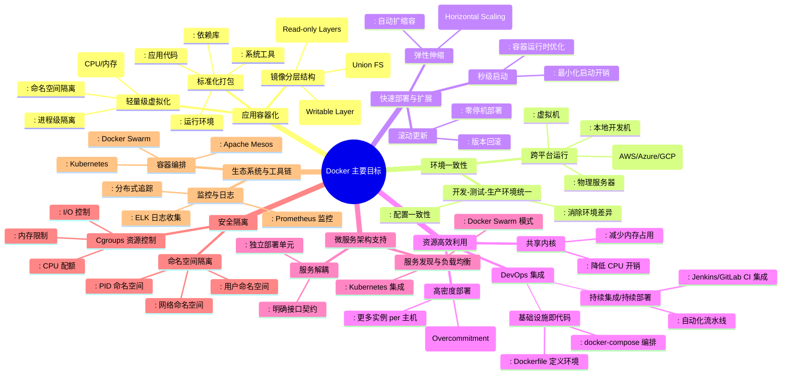

# 一、Docker 介绍和基础管理
## 1.1 Docker 介绍
### 1.1.1 容器技术简史：Docker 并非起点
#### 1.1.1.1 `chroot` Jail（1979）
- **出现时间**：1979 年（Unix Version 7）
- **原理**：通过 `chroot` 系统调用，将进程的根目录（`/`）重定向到指定子目录，实现**文件系统级别的隔离**。
- **意义**：被广泛认为是**最早的容器化技术雏形**，虽无进程、网络、用户等隔离能力，但开启了“环境隔离”的先河。

---

#### 1.1.1.2 FreeBSD Jail（2000）
- **发布**：随 FreeBSD 4.0 一同推出
- **特点**：
  - 实现了**操作系统级虚拟化**（OS-level virtualization）
  - 每个 “Jail” 拥有独立的 IP 地址、用户账户、进程空间和文件系统
- **地位**：是首个成熟的、生产可用的容器化方案，被视为现代容器技术的**重要先驱**。

---

#### 1.1.1.3 Linux-VServer（2003）
- **发布时间**：2003 年 11 月 1 日（v1.0）
- **官网**：[http://linux-vserver.org/](http://linux-vserver.org/)
- **机制**：通过向 Linux 内核打补丁，实现**系统级虚拟化**，允许多个虚拟专用服务器（VPS）在单台物理机上并行运行。
- **能力**：
  - 每个 VPS 拥有独立的 root 用户、用户数据库、网络配置
  - 可直接运行标准服务（如 SSH、Web、数据库），几乎无需修改
  - **共享底层硬件资源**，性能开销极低

---

#### 1.1.1.4 Solaris Containers（2004）
- **平台**：Oracle Solaris（支持 SPARC 和 x86）
- **组成**：结合 **Zones（区域）** 与 **Resource Controls（资源控制）**
- **特性**：
  - 提供强隔离的执行环境（Zone）
  - 支持 CPU、内存、网络等资源配额管理
- **优势**：企业级稳定性与安全性，适用于高可靠场景。

---

#### 1.1.1.5 OpenVZ（2005）
- **类型**：基于 Linux 内核的**操作系统级虚拟化**
- **功能**：
  - 创建多个安全隔离的 Linux 容器（称为 VPS）
  - 共享同一个内核，但拥有独立的文件系统、用户、进程、网络栈
- **影响**：曾是主流 VPS 提供商（如早期 HostGator）的技术基础。

---

#### 1.1.1.6 Process Containers → cgroups（2006–2007）
- **开发者**：Google 工程师
- **演进**：最初名为 *Process Containers*，后因命名冲突更名为 **cgroups**（Control Groups）
- **作用**：Linux 内核功能，用于**限制、记录和隔离进程组的资源使用**（CPU、内存、I/O 等）
- **地位**：成为后续所有 Linux 容器技术（包括 LXC 和 Docker）的**核心依赖**。

---

#### 1.1.1.7 LXC（Linux Containers，2008）
- **全称**：Linux Container
- **原理**：结合 **cgroups + namespaces**，实现轻量级虚拟化
- **特点**：
  - 无需 Hypervisor，直接在宿主机 OS 上运行隔离环境
  - 提供类似虚拟机的体验（独立 init 进程、网络、用户空间），但启动更快、资源开销更小
- **定位**：Docker 早期版本（0.x）的默认运行时。

---

#### 1.1.1.8 Warden（2011）
- **背景**：Cloud Foundry 项目中的容器管理组件
- **初期实现**：基于 LXC
- **后续**：被更现代的容器运行时取代，现已不再维护。

---

#### 1.1.1.9 LMCTFY（2013）
- **全称**：*Let Me Contain That For You*
- **发起者**：Google
- **目标**：开源 Google 内部容器管理技术
- **现状**：项目已归档，其核心思想融入了后来的 **libcontainer**（Docker 的底层引擎）及 **Kubernetes**。

---

#### 1.1.1.10 Docker（2013）
- **发布**：2013 年
- **突破**：
  - 引入**镜像分层**、**Dockerfile**、**Registry** 等概念
  - 极大简化了容器的构建、分发与运行
- **影响**：引爆 DevOps 与云原生革命，成为**最广为人知的容器平台**，但**并非技术首创者**。

---

#### 1.1.1.11 rkt（Rocket，2014）
- **发起者**：CoreOS
- **理念**：强调**安全性**、**可组合性** 和 **开放标准**（推动 OCI 规范）
- **现状**：已停止维护，但其设计思想影响了后续容器生态。
### 1.1.2 Docker 是什么
2010年，Solomon Hykes（现任 Docker CTO）与几位合伙人在美国旧金山联合创立了 dotCloud 公司。该公司主要业务是提供平台即服务（PaaS）解决方案，为开发者提供技术服务平台。

**Docker**（中文常译为"码头工人"）作为一个开源项目，正式诞生于 **2013 年 3 月 27 日**。该项目最初是 dotCloud 公司内部的一个业余性质的开源 PaaS 服务项目。由于 Docker 开源后获得了业界广泛关注和热烈反响，dotCloud 公司于 **2013 年 10 月**正式更名为 **Docker Inc**，并将总部设在美国加州旧金山。

|特性|Docker 容器|传统虚拟机|
|---|---|---|
|**启动速度**​|秒级启动|分钟级启动|
|**资源消耗**​|极低资源占用|较高资源开销|
|**性能损耗**​|接近原生性能|明显性能损耗|
Docker 服务设计
- **客户端/服务端架构**：采用 C/S 模式，通过远程 API 进行管理和控制
- **轻量级设计**：创建轻量级、可移植、自包含的容器环境
- **核心理念**：构建（Build）、运输（Ship）、运行（Run）三大核心哲学

Docker 服务安全隔离机制
- **命名空间隔离**（namespace）：提供进程、网络、文件系统等资源的隔离
- **控制组限制**（cgroup）：实现资源配额和限制管理
- **安全保证**：确保容器间的安全边界和资源隔离

**Docker 主要目标**

```mermaid
graph LR
    A[Docker Application Containerization Significance] --> B1[Environment Standardization & Consistency]
    A --> B2[Application Isolation & Security]
    A --> B3[Resource Efficiency & Cost Optimization]
    A --> B4[Agile Development & DevOps]
    A --> B5[Portability & Cloud Native]
    A --> B6[Fault Recovery & High Availability]
    A --> B7[Monitoring & Observability]
    A --> B8[Ecosystem & Toolchain]
    
    B1 --> C1_1[Development Environment Consistency]
    B1 --> C1_2[Testing Environment Consistency]
    B1 --> C1_3[Production Environment Consistency]
    
    C1_1 --> D1_1_1[Eliminate Environment-Specific Issues]
    C1_1 --> D1_1_2[Unified Dependency Management]
    C1_1 --> D1_1_3[Standardized Configuration Management]
    
    C1_2 --> D1_2_1[Automated Test Environment Setup]
    C1_2 --> D1_2_2[Reproducible Test Results]
    C1_2 --> D1_2_3[Parallel Testing Environment Isolation]
    
    C1_3 --> D1_3_1[Standardized Deployment Environment]
    C1_3 --> D1_3_2[Configuration Drift Prevention]
    C1_3 --> D1_3_3[Version Control Traceability]
    
    B2 --> C2_1[Process-Level Isolation]
    B2 --> C2_2[Security Boundary Enhancement]
    B2 --> C2_3[Multi-Tenant Environment Support]
    
    C2_1 --> D2_1_1[Namespace Isolation]
    C2_1 --> D2_1_2[Control Groups Resource Limits]
    C2_1 --> D2_1_3[Filesystem Isolation]
    
    C2_2 --> D2_2_1[Principle of Least Privilege]
    C2_2 --> D2_2_2[Vulnerability Impact Containment]
    C2_2 --> D2_2_3[Centralized Security Policy Management]
    
    C2_3 --> D2_3_1[Resource Competition Avoidance]
    C2_3 --> D2_3_2[Failure Propagation Isolation]
    C2_3 --> D2_3_3[Performance Interference Elimination]
    
    B3 --> C3_1[Lightweight Virtualization]
    B3 --> C3_2[Resource Utilization Improvement]
    B3 --> C3_3[Cost Effectiveness]
    
    C3_1 --> D3_1_1[Shared OS Kernel]
    C3_1 --> D3_1_2[Fast Startup and Shutdown]
    C3_1 --> D3_1_3[Low Memory Overhead]
    
    C3_2 --> D3_2_1[High-Density Deployment Capability]
    C3_2 --> D3_2_2[Dynamic Resource Allocation]
    C3_2 --> D3_2_3[Idle Resource Recovery]
    
    C3_3 --> D3_3_1[Hardware Investment Reduction]
    C3_3 --> D3_3_2[Energy Consumption Reduction]
    C3_3 --> D3_3_3[Operational Cost Decrease]
    
    B4 --> C4_1[CI/CD Integration]
    B4 --> C4_2[Microservices Architecture Support]
    B4 --> C4_3[Infrastructure as Code]
    
    C4_1 --> D4_1_1[Automated Build Pipeline]
    C4_1 --> D4_1_2[Standardized Deployment Process]
    C4_1 --> D4_1_3[Fast Rollback Mechanism]
    
    C4_2 --> D4_2_1[Service Decoupling & Independent Deployment]
    C4_2 --> D4_2_2[Technology Stack Diversity Support]
    C4_2 --> D4_2_3[Service Mesh Integration]
    
    C4_3 --> D4_3_1[Dockerfile Version Control]
    C4_3 --> D4_3_2[Immutable Infrastructure]
    C4_3 --> D4_3_3[Environment Configuration as Code]
    
    B5 --> C5_1[Cross-Platform Runtime Capability]
    B5 --> C5_2[Cloud-Native Application Foundation]
    B5 --> C5_3[Standardized Packaging Format]
    
    C5_1 --> D5_1_1[Seamless Dev-to-Production Migration]
    C5_1 --> D5_1_2[Multi-Cloud Deployment Strategy Support]
    C5_1 --> D5_1_3[Hybrid Cloud Environment Compatibility]
    
    C5_2 --> D5_2_1[Kubernetes Native Support]
    C5_2 --> D5_2_2[Service Discovery & Load Balancing]
    C5_2 --> D5_2_3[Auto-Scaling Capability]
    
    C5_3 --> D5_3_1[Image Registry Ecosystem]
    C5_3 --> D5_3_2[Image Signing & Verification]
    C5_3 --> D5_3_3[Supply Chain Security Assurance]
    
    B6 --> C6_1[Fast Fault Recovery]
    B6 --> C6_2[Rolling Updates & Blue-Green Deployment]
    B6 --> C6_3[Disaster Recovery Strategy]
    
    C6_1 --> D6_1_1[Container Self-Healing Capability]
    C6_1 --> D6_1_2[Health Check Mechanism]
    C6_1 --> D6_1_3[Service Mesh Fault Tolerance]
    
    C6_2 --> D6_2_1[Zero-Downtime Deployment]
    C6_2 --> D6_2_2[Instant Version Rollback]
    C6_2 --> D6_2_3[Canary Release Support]
    
    C6_3 --> D6_3_1[Image Backup & Recovery]
    C6_3 --> D6_3_2[Cross-Region Deployment]
    C6_3 --> D6_3_3[Data Persistence Solutions]
    
    B7 --> C7_1[Standardized Log Management]
    B7 --> C7_2[Performance Monitoring Metrics]
    B7 --> C7_3[Distributed Tracing]
    
    C7_1 --> D7_1_1[Centralized Log Collection]
    C7_1 --> D7_1_2[Structured Log Output]
    C7_1 --> D7_1_3[Pluggable Log Drivers]
    
    C7_2 --> D7_2_1[Resource Usage Monitoring]
    C7_2 --> D7_2_2[Application Performance Metrics]
    C7_2 --> D7_2_3[Custom Metrics Exposure]
    
    C7_3 --> D7_3_1[Request Chain Tracing]
    C7_3 --> D7_3_2[Service Dependency Visualization]
    C7_3 --> D7_3_3[Performance Bottleneck Identification]
    
    B8 --> C8_1[Rich Tool Ecosystem]
    B8 --> C8_2[Community & Market Support]
    B8 --> C8_3[Standardized Interfaces]
    
    C8_1 --> D8_1_1[Docker Compose Multi-Container Orchestration]
    C8_1 --> D8_1_2[Docker Swarm Cluster Management]
    C8_1 --> D8_1_3[Third-Party Tool Integration]
    
    C8_2 --> D8_2_1[Docker Hub Image Registry]
    C8_2 --> D8_2_2[Enterprise Image Registry]
    C8_2 --> D8_2_3[Open Source Project Containerization]
    
    C8_3 --> D8_3_1[OCI Open Container Initiative Standards]
    C8_3 --> D8_3_2[CNCF Cloud Native Foundation Support]
    C8_3 --> D8_3_3[Multi-Runtime Compatibility]
    
    %% 样式定义
    classDef level1 fill:#e1f5fe,stroke:#01579b,stroke-width:2px
    classDef level2 fill:#f3e5f5,stroke:#4a148c,stroke-width:1.5px
    classDef level3 fill:#e8f5e8,stroke:#1b5e20,stroke-width:1px
    classDef level4 fill:#fff3e0,stroke:#e65100,stroke-width:1px
    
    class A level1
    class B1,B2,B3,B4,B5,B6,B7,B8 level2
    class C1_1,C1_2,C1_3,C2_1,C2_2,C2_3,C3_1,C3_2,C3_3,C4_1,C4_2,C4_3,C5_1,C5_2,C5_3,C6_1,C6_2,C6_3,C7_1,C7_2,C7_3,C8_1,C8_2,C8_3 level3
    class D1_1_1,D1_1_2,D1_1_3,D1_2_1,D1_2_2,D1_2_3,D1_3_1,D1_3_2,D1_3_3,D2_1_1,D2_1_2,D2_1_3,D2_2_1,D2_2_2,D2_2_3,D2_3_1,D2_3_2,D2_3_3,D3_1_1,D3_1_2,D3_1_3,D3_2_1,D3_2_2,D3_2_3,D3_3_1,D3_3_2,D3_3_3,D4_1_1,D4_1_2,D4_1_3,D4_2_1,D4_2_2,D4_2_3,D4_3_1,D4_3_2,D4_3_3,D5_1_1,D5_1_2,D5_1_3,D5_2_1,D5_2_2,D5_2_3,D5_3_1,D5_3_2,D5_3_3,D6_1_1,D6_1_2,D6_1_3,D6_2_1,D6_2_2,D6_2_3,D6_3_1,D6_3_2,D6_3_3,D7_1_1,D7_1_2,D7_1_3,D7_2_1,D7_2_2,D7_2_3,D7_3_1,D7_3_2,D7_3_3,D8_1_1,D8_1_2,D8_1_3,D8_2_1,D8_2_2,D8_2_3,D8_3_1,D8_3_2,D8_3_3 level4
```

