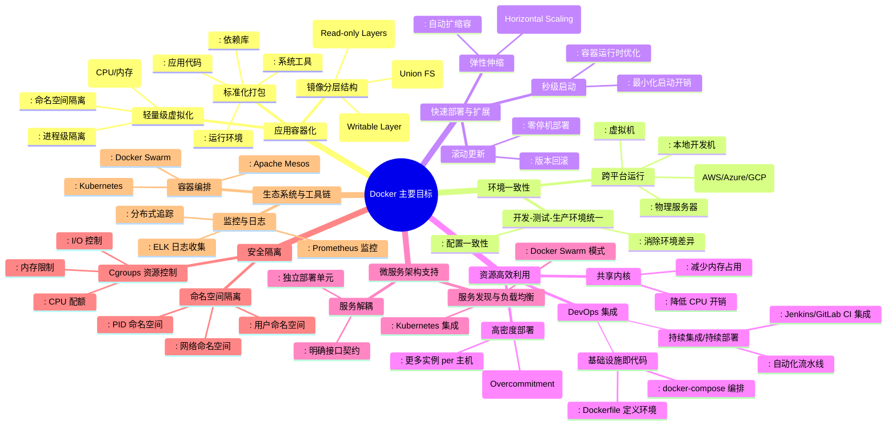
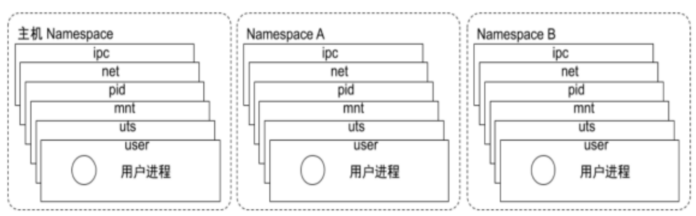

# 一、Docker 介绍
## 1.1 Docker 介绍
### 1.1.1 容器技术简史：Docker 并非起点
#### 1.1.1.1 `chroot` Jail（1979）
- **出现时间**：1979 年（Unix Version 7）
- **原理**：通过 `chroot` 系统调用，将进程的根目录（`/`）重定向到指定子目录，实现**文件系统级别的隔离**。
- **意义**：被广泛认为是**最早的容器化技术雏形**，虽无进程、网络、用户等隔离能力，但开启了“环境隔离”的先河。

---

#### 1.1.1.2 FreeBSD Jail（2000）
- **发布**：随 FreeBSD 4.0 一同推出
- **特点**：
  - 实现了**操作系统级虚拟化**（OS-level virtualization）
  - 每个 “Jail” 拥有独立的 IP 地址、用户账户、进程空间和文件系统
- **地位**：是首个成熟的、生产可用的容器化方案，被视为现代容器技术的**重要先驱**。

---

#### 1.1.1.3 Linux-VServer（2003）
- **发布时间**：2003 年 11 月 1 日（v1.0）
- **官网**：[http://linux-vserver.org/](http://linux-vserver.org/)
- **机制**：通过向 Linux 内核打补丁，实现**系统级虚拟化**，允许多个虚拟专用服务器（VPS）在单台物理机上并行运行。
- **能力**：
  - 每个 VPS 拥有独立的 root 用户、用户数据库、网络配置
  - 可直接运行标准服务（如 SSH、Web、数据库），几乎无需修改
  - **共享底层硬件资源**，性能开销极低

---

#### 1.1.1.4 Solaris Containers（2004）
- **平台**：Oracle Solaris（支持 SPARC 和 x86）
- **组成**：结合 **Zones（区域）** 与 **Resource Controls（资源控制）**
- **特性**：
  - 提供强隔离的执行环境（Zone）
  - 支持 CPU、内存、网络等资源配额管理
- **优势**：企业级稳定性与安全性，适用于高可靠场景。

---

#### 1.1.1.5 OpenVZ（2005）
- **类型**：基于 Linux 内核的**操作系统级虚拟化**
- **功能**：
  - 创建多个安全隔离的 Linux 容器（称为 VPS）
  - 共享同一个内核，但拥有独立的文件系统、用户、进程、网络栈
- **影响**：曾是主流 VPS 提供商（如早期 HostGator）的技术基础。

---

#### 1.1.1.6 Process Containers → cgroups（2006–2007）
- **开发者**：Google 工程师
- **演进**：最初名为 *Process Containers*，后因命名冲突更名为 **cgroups**（Control Groups）
- **作用**：Linux 内核功能，用于**限制、记录和隔离进程组的资源使用**（CPU、内存、I/O 等）
- **地位**：成为后续所有 Linux 容器技术（包括 LXC 和 Docker）的**核心依赖**。

---

#### 1.1.1.7 LXC（Linux Containers，2008）
- **全称**：Linux Container
- **原理**：结合 **cgroups + namespaces**，实现轻量级虚拟化
- **特点**：
  - 无需 Hypervisor，直接在宿主机 OS 上运行隔离环境
  - 提供类似虚拟机的体验（独立 init 进程、网络、用户空间），但启动更快、资源开销更小
- **定位**：Docker 早期版本（0.x）的默认运行时。

---

#### 1.1.1.8 Warden（2011）
- **背景**：Cloud Foundry 项目中的容器管理组件
- **初期实现**：基于 LXC
- **后续**：被更现代的容器运行时取代，现已不再维护。

---

#### 1.1.1.9 LMCTFY（2013）
- **全称**：*Let Me Contain That For You*
- **发起者**：Google
- **目标**：开源 Google 内部容器管理技术
- **现状**：项目已归档，其核心思想融入了后来的 **libcontainer**（Docker 的底层引擎）及 **Kubernetes**。

---

#### 1.1.1.10 Docker（2013）
- **发布**：2013 年
- **突破**：
  - 引入**镜像分层**、**Dockerfile**、**Registry** 等概念
  - 极大简化了容器的构建、分发与运行
- **影响**：引爆 DevOps 与云原生革命，成为**最广为人知的容器平台**，但**并非技术首创者**。

---

#### 1.1.1.11 rkt（Rocket，2014）
- **发起者**：CoreOS
- **理念**：强调**安全性**、**可组合性** 和 **开放标准**（推动 OCI 规范）
- **现状**：已停止维护，但其设计思想影响了后续容器生态。
### 1.1.2 Docker 是什么
2010年，Solomon Hykes（现任 Docker CTO）与几位合伙人在美国旧金山联合创立了 dotCloud 公司。该公司主要业务是提供平台即服务（PaaS）解决方案，为开发者提供技术服务平台。

**Docker**（中文常译为"码头工人"）作为一个开源项目，正式诞生于 **2013 年 3 月 27 日**。该项目最初是 dotCloud 公司内部的一个业余性质的开源 PaaS 服务项目。由于 Docker 开源后获得了业界广泛关注和热烈反响，dotCloud 公司于 **2013 年 10 月**正式更名为 **Docker Inc**，并将总部设在美国加州旧金山。

|特性|Docker 容器|传统虚拟机|
|---|---|---|
|**启动速度**​|秒级启动|分钟级启动|
|**资源消耗**​|极低资源占用|较高资源开销|
|**性能损耗**​|接近原生性能|明显性能损耗|
Docker 服务设计
- **客户端/服务端架构**：采用 C/S 模式，通过远程 API 进行管理和控制
- **轻量级设计**：创建轻量级、可移植、自包含的容器环境
- **核心理念**：构建（Build）、运输（Ship）、运行（Run）三大核心哲学

Docker 服务安全隔离机制
- **命名空间隔离**（namespace）：提供进程、网络、文件系统等资源的隔离
- **控制组限制**（cgroup）：实现资源配额和限制管理
- **安全保证**：确保容器间的安全边界和资源隔离

**Docker 主要目标**

```mermaid
graph LR
    A[Docker Application Containerization Significance] --> B1[Environment Standardization & Consistency]
    A --> B2[Application Isolation & Security]
    A --> B3[Resource Efficiency & Cost Optimization]
    A --> B4[Agile Development & DevOps]
    A --> B5[Portability & Cloud Native]
    A --> B6[Fault Recovery & High Availability]
    A --> B7[Monitoring & Observability]
    A --> B8[Ecosystem & Toolchain]
    
    B1 --> C1_1[Development Environment Consistency]
    B1 --> C1_2[Testing Environment Consistency]
    B1 --> C1_3[Production Environment Consistency]
    
    C1_1 --> D1_1_1[Eliminate Environment-Specific Issues]
    C1_1 --> D1_1_2[Unified Dependency Management]
    C1_1 --> D1_1_3[Standardized Configuration Management]
    
    C1_2 --> D1_2_1[Automated Test Environment Setup]
    C1_2 --> D1_2_2[Reproducible Test Results]
    C1_2 --> D1_2_3[Parallel Testing Environment Isolation]
    
    C1_3 --> D1_3_1[Standardized Deployment Environment]
    C1_3 --> D1_3_2[Configuration Drift Prevention]
    C1_3 --> D1_3_3[Version Control Traceability]
    
    B2 --> C2_1[Process-Level Isolation]
    B2 --> C2_2[Security Boundary Enhancement]
    B2 --> C2_3[Multi-Tenant Environment Support]
    
    C2_1 --> D2_1_1[Namespace Isolation]
    C2_1 --> D2_1_2[Control Groups Resource Limits]
    C2_1 --> D2_1_3[Filesystem Isolation]
    
    C2_2 --> D2_2_1[Principle of Least Privilege]
    C2_2 --> D2_2_2[Vulnerability Impact Containment]
    C2_2 --> D2_2_3[Centralized Security Policy Management]
    
    C2_3 --> D2_3_1[Resource Competition Avoidance]
    C2_3 --> D2_3_2[Failure Propagation Isolation]
    C2_3 --> D2_3_3[Performance Interference Elimination]
    
    B3 --> C3_1[Lightweight Virtualization]
    B3 --> C3_2[Resource Utilization Improvement]
    B3 --> C3_3[Cost Effectiveness]
    
    C3_1 --> D3_1_1[Shared OS Kernel]
    C3_1 --> D3_1_2[Fast Startup and Shutdown]
    C3_1 --> D3_1_3[Low Memory Overhead]
    
    C3_2 --> D3_2_1[High-Density Deployment Capability]
    C3_2 --> D3_2_2[Dynamic Resource Allocation]
    C3_2 --> D3_2_3[Idle Resource Recovery]
    
    C3_3 --> D3_3_1[Hardware Investment Reduction]
    C3_3 --> D3_3_2[Energy Consumption Reduction]
    C3_3 --> D3_3_3[Operational Cost Decrease]
    
    B4 --> C4_1[CI/CD Integration]
    B4 --> C4_2[Microservices Architecture Support]
    B4 --> C4_3[Infrastructure as Code]
    
    C4_1 --> D4_1_1[Automated Build Pipeline]
    C4_1 --> D4_1_2[Standardized Deployment Process]
    C4_1 --> D4_1_3[Fast Rollback Mechanism]
    
    C4_2 --> D4_2_1[Service Decoupling & Independent Deployment]
    C4_2 --> D4_2_2[Technology Stack Diversity Support]
    C4_2 --> D4_2_3[Service Mesh Integration]
    
    C4_3 --> D4_3_1[Dockerfile Version Control]
    C4_3 --> D4_3_2[Immutable Infrastructure]
    C4_3 --> D4_3_3[Environment Configuration as Code]
    
    B5 --> C5_1[Cross-Platform Runtime Capability]
    B5 --> C5_2[Cloud-Native Application Foundation]
    B5 --> C5_3[Standardized Packaging Format]
    
    C5_1 --> D5_1_1[Seamless Dev-to-Production Migration]
    C5_1 --> D5_1_2[Multi-Cloud Deployment Strategy Support]
    C5_1 --> D5_1_3[Hybrid Cloud Environment Compatibility]
    
    C5_2 --> D5_2_1[Kubernetes Native Support]
    C5_2 --> D5_2_2[Service Discovery & Load Balancing]
    C5_2 --> D5_2_3[Auto-Scaling Capability]
    
    C5_3 --> D5_3_1[Image Registry Ecosystem]
    C5_3 --> D5_3_2[Image Signing & Verification]
    C5_3 --> D5_3_3[Supply Chain Security Assurance]
    
    B6 --> C6_1[Fast Fault Recovery]
    B6 --> C6_2[Rolling Updates & Blue-Green Deployment]
    B6 --> C6_3[Disaster Recovery Strategy]
    
    C6_1 --> D6_1_1[Container Self-Healing Capability]
    C6_1 --> D6_1_2[Health Check Mechanism]
    C6_1 --> D6_1_3[Service Mesh Fault Tolerance]
    
    C6_2 --> D6_2_1[Zero-Downtime Deployment]
    C6_2 --> D6_2_2[Instant Version Rollback]
    C6_2 --> D6_2_3[Canary Release Support]
    
    C6_3 --> D6_3_1[Image Backup & Recovery]
    C6_3 --> D6_3_2[Cross-Region Deployment]
    C6_3 --> D6_3_3[Data Persistence Solutions]
    
    B7 --> C7_1[Standardized Log Management]
    B7 --> C7_2[Performance Monitoring Metrics]
    B7 --> C7_3[Distributed Tracing]
    
    C7_1 --> D7_1_1[Centralized Log Collection]
    C7_1 --> D7_1_2[Structured Log Output]
    C7_1 --> D7_1_3[Pluggable Log Drivers]
    
    C7_2 --> D7_2_1[Resource Usage Monitoring]
    C7_2 --> D7_2_2[Application Performance Metrics]
    C7_2 --> D7_2_3[Custom Metrics Exposure]
    
    C7_3 --> D7_3_1[Request Chain Tracing]
    C7_3 --> D7_3_2[Service Dependency Visualization]
    C7_3 --> D7_3_3[Performance Bottleneck Identification]
    
    B8 --> C8_1[Rich Tool Ecosystem]
    B8 --> C8_2[Community & Market Support]
    B8 --> C8_3[Standardized Interfaces]
    
    C8_1 --> D8_1_1[Docker Compose Multi-Container Orchestration]
    C8_1 --> D8_1_2[Docker Swarm Cluster Management]
    C8_1 --> D8_1_3[Third-Party Tool Integration]
    
    C8_2 --> D8_2_1[Docker Hub Image Registry]
    C8_2 --> D8_2_2[Enterprise Image Registry]
    C8_2 --> D8_2_3[Open Source Project Containerization]
    
    C8_3 --> D8_3_1[OCI Open Container Initiative Standards]
    C8_3 --> D8_3_2[CNCF Cloud Native Foundation Support]
    C8_3 --> D8_3_3[Multi-Runtime Compatibility]
    
    %% 样式定义
    classDef level1 fill:#e1f5fe,stroke:#01579b,stroke-width:2px
    classDef level2 fill:#f3e5f5,stroke:#4a148c,stroke-width:1.5px
    classDef level3 fill:#e8f5e8,stroke:#1b5e20,stroke-width:1px
    classDef level4 fill:#fff3e0,stroke:#e65100,stroke-width:1px
    
    class A level1
    class B1,B2,B3,B4,B5,B6,B7,B8 level2
    class C1_1,C1_2,C1_3,C2_1,C2_2,C2_3,C3_1,C3_2,C3_3,C4_1,C4_2,C4_3,C5_1,C5_2,C5_3,C6_1,C6_2,C6_3,C7_1,C7_2,C7_3,C8_1,C8_2,C8_3 level3
    class D1_1_1,D1_1_2,D1_1_3,D1_2_1,D1_2_2,D1_2_3,D1_3_1,D1_3_2,D1_3_3,D2_1_1,D2_1_2,D2_1_3,D2_2_1,D2_2_2,D2_2_3,D2_3_1,D2_3_2,D2_3_3,D3_1_1,D3_1_2,D3_1_3,D3_2_1,D3_2_2,D3_2_3,D3_3_1,D3_3_2,D3_3_3,D4_1_1,D4_1_2,D4_1_3,D4_2_1,D4_2_2,D4_2_3,D4_3_1,D4_3_2,D4_3_3,D5_1_1,D5_1_2,D5_1_3,D5_2_1,D5_2_2,D5_2_3,D5_3_1,D5_3_2,D5_3_3,D6_1_1,D6_1_2,D6_1_3,D6_2_1,D6_2_2,D6_2_3,D6_3_1,D6_3_2,D6_3_3,D7_1_1,D7_1_2,D7_1_3,D7_2_1,D7_2_2,D7_2_3,D7_3_1,D7_3_2,D7_3_3,D8_1_1,D8_1_2,D8_1_3,D8_2_1,D8_2_2,D8_2_3,D8_3_1,D8_3_2,D8_3_3 level4
```

**使用 Docker 容器化封装应用程序的意义**



### 1.1.3 Docker 虚拟机和物理主机
- 传统虚拟机是虚拟出一个主机硬件,并且运行一个完整的操作系统 ,然后在这个系统上安装和运行软件
- 容器内的应用直接运行在宿主机的内核之上,容器并没有自己的内核,也不需要虚拟硬件,相当轻量化
- 每个容器间是互相隔离,每个容器内都有一个属于自己的独立文件系统,独立的进程空间,网络空间,用户空间等,所以在同一个宿主机上的多个容器之间彼此不会相互影响

```mermaid
graph LR
    %% 标题
    T[Docker容器 vs 虚拟机 vs 物理主机 对比分析] --> C1[资源利用率对比]
    T --> C2[性能对比]
    T --> C3[启动速度对比]
    T --> C4[隔离性对比]
    T --> C5[可移植性对比]
    T --> C6[安全性对比]
    T --> C7[部署复杂度对比]
    T --> C8[成本对比]
    T --> C9[适用场景对比]
    
    %% 资源利用率
    C1 --> D1[Docker容器]
    C1 --> V1[虚拟机]
    C1 --> P1[物理主机]
    
    D1 --> D1_1[高密度部署]
    D1 --> D1_2[共享内核]
    D1 --> D1_3[资源超分]
    D1 --> D1_4[快速伸缩]
    
    V1 --> V1_1[中等密度]
    V1 --> V1_2[独立内核]
    V1 --> V1_3[固定分配]
    V1 --> V1_4[较慢伸缩]
    
    P1 --> P1_1[单实例]
    P1 --> P1_2[专用资源]
    P1 --> P1_3[无虚拟化开销]
    P1 --> P1_4[硬件限制]
    
    %% 性能
    C2 --> D2[Docker容器]
    C2 --> V2[虚拟机]
    C2 --> P2[物理主机]
    
    D2 --> D2_1[接近原生性能]
    D2 --> D2_2[低CPU开销<1-2%]
    D2 --> D2_3[低内存开销]
    D2 --> D2_4[高效I/O]
    
    V2 --> V2_1[有性能损耗]
    V2 --> V2_2[较高CPU开销5-15%]
    V2 --> V2_3[内存开销大]
    V2 --> V2_4[I/O性能较低]
    
    P2 --> P2_1[最佳性能]
    P2 --> P2_2[零虚拟化开销]
    P2 --> P2_3[直接硬件访问]
    P2 --> P2_4[最优I/O性能]
    
    %% 启动速度
    C3 --> D3[Docker容器]
    C3 --> V3[虚拟机]
    C3 --> P3[物理主机]
    
    D3 --> D3_1[秒级启动]
    D3 --> D3_2[快速扩缩容]
    D3 --> D3_3[即时销毁]
    D3 --> D3_4[高效生命周期]
    
    V3 --> V3_1[分钟级启动]
    V3 --> V3_2[较慢伸缩]
    V3 --> V3_3[关闭较慢]
    V3 --> V3_4[较重生命周期]
    
    P3 --> P3_1[小时级启动]
    P3 --> P3_2[物理部署]
    P3 --> P3_3[无法快速伸缩]
    P3 --> P3_4[硬件依赖]
    
    %% 隔离性
    C4 --> D4[Docker容器]
    C4 --> V4[虚拟机]
    C4 --> P4[物理主机]
    
    D4 --> D4_1[进程级隔离]
    D4 --> D4_2[命名空间隔离]
    D4 --> D4_3[共享内核风险]
    D4 --> D4_4[Cgroups限制]
    
    V4 --> V4_1[完整系统隔离]
    V4 --> V4_2[硬件级隔离]
    V4 --> V4_3[独立内核]
    V4 --> V4_4[强安全边界]
    
    P4 --> P4_1[物理隔离]
    P4 --> P4_2[完全独立]
    P4 --> P4_3[无共享风险]
    P4 --> P4_4[最高隔离级别]
    
    %% 可移植性
    C5 --> D5[Docker容器]
    C5 --> V5[虚拟机]
    C5 --> P5[物理主机]
    
    D5 --> D5_1[高度可移植]
    D5 --> D5_2[跨环境一致]
    D5 --> D5_3[镜像标准化]
    D5 --> D5_4[云原生支持]
    
    V5 --> V5_1[中等可移植性]
    V5 --> V5_2[格式转换需求]
    V5 --> V5_3[较大文件体积]
    V5 --> V5_4[兼容性要求]
    
    P5 --> P5_1[低可移植性]
    P5 --> P5_2[硬件绑定]
    P5 --> P5_3[迁移复杂]
    P5 --> P5_4[物理限制]
    
    %% 安全性
    C6 --> D6[Docker容器]
    C6 --> V6[虚拟机]
    C6 --> P6[物理主机]
    
    D6 --> D6_1[命名空间隔离]
    D6 --> D6_2[内核共享风险]
    D6 --> D6_3[安全策略]
    D6 --> D6_4[镜像安全扫描]
    
    V6 --> V6_1[强隔离性]
    V6 --> V6_2[Hypervisor安全]
    V6 --> V6_3[完整沙箱]
    V6 --> V6_4[虚拟机逃逸防护]
    
    P6 --> P6_1[物理安全]
    P6 --> P6_2[网络隔离]
    P6 --> P6_3[硬件级安全]
    P6 --> P6_4[直接攻击面]
    
    %% 部署复杂度
    C7 --> D7[Docker容器]
    C7 --> V7[虚拟机]
    C7 --> P7[物理主机]
    
    D7 --> D7_1[简单部署]
    D7 --> D7_2[编排工具]
    D7 --> D7_3[自动化支持]
    D7 --> D7_4[DevOps友好]
    
    V7 --> V7_1[中等复杂度]
    V7 --> V7_2[模板部署]
    V7 --> V7_3[配置管理]
    V7 --> V7_4[资源规划]
    
    P7 --> P7_1[高复杂度]
    P7 --> P7_2[硬件配置]
    P7 --> P7_3[物理安装]
    P7 --> P7_4[维护成本高]
    
    %% 成本对比
    C8 --> D8[Docker容器]
    C8 --> V8[虚拟机]
    C8 --> P8[物理主机]
    
    D8 --> D8_1[低资源成本]
    D8 --> D8_2[高密度节省]
    D8 --> D8_3[运维自动化]
    D8 --> D8_4[快速ROI]
    
    V8 --> V8_1[中等成本]
    V8 --> V8_2[许可费用]
    V8 --> V8_3[管理工具]
    V8 --> V8_4[资源预留]
    
    P8 --> P8_1[高资本支出]
    P8 --> P8_2[硬件投资]
    P8 --> P8_3[维护费用]
    P8 --> P8_4[空间能耗成本]
    
    %% 适用场景
    C9 --> D9[Docker容器]
    C9 --> V9[虚拟机]
    C9 --> P9[物理主机]
    
    D9 --> D9_1[微服务架构]
    D9 --> D9_2[CI/CD流水线]
    D9 --> D9_3[云原生应用]
    D9 --> D9_4[开发测试环境]
    
    V9 --> V9_1[传统应用]
    V9 --> V9_2[Windows应用]
    V9 --> V9_3[混合环境]
    V9 --> V9_4[合规要求]
    
    P9 --> P9_1[高性能计算]
    P9 --> P9_2[数据库系统]
    P9 --> P9_3[GPU计算]
    P9 --> P9_4[安全敏感应用]
    
    %% 样式定义
    classDef title fill:#2e7d32,stroke:#1b5e20,stroke-width:3px,color:white
    classDef category fill:#1565c0,stroke:#0d47a1,stroke-width:2px,color:white
    classDef docker fill:#4caf50,stroke:#2e7d32,stroke-width:1.5px,color:white
    classDef vm fill:#ff9800,stroke:#f57c00,stroke-width:1.5px,color:black
    classDef physical fill:#f44336,stroke:#d32f2f,stroke-width:1.5px,color:white
    classDef detail fill:#e3f2fd,stroke:#90caf9,stroke-width:1px
    
    class T title
    class C1,C2,C3,C4,C5,C6,C7,C8,C9 category
    class D1,D2,D3,D4,D5,D6,D7,D8,D9 docker
    class V1,V2,V3,V4,V5,V6,V7,V8,V9 vm
    class P1,P2,P3,P4,P5,P6,P7,P8,P9 physical
    class D1_1,D1_2,D1_3,D1_4,D2_1,D2_2,D2_3,D2_4,D3_1,D3_2,D3_3,D3_4,D4_1,D4_2,D4_3,D4_4,D5_1,D5_2,D5_3,D5_4,D6_1,D6_2,D6_3,D6_4,D7_1,D7_2,D7_3,D7_4,D8_1,D8_2,D8_3,D8_4,D9_1,D9_2,D9_3,D9_4 detail
    class V1_1,V1_2,V1_3,V1_4,V2_1,V2_2,V2_3,V2_4,V3_1,V3_2,V3_3,V3_4,V4_1,V4_2,V4_3,V4_4,V5_1,V5_2,V5_3,V5_4,V6_1,V6_2,V6_3,V6_4,V7_1,V7_2,V7_3,V7_4,V8_1,V8_2,V8_3,V8_4,V9_1,V9_2,V9_3,V9_4 detail
    class P1_1,P1_2,P1_3,P1_4,P2_1,P2_2,P2_3,P2_4,P3_1,P3_2,P3_3,P3_4,P4_1,P4_2,P4_3,P4_4,P5_1,P5_2,P5_3,P5_4,P6_1,P6_2,P6_3,P6_4,P7_1,P7_2,P7_3,P7_4,P8_1,P8_2,P8_3,P8_4,P9_1,P9_2,P9_3,P9_4 detail
```




### 1.1.4 Docker 的组成
Docker 官网: http://www.docker.com

帮助文档链接: https://docs.docker.com/

Docker 镜像: https://hub.docker.com/

Docker 中文网站: http://www.docker.org.cn/

- Docker 主机(Host): 一个物理机或虚拟机，用于运行 Docker 服务进程和容器，也称为宿主机，node 节点
- Docker 服务端(Server): Docker 守护进程，运行 docker 容器 docker engine
- Docker 客户端(Client): 客户端使用 docker 命令或其他工具调用 docker API
- Docker 镜像(Images): 镜像可以理解为创建实例使用的模板,本质上就是一些程序文件的集合
- Docker 仓库(Registry): 保存镜像的仓库，官方仓库: https://hub.docker.com
	 可以搭建私有仓库 harbor
- Docker 容器(Container): 容器是从镜像生成对外提供服务的一个或一组服务,其本质就是将镜像中的程序启动后生成的进程
## 1.2 Namespace
https://man7.org/linux/man-pages/man7/namespaces.7.html
https://en.wikipedia.org/wiki/Linux_namespaces

>[!question] 一个宿主机运行了 N 个容器，多个容器公用一个 OS，必然带来以下问题：
> - 怎么样保证每个容器都有不同的文件系统并且能互不影响？
> - 一个docker主进程内的各个容器都是其子进程，那么如果实现同一个主进程下不同类型的子进程？各个容器子进程间能相互通信(内存数据)吗？
> - 多个容器怎么解决 IP 及端口分配问题
> - 多个容器的主机名能一样吗
> - 每个容器都要不要有 root，怎么解决账户重名问题


Namespace 是 Linux 系统的底层核心概念，其实现逻辑位于 Linux 内核层 —— 内核中部署了多种不同类型的命名空间，为容器隔离提供了基础能力。
Docker 容器的运行机制有一个关键特征：所有容器都运行在宿主机的同一个 Docker 主进程下，并且共用宿主机的系统内核，容器自身仅运行在宿主机的**用户空间**中。尽管容器不像虚拟机那样拥有独立的内核，但仍需要实现与其他容器相互隔离的运行环境。
容器技术的核心是**在单个进程内为指定服务构建独立的运行环境**，同时确保宿主机内核不受容器内进程的干扰和影响（比如文件读写、网络请求、进程调度等层面）。

Linux Namespace 隔离类型详情表

|隔离类型|英文全称 / 简称|核心功能|系统调用参数|内核版本|
|---|---|---|---|---|
|MNT Namespace|mount|提供磁盘挂载点和文件系统的隔离能力|CLONE_NEWNS|2.4.19|
|PID Namespace|Process Identification|提供进程隔离能力（容器内进程 ID 独立编号，无法感知宿主机 / 其他容器进程）|CLONE_NEWPID|2.6.24|
|IPC Namespace|Inter-Process Communication|提供进程间通信的隔离能力，包括信号量、消息队列和共享内存|CLONE_NEWIPC|2.6.19|
|Net Namespace|network|提供网络隔离能力，包括网络设备、网络栈、端口等|CLONE_NEWNET|2.6.29|
|UTS Namespace|UNIX Timesharing System|提供内核、主机名和域名的隔离能力|CLONE_NEWUTS|2.6.19|
|User Namespace|user|提供用户隔离能力，包括用户和用户组的独立映射|CLONE_NEWUSER|3.8|
### 1. MNT Namespace（挂载命名空间）

#### 核心定义

MNT（Mount）Namespace 是最早实现的 Linux 命名空间（内核 2.4.19），核心作用是为每个容器提供**独立的文件系统挂载视图**。

#### 工作原理

- 每个 MNT Namespace 有自己的挂载点列表，容器内执行 `mount`/`umount` 操作仅影响自身的挂载表，不会改变宿主机或其他容器的文件系统挂载状态；
- 容器的根目录（`/`）会被挂载为独立的文件系统（如镜像层 + 可写层），使得容器 “看到” 的文件目录与宿主机、其他容器完全隔离。

#### 实际应用

- 容器可以拥有独立的 `/etc`、`/usr` 等目录，比如容器 A 的 `/etc/passwd` 和容器 B 的完全不同，互不干扰；
- 宿主机的磁盘分区可以按需挂载到容器内（如 `-v /host/data:/container/data`），但容器内的挂载操作不会反向影响宿主机。

### 2. PID Namespace（进程命名空间）

#### 核心定义

PID（Process Identification）Namespace（内核 2.6.24）实现**进程 ID 的隔离**，让每个容器拥有独立的进程编号空间。

#### 工作原理

- 每个 PID Namespace 内的第一个进程 PID 为 1（通常是容器的入口进程，如 `nginx`/`bash`），相当于容器内的 “init 进程”，负责回收子进程；
- 容器内只能看到自己 Namespace 内的进程，无法感知宿主机或其他容器的进程（即使宿主机的 PID 1000 在容器内可能显示为 PID 2）；
- PID Namespace 是层级化的，父 Namespace 可以看到子 Namespace 的进程（但 PID 编号不同），子 Namespace 无法看到父 Namespace 的进程。

#### 实际应用

- 容器内执行 `ps -ef` 只能看到容器自身的进程，避免进程 ID 冲突和误操作；
- 容器内杀死 PID 1 会直接导致容器退出（类似宿主机杀死 init 进程），保证容器的进程生命周期独立。

### 3. IPC Namespace（进程间通信命名空间）

#### 核心定义

IPC（Inter-Process Communication）Namespace（内核 2.6.19）隔离**进程间的通信方式**，防止不同容器的 IPC 资源互相干扰。

#### 工作原理

- IPC 资源包括：信号量（semaphores）、消息队列（message queues）、共享内存（shared memory）；
- 每个 IPC Namespace 有独立的 IPC 资源标识符，容器 A 创建的共享内存，容器 B 无法访问或修改。

#### 实际应用

- 多进程容器内的进程可以通过 IPC 通信（如共享内存传输数据），但不会和其他容器的 IPC 资源冲突；
- 避免不同容器的 IPC 资源耗尽对方的资源（比如一个容器的消息队列占满，不影响其他容器）。

### 4. Net Namespace（网络命名空间）

#### 核心定义

Net（Network）Namespace（内核 2.6.29）是容器网络隔离的核心，为每个容器提供**独立的网络栈**。

#### 工作原理

- 每个 Net Namespace 有独立的网络设备（如 `eth0`）、IP 地址、端口号、路由表、防火墙规则（iptables）、套接字（socket）；
- 宿主机通过虚拟网桥（如 `docker0`）连接所有容器的 Net Namespace，实现容器间 / 容器与外网的通信；
- 端口映射（如 `-p 8080:80`）本质是在宿主机的 Net Namespace 和容器的 Net Namespace 之间做 NAT 转发。

#### 实际应用

- 多个容器可以同时监听 80 端口（容器内），通过宿主机不同端口映射对外提供服务（如容器 A:80→宿主机：8080，容器 B:80→宿主机：8081）；
- 容器可以配置独立的 IP 地址（如 172.17.0.2），与其他容器或外网通信，网络故障仅影响自身。

### 5. UTS Namespace（主机名命名空间）

#### 核心定义

UTS（UNIX Timesharing System）Namespace（内核 2.6.19）隔离**主机名和域名**，让每个容器有独立的主机标识。

#### 工作原理

- UTS 是 “UNIX 分时系统” 的缩写，核心作用是让容器可以设置自己的 `hostname` 和 `domainname`，且仅在自身 Namespace 内生效；
- 宿主机执行 `hostname` 看到的是宿主机名，容器内执行 `hostname` 看到的是容器自定义的名称（如 `docker run --hostname my-container`）。

#### 实际应用

- 依赖主机名的应用（如集群软件、日志系统）可以在容器内独立配置主机名，无需修改宿主机；
- 不同容器可以使用相同的主机名，互不冲突。

### 6. User Namespace（用户命名空间）

#### 核心定义

User Namespace（内核 3.8）实现**用户和用户组的隔离与映射**，是容器安全的重要保障。

#### 工作原理

- 每个 User Namespace 有独立的 UID/GID（用户 / 组 ID）空间，容器内的 root 用户（UID 0）可以映射到宿主机的普通用户（如 UID 1000）；
- 容器内的 root 仅在自己的 Namespace 内拥有最高权限，在宿主机上仅拥有映射后的普通用户权限，即使容器内进程逃逸到宿主机，也无法获得 root 权限。

#### 实际应用

- 容器内以 root 运行应用（满足应用权限需求），但宿主机层面无 root 风险，提升容器安全性；
- 不同容器可以有独立的用户体系，比如容器 A 的 UID 1000 是普通用户，容器 B 的 UID 1000 可以是管理员，互不影响。

```bash
╭─[root@lnxguru] ~
╰─➤ grep -A10 CONFIG_NAMESPACES /boot/config-5.15.0-52-generic
grep: /boot/config-5.15.0-52-generic: No such file or directory
╭─[root@lnxguru] ~
╰─➤ grep -A10 CONFIG_NAMESPACES /boot/config-6.14.0-37-generic 
CONFIG_NAMESPACES=y
CONFIG_UTS_NS=y
CONFIG_TIME_NS=y
CONFIG_IPC_NS=y
CONFIG_USER_NS=y
CONFIG_PID_NS=y
CONFIG_NET_NS=y
CONFIG_CHECKPOINT_RESTORE=y
CONFIG_SCHED_AUTOGROUP=y
CONFIG_RELAY=y
CONFIG_BLK_DEV_INITRD=y
```

namespace
```bash
╭─[root@lnxguru] ~
╰─➤ lsns --help 

Usage:
 lsns [options] [<namespace>]

List system namespaces.

Options:
 -J, --json             use JSON output format
 -l, --list             use list format output
 -n, --noheadings       don't print headings'
 -o, --output <list>    define which output columns to use
     --output-all       output all columns
 -P, --persistent       namespaces without processes
 -p, --task <pid>       print process namespaces
 -r, --raw              use the raw output format
 -u, --notruncate       don't truncate text in columns
 -W, --nowrap           don't use multi-line representation
 -t, --type <name>      namespace type (mnt, net, ipc, user, pid, uts, cgroup, time)
 -T, --tree <rel>       use tree format (parent, owner, or process)

 -h, --help             display this help
 -V, --version          display version

Available output columns:
          NS  namespace identifier (inode number)
        TYPE  kind of namespace
        PATH  path to the namespace
      NPROCS  number of processes in the namespace
         PID  lowest PID in the namespace
        PPID  PPID of the PID
     COMMAND  command line of the PID
         UID  UID of the PID
        USER  username of the PID
     NETNSID  namespace ID as used by network subsystem
        NSFS  nsfs mountpoint (usually used network subsystem)
         PNS  parent namespace identifier (inode number)
         ONS  owner namespace identifier (inode number)

For more details see lsns(8).


╭─[root@lnxguru] ~
╰─➤ lsns -l 
        NS TYPE   NPROCS   PID USER             COMMAND
4026531834 time      369     1 root             /sbin/init splash
4026531835 cgroup    369     1 root             /sbin/init splash
4026531836 pid       369     1 root             /sbin/init splash
4026531837 user      367     1 root             /sbin/init splash
4026531838 uts       361     1 root             /sbin/init splash
4026531839 ipc       369     1 root             /sbin/init splash
4026531840 net       367     1 root             /sbin/init splash
4026531841 mnt       350     1 root             /sbin/init splash
4026531862 mnt         1    71 root             kdevtmpfs
4026532553 mnt         1   518 root             /usr/lib/systemd/systemd-udevd
4026532554 uts         1   518 root             /usr/lib/systemd/systemd-udevd
4026532555 mnt         1   932 systemd-timesync /usr/lib/systemd/systemd-timesyncd
4026532556 mnt         1   906 systemd-resolve  /usr/lib/systemd/systemd-resolved
4026532557 mnt         1   862 systemd-oom      /usr/lib/systemd/systemd-oomd
4026532585 uts         1   862 systemd-oom      /usr/lib/systemd/systemd-oomd
4026532586 uts         1   932 systemd-timesync /usr/lib/systemd/systemd-timesyncd
4026532587 mnt         1  1374 root             /usr/lib/systemd/systemd-logind
4026532589 uts         1  1374 root             /usr/lib/systemd/systemd-logind
4026532591 uts         1  1411 syslog           /usr/sbin/rsyslogd -n -iNONE
4026532592 mnt         1  1320 polkitd          /usr/lib/polkit-1/polkitd --no-debug
4026532602 mnt         1  1485 root             /usr/sbin/NetworkManager --no-daemon
4026532603 uts         1  1320 polkitd          /usr/lib/polkit-1/polkitd --no-debug
4026532606 mnt         1  1560 root             /usr/sbin/ModemManager
4026532613 mnt         1  4672 root             /usr/libexec/fwupd/fwupd
4026532642 mnt         1  1322 root             /usr/libexec/power-profiles-daemon
4026532644 net         1  1345 root             /usr/libexec/accounts-daemon
4026532698 uts         1  1322 root             /usr/libexec/power-profiles-daemon
4026532700 mnt         1  1345 root             /usr/libexec/accounts-daemon
4026532701 mnt         1  1356 root             /usr/libexec/switcheroo-control
4026532727 mnt         2  3748 xuruizhao        /snap/snapd-desktop-integration/343/usr/bin/snapd-desktop-integration
4026532729 mnt         1  1734 root             /usr/libexec/bluetooth/bluetoothd
4026532777 net         1  2453 rtkit            /usr/libexec/rtkit-daemon
4026532832 mnt         1  2453 rtkit            /usr/libexec/rtkit-daemon
4026532833 mnt         0       root             
4026532834 mnt         1  2616 colord           /usr/libexec/colord
4026532835 uts         1  2616 colord           /usr/libexec/colord
4026532836 user        1  2616 colord           /usr/libexec/colord
4026532894 mnt         1  2662 root             /usr/libexec/upowerd
4026532895 user        1  2662 root             /usr/libexec/upowerd


╭─[root@lnxguru] ~
╰─➤ lsns -t  net
        NS TYPE NPROCS   PID USER     NETNSID NSFS COMMAND
4026531840 net     368     1 root  unassigned      /sbin/init splash
4026532644 net       1  1345 root  unassigned      ├─/usr/libexec/accounts-daemon
4026532777 net       1  2453 rtkit unassigned      └─/usr/libexec/rtkit-daemon


╭─[root@lnxguru] ~
╰─➤ nsenter --help 

Usage:
 nsenter [options] [<program> [<argument>...]]

Run a program with namespaces of other processes.

Options:
 -a, --all              enter all namespaces
 -t, --target <pid>     target process to get namespaces from
 -m, --mount[=<file>]   enter mount namespace
 -u, --uts[=<file>]     enter UTS namespace (hostname etc)
 -i, --ipc[=<file>]     enter System V IPC namespace
 -n, --net[=<file>]     enter network namespace
 -p, --pid[=<file>]     enter pid namespace
 -C, --cgroup[=<file>]  enter cgroup namespace
 -U, --user[=<file>]    enter user namespace
 -T, --time[=<file>]    enter time namespace
 -S, --setuid[=<uid>]   set uid in entered namespace
 -G, --setgid[=<gid>]   set gid in entered namespace
     --preserve-credentials do not touch uids or gids
 -r, --root[=<dir>]     set the root directory
 -w, --wd[=<dir>]       set the working directory
 -W, --wdns <dir>       set the working directory in namespace
 -e, --env              inherit environment variables from target process
 -F, --no-fork          do not fork before exec'ing <program>
 -Z, --follow-context   set SELinux context according to --target PID

 -h, --help             display this help
 -V, --version          display version

For more details see nsenter(1).'


# 说明:5387 为容器在宿主机的 Pid,下面表示进入5387容器的对应网络名称空间执行命令
╭─[root@lnxguru] ~
╰─➤ ls -l /proc/5387/ns
total 0
lrwxrwxrwx 1 root root 0 Feb 13 14:40 cgroup -> 'cgroup:[4026531835]'
lrwxrwxrwx 1 root root 0 Feb 13 14:40 ipc -> 'ipc:[4026531839]'
lrwxrwxrwx 1 root root 0 Feb 13 14:40 mnt -> 'mnt:[4026531841]'
lrwxrwxrwx 1 root root 0 Feb 13 14:40 net -> 'net:[4026531840]'
lrwxrwxrwx 1 root root 0 Feb 13 14:40 pid -> 'pid:[4026531836]'
lrwxrwxrwx 1 root root 0 Feb 13 14:40 pid_for_children -> 'pid:[4026531836]'
lrwxrwxrwx 1 root root 0 Feb 13 14:40 time -> 'time:[4026531834]'
lrwxrwxrwx 1 root root 0 Feb 13 14:40 time_for_children -> 'time:[4026531834]'
lrwxrwxrwx 1 root root 0 Feb 13 14:40 user -> 'user:[4026531837]'
lrwxrwxrwx 1 root root 0 Feb 13 14:40 uts -> 'uts:[4026531838]'

╭─[root@lnxguru] ~
╰─➤ nsenter -t 5387 -n ip a
1: lo: <LOOPBACK,UP,LOWER_UP> mtu 65536 qdisc noqueue state UNKNOWN group default qlen 1000
    link/loopback 00:00:00:00:00:00 brd 00:00:00:00:00:00
    inet 127.0.0.1/8 scope host lo
       valid_lft forever preferred_lft forever
    inet6 ::1/128 scope host noprefixroute 
       valid_lft forever preferred_lft forever
2: ens33: <BROADCAST,MULTICAST,UP,LOWER_UP> mtu 1500 qdisc fq_codel state UP group default qlen 1000
    link/ether 00:0c:29:f7:69:7c brd ff:ff:ff:ff:ff:ff
    altname enp2s1
    inet 192.168.121.197/24 brd 192.168.121.255 scope global dynamic noprefixroute ens33
       valid_lft 1155sec preferred_lft 1155sec
    inet6 fe80::20c:29ff:fef7:697c/64 scope link 
       valid_lft forever preferred_lft forever
3: docker0: <BROADCAST,MULTICAST,UP,LOWER_UP> mtu 1500 qdisc noqueue state UP group default 
    link/ether 36:6a:33:d7:f8:fd brd ff:ff:ff:ff:ff:ff
    inet 172.17.0.1/16 brd 172.17.255.255 scope global docker0
       valid_lft forever preferred_lft forever
    inet6 fe80::346a:33ff:fed7:f8fd/64 scope link 
       valid_lft forever preferred_lft forever
4: veth4f8bbb4@if2: <BROADCAST,MULTICAST,UP,LOWER_UP> mtu 1500 qdisc noqueue master docker0 state UP group default 
    link/ether 92:9c:a9:4c:70:7c brd ff:ff:ff:ff:ff:ff link-netnsid 0
    inet6 fe80::909c:a9ff:fe4c:707c/64 scope link 
       valid_lft forever preferred_lft forever

```
## 1.3 Control groups
Linux Cgroups 的全称是 Linux Control Groups,是 Linux 内核的一个功能.最早是由 Google 的工程师（主要是 Paul Menage 和 Rohit Seth）在2006年发起，最早的名称为进程容器（process containers）。
在2007年时，因为在 Linux 内核中，容器（container）这个名词有许多不同的意义，为避免混乱，被重命名为 cgroup，并且被合并到2.6.24版的内核中去。自那以后，又添加了很多功能。

如果不对一个容器做任何资源限制，则宿主机会允许其占用无限大的内存空间，有时候会因为代码 bug 程序会一直申请内存，直到把宿主机内存占完，为了避免此类的问题出现，宿主机有必要对容器进行资源分配限制，比如 CPU、内存等
Cgroups 最主要的作用，就是限制一个进程组能够使用的资源上限，包CPU、内存、磁盘、网络带宽等等。此外，还能够对进程进行优先级设置，资源的计量以及资源的控制(比如:将进程挂起和恢复等操作)。
Cgroups 在内核层默认已经开启，从 CentOS 和 Ubuntu 不同版本对比，显然内核较新的支持的功能更多。
```bash
╭─[root@lnxguru] ~
╰─➤ grep CGROUP /boot/config-6.14.0-37-generic 
CONFIG_CGROUPS=y
# CONFIG_CGROUP_FAVOR_DYNMODS is not set
CONFIG_BLK_CGROUP=y
CONFIG_CGROUP_WRITEBACK=y
CONFIG_CGROUP_SCHED=y
CONFIG_CGROUP_PIDS=y
CONFIG_CGROUP_RDMA=y
CONFIG_CGROUP_DMEM=y
CONFIG_CGROUP_FREEZER=y
CONFIG_CGROUP_HUGETLB=y
CONFIG_CGROUP_DEVICE=y
CONFIG_CGROUP_CPUACCT=y
CONFIG_CGROUP_PERF=y
CONFIG_CGROUP_BPF=y
CONFIG_CGROUP_MISC=y
# CONFIG_CGROUP_DEBUG is not set
CONFIG_SOCK_CGROUP_DATA=y
CONFIG_BLK_CGROUP_RWSTAT=y
CONFIG_BLK_CGROUP_PUNT_BIO=y
# CONFIG_BLK_CGROUP_IOLATENCY is not set
CONFIG_BLK_CGROUP_FC_APPID=y
CONFIG_BLK_CGROUP_IOCOST=y
CONFIG_BLK_CGROUP_IOPRIO=y
# CONFIG_BFQ_CGROUP_DEBUG is not set
CONFIG_NETFILTER_XT_MATCH_CGROUP=m
CONFIG_NET_CLS_CGROUP=m
CONFIG_CGROUP_NET_PRIO=y
CONFIG_CGROUP_NET_CLASSID=y
# CONFIG_DEBUG_CGROUP_REF is not set
```
## 1.4 容器管理工具
有了以上的 namespace、cgroups 就具备了基础的容器运行环境，但是还需要有相应的容器创建与删除的管理工具、以及怎么样把容器运行起来、容器数据怎么处理、怎么进行启动与关闭等问题需要解决，于是容器管理技术出现了。目前主要是使用 docker，containerd 等，早期使用 LXC

## 1.5 Docker 优势
- **极速部署交付**：支持短时间内批量部署成百上千个应用，大幅缩短从开发到上线的交付周期，快速响应业务需求。
- **高效轻量虚拟化**：无需额外 hypervisor 虚拟化层，基于 Linux 内核原生技术实现应用级虚拟化，相比传统虚拟机，减少资源冗余开销，性能和运行效率显著提升。
- **显著节省开支**：通过提高服务器资源利用率（支持多容器高密度部署），减少物理服务器采购、运维及能耗成本，降低整体 IT 支出。
- **配置简化便捷**：将应用运行环境（依赖、配置、代码等）整体打包为容器镜像，使用时直接启动镜像即可快速部署，无需重复配置环境。
- **环境标准化统一**：实现开发、测试、生产全流程环境的标准化，彻底解决 “开发环境能跑、测试 / 生产环境报错” 的环境不一致问题，减少调试成本。
- **灵活迁移与扩展**：容器具备良好的跨平台兼容性，可无缝运行在物理机、虚拟机、公有云、私有云等不同环境，支持应用在不同宿主机、不同平台间快速迁移；同时支持横向弹性扩展，满足业务流量波动需求。
- **适配微服务架构**：推荐 “一个容器运行一个应用” 的部署模式，天然契合面向服务的架构（SOA）和微服务理念，实现应用的分布式部署。这种模式符合 “高内聚、低耦合” 的开发原则，可降低不同服务间的相互干扰，便于独立升级、维护和横向扩展。
## 1.6 容器相关技术
### 1.6.1 容器规范


OCI 官网:https://opencontainers.org/

容器技术除了的 docker 之外，还有 coreOS 的 rkt，还有阿里的 Pouch 等等
为了保证容器生态的标准性和健康可持续发展，包括 Linux 基金会、Docker、微软、红帽、谷歌和 IBM 等公司在2015年6月共同成立了一个叫 Open Container Initiative（OCI）的组织，其目的就是制定开放的标准的容器规范
目前 OCI 一共发布了两个规范，分别是 runtime spec 和 image format spec，有了这两个规范，不同的容器公司开发的容器只要兼容这两个规范，就可以保证容器的可移植性和相互可操作性。
### 1.6.2 容器 runtime
runtime 是真正运行容器的地方，因此为了运行不同的容器 runtime 需要和操作系统内核紧密合作相互在支持，以便为容器提供相应的运行环境
对于容器运行时主要有两个级别：Low Level (使用接近内核层) 和 High Level (使用接近用户层)目前，市面上常用的容器引擎有很多，主要有下图的那几种。
```mermaid
graph TD
    A[容器运行时 Runtime] --> B[Low Level 运行时<br/>(接近内核层)]
    A --> C[High Level 运行时<br/>(接近用户层)]
    
    %% 底层运行时（贴近内核，提供基础容器运行能力）
    B --> B1[runc<br/>（OCI 标准，Docker/Containerd 底层）]
    B --> B2[crun<br/>（轻量级，替代 runc，性能更优）]
    B --> B3[kata-runtime<br/>（安全隔离型，结合轻量虚拟机）]
    B --> B4[runv<br/>（基于 Hypervisor 的虚拟化运行时）]
    
    %% 高层运行时（贴近用户，提供更友好的封装和管理能力）
    C --> C1[Containerd<br/>（Docker 剥离的核心，K8s 默认）]
    C --> C2[Docker Engine<br/>（经典引擎，包含完整工具链）]
    C --> C3[CRI-O<br/>（专为 K8s CRI 设计的轻量引擎）]
    C --> C4[Podman<br/>（无守护进程，兼容 Docker 命令）]
    C --> C5[LXD/LXC<br/>（系统级容器，侧重完整系统环境）]
    
    %% 标注核心特性
    B1 -. OCI 规范标准实现 .-> A
    C1 -. 对接 K8s CRI 接口 .-> A
    C2 -. 一站式容器管理（含镜像/网络/存储） .-> A
```
查看 docker  的 runtime
```bash
╭─[root@lnxguru] ~
╰─➤ docker info  | grep Runtimes
 Runtimes: io.containerd.runc.v2 runc

```
### 1.6.3 镜像仓库 Registry
统一保存镜像而且是多个不同镜像版本的地方，叫做镜像仓库

- Docker hub: docker 官方的公共仓库，已经保存了大量的常用镜像，可以方便大家直接使用
- 阿里云，网易等第三方镜像的公共仓库
- Image registry: docker 官方提供的私有仓库部署工具，无 web 管理界面，目前使用较少
- Harbor: vmware 提供的自带 web 界面自带认证功能的镜像私有仓库，目前有很多公司使用
```ini
docker.io/library/alpine

harbor.wang.org/project/centos:7.2.1511

registry.cn-hangzhou.aliyuncs.com/wangxiaochun/busybox:v1.0

172.18.200.101/project/centos: latest

172.18.200.101/project/java-7.0.59:v1
```
### 1.6.4 容器编排工具
当多个容器在多个主机运行的时候，单独管理容器是相当复杂而且很容易出错，而且也无法实现某一台主机宕机后容器自动迁移到其他主机从而实现高可用的目的，也无法实现动态伸缩的功能，因此需要有一种工具可以实现统一管理、动态伸缩、故障自愈、批量执行等功能，这就是容器编排引擎

容器编排通常包括容器管理、调度、集群定义和服务发现等功能

- Docker compose : docker 官方实现单机的容器的编排工具
- Docker swarm: docker 官方开发的容器编排引擎,支持overlay network
- Mesos+Marathon: Mesos 是 Apache 下的开源分布式资源管理框架，它被称为是分布式系统的内核。Mesos 最初是由加州大学伯克利分校的 AMPLab 开发的，后在 Twitter 得到广泛使用。通用的集群组员调度平台，mesos(资源分配)与 marathon(容器编排平台)一起提供容器编排引擎功能
- Kubernetes: google 领导开发的容器编排引擎，内部项目为 Borg，且其同时支持 docker 和CoreOS,当前已成为容器编排工具事实上的标准
# 二、Docker 部署
官方网址: https://www.docker.com/
OS系统版本选择:

Docker 目前已经支持多种操作系统的安装运行，比如 Ubuntu、CentOS、Redhat、Debian、Fedora，甚至是还支持了 Mac 和 Windows，在 linux 系统上需要内核版本在3.10或以上

Docker 版本选择
github 地址: https://github.com/moby/moby
## 2.1 docker 安装和删除
官方文档 : https://docs.docker.com/engine/install/
阿里云文档: https://developer.aliyun.com/mirror/docker-ce?spm=a2c6h.13651102.0.0.3221b11guHCWE

安装方法
- 内置仓库
- 官方仓库（国内镜像）
- 二进制安装（离线）
- 官方脚本
### 2.1.1 Linux 二进制离线安装
官方文档: https://docs.docker.com/install/linux/docker-ce/ubuntu/
本方法适用于无法上网或无法通过包安装方式安装的主机上安装docker
安装文档: https://docs.docker.com/install/linux/docker-ce/binaries/

二进制安装下载路径
https://download.docker.com/linux/
https://mirrors.aliyun.com/docker-ce/linux/static/stable/x86_64/