[TOC]
# 一、Redis 部署

## 1.1 Redis 基础

### 1.1.1 NoSQL 数据库

#### 1.1.1.1 什么是 NoSQL

数据库主要分为两大类：关系型数据库与 NoSQL 数据库。

关系型数据库，是建立在关系模型基础上的数据库，其借助于集合代数等数学概念和方法来处理数据库中的数据。主流的 MySQL、Oracle、MS SQL Server 和 DB2 都属于这类传统数据库。

NoSQL 数据库，全称为 Not Only SQL，意思就是适用关系型数据库的时候就使用关系型数据库，不适用的时候可以考虑使用更加合适的数据存储。NoSQL 是对不同于传统的关系型数据库的数据库管理系统的统称。
SQL 结构化查询语言。

NoSQL 用于超大规模数据的存储。（例如谷歌或 Facebook 每天为他们的用户收集万亿比特的数据）。这些类型的数据存储不需要固定的模式，无需多余操作就可以横向扩展。

#### 1.1.1.2 NoSQL 起源

NoSQL一词最早出现于1998年，是Carlo Strozzi开发的一个轻量、开源、不提供SQL功能的关系数据库。

2009年，Last.fm的Johan Oskarsson发起了一次关于分布式开源数据库的讨论，来自Rackspace的Eric Evans再次提出了NoSQL的概念，这时的NoSQL主要指非关系型、分布式、不提供ACID的数据库设计模式。

2009年在亚特兰大举行的"no:sql(east)"讨论会是一个里程碑，其口号是"select fun, profit from real_world where relational=false;"。因此，对NoSQL最普遍的解释是"非关联型的"，强调Key-Value Stores和文档数据库的优点，而不是单纯的反对RDBMS。

#### 1.1.1.3 为什么使用 NoSQL

Oracle，MySQL 等传统的关系数据库非常成熟并且已大规模商用，为什么还要用 NoSQL 数据库呢？

主要是由于随着互联网发展，数据量越来越大，对性能要求越来越高，传统数据库存在着先天性的缺陷，即单机（单库）性能瓶颈，并且扩展困难。这样既有单机单库瓶颈，却又扩展困难，自然无法满足日益增长的海量数据存储及其性能要求，所以才会出现了各种不同的 NoSQL 产品，NoSQL 根本性的优势在于在云计算时代，简单、易于大规模分布式扩展，并且读写性能非常高

通过第三方平台（如：Google,Facebook 等）可以很容易的访问和抓取数据。用户的个人信息，社交网络，地理位置，用户生成的数据和用户操作日志已经成倍的增加。如果要对这些用户数据进行挖掘，那 SQL 数据库已经不适合这些应用了, NoSQL 数据库的发展却能很好的处理这些大的数据。

#### 1.1.1.4 RDBMS 和 NoSQL 对比

**RDBMS（关系型数据库管理系统）**

- 高度组织化结构化数据
- 结构化查询语言（SQL）
- 数据和关系都存储在单独的表中。
- 数据操纵语言，数据定义语言
- 严格的一致性
- 基础事务

**NoSQL**

- 代表着不仅仅是SQL, 没有声明性查询语言
- 没有预定义的模式
- 最终一致性，而非ACID属性
- 非结构化和不可预知的数据
- CAP定理
- 高性能，高可用性和可伸缩性

#### 1.1.1.5 CAP 定理


在计算机科学中, CAP定理（CAP theorem）, 又被称为布鲁尔定理（Brewer's theorem）, 1998年，加州大学的计算机科学家Eric Brewer提出

它指出对于一个分布式计算系统，不可能同时满足以下三点: 

- C：Consistency

  即一致性， 所有节点在同一时间具有相同的数据视图

  换句话说，如果一个节点在写入操作完成后，所有其他节点都能立即读取到最新的数据。

  注意，这里的一致性指的是强一致性，也就是数据更新完，访问任何节点看到的数据完全一致，要和弱一致性，最终一致性区分开来。

  每次读取的数据都应该是最近写入的数据或者返回一个错误, 而不是过期数据，也就是说，所有节点的数据是一致的。

- A：Availability

  即可用性，所有的节点都保持高可用性

  每个非故障节点都能够在有限的时间内返回有效的响应，即系统一直可用。可用性强调系统对用户请求的及时响应

  注意，这里的高可用还包括不能出现延迟，比如如果某个节点由于等待数据同步而阻塞请求，那么该节点就不满足高可用性。

  也就是说，任何没有发生故障的服务必须在有限的时间内返回合理的结果集。

  每次请求都应该得到一个有效的响应，而不是返回一个错误或者失去响应，不过这个响应不需要保证数据是最近写入的,也就是说系统需要一直都是可用正常使用的，不会引起调用者的异常，但是并不保证响应的数据是最新的。

- P：Partiton tolerance

  即分区容忍性，系统能够在网络分区的情况下继续运行。分区是指系统中的节点由于网络故障无法相互通信，导致系统被分成多个孤立的子系统

  由于网络是不可靠的，所有节点之间很可能出现无法通讯的情况，在节点不能通信时，要保证系统可以继续正常服务。

  在分布式系统中，机器分布在各个不同的地方，由网络进行连接。由于各地的网络情况不同，网络的延迟甚至是中断是不可避免的。分区容错性指的就是服务器之间通信异常的情况。

遵循CAP原理，一个数据分布式系统不可能同时满足C和A和P这3个条件。所以系统架构师在设计系统时，不要将精力浪费在如何设计能满足三者的完美分布式系统，而是应该进行取舍。由于网络的不可靠的性质，大多数开源的分布式系统都会实现P，也就是分区容忍性，之后在C和A中做抉择。比如: MySQL的主从服务器之间网络没有问题，主从复制正常，那么数据一致性，可用性是有保障的。但是如果网络出现了问题，主从复制异常，那么就会有数据不同步的情况。这种情况下有两个选择，第一个方法是保证可用性，允许出现数据不一致的情况，依然在主数据库写，从数据库读。第二个方法是保证一致性，关闭主数据库，禁止写操作，确保主从数据一致，等服务器之间网络恢复了，再开放写操作。

也就是说，在服务器之间的网络出现异常的情况下，一致性和可用性是不可能同时满足的，必须要放弃一个，来保证另一个。这也正是 CAP 定理所说的，在分布式系统中，P 总是存在的。在 P 发生的前提下，C(一致性)和A（可用性）不能同时满足。这种情况在做架构设计的时候就要考虑到，要评估对业务的影响，进行权衡决定放弃哪一个。在通常的业务场景下，系统不可用是不能接受的，所以要优先保证可用性，暂时放弃一致性。

因此，根据 CAP 原理将 NoSQL 数据库分成了满足 CA 原则、满足 CP 原则和满足 AP 原则三大类：

- CA - 单点集群，满足一致性，可用性的系统，通常在可扩展性上不太强大。

  放弃分区容忍性，即不进行分区，不考虑由于网络不通或结点挂掉的问题，则可以实现一致性和可用性。那么系统将不是一个标准的分布式系统

  比如:单一数据中心数据库,所有节点都位于同一个数据中心，并且节点之间的通信是高可靠的

- CP - 满足一致性，分区容忍性的系统，通常性能不是特别高。 放弃可用性，追求强一致性和分区容错性

  例如: Zookeeper,ETCD,Consul,MySQL 的 PXC 等集群就是追求的强一致，再比如跨行转账，一次转账请求要等待双方银行系统都完成整个事务才算完成。

- AP - 满足可用性，分区容忍性的系统，通常可能对一致性要求低一些。

  放弃一致性，追求分区容忍性和可用性。这是很多分布式系统设计时的选择。

  例如：MySQL 主从复制，默认是异步机制就可以实现 AP，但是用户接受所查询的到数据在一定时间内不是最新的.

  通常实现 AP 都会保证最终一致性，而BASE理论就是根据 AP 来扩展的，一些业务场景 比如：订单退款，今日退款成功，明日账户到账，只要用户可以接受在一定时间内到账即可。

#### 1.1.1.6 Base 理论

Base 理论是三要素的缩写：基本可用（Basically Available）、软状态（Soft-state）、最终一致性（Eventually Consistency）。


- 基本可用 （Basically Available）

  相对于 CAP 理论中可用性的要求：【任何时候，读写都是成功的】，“基本可用”要求系统能够基本运行，一直提供服务，强调的是分布式系统在出现不可预知故障的时候，允许损失部分可用性。比如系统通过断路保护而引发快速失败，在快速失败模式下，支持加载默认显示的内容（静态化的或者被缓存的数据），从而保证服务依然可用。

  相比于正常的系统，可能是响应时间延长，或者是服务被降级。

  比如在在秒杀活动中，如果抢购人数太多，超过了系统的QPS峰值，可能会排队或者提示限流。

- 软状态 （Soft state）

  相对于 ACID 事务中原子性要求的要么全做，要么全不做，强调的是强制一致性，要求多个节点的数据副本是一致的，强调数据的一致性。这种原子性可以理解为”硬状态“。

  而软状态则允许系统中的数据存在中间状态，并认为该状态不影响系统的整体可用性，即允许系统在不同节点的数据副本上存在数据延时。

  比如粉丝数，关注后需要过一段时间才会显示正确的数据。

- 最终一致性（Eventuallyconsistent）

  数据不可能一直处于软状态，必须在一个时间期限后达到各个节点的一致性。在期限过后，应当保证所有副本中的数据保持一致性，也就是达到了数据的最终一致性。

  在系统设计中，最终一致性实现的时间取决于网络延时、系统负载、不同的存储选型，不同数据复制方案设计等因素。也就是说，不保证用户什么时候能看到更新完成后的数据，但是终究会看到的。

#### 1.1.1.7 NoSQL 数据库分类

| 类型           | 代表                                                   | 特点                                                                  |
| ------------ | ---------------------------------------------------- | ------------------------------------------------------------------- |
| 列存储          | HbaseCassandraHypertable                             | 顾名思义，是按列存储数据的。最大的特点是方便存储结构化和半结构化数据，方便做数据压缩，对针对某一列或者某几列的查询有非常大的IO优势。 |
| 文档存储         | MongoDB、CouchDB                                      | 文档存储一般用类似json的格式存储，存储的内容是文档型的。这样也就有机会对某些字段建立索引，实现关系数据库的某些功能。        |
| key-value 存储 | Tokyo Cabinet / TyrantBerkeley Memcached  Redis，ETCD | 可以通过key快速查询到其value。一般来说，存储不管value的格式，照单全收。（Redis包含了其他功能）            |
| 图存储          | Neo4JFlockDB                                         | 图形关系的最佳存储。使用传统关系数据库来解决的话性能低下，而且设计使用不方便。                             |
| 对象存储         | db4oVersant                                          | 通过类似面向对象语言的语法操作数据库，通过对象的方式存取数据。                                     |
| xml数据库       | Berkeley DB XMLBaseX                                 | 高效的存储XML数据，并支持XML的内部查询语法，比如XQuery,Xpath。                            |

### 1.1.2 Redis 简介

Redis (Remote Dictionary Server远程字典服务)是一个遵循BSD MIT开源协议的高性能的NoSQL

Redis 基于ANSI C语言语言)编写的key-value数据库,是意大利的Salvatore Sanfilippo在2009年发布

从2010年3月15日起，Redis的开发工作由VMware主持。从2013年5月开始，Redis的开发由Pivotal公司赞助。目前国内外使用的公司众多,比如:阿里,腾讯,百度,京东,新浪微博,GitHub,Twitter 等

Redis的出现，很大程度补偿了memcached这类key/value存储的不足，在部分场合可以对关系数据库起到很好的补充作用。它提供了Java，C/C++，Go, C#，PHP，JavaScript，Perl，Object-C，Python，Ruby，Erlang等客户端

DB-Engine月度排行榜Redis在键值型存储类的数据库长期居于首位,远远高于第二位的memcached

https://db-engines.com/en/ranking

Redis 官网地址：https://redis.io/

### 1.1.3 Redis 特性

- 速度快: 10W QPS,基于内存,C 语言实现
- 单线程：引号的”单线程“
- 持久化：
- 支持多种数据类型
- 支持多种编程语言
- 功能丰富: 支持 Lua 脚本,发布订阅,事务,pipeline 等功能
- 简单: 代码短小精悍(单机核心代码只有23000行左右),单线程开发容易,不依赖外部库,使用简单
- 主从复制
- 支持高可用和分布式

### 1.1.4 单线程

Redis 6.0 版本前一直是单线程方式处理用户的请求


单线程为何如此快?

- 纯内存
- 非阻塞
- 避免线程切换和竞态消耗
- 基于 Epoll 实现 IO 多路复用


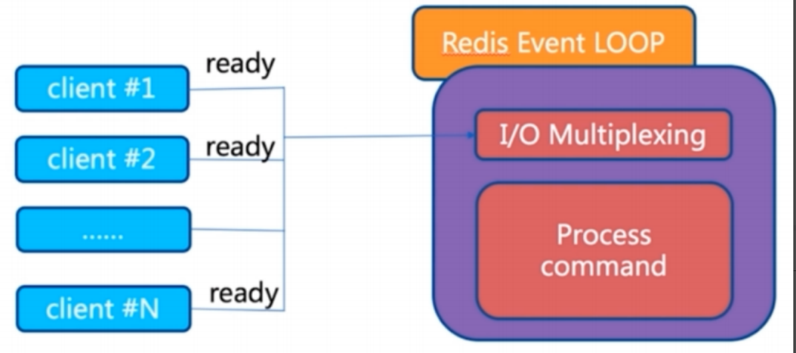

注意事项:

- 一次只运行一条命令 
- 避免执行长(慢)命令:keys \*, flushall, flushdb, slow lua script, mutil/exec, operate bigvalue(collection)
- 其实不是单线程: 早期版本是单进程单线程,3.0 版本后实际还有其它的线程, 实现特定功能,如: fysnc file descriptor,close file descriptor

### 1.1.5 Redis 应用场景
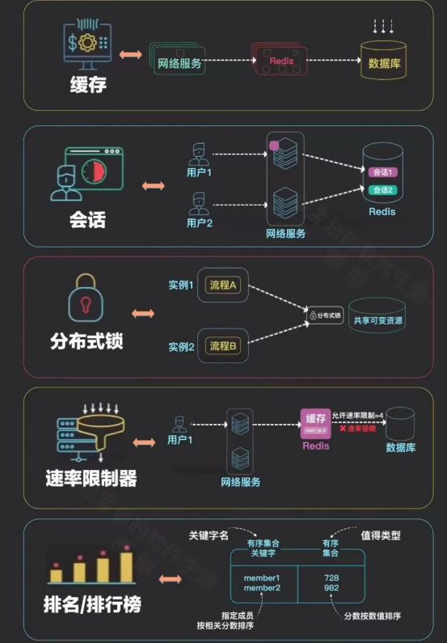

- 缓存：缓存 RDBMS 中数据,比如网站的查询结果、商品信息、微博、新闻、消息
- Session 共享：实现Web集群中的多服务器间的session共享
- 计数器：商品访问排行榜、浏览数、粉丝数、关注、点赞、评论等和次数相关的数值统计场景
- 社交：朋友圈、共同好友、可能认识他们等
- 地理位置: 基于地理信息系统 GIS（Geographic Information System)实现摇一摇、附近的人、外卖等功能
- 消息队列：ELK 等日志系统缓存、业务的订阅/发布系统

### 1.1.6 缓存实现流程

数据更新操作流程


数据读操作流程

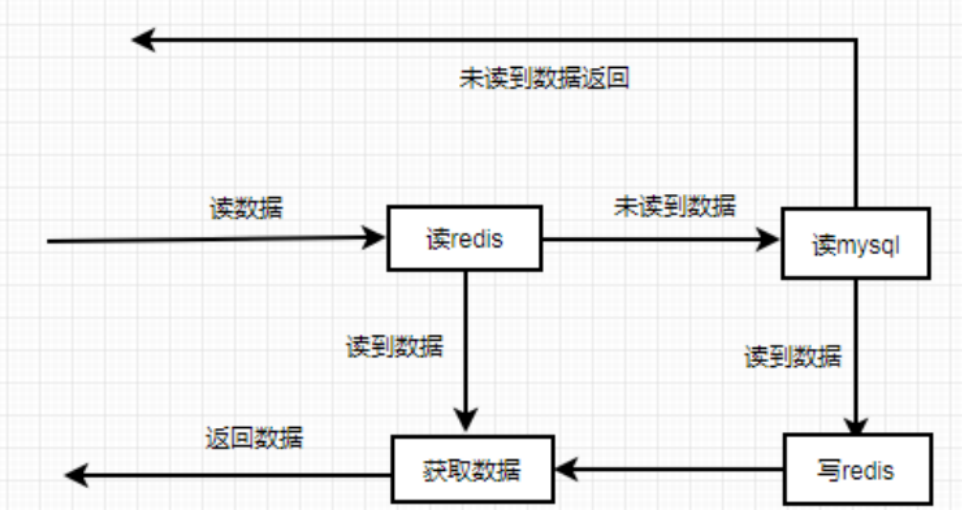

### 1.1.7 缓存穿透,缓存击穿和缓存雪崩
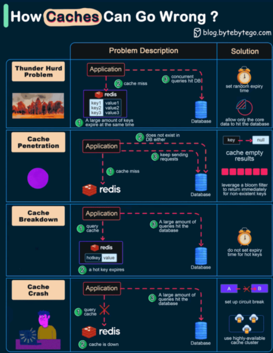
#### 1.1.7.1 缓存穿透 Cache Penetration
缓存穿透是指缓存和数据库中都没有的数据，而用户不断发起请求，比如： 发起为 id 为 “-1” 的数据或 id

为特别大不存在的数据。

这时的用户很可能是攻击者，攻击会导致数据库压力过大。

解决方法：

- 接口层增加校验，如用户鉴权校验，id 做基础校验，id<=0 的直接拦截

- 从缓存取不到的数据，在数据库中也没有取到，这时也可以将 key-value 对写为 key-null，缓存有效时间可以设置短点，如 30 秒（设置太长会导致正常情况也没法使用）。这样可以防止攻击用户反复用同一个 id 暴力攻击
#### 1.1.7.2 缓存击穿 Cache breakdown

缓存击穿是指缓存中没有但数据库中有的数据，比如：热点数据的缓存时间到期后，这时由于并发用户

特别多，同时读缓存没读到数据，又同时去数据库去取数据，引起数据库压力瞬间增大，造成过大压力

解决方法：

- 设置热点数据永远不过期。

#### 1.1.7.3 缓存雪崩 Thunder Hurd Problem

缓存雪崩是指缓存中数据大批量到过期时间，而查询数据量巨大，引起数据库压力过大甚至down机。和

缓存击穿不同的是，缓存击穿指并发查同一条数据，缓存雪崩是不同数据都过期了，很多数据都查不到

从而查数据库。

解决方法：

- 缓存数据的过期时间设置随机，防止同一时间大量数据过期现象发生

- 如果缓存数据库是分布式部署，将热点数据均匀分布在不同搞得缓存数据库中

- 设置热点数据永远不过期

#### 1.1.7.4 缓存宕机 crash

Redis 缓存服务宕机，造成 缓存服务失效

解决方法：Redis 高可用集群
### 1.1.8 Pipeline 流水线
Redis 客户端执行一条命令分6个过程：

发送命令 ---> 网络传输 ---> 命令排队 ---> 命令执行 ---> 网络传输 ---> 返回结果

这个过程称为 Round trip time(简称RTT, 往返时间)，mget,mset 指令可以一次性的批量对多个数据的执行操作,所以有效节约了 RTT

但大部分命令（如 hgetall）不支持批量操作，需要消耗 N 次 RTT ，利用 Pipeline 技术可以解决这一问题

未使用 pipeline 执行 N 条命令如下图

使用了 pipeline 执行 N 条命令如下图
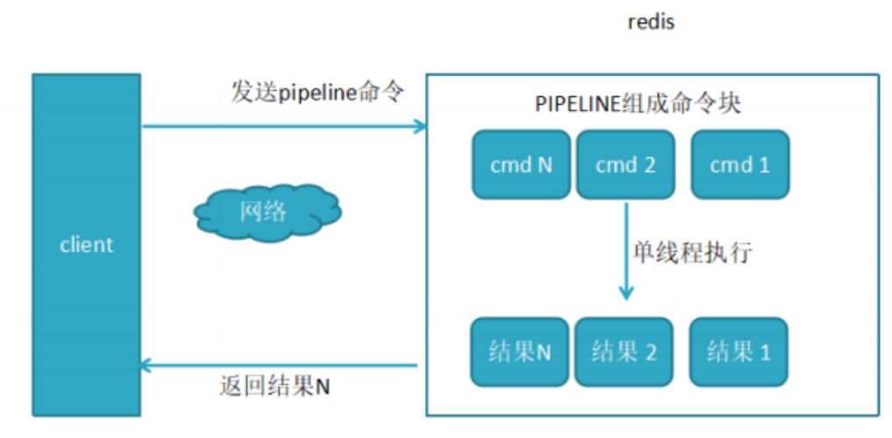
以上对比结果说明在使用 Pipeline 执行时速度比逐条执行要快，特别是客户端与服务端的网络延迟越大，性能体能越明显。
## 1.2 Redis 安装

官方安装说明

https://redis.io/docs/getting-started/installation/

安装方法

1. 包安装 deb、rpm....
2. 二进制安装
3. 源码编译
4. 容器运行

### 1.2.1 包安装 Redis
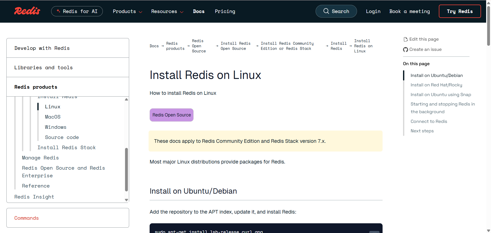

#### 1.2.1.1 Ubuntu 安装 Redis

范例：Ubuntu 2404 安装 Redis

https://redis.io/docs/latest/operate/oss_and_stack/install/install-redis/install-redis-on-linux/

~~~bash
# 配置官方的软件源，安装最新的版本
# 如果你是 root 用户，可以不用加 sudo
sudo apt-get install lsb-release curl gpg
curl -fsSL https://packages.redis.io/gpg | sudo gpg --dearmor -o /usr/share/keyrings/redis-archive-keyring.gpg
sudo chmod 644 /usr/share/keyrings/redis-archive-keyring.gpg
echo "deb [signed-by=/usr/share/keyrings/redis-archive-keyring.gpg] https://packages.redis.io/deb $(lsb_release -cs) main" | sudo tee /etc/apt/sources.list.d/redis.list
sudo apt-get update
sudo apt-get install -y redis

21:49:02 root@redis01:~# apt list redis 
Listing... Done
redis/noble,noble,now 6:8.4.0-1rl1~noble1 all [installed]
N: There are 35 additional versions. Please use the '-a' switch to see them.
21:50:03 root@redis01:~# 

# 安装完成后会自动生成一个 redis 用户
21:48:52 root@redis01:~# id redis
uid=111(redis) gid=111(redis) groups=111(redis)

# 并且会自动启动
21:48:55 root@redis01:~# systemctl status redis 
● redis-server.service - Advanced key-value store
     Loaded: loaded (/usr/lib/systemd/system/redis-server.service; enabled; preset: enabled)
     Active: active (running) since Sat 2025-11-29 21:48:41 CST; 20s ago
       Docs: http://redis.io/documentation,
             man:redis-server(1)
   Main PID: 2359 (redis-server)
     Status: "Ready to accept connections"
      Tasks: 7 (limit: 2210)
     Memory: 4.8M (peak: 5.3M)
        CPU: 268ms
     CGroup: /system.slice/redis-server.service
             └─2359 "/usr/bin/redis-server 127.0.0.1:6379"

Nov 29 21:48:41 redis01 systemd[1]: Starting redis-server.service - Advanced key-value store...
Nov 29 21:48:41 redis01 systemd[1]: Started redis-server.service - Advanced key-value store.
21:49:02 root@redis01:~# 
~~~

范例：Ubuntu 2204 安装 Redis
```bash
[root@ubuntu2204 ~]#curl -fsSL https://packages.redis.io/gpg | sudo gpg --dearmor -o /usr/share/keyrings/redis-archive-keyring.gpg

[root@ubuntu2204 ~]#echo "deb [signed-by=/usr/share/keyrings/redis-archive-keyring.gpg] https://packages.redis.io/deb $(lsb_release -cs) main" | sudo tee

/etc/apt/sources.list.d/redis.list

[root@ubuntu2204 ~]#ls /etc/apt/sources.list.d

redis.list

[root@ubuntu2204 ~]#cat /etc/apt/sources.list.d/redis.list

deb [signed-by=/usr/share/keyrings/redis-archive-keyring.gpg]
https://packages.redis.io/deb jammy main

[root@ubuntu2204 ~]#apt update
[root@ubuntu2204 ~]#apt list -a redis

正在列表... 完成

redis/jammy,jammy,6:7.2.4-1rl1~jammy1 all

redis/jammy,jammy 6:7.2.3-1rl1~jammy1 all

redis/jammy,jammy 6:7.2.2-1rl1~jammy1 all

redis/jammy,jammy 6:7.2.1-1rl1~jammy1 all

redis/jammy,jammy 6:7.2.0-1rl1~jammy1 all

redis/jammy,jammy 6:7.0.15-1rl1~jammy1 all

redis/jammy,jammy 6:7.0.14-1rl1~jammy1 all

redis/jammy,jammy 6:7.0.13-1rl1~jammy1 all

redis/jammy,jammy 6:7.0.12-1rl1~jammy1 all

redis/jammy,jammy 6:7.0.11-1rl1~jammy1 all

redis/jammy,jammy 6:7.0.10-1rl1~jammy1 all

redis/jammy,jammy 6:7.0.9-1rl1~jammy1 all

redis/jammy,jammy 6:7.0.8-1rl1~jammy1 all

redis/jammy,jammy 6:7.0.7-1rl1~jammy1 all

redis/jammy,jammy 6:7.0.6-1rl1~jammy1 all

redis/jammy,jammy 6:7.0.5-1rl1~jammy1 all

redis/jammy,jammy 6:7.0.4-1rl1~jammy1 all

redis/jammy,jammy 6:7.0.3-1rl1~jammy1 all

redis/jammy,jammy 6:7.0.2-1rl1~jammy1 all

redis/jammy,jammy 6:7.0.1-1rl1~jammy1 all

redis/jammy,jammy 6:7.0.0-1rl1~jammy1 all

redis/jammy,jammy 6:6.2.14-1rl1~jammy1 all

redis/jammy,jammy 6:6.2.13-1rl1~jammy1 all

redis/jammy,jammy 6:6.2.12-1rl1~jammy1 all

redis/jammy,jammy 6:6.2.11-1rl1~jammy1 all

redis/jammy,jammy 6:6.2.10-1rl1~jammy1 all

redis/jammy,jammy 6:6.2.9-1rl1~jammy1 all

redis/jammy,jammy 6:6.2.8-1rl1~jammy1 all

redis/jammy,jammy 6:6.2.7-1rl1~jammy1 all

redis/jammy,jammy 6:6.0.20-1rl1~jammy1 all

redis/jammy,jammy 6:6.0.19-1rl1~jammy1 all

redis/jammy,jammy 6:6.0.18-1rl1~jammy1 all

redis/jammy,jammy 6:6.0.17-1rl1~jammy1 all

redis/jammy 5:6.0.16-1ubuntu1 all

#安装最新版

[root@ubuntu2204 ~]#apt -y install redis

#指定版本安装，注意：因为依赖关系可能会失败

[root@ubuntu2204 ~]#apt -y install redis=6:7.2.4-1rl1~jammy1
```
范例：内置仓库
```bash
[root@ubuntu2204 ~]#apt list redis

正在列表... 完成

redis/jammy 5:6.0.16-1ubuntu1 all

[root@ubuntu2004 ~]#apt list redis

正在列表... 完成

redis/focal-security,focal-updates 5:5.0.7-2ubuntu0.1 all

N: 还有 1 个版本。请使用 -a 选项来查看它(他们)。

[root@ubuntu2004 ~]#apt -y install redis

[root@ubuntu2004 ~]#pstree -p|grep redis

          |-redis-server(1330)-+-{redis-server}(1331)
          |                   |-{redis-server}(1332)

          |                    `-{redis-server}(1333)

[root@ubuntu2004 ~]#ss -ntll

State           Recv-Q   Send-Q     Local Address:Port   Peer Address:Port    

      Process          

LISTEN           0        128            127.0.0.1:6010         0.0.0.0:*      

LISTEN           0        511            127.0.0.1:6379         0.0.0.0:*      

LISTEN           0        4096       127.0.0.53%lo:53           0.0.0.0:*      

LISTEN           0        128              0.0.0.0:22           0.0.0.0:*      

LISTEN           0        128               [::1]:6010           [::]:*      

LISTEN           0        511               [::1]:6379           [::]:*      

LISTEN           0        128                 [::]:22             [::]:*
```
#### 1.2.1.2 Centos 安装 redis

```bash
#CentOS 8 由系统源提供
[root@centos8 ~]#dnf info redis

#在CentOS7系统上需要安装EPEL源
[root@centos7 ~]#yum info redis

[root@centos8 ~]#dnf -y install redis
[root@centos8 ~]#systemctl enable --now redis
[root@centos8 ~]#ss -tnl
State       Recv-Q       Send-Q       Local Address:Port           Peer 
Address:Port 
LISTEN       0             128                 0.0.0.0:22                   
0.0.0.0:*     
LISTEN       0             128               127.0.0.1:6379                 
0.0.0.0:*     
LISTEN       0             128                   [::]:22                     
[::]:*     
[root@centos8 ~]#pstree -p|grep redis
           |-redis-server(3383)-+-{redis-server}(3384)
           |                   |-{redis-server}(3385)
           |                    `-{redis-server}(3386)
[root@centos8 ~]#redis-cli 
127.0.0.1:6379> ping
PONG
```

### 1.2.2 编译安装 redis

Redis 源码包官方下载链接：

http://download.redis.io/releases/

#### 1.2.2.1 编译安装
官方安装方法
https://redis.io/docs/latest/operate/oss_and_stack/install/build-stack/ubuntu-noble/

https://redis.io/docs/getting-started/installation/install-redis-from-source/
8.x 编译说明
https://redis.io/docs/latest/operate/oss_and_stack/install/build-stack/ubuntu-noble/
##### 1.2.2.1.1 源码编译安装过程
###### 1.2.2.1.1.1 Ubuntu24.04 编译安装 redis-7.0.0
~~~bash
# 下载源码
root@node2-112:~ 15:38:29 # wget https://download.redis.io/releases/redis-7.0.0.tar.gz 
root@node2-112:~ 15:46:06 # tar xf redis-7.0.0.tar.gz 
root@node2-112:~ 15:46:31 # cd redis-7.0.0/
root@node2-112:~/redis-7.0.0 15:46:33 # 


# 安装依赖
root@node2-112:~ 15:38:43 # apt update && apt -y install make gcc libjemalloc-dev libsystemd-dev


# 编译
# 如果支持 systemd,需要执行下面
[root@centos8 redis-6.2.4]#make -j 2 USE_SYSTEMD=yes PREFIX=/apps/redis install
root@node2-112:~/redis-8.2.0 15:46:33 # make -j 2 USE_SYSTEMD=yes PREFIX=/apps/redis install 
# 如果不支持 systemd，执行下面
root@node2-112:~/redis-8.2.0 15:46:33 # make -j 2 PREFIX=/apps/redis install

# 配置环境变量
root@node2-112:~ 15:50:37 # cat /etc/profile.d/redis.sh
############################
# File Name: /etc/profile.d/redis.sh
# Author: xuruizhao
# mail: xuruizhao00@163.com
# Created Time: Wed 15 Oct 2025 03:49:52 PM CST
############################
#!/bin/bash
export PATH=$PATH:/apps/redis/bin
root@node2-112:~ 15:50:46 # source /etc/profile.d/redis.sh
root@node2-112:~ 15:50:50 # echo $PATH
/usr/local/prometheus/bin:/usr/local/node_exporter/bin:/usr/local/sbin:/usr/local/bin:/usr/sbin:/usr/bin:/sbin:/bin:/usr/games:/usr/local/games:/snap/bin:/apps/redis/bin
root@node2-112:~ 15:50:53 #

# 目录结构
root@prometheus-221:~ 15:51:53 # tree /apps/redis/
/apps/redis/
├── bin
│   ├── redis-benchmark
│   ├── redis-check-aof -> redis-server
│   ├── redis-check-rdb -> redis-server
│   ├── redis-cli
│   ├── redis-sentinel -> redis-server
│   └── redis-server

5 directories, 7 files
root@prometheus-221:~ 15:52:05 #

# 准备相关目录和配置文件
root@prometheus-221:~ 15:51:53 # mkdir /apps/redis/{etc,log,data,run} #创建配置文件、日志、数据等目录
root@prometheus-221:~ 15:51:53 #  cp redis.conf /apps/redis/etc/
~~~

###### 1.2.2.1.1.1 Ubuntu24.04 编译安装 redis-8.2.1/8.0.2
```bash
# 1、安装依赖
22:11:29 root@redis02:~# apt install -y --no-install-recommends gcc make ca-certificates wget dpkg-dev g++ libc6-dev libssl-dev git cmake python3 python3-pip python3-venv python3-dev unzip rsync clang automake  autoconf libtool pkg-config libsystemd-dev

# 2、下载官方源码包（Redis 官网稳定版地址，速度快且安全）
22:16:48 root@redis02:~# version=8.2.1
22:18:32 root@redis02:~# wget -O redis-$version.tar.gz https://github.com/redis/redis/archive/refs/tags/$version.tar.gz

# 3、证源码包完整性（可选但推荐，避免下载损坏）
# 先获取官网 SHA256 校验值（官网地址：https://download.redis.io/releases/）
# 本地计算校验值并对比（输出需与官网一致）
10:28:07 root@redis02:~# sha256sum  redis-8.2.1.tar.gz 
517e47ebce911ebbed2fe86047a871d9cbeadc7d2de15ffca37a1540eb4d588f  redis-8.2.1.tar.gz
10:28:19 root@redis02:~#

# 4、解压源码包
22:24:44 root@redis02:~# tar xf redis-8.2.1.tar.gz 
22:24:50 root@redis02:~# cd redis-8.2.1/
22:24:53 root@redis02:~/redis-8.2.1# ls
00-RELEASENOTES  CODE_OF_CONDUCT.md  INSTALL      MANIFESTO  redis.conf              runtest            runtest-sentinel  src     utils
BUGS             CONTRIBUTING.md     LICENSE.txt  modules    REDISCONTRIBUTIONS.txt  runtest-cluster    SECURITY.md       tests
codecov.yml      deps                Makefile     README.md  redis-full.conf         runtest-moduleapi  sentinel.conf     TLS.md
22:24:55 root@redis02:~/redis-8.2.1#

# 5、编译变量配置
# 源码编译安装 redis 8+ 版本，需要配置好环境变量，后面直接 make 即可
# 在 redis 8.0+ 版本的源码包中，已经有 编译好的 Makefile 文件
# 需要声明的变量
# 这些变量如果声明为了 yes，那么在安装时需要再次连接 GitHub 下载源码，在下文会说明这些变量的作用
BUILD_TLS=yes
BUILD_WITH_MODULES=yes
INSTALL_RUST_TOOLCHAIN=yes
DISABLE_WERRORS=yes
# 在非生产环境下，我们暂时不需要这些完整的功能，这里我们不全部设置为 yes
BUILD_TLS=no
BUILD_WITH_MODULES=no
INSTALL_RUST_TOOLCHAIN=no
DISABLE_WERRORS=yes
22:30:45 root@redis02:~/redis-8.2.1# export BUILD_TLS=no BUILD_WITH_MODULES=no INSTALL_RUST_TOOLCHAIN=no DISABLE_WERRORS=yes
22:31:14 root@redis02:~/redis-8.2.1# env
# 避坑提示：
# - 若服务器内存 ≤ 2GB，建议手动指定线程数（如 -j 2），避免内存不足编译崩溃
# - 若不需要 TLS 或模块，可将对应变量设为 no（如 BUILD_TLS=no），编译更快

# 6、编译
22:31:17 root@redis02:~/redis-8.2.1# make -j "$(nproc)" all
# 编译后单元测试（可选，验证功能完整性）

# 执行 Redis 内置单元测试（约 5-10 分钟，确保核心功能正常）
make test
# 测试通过标志：最后输出 "All tests passed without errors!"
# 若测试失败：大概率是 TLS 依赖或 Rust 环境问题，可重新安装 libssl-dev 后重试，或忽略（核心功能通常不受影响）

# 安装到默认目录 /usr/local/bin（已在系统 PATH 中，任意目录可执行 redis-server/redis-cli）
make install
# 验证
22:39:02 root@redis02:~/redis-8.2.1# ./src/redis-server --version
Redis server v=8.2.1 sha=00000000:1 malloc=jemalloc-5.3.0 bits=64 build=f636a2be442c8259
22:39:13 root@redis02:~/redis-8.2.1# ./src/redis-cli --version
redis-cli 8.2.1
22:39:20 root@redis02:~/redis-8.2.1#


# 启动 redis
22:44:29 root@redis02:~/redis-8.2.1# ./src/redis-server 
14009:C 29 Nov 2025 22:49:04.194 # WARNING Memory overcommit must be enabled! Without it, a background save or replication may fail under low memory condition. Being disabled, it can also cause failures without low memory condition, see https://github.com/jemalloc/jemalloc/issues/1328. To fix this issue add 'vm.overcommit_memory = 1' to /etc/sysctl.conf and then reboot or run the command 'sysctl vm.overcommit_memory=1' for this to take effect.
14009:C 29 Nov 2025 22:49:04.195 * oO0OoO0OoO0Oo Redis is starting oO0OoO0OoO0Oo
14009:C 29 Nov 2025 22:49:04.195 * Redis version=8.2.1, bits=64, commit=00000000, modified=1, pid=14009, just started
14009:C 29 Nov 2025 22:49:04.195 # Warning: no config file specified, using the default config. In order to specify a config file use ./src/redis-server /path/to/redis.conf
14009:M 29 Nov 2025 22:49:04.197 * Increased maximum number of open files to 10032 (it was originally set to 1024).
14009:M 29 Nov 2025 22:49:04.197 * monotonic clock: POSIX clock_gettime
                _._                                                  
           _.-``__ ''-._                                             
      _.-``    `.  `_.  ''-._           Redis Open Source            
  .-`` .-```.  ```\/    _.,_ ''-._      8.2.1 (00000000/1) 64 bit
 (    '      ,       .-`  | `,    )     Running in standalone mode
 |`-._`-...-` __...-.``-._|'` _.-'|     Port: 6379
 |    `-._   `._    /     _.-'    |     PID: 14009
  `-._    `-._  `-./  _.-'    _.-'                                   
 |`-._`-._    `-.__.-'    _.-'_.-'|                                  
 |    `-._`-._        _.-'_.-'    |           https://redis.io       
  `-._    `-._`-.__.-'_.-'    _.-'                                   
 |`-._`-._    `-.__.-'    _.-'_.-'|                                  
 |    `-._`-._        _.-'_.-'    |                                  
  `-._    `-._`-.__.-'_.-'    _.-'                                   
      `-._    `-.__.-'    _.-'                                       
          `-._        _.-'                                           
              `-.__.-'                                               

14009:M 29 Nov 2025 22:49:04.205 * Server initialized
14009:M 29 Nov 2025 22:49:04.205 * Ready to accept connections tcp


22:49:23 root@redis02:~# ss -tunlp  |grep 6379
tcp   LISTEN 0      511          0.0.0.0:6379      0.0.0.0:*    users:(("redis-server",pid=14009,fd=8))                
tcp   LISTEN 0      511             [::]:6379         [::]:*    users:(("redis-server",pid=14009,fd=9))                
22:49:30 root@redis02:~#
```
##### 1.2.2.1.2 源码编译安装的参数含义
|变量名|核心作用|详细说明与使用场景|
|---|---|---|
|`BUILD_TLS=yes`|启用 TLS/SSL 加密功能|- 让 Redis 支持加密连接（`redis-cli -tls`），保护数据传输安全（如跨网络访问场景）；<br><br>- 编译时会链接 OpenSSL 库（需提前安装 `libssl-dev`）；<br><br>- 生产环境必开（尤其是 Redis 暴露在公网或跨机房访问时），避免明文传输泄露数据。|
|`BUILD_WITH_MODULES=yes`|编译并启用 Redis 模块系统（Module API）|- 允许 Redis 加载第三方扩展模块（如 RedisSearch、RedisJSON、RedisGraph 等）；<br><br>- 编译后 Redis 可通过 `loadmodule` 配置或命令动态加载模块，扩展核心功能（如全文检索、JSON 解析）；<br><br>- 开发 / 扩展场景推荐开启，纯基础缓存场景可关闭（减少编译体积）。|
|`INSTALL_RUST_TOOLCHAIN=yes`|自动安装 Rust 工具链（用于编译 Redis 核心依赖或模块）|- Redis 从 7.0+ 开始，部分核心功能（如 `redis-stack` 相关模块、新数据结构优化）依赖 Rust 编译；<br><br>- 声明该变量后，编译脚本会自动下载、安装适配版本的 Rust 工具链（无需手动安装）；<br><br>- 依赖：需网络通畅（从 Rust 官方源下载），适合首次编译或无 Rust 环境的场景。|
|`DISABLE_WERRORS=yes`|禁用「警告视为错误」的编译规则|- 默认情况下，Redis 编译会将所有编译器警告（`warning`）视为错误（`error`），导致编译中断；<br><br>- 声明该变量后，仅显示警告，不中断编译（适用于：系统依赖版本略高 / 略低、自定义编译参数导致的非致命警告）；<br><br>- 注意：仅用于临时规避警告问题，生产环境建议排查警告根源（避免潜在稳定性风险）。|
##### 1.2.2.1.3 相关参数适用场景
| 变量组合                         | 适用场景                     |
| ---------------------------- | ------------------------ |
| 全部 `yes`                     | 生产环境（需 TLS 加密、模块扩展、兼容警告） |
| `BUILD_TLS=yes` 仅开启          | 仅需加密连接（无模块需求）            |
| `BUILD_WITH_MODULES=yes` 仅开启 | 需加载第三方模块（如 RedisJSON）    |
| `DISABLE_WERRORS=yes` 仅开启    | 编译时出现非致命警告，需临时规避         |
##### 1.2.2.1.4 `make -j "$(nproc)" all` 命令解析
>这条命令是 **Redis 源码编译的高效执行命令**，核心作用是「多线程并行编译所有模块」，大幅缩短编译时间

| 部分              | 作用与详细说明                                                                                                                                                                                          |
| --------------- | ------------------------------------------------------------------------------------------------------------------------------------------------------------------------------------------------ |
| `make`          | 编译构建工具（读取 Redis 源码中的 `Makefile` 配置，执行编译流程）                                                                                                                                                       |
| `-j "$(nproc)"` | 并行编译核心参数：<br><br>- `-j`（全称 `--jobs`）：指定编译时的并行线程数；<br><br>- `$(nproc)`：Linux 系统命令，动态获取当前服务器的 **CPU 核心数**（如 4 核服务器返回 `4`）；<br><br>- 组合效果：自动根据 CPU 核心数分配并行线程（4 核则同时启动 4 个编译任务），最大化利用 CPU 资源，缩短编译时间。 |
| `all`           | Makefile 中的「目标（target）」：<br><br>- 表示编译 Redis 源码中的「所有模块」（包括 `redis-server`、`redis-cli`、`redis-benchmark` 等核心工具）；<br><br>- Redis 的 `Makefile` 默认目标就是 `all`，因此可省略不写（直接 `make -j "$(nproc)"` 效果相同）。  |

```bash
# `$(nproc)` 动态适配服务器 CPU 核心数，避免手动指定线程数（如 `-j 4`）导致的资源浪费或过载；
22:44:17 root@redis02:~/redis-8.2.1# echo $(nproc)
2
22:44:29 root@redis02:~/redis-8.2.1# 
```

- 为什么需要使用 $(nproc) 而不使用固定数字？
	- 固定数字（如 `-j 8`）：若服务器 CPU 核心数少于 8（如 4 核），会导致线程切换频繁，反而降低效率；若核心数多于 8（如 16 核），则未充分利用资源；
	- `$(nproc)`：自动匹配硬件，无需手动修改，兼容性更强（如在虚拟机、物理机、云服务器上均可正常使用）。
- 与之前提到的编译变量如何结合
	- 若需启用 `BUILD_TLS=yes`、`BUILD_WITH_MODULES=yes` 等特性，需在 `make` 前声明变量
			`make BUILD_TLS=yes BUILD_WITH_MODULES=yesINSTALL_RUST_TOOLCHAIN=yes -j "$(nproc)" all

#### 1.2.2.2 前台启动 redis

redis-server 是 redis 服务器端的主程序

```shell
10:30:13 root@redis02:~# redis-8.2.1/src/redis-server --help
Usage: ./redis-server [/path/to/redis.conf] [options] [-]
       ./redis-server - (read config from stdin)
       ./redis-server -v or --version
       ./redis-server -h or --help
       ./redis-server --test-memory <megabytes>
       ./redis-server --check-system

Examples:
       ./redis-server (run the server with default conf)
       echo 'maxmemory 128mb' | ./redis-server -
       ./redis-server /etc/redis/6379.conf
       ./redis-server --port 7777
       ./redis-server --port 7777 --replicaof 127.0.0.1 8888
       ./redis-server /etc/myredis.conf --loglevel verbose -
       ./redis-server /etc/myredis.conf --loglevel verbose

Sentinel mode:
       ./redis-server /etc/sentinel.conf --sentinel
10:30:30 root@redis02:~#

```

前台启动

```bash
10:30:30 root@redis02:~# redis-8.2.1/src/redis-server 
14773:C 30 Nov 2025 10:30:55.641 * oO0OoO0OoO0Oo Redis is starting oO0OoO0OoO0Oo
14773:C 30 Nov 2025 10:30:55.641 * Redis version=8.2.1, bits=64, commit=00000000, modified=1, pid=14773, just started
14773:C 30 Nov 2025 10:30:55.641 # Warning: no config file specified, using the default config. In order to specify a config file use redis-8.2.1/src/redis-server /path/to/redis.conf
14773:M 30 Nov 2025 10:30:55.645 * Increased maximum number of open files to 10032 (it was originally set to 1024).
14773:M 30 Nov 2025 10:30:55.645 * monotonic clock: POSIX clock_gettime
                _._                                                  
           _.-``__ ''-._                                             
      _.-``    `.  `_.  ''-._           Redis Open Source            
  .-`` .-```.  ```\/    _.,_ ''-._      8.2.1 (00000000/1) 64 bit
 (    '      ,       .-`  | `,    )     Running in standalone mode
 |`-._`-...-` __...-.``-._|'` _.-'|     Port: 6379
 |    `-._   `._    /     _.-'    |     PID: 14773
  `-._    `-._  `-./  _.-'    _.-'                                   
 |`-._`-._    `-.__.-'    _.-'_.-'|                                  
 |    `-._`-._        _.-'_.-'    |           https://redis.io       
  `-._    `-._`-.__.-'_.-'    _.-'                                   
 |`-._`-._    `-.__.-'    _.-'_.-'|                                  
 |    `-._`-._        _.-'_.-'    |                                  
  `-._    `-._`-.__.-'_.-'    _.-'                                   
      `-._    `-.__.-'    _.-'                                       
          `-._        _.-'                                           
              `-.__.-'                                               

14773:M 30 Nov 2025 10:30:55.663 * Server initialized
14773:M 30 Nov 2025 10:30:55.664 * Ready to accept connections tcp


10:31:21 root@redis02:~# ss -tunlp | grep 6379
tcp   LISTEN 0      511          0.0.0.0:6379      0.0.0.0:*    users:(("redis-server",pid=14773,fd=8))                
tcp   LISTEN 0      511             [::]:6379         [::]:*    users:(("redis-server",pid=14773,fd=9))                

10:31:42 root@redis02:~# redis-8.2.1/src/redis-cli
127.0.0.1:6379>
```

启动 Redis 多实例

```bash
# Redis 启动多实例
10:33:19 root@redis02:~# redis-8.2.1/src/redis-server --port 6380
14865:C 30 Nov 2025 10:33:37.126 * oO0OoO0OoO0Oo Redis is starting oO0OoO0OoO0Oo
14865:C 30 Nov 2025 10:33:37.126 * Redis version=8.2.1, bits=64, commit=00000000, modified=1, pid=14865, just started
14865:C 30 Nov 2025 10:33:37.126 * Configuration loaded
14865:M 30 Nov 2025 10:33:37.128 * Increased maximum number of open files to 10032 (it was originally set to 1024).
14865:M 30 Nov 2025 10:33:37.128 * monotonic clock: POSIX clock_gettime
                _._                                                  
           _.-``__ ''-._                                             
      _.-``    `.  `_.  ''-._           Redis Open Source            
  .-`` .-```.  ```\/    _.,_ ''-._      8.2.1 (00000000/1) 64 bit
 (    '      ,       .-`  | `,    )     Running in standalone mode
 |`-._`-...-` __...-.``-._|'` _.-'|     Port: 6380
 |    `-._   `._    /     _.-'    |     PID: 14865
  `-._    `-._  `-./  _.-'    _.-'                                   
 |`-._`-._    `-.__.-'    _.-'_.-'|                                  
 |    `-._`-._        _.-'_.-'    |           https://redis.io       
  `-._    `-._`-.__.-'_.-'    _.-'                                   
 |`-._`-._    `-.__.-'    _.-'_.-'|                                  
 |    `-._`-._        _.-'_.-'    |                                  
  `-._    `-._`-.__.-'_.-'    _.-'                                   
      `-._    `-.__.-'    _.-'                                       
          `-._        _.-'                                           
              `-.__.-'                                               

14865:M 30 Nov 2025 10:33:37.135 * Server initialized
14865:M 30 Nov 2025 10:33:37.135 * Ready to accept connections tcp

10:34:27 root@redis02:~# ss -tunlp | grep -E  "(6379)|(6380)"
tcp   LISTEN 0      511          0.0.0.0:6380      0.0.0.0:*    users:(("redis-server",pid=14865,fd=8))                
tcp   LISTEN 0      511          0.0.0.0:6379      0.0.0.0:*    users:(("redis-server",pid=14773,fd=8))                
tcp   LISTEN 0      511             [::]:6380         [::]:*    users:(("redis-server",pid=14865,fd=9))                
tcp   LISTEN 0      511             [::]:6379         [::]:*    users:(("redis-server",pid=14773,fd=9))  

10:34:58 root@redis02:~# redis-8.2.1/src/redis-cli -p 6380
127.0.0.1:6380>
```

#### 1.2.2.3 消除 redis 启动的警告

前面直接启动 Redis 时有三个 Waring 信息,可以用下面方法消除告警,但非强制消除

##### 1.2.2.3.1 TCP backlog

```ini
WARNING: The TCP backlog setting of 511 cannot be enforced because /proc/sys/net/core/somaxconn is set to the lower value of 128.
```

Tcp backlog 是指 TCP 的第三次握手服务器端收到客户端 ack 确认号之后到服务器用 Accept 函数处理请求前的队列长度，即全连接队列

```bash
# 半连接对列数量
22:54:23 root@redis02:~# cat /proc/sys/net/ipv4/tcp_max_syn_backlog
128
# 全连接对列数量
22:57:09 root@redis02:~# cat /proc/sys/net/core/somaxconn
4096
22:57:16 root@redis02:~#
```

注意：Ubuntu22.04 默认值满足要求，不再有此告警

```bash
root@prometheus-221:~ 16:01:43 # cat /proc/sys/net/ipv4/tcp_max_syn_backlog
256
root@prometheus-221:~ 16:01:44 #

#修改配置
#vim /etc/sysctl.conf
net.core.somaxconn = 1024
#sysctl -p
```

##### 1.2.2.3.2 overcommit_memory

```ini
WARNING overcommit_memory is set to 0! Background save may fail under low memory condition. To fix this issue add 'vm.overcommit_memory = 1' to /etc/sysctl.conf and then reboot or run the command 'sysctl vm.overcommit_memory=1' for this to take effect.
```

内核参数说明:

```ini
内核参数 overcommit_memory 实现内存分配策略,可选值有三个：0、1、2
0 表示内核将检查是否有足够的可用内存供应用进程使用；如果有足够的可用内存，内存申请允许；否则内存申请失败，并把错误返回给应用进程
1 表示内核允许分配所有的物理内存，而不管当前的内存状态如何
2 表示内核允许分配超过所有物理内存和交换空间总和的内存
```

```shell
22:49:30 root@redis02:~# sysctl vm.overcommit_memory
vm.overcommit_memory = 0
22:51:06 root@redis02:~#

#修改
#vim /etc/sysctl.conf
vm.overcommit_memory = 1  #新版只允许1，不支持2
#sysctl -p
```

##### 1.2.2.3.3 transparent hugepage

```bash
WARNING you have Transparent Huge Pages (THP) support enabled in your kernel. This will create latency and memory usage issues with Redis. To fix this issue run the command 'echo never > /sys/kernel/mm/transparent_hugepage/enabled' as root, and add it to your /etc/rc.local in order to retain the setting after a reboot. Redis must be restarted after THP is disabled.
警告：您在内核中启用了透明大页面（THP,不同于一般4k内存页,而为2M）支持。 这将在 Redis 中造成延迟和内存使用问题。 要解决此问题，请以 root 用户身份运行命令 “echo never> /sys/kernel/mm/transparent_hugepage/enabled”，并将其添加到您的 /etc/rc.local 中，以便在重启后保留设置。禁用THP后，必须重新启动
```

注意：Ubuntu22.04+ 默认值满足要求，不再有此告警

范例: 

```bash
22:57:16 root@redis02:~# cat /sys/kernel/mm/transparent_hugepage/enabled
always [madvise] never
23:00:51 root@redis02:~#

#ubuntu开机配置
[root@ubuntu2004 ~]#cat /etc/rc.local 
#!/bin/bash
echo never > /sys/kernel/mm/transparent_hugepage/enabled
[root@ubuntu2004 ~]#chmod +x /etc/rc.local

#CentOS开机配置
[root@centos8 ~]#echo 'echo never > /sys/kernel/mm/transparent_hugepage/enabled' 
>> /etc/rc.d/rc.local 
[root@centos8 ~]#cat /etc/rc.d/rc.local
#!/bin/bash
# THIS FILE IS ADDED FOR COMPATIBILITY PURPOSES
#
# It is highly advisable to create own systemd services or udev rules
# to run scripts during boot instead of using this file.
#
# In contrast to previous versions due to parallel execution during boot
# this script will NOT be run after all other services.
#
# Please note that you must run 'chmod +x /etc/rc.d/rc.local' to ensure
# that this script will be executed during boot.
touch /var/lock/subsys/local
echo never > /sys/kernel/mm/transparent_hugepage/enabled
[root@centos8 ~]#chmod +x /etc/rc.d/rc.local
```

##### 1.2.2.3.4 打开文件数的 Warning
```ini
[root@ubuntu2404 ~]#/apps/redis/bin/redis-server /apps/redis/etc/redis.conf 
....
12169:M 31 Mar 2025 15:44:36.737 * Increased maximum number of open files to 
10032 (it was originally set to 1024).


[root@ubuntu2404 ~]#vim /etc/security/limits.conf

root soft nofile 20000

root hard nofile 20000

[root@ubuntu2404 ~]#reboot
```
#### 1.2.2.4 创建 redis 用户和设置数据目录权限及修改默认配置文件
##### 1.2.2.4.1 创建 Redis 专用用户和组

```bash
10:58:17 root@redis02:~# groupadd -r redis
11:04:13 root@redis02:~# useradd -r -s /sbin/nologin -g redis -d /var/lib/redis redis
11:04:18 root@redis02:~# getent passwd redis 
redis:x:999:988::/var/lib/redis:/sbin/nologin
11:04:23 root@redis02:~# 


root@prometheus-221:~ 16:08:24 # chown -R redis.redis /apps/redis/
root@prometheus-221:~ 16:08:43 # vim /apps/redis/etc/redis.conf 
#dir ./
dir /apps/redis/data
#pidfile /var/run/redis_6379.pid
pidfile /apps/redis/run/redis_6379.pid
# logfile 位置
logfile /apps/redis/log/6379.log
# bind 设置
bind 0.0.0.0 -::1
```
##### 1.2.2.4.2 调整 Redis 相关目录和文件权限
```bash
# 1、规范管理相关目录
11:09:47 root@redis02:~# mkdir -p /etc/redis          # 配置文件目录
mkdir -p /var/lib/redis      # 数据存储目录（RDB/AOF 文件）
mkdir -p /var/log/redis      # 日志目录
mkdir -p /var/run/redis      # PID 文件目录（进程标识）

# 2、调整核心目录权限（递归修改所有者为 redis:redis）
chown -R redis:redis /etc/redis          # 配置文件目录
chown -R redis:redis /var/lib/redis      # 数据存储目录
chown -R redis:redis /var/log/redis      # 日志目录
chown -R redis:redis /var/run/redis      # PID 目录

# 3、调整目录权限（确保 redis 用户可进入和操作）
chmod -R 750 /etc/redis          # 仅所有者（redis）可读写执行，组只读，其他无权限
chmod -R 750 /var/lib/redis
chmod -R 750 /var/log/redis
chmod -R 750 /var/run/redis

# 4、调整配置文件权限（仅 redis 用户可读写）
11:14:36 root@redis02:~# cp redis-8.2.1/redis.conf /etc/redis/
11:15:10 root@redis02:~# chmod 640 /etc/redis/redis.conf
11:15:41 root@redis02:~# ls -l /etc/redis/redis.conf
-rw-r----- 1 redis redis 111227 Nov 30 11:15 /etc/redis/redis.conf
11:15:43 root@redis02:~#
```

##### 1.2.2.4.3 修改 redis 配置文件
```bash
11:26:15 root@redis02:~# cat /etc/redis/redis.conf | grep -E "^(dir|logfile|protected-mode|requirepass|pidfile|logfile|bind|port)"
bind 0.0.0.0
protected-mode no
port 6379
pidfile /var/run/redis/redis_6379.pid
logfile "/var/log/redis/redis-server.log"
dir  /var/lib/redis
requirepass 123456

```

##### 1.2.2.4.4 protected-mode 配置参数解析
Redis 的 `protected-mode`（保护模式）是 **核心安全参数**，作用是 **防止 Redis 实例被公网未授权访问**，本质是 Redis 内置的「访问控制防护机制」，默认值为 `yes`（开启状态）。

###### 1.2.2.4.4.1 核心作用
当 Redis 暴露在公网（或非信任网络）时，保护模式会限制「无密码 + 绑定所有网卡」的危险配置，避免恶意攻击者直接连接并操作 Redis（如删数据、植入挖矿脚本等）。

###### 1.2.2.4.4.2 参数取值与行为说明

| 参数值                      | 核心行为                                                                                                                                                                                                                                                    | 适用场景                                                                                  |
| ------------------------ | ------------------------------------------------------------------------------------------------------------------------------------------------------------------------------------------------------------------------------------------------------- | ------------------------------------------------------------------------------------- |
| `protected-mode yes`（默认） | 仅允许以下两种访问方式，拒绝其他所有外部连接：<br><br>1. 本地回环地址（`127.0.0.1`/`::1`）访问；<br><br>2. 通过 `unix socket` 本地连接。<br><br>即使配置 `bind 0.0.0.0`（绑定所有网卡），外部机器也无法连接，除非同时满足：<br><br>- 配置了 `requirepass`（访问密码）；<br><br>或<br><br>- 明确在 `bind` 中指定了信任的 IP（如 `bind 192.168.1.100`）。 | 1. Redis 仅在本机使用（如同一服务器内应用调用）；<br><br>2. 未设置访问密码，且不想暴露到外部网络。                           |
| `protected-mode no`（关闭）  | 允许外部机器连接 Redis，不受「本地地址限制」，但需配合其他安全配置：<br><br>- 必须设置 `requirepass`（强密码）；<br><br>- 建议通过 `bind` 限制信任的 IP（如仅允许内网 IP `192.168.1.0/24`）；<br><br>- 结合防火墙开放 Redis 端口（如 6379）。                                                                                   | 1. 需要跨服务器访问 Redis（如应用服务器和 Redis 分离部署）；<br><br>2. Redis 暴露在公网（必须配密码 + TLS 加密 + 防火墙限制）。 |

###### 1.2.2.4.4.3 关键关联配置
`protected-mode` 的效果依赖其他配置，单独修改可能导致连接失败或安全风险：

1. **与 `bind` 联动**：
    
    - 若 `bind 127.0.0.1`（仅绑定本地）：无论 `protected-mode` 是 `yes` 还是 `no`，外部都无法连接（仅本地可用）；
    - 若 `bind 0.0.0.0`（绑定所有网卡）：`protected-mode yes` 会拒绝外部连接，`protected-mode no` 允许外部连接（需密码）。
2. **与 `requirepass` 联动**：
    
    - 关闭 `protected-mode no` 时，**必须设置 `requirepass`**！否则任何人都能连接 Redis 并执行任意命令（如 `FLUSHALL` 删所有数据）；
    - 开启 `protected-mode yes` 时，若设置了 `requirepass`，外部仍可通过密码连接（需 `bind 0.0.0.0`）。

###### 1.2.2.4.4.4 生产实际配置案例
```bash
# 1. 绑定所有网卡（允许外部访问）
bind 0.0.0.0

# 2. 关闭保护模式（允许外部连接）
protected-mode no

# 3. 设置强密码（必须！否则有安全风险）
requirepass StrongPass@2025

# 4. 配合 TLS 加密（跨网络访问必开）
tls-port 6380
tls-cert-file /etc/redis/redis-cert.pem
tls-key-file /etc/redis/redis-key.pem
```
###### 1.2.2.4.4.5 常见问题
1. **开启保护模式后，外部无法连接**：
    
    - 原因：`protected-mode yes` + `bind 0.0.0.0` + 未设密码，保护模式拒绝外部连接；
    - 解决方案：要么设密码（`requirepass`），要么关闭保护模式（`protected-mode no`），或在 `bind` 中添加信任的外部 IP。
2. **关闭保护模式后，仍无法连接**：
    
    - 检查 `bind` 是否绑定了所有网卡（`0.0.0.0`）；
    - 检查防火墙是否开放 Redis 端口（如 `ufw allow 6379/tcp`）；
    - 确认连接时输入了正确的密码（`redis-cli -a 密码`）。
3. **本地连接正常，外部连接提示「DENIED Redis is running in protected mode」**：
    
    - 原因：`protected-mode yes` + `bind 0.0.0.0` + 未设密码，保护模式拦截了外部连接；
    - 解决方案：关闭保护模式（`protected-mode no`）并设置密码。

#### 1.2.2.5 创建 redis 的 service 文件

```bash
要在 systemd 下运行 redis，您需要设置supervised systemd。

查看配置文件：

# If you run Redis from upstart or systemd, Redis can interact with your
# supervision tree. Options:
#   supervised no      - no supervision interaction
#   supervised upstart - signal upstart by putting Redis into SIGSTOP mode
#   supervised systemd - signal systemd by writing READY=1 to $NOTIFY_SOCKET
#   supervised auto    - detect upstart or systemd method based on
#                        UPSTART_JOB or NOTIFY_SOCKET environment variables
# Note: these supervision methods only signal "process is ready."
#       They do not enable continuous liveness pings back to your supervisor.
supervised no
需要更改为：

supervised systemd
```

```shell
11:30:52 root@redis02:~# cat /usr/lib/systemd/system/redis.service
[Unit]
Description=Redis In-Memory Data Store (v8.2.1)
After=network.target
Documentation=https://redis.io/documentation/
# 依赖 tmpfs 目录（可选，优化内存使用）
RequiresMountsFor=/var/run/redis

[Service]
# 核心：指定运行用户和组（redis 专用用户）
User=redis
Group=redis

# 工作目录（与 redis.conf 中的 dir 一致）
WorkingDirectory=/var/lib/redis

# 启动命令：指定 redis-server 路径和配置文件（必须是绝对路径）
ExecStart=/usr/local/bin/redis-server /etc/redis/redis.conf

# 停止命令：通过 redis-cli 发送 shutdown 指令（需匹配密码和端口）
# 若未启用 TLS，用以下命令：
ExecStop=/usr/local/bin/redis-cli -h 127.0.0.1 -p 6379 -a 123456  shutdown
# 若启用 TLS，替换为（需指定证书）：
# ExecStop=/usr/local/bin/redis-cli -h 127.0.0.1 -p 6380 -a StrongPass@2025 --tls --cacert /etc/redis/ca-cert.pem shutdown

# 进程异常退出时自动重启（高可用）
Restart=always
RestartSec=3

# PID 文件路径（与 redis.conf 中的 pidfile 一致）
PIDFile=/var/run/redis/redis_6379.pid

# 优化参数：提高文件描述符限制（Redis 并发连接需要）
LimitNOFILE=65536

# 禁用核心转储（避免敏感信息泄露）
LimitCORE=0

# 环境变量（可选，指定 Redis 日志编码）
Environment=LC_ALL=C.UTF-8

[Install]
WantedBy=multi-user.target
```

==相关说明==
1. `User=redis` 和 `Group=redis`：强制服务以专用用户运行，即使 root 启动服务，也会切换到 redis 用户。
2. `RequiresMountsFor=/var/run/redis`：确保 PID 目录挂载后再启动 Redis，避免路径不存在报错。
3. `LimitNOFILE=65536`：提高最大文件描述符限制（默认 1024 不足以支撑高并发）。
4. `ExecStop` 中的密码必须与 `redis.conf` 的 `requirepass` 一致，否则无法正常停止服务。

#### 1.2.2.6 启动 Redis 服务并验证
##### 1.2.2.6.1 重新加载 systemd 配置（识别新服务文件）
```bash
systemctl daemon-reload 
```

##### 1.2.2.6.2 启动 Redis 服务
```
systemctl start redis.service
```

##### 1.2.2.6.3 设置开机自启
```
systemctl enable redis.service 
```

#####  1.2.2.6.4 验证服务状态（核心：确认运行用户是 redis）
```bash
systemctl status redis.service
```

#### 1.2.2.7 客户端连接 redis


```shell
redis-cli -h IP/HOSTNAME -p PORT -a PASSWORD
```

```bash
11:39:51 root@redis02:~# redis-cli -a 123456
Warning: Using a password with '-a' or '-u' option on the command line interface may not be safe.
127.0.0.1:6379> set test xixi
OK
127.0.0.1:6379> get test
"xixi"
127.0.0.1:6379> ping
PONG
127.0.0.1:6379> info
# Server
redis_version:8.2.1
redis_git_sha1:00000000
redis_git_dirty:1
redis_build_id:28b7a201c4fd458a
redis_mode:standalone
os:Linux 6.8.0-88-generic x86_64
arch_bits:64
monotonic_clock:POSIX clock_gettime
multiplexing_api:epoll
atomicvar_api:c11-builtin
gcc_version:13.3.0
process_id:38732
process_supervised:no
run_id:7beeebaf041005b57f81a57ef186a646ab3d6b17
tcp_port:6379
server_time_usec:1764474047884755
uptime_in_seconds:607
uptime_in_days:0
hz:10
configured_hz:10
lru_clock:2866367
executable:/usr/local/bin/redis-server
config_file:/etc/redis/redis.conf
io_threads_active:0
listener0:name=tcp,bind=0.0.0.0,port=6379

# Clients
connected_clients:1
cluster_connections:0
maxclients:10000
client_recent_max_input_buffer:16
client_recent_max_output_buffer:0
blocked_clients:0
tracking_clients:0
pubsub_clients:0
watching_clients:0
clients_in_timeout_table:0
total_watched_keys:0
total_blocking_keys:0
total_blocking_keys_on_nokey:0

# Memory
used_memory:778376
used_memory_human:760.13K
used_memory_rss:10485760
used_memory_rss_human:10.00M
used_memory_peak:1016896
used_memory_peak_human:993.06K
used_memory_peak_time:1764474045
used_memory_peak_perc:76.54%
used_memory_overhead:721080
used_memory_startup:651496
used_memory_dataset:57296
used_memory_dataset_perc:45.16%
allocator_allocated:2100384
allocator_active:2326528
allocator_resident:5169152
allocator_muzzy:0
total_system_memory:2013102080
total_system_memory_human:1.87G
used_memory_lua:31744
used_memory_vm_eval:31744
used_memory_lua_human:31.00K
used_memory_scripts_eval:0
number_of_cached_scripts:0
number_of_functions:0
number_of_libraries:0
used_memory_vm_functions:32768
used_memory_vm_total:64512
used_memory_vm_total_human:63.00K
used_memory_functions:192
used_memory_scripts:192
used_memory_scripts_human:192B
maxmemory:0
maxmemory_human:0B
maxmemory_policy:noeviction
allocator_frag_ratio:1.09
allocator_frag_bytes:150112
allocator_rss_ratio:2.22
allocator_rss_bytes:2842624
rss_overhead_ratio:2.03
rss_overhead_bytes:5316608
mem_fragmentation_ratio:13.51
mem_fragmentation_bytes:9709872
mem_not_counted_for_evict:0
mem_replication_backlog:0
mem_total_replication_buffers:0
mem_replica_full_sync_buffer:0
mem_clients_slaves:0
mem_clients_normal:1920
mem_cluster_links:0
mem_aof_buffer:0
mem_allocator:jemalloc-5.3.0
mem_overhead_db_hashtable_rehashing:0
active_defrag_running:0
lazyfree_pending_objects:0
lazyfreed_objects:0

# Persistence
loading:0
async_loading:0
current_cow_peak:0
current_cow_size:0
current_cow_size_age:0
current_fork_perc:0.00
current_save_keys_processed:0
current_save_keys_total:0
rdb_changes_since_last_save:1
rdb_bgsave_in_progress:0
rdb_last_save_time:1764473440
rdb_last_bgsave_status:ok
rdb_last_bgsave_time_sec:-1
rdb_current_bgsave_time_sec:-1
rdb_saves:0
rdb_last_cow_size:0
rdb_last_load_keys_expired:0
rdb_last_load_keys_loaded:0
aof_enabled:0
aof_rewrite_in_progress:0
aof_rewrite_scheduled:0
aof_last_rewrite_time_sec:-1
aof_current_rewrite_time_sec:-1
aof_last_bgrewrite_status:ok
aof_rewrites:0
aof_rewrites_consecutive_failures:0
aof_last_write_status:ok
aof_last_cow_size:0
module_fork_in_progress:0
module_fork_last_cow_size:0

# Threads
io_thread_0:clients=1,reads=8,writes=10

# Stats
total_connections_received:2
total_commands_processed:6
instantaneous_ops_per_sec:0
total_net_input_bytes:176
total_net_output_bytes:445909
total_net_repl_input_bytes:0
total_net_repl_output_bytes:0
instantaneous_input_kbps:0.00
instantaneous_output_kbps:0.00
instantaneous_input_repl_kbps:0.00
instantaneous_output_repl_kbps:0.00
rejected_connections:0
sync_full:0
sync_partial_ok:0
sync_partial_err:0
expired_subkeys:0
expired_keys:0
expired_stale_perc:0.00
expired_time_cap_reached_count:0
expire_cycle_cpu_milliseconds:18
evicted_keys:0
evicted_clients:0
evicted_scripts:0
total_eviction_exceeded_time:0
current_eviction_exceeded_time:0
keyspace_hits:1
keyspace_misses:0
pubsub_channels:0
pubsub_patterns:0
pubsubshard_channels:0
latest_fork_usec:0
total_forks:0
migrate_cached_sockets:0
slave_expires_tracked_keys:0
active_defrag_hits:0
active_defrag_misses:0
active_defrag_key_hits:0
active_defrag_key_misses:0
total_active_defrag_time:0
current_active_defrag_time:0
tracking_total_keys:0
tracking_total_items:0
tracking_total_prefixes:0
unexpected_error_replies:0
total_error_replies:0
dump_payload_sanitizations:0
total_reads_processed:8
total_writes_processed:10
io_threaded_reads_processed:0
io_threaded_writes_processed:0
io_threaded_total_prefetch_batches:0
io_threaded_total_prefetch_entries:0
client_query_buffer_limit_disconnections:0
client_output_buffer_limit_disconnections:0
reply_buffer_shrinks:2
reply_buffer_expands:0
eventloop_cycles:6016
eventloop_duration_sum:4443921
eventloop_duration_cmd_sum:5100
instantaneous_eventloop_cycles_per_sec:9
instantaneous_eventloop_duration_usec:862
acl_access_denied_auth:0
acl_access_denied_cmd:0
acl_access_denied_key:0
acl_access_denied_channel:0

# Replication
role:master
connected_slaves:0
master_failover_state:no-failover
master_replid:fab14a3ac06eb99808825eb59cf25527d7cf444e
master_replid2:0000000000000000000000000000000000000000
master_repl_offset:0
second_repl_offset:-1
repl_backlog_active:0
repl_backlog_size:1048576
repl_backlog_first_byte_offset:0
repl_backlog_histlen:0

# CPU
used_cpu_sys:1.577679
used_cpu_user:3.335700
used_cpu_sys_children:0.000000
used_cpu_user_children:0.000000
used_cpu_sys_main_thread:1.577271
used_cpu_user_main_thread:3.334837

# Modules
module:name=vectorset,ver=1,api=1,filters=0,usedby=[],using=[],options=[handle-io-errors|handle-repl-async-load]

# Errorstats

# Cluster
cluster_enabled:0

# Keyspace
db0:keys=1,expires=0,avg_ttl=0,subexpiry=0

# Keysizes
db0_distrib_strings_sizes:4=1
127.0.0.1:6379> 
```

#### 1.2.2.8 故障排查
| 报错现象                                                   | 原因                       | 解决方案                                                                                |
| ------------------------------------------------------ | ------------------------ | ----------------------------------------------------------------------------------- |
| 启动失败，日志显示「Permission denied」                           | 目录 / 文件权限未改为 redis:redis | 重新执行 `chown -R redis:redis /etc/redis /var/lib/redis /var/log/redis /var/run/redis` |
| 启动失败，日志显示「PID file exists, but process is not running」 | 残留 PID 文件未删除             | `rm -f /var/run/redis/redis-server.pid`，再重启服务                                       |
| 无法停止服务，提示「NOAUTH Authentication required」              | `ExecStop` 中的密码与配置文件不一致  | 修改服务文件的 `ExecStop` 密码，与 `requirepass` 匹配                                            |
| 连接 Redis 提示「Permission denied」                         | redis 用户无 redis-cli 执行权限 | 检查 `redis-cli` 权限：`chmod 755 /usr/local/bin/redis-cli`（默认安装后权限正常）                   |
#### 1.2.2.9 脚本安装 redis

```bash
root@node2-112:~ 16:42:50 # cat install_redis.sh
#!/bin/bash
#
#********************************************************************
#Author:          LnxGuru
#FileName：       install_redis.sh
#Description:     The test script
#********************************************************************

#本脚本支持在线和离线安装

REDIS_VERSION=redis-7.0.0
#REDIS_VERSION=redis-7.2.3
#REDIS_VERSION=redis-7.2.1
#REDIS_VERSION=redis-7.0.11
#REDIS_VERSION=redis-7.0.7
#REDIS_VERSION=redis-7.0.3
#REDIS_VERSION=redis-6.2.6
#REDIS_VERSION=redis-4.0.14

PASSWORD=123456
INSTALL_DIR=/apps/redis

CPUS=`lscpu |awk '/^CPU\(s\)/{print $2}'`

. /etc/os-release

color () {
    RES_COL=60
    MOVE_TO_COL="echo -en \\033[${RES_COL}G"
    SETCOLOR_SUCCESS="echo -en \\033[1;32m"
    SETCOLOR_FAILURE="echo -en \\033[1;31m"
    SETCOLOR_WARNING="echo -en \\033[1;33m"
    SETCOLOR_NORMAL="echo -en \E[0m"
    echo -n "$1" && $MOVE_TO_COL
    echo -n "["
    if [ $2 = "success" -o $2 = "0" ] ;then
        ${SETCOLOR_SUCCESS}
        echo -n $"  OK  "    
    elif [ $2 = "failure" -o $2 = "1"  ] ;then 
        ${SETCOLOR_FAILURE}
        echo -n $"FAILED"
    else
        ${SETCOLOR_WARNING}
        echo -n $"WARNING"
    fi
    ${SETCOLOR_NORMAL}
    echo -n "]"
    echo 
}


prepare(){
    if [ $ID = "centos" -o $ID = "rocky" ];then
        yum  -y install gcc make jemalloc-devel systemd-devel
    else
        apt update 
        apt -y install  gcc make libjemalloc-dev libsystemd-dev
    fi
    if [ $? -eq 0 ];then
        color "安装软件包成功"  0
    else
        color "安装软件包失败，请检查网络配置" 1
        exit
    fi
}

install() {   
    if [ ! -f ${REDIS_VERSION}.tar.gz ];then
        wget http://download.redis.io/releases/${REDIS_VERSION}.tar.gz || { color "Redis 源码下载失败" 1 ; exit; }
    fi
    tar xf ${REDIS_VERSION}.tar.gz -C /usr/local/src
    cd /usr/local/src/${REDIS_VERSION}
    make -j $CUPS USE_SYSTEMD=yes PREFIX=${INSTALL_DIR} install && color "Redis 编译安装完成" 0 || { color "Redis 编译安装失败" 1 ;exit ; }

    ln -s ${INSTALL_DIR}/bin/redis-*  /usr/local/bin/
    
    mkdir -p ${INSTALL_DIR}/{etc,log,data,run}
  
    cp redis.conf  ${INSTALL_DIR}/etc/

    sed -i -e 's/bind 127.0.0.1/bind 0.0.0.0/'  -e "/# requirepass/a requirepass $PASSWORD"  -e "/^dir .*/c dir ${INSTALL_DIR}/data/"  -e "/logfile .*/c logfile ${INSTALL_DIR}/log/redis-6379.log"  -e  "/^pidfile .*/c  pidfile ${INSTALL_DIR}/run/redis_6379.pid" ${INSTALL_DIR}/etc/redis.conf


    if id redis &> /dev/null ;then 
         color "Redis 用户已存在" 1 
    else
         useradd -r -s /sbin/nologin redis
         color "Redis 用户创建成功" 0
    fi

    chown -R redis.redis ${INSTALL_DIR}

    cat >> /etc/sysctl.conf <<EOF
net.core.somaxconn = 1024
vm.overcommit_memory = 1
EOF
    sysctl -p 
    if [ $ID = "centos" -o $ID = "rocky" ];then
        echo 'echo never > /sys/kernel/mm/transparent_hugepage/enabled' >> /etc/rc.d/rc.local
        chmod +x /etc/rc.d/rc.local
        /etc/rc.d/rc.local 
    else 
        echo -e '#!/bin/bash\necho never > /sys/kernel/mm/transparent_hugepage/enabled' >> /etc/rc.local
        chmod +x /etc/rc.local
        /etc/rc.local
    fi


cat > /lib/systemd/system/redis.service <<EOF
[Unit]
Description=Redis persistent key-value database
After=network.target

[Service]
ExecStart=${INSTALL_DIR}/bin/redis-server ${INSTALL_DIR}/etc/redis.conf --supervised systemd
ExecStop=/bin/kill -s QUIT \$MAINPID
Type=notify
User=redis
Group=redis
RuntimeDirectory=redis
RuntimeDirectoryMode=0755
LimitNOFILE=1000000

[Install]
WantedBy=multi-user.target

EOF
     systemctl daemon-reload 
     systemctl enable --now  redis &> /dev/null 
     if [ $? -eq 0 ];then
         color "Redis 服务启动成功,Redis信息如下:"  0 
     else
        color "Redis 启动失败" 1 
        exit
     fi
     sleep 2
     redis-cli -a $PASSWORD INFO Server 2> /dev/null
}

prepare 

install 
```

### 1.2.3 Docker 安装
https://hub.docker.com/_/redis

`dockerfile`
https://github.com/docker-library/redis/blob/f623bf8a6fef29b1459a29ff9f852c0f88d76b5a/7.2/debian/Dockerfile

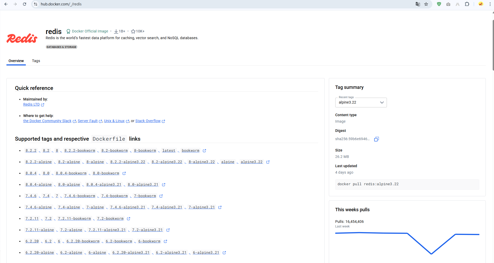

```bash
#指定连接密码
[root@ubuntu2204 ~]#docker run --name redis -p 6379:6379 -d   redis:7.2.4 --requirepass 123456

#使用自定义的配置启动容器
[root@ubuntu2204 ~]#docker run -d -p 6379:6379 -v /myredis/conf:/usr/local/etc/redis --name myredis redis redis-server /usr/local/etc/redis/redis.conf

#实现Redis的持久化保存
[root@ubuntu2204 ~]#docker run --name redis -p 6379:6379 -d -v /data/redis:/data redis 
[root@ubuntu2204 ~]#docker exec redis redis-cli info server
# Server
redis_version:7.0.7
redis_git_sha1:00000000
redis_git_dirty:0
redis_build_id:73d41e29cd700caa
redis_mode:standalone
os:Linux 5.15.0-52-generic x86_64
arch_bits:64
monotonic_clock:POSIX clock_gettime
multiplexing_api:epoll
atomicvar_api:c11-builtin
gcc_version:10.2.1
process_id:1
process_supervised:no
run_id:fb61da13dd55eb361305a36438803b2883e2909b
tcp_port:6379
server_time_usec:1673849373675378
uptime_in_seconds:267
uptime_in_days:0
hz:10
configured_hz:10
lru_clock:12904989
executable:/data/redis-server
config_file:
io_threads_active:0
[root@ubuntu2204 ~]#docker exec redis redis-cli set name wang
[root@ubuntu2204 ~]#docker exec redis redis-cli set age 18
OK
[root@ubuntu2204 ~]#docker exec redis redis-cli get name
wang
[root@ubuntu2204 ~]#docker exec redis redis-cli get age
18
[root@ubuntu2204 ~]#docker exec redis redis-cli save
OK
[root@ubuntu2204 ~]#ls /data/redis/ -l
总用量 4
-rw------- 1 lxd 999 111  1月 16 14:07 dump.rdb
#默认Redis容器可以直接远程连接
[root@ubuntu2204 ~]#redis-cli -h 10.0.0.202
10.0.0.202:6379> keys *
1) "age"
2) "name"
10.0.0.202:6379> exit
```

### 1.2.4 redis 多实例

测试环境中经常使用多实例,需要指定不同实例的相应的端口,配置文件,日志文件等相关配置

范例: 以编译安装为例实现 redis 多实例

```bash
# 配置 redis 数据文件、日志文件、配置文件、pid 文件
root@prometheus-221:~ 14:48:00 # cp /apps/redis/etc/redis.conf /apps/redis/etc/redis_6379.conf
root@prometheus-221:~ 14:48:08 # cp /apps/redis/etc/redis.conf /apps/redis/etc/redis_6380.conf
root@prometheus-221:~ 14:48:11 # cp /apps/redis/etc/redis.conf /apps/redis/etc/redis_6381.conf
root@prometheus-221:~ 14:48:13 # sed -i "s/6379/6380/g" /apps/redis/etc/redis_6380.conf
root@prometheus-221:~ 14:48:31 # sed -i "s/6379/6381/g" /apps/redis/etc/redis_6381.conf
root@prometheus-221:~ 14:48:39 # vim /apps/redis/etc/redis_6381.conf
root@prometheus-221:~ 14:48:44 # grep 6381 /apps/redis/etc/redis_6381.conf
# pidfile /var/run/redis_6381.pid
pidfile /apps/redis/run/redis_6381.pid
# Accept connections on the specified port, default is 6381 (IANA #815344).
port 6381
# tls-port 6381
pidfile /var/run/redis_6381.pid
logfile "/apps/redis/log/redis_6381.log"
dbfilename dump_6381.rdb
# cluster-config-file nodes-6381.conf
# cluster-announce-tls-port 6381

root@prometheus-221:~ 14:48:51 # grep 6380 /apps/redis/etc/redis_6380.conf
# pidfile /var/run/redis_6380.pid
pidfile /apps/redis/run/redis_6380.pid
# Accept connections on the specified port, default is 6380 (IANA #815344).
port 6380
# tls-port 6380
pidfile /var/run/redis_6380.pid
logfile "/apps/redis/log/redis_6380.log"
dbfilename dump_6380.rdb
# cluster-config-file nodes-6380.conf
# cluster-announce-tls-port 6380
# cluster-announce-bus-port 6380


# 配置 redis 多实例 service 文件
root@prometheus-221:~ 14:50:07 # cat /lib/systemd/system/redis6379.service
[Unit]
Description=Redis persistent key-value database
After=network.target
[Service]
ExecStart=/apps/redis/bin/redis-server /apps/redis/etc/redis_6379.conf --supervised systemd
ExecStop=/bin/kill -s QUIT $MAINPID        
Type=notify
User=redis
Group=redis
RuntimeDirectory=redis
RuntimeDirectoryMode=0755
LimitNOFILE=1000000   #指定此值才支持更大的maxclients值
[Install]
WantedBy=multi-user.target
root@prometheus-221:~ 14:50:14 # cat /lib/systemd/system/redis6380.service
[Unit]
Description=Redis persistent key-value database
After=network.target
[Service]
ExecStart=/apps/redis/bin/redis-server /apps/redis/etc/redis_6380.conf --supervised systemd
ExecStop=/bin/kill -s QUIT $MAINPID        
Type=notify
User=redis
Group=redis
RuntimeDirectory=redis
RuntimeDirectoryMode=0755
LimitNOFILE=1000000   #指定此值才支持更大的maxclients值
[Install]
WantedBy=multi-user.target
root@prometheus-221:~ 14:50:17 # cat /lib/systemd/system/redis6381.service
[Unit]
Description=Redis persistent key-value database
After=network.target
[Service]
ExecStart=/apps/redis/bin/redis-server /apps/redis/etc/redis_6381.conf --supervised systemd
ExecStop=/bin/kill -s QUIT $MAINPID        
Type=notify
User=redis
Group=redis
RuntimeDirectory=redis
RuntimeDirectoryMode=0755
LimitNOFILE=1000000   #指定此值才支持更大的maxclients值
[Install]
WantedBy=multi-user.target


# 启动 redis 多实例
root@prometheus-221:~ 14:50:26 # systemctl enable --now redis6379.service redis6380.service redis6381.service 
Created symlink /etc/systemd/system/multi-user.target.wants/redis6379.service → /lib/systemd/system/redis6379.service.
Created symlink /etc/systemd/system/multi-user.target.wants/redis6380.service → /lib/systemd/system/redis6380.service.
Created symlink /etc/systemd/system/multi-user.target.wants/redis6381.service → /lib/systemd/system/redis6381.service.
root@prometheus-221:~ 14:54:19 # systemctl status  redis6379.service redis6380.service redis6381.service 
● redis6379.service - Redis persistent key-value database
     Loaded: loaded (/lib/systemd/system/redis6379.service; enabled; vendor preset: enabled)
     Active: active (running) since Thu 2025-10-16 14:54:19 CST; 2s ago
   Main PID: 101300 (redis-server)
     Status: "Ready to accept connections"
      Tasks: 5 (limit: 4514)
     Memory: 2.2M
        CPU: 67ms
     CGroup: /system.slice/redis6379.service
             └─101300 "/apps/redis/bin/redis-server 127.0.0.1:6379" "" "" "" "" "" "" "" "" "" "" "" "" "" "" "" "" "" "" "" "" "" "" "" "" "" "" "" "" "" "" "" "" ""

Oct 16 14:54:19 prometheus-221 systemd[1]: Starting Redis persistent key-value database...
Oct 16 14:54:19 prometheus-221 systemd[1]: Started Redis persistent key-value database.

● redis6380.service - Redis persistent key-value database
     Loaded: loaded (/lib/systemd/system/redis6380.service; enabled; vendor preset: enabled)
     Active: active (running) since Thu 2025-10-16 14:54:19 CST; 1s ago
   Main PID: 101311 (redis-server)
     Status: "Ready to accept connections"
      Tasks: 5 (limit: 4514)
     Memory: 2.2M
        CPU: 38ms
     CGroup: /system.slice/redis6380.service
             └─101311 "/apps/redis/bin/redis-server 127.0.0.1:6380" "" "" "" "" "" "" "" "" "" "" "" "" "" "" "" "" "" "" "" "" "" "" "" "" "" "" "" "" "" "" "" "" ">

Oct 16 14:54:19 prometheus-221 systemd[1]: Starting Redis persistent key-value database...
Oct 16 14:54:19 prometheus-221 systemd[1]: Started Redis persistent key-value database.

● redis6381.service - Redis persistent key-value database
     Loaded: loaded (/lib/systemd/system/redis6381.service; enabled; vendor preset: enabled)
     Active: active (running) since Thu 2025-10-16 14:54:19 CST; 1s ago
   Main PID: 101306 (redis-server)
     Status: "Ready to accept connections"
      Tasks: 5 (limit: 4514)
     Memory: 2.2M
        CPU: 63ms
     CGroup: /system.slice/redis6381.service
             └─101306 "/apps/redis/bin/redis-server 127.0.0.1:6381" "" "" "" "" "" "" "" "" "" "" "" "" "" "" "" "" "" "" "" "" "" "" "" "" "" "" "" "" "" "" "" "" ">

root@prometheus-221:~ 14:55:07 # tree /apps/redis/
/apps/redis/
├── bin
│   ├── redis-benchmark
│   ├── redis-check-aof -> redis-server
│   ├── redis-check-rdb -> redis-server
│   ├── redis-cli
│   ├── redis-sentinel -> redis-server
│   └── redis-server
├── data
│   └── dump.rdb
├── etc
│   ├── redis_6379.conf
│   ├── redis_6380.conf
│   ├── redis_6381.conf
│   └── redis.conf
├── log
│   ├── redis_6379.log
│   ├── redis_6380.log
│   └── redis_6381.log
└── run
    ├── redis_6379.pid
    ├── redis_6380.pid
    └── redis_6381.pid

5 directories, 17 files
root@prometheus-221:~ 14:55:10 # 
root@prometheus-221:~ 14:51:14 # ss -tunlp | grep -E "63(79|80|81)"
tcp   LISTEN 0      511                           127.0.0.1:6381      0.0.0.0:*    users:(("redis-server",pid=101071,fd=6))   
tcp   LISTEN 0      511                           127.0.0.1:6380      0.0.0.0:*    users:(("redis-server",pid=101070,fd=6))   
tcp   LISTEN 0      511                           127.0.0.1:6379      0.0.0.0:*    users:(("redis-server",pid=101122,fd=6))   
tcp   LISTEN 0      511                               [::1]:6381         [::]:*    users:(("redis-server",pid=101071,fd=7))   
tcp   LISTEN 0      511                               [::1]:6380         [::]:*    users:(("redis-server",pid=101070,fd=7))   
tcp   LISTEN 0      511                               [::1]:6379         [::]:*    users:(("redis-server",pid=101122,fd=7))   

```

## 1.3 redis 相关工具和客户端连接

### 1.3.1 安装的相关工具介绍

```bash
# redis 7.0 +
root@prometheus-221:~ 18:08:39 # ls -l /apps/redis/bin/
total 21956
-rwxr-xr-x 1 redis redis  5493256 Oct 14 13:21 redis-benchmark  # 性能测试程序
lrwxrwxrwx 1 redis redis       12 Oct 14 13:21 redis-check-aof -> redis-server # AOF文件检查程序
lrwxrwxrwx 1 redis redis       12 Oct 14 13:21 redis-check-rdb -> redis-server # RDB文件检查程序
-rwxr-xr-x 1 redis redis  5379336 Oct 14 13:21 redis-cli		# 客户端程序
lrwxrwxrwx 1 redis redis       12 Oct 14 13:21 redis-sentinel -> redis-server # 哨兵程序，软连
-rwxr-xr-x 1 redis redis 11603280 Oct 14 13:21 redis-server		# 服务端主程序
root@prometheus-221:~ 18:08:45 # 


# Redis6.0 以下
[root@centos8 ~]#ll /apps/redis/bin/
total 32772
-rwxr-xr-x 1 root root 4366792 Feb 16 21:12 redis-benchmark #性能测试程序
-rwxr-xr-x 1 root root 8125184 Feb 16 21:12 redis-check-aof #AOF文件检查程序
-rwxr-xr-x 1 root root 8125184 Feb 16 21:12 redis-check-rdb #RDB文件检查程序
-rwxr-xr-x 1 root root 4807856 Feb 16 21:12 redis-cli       #客户端程序
lrwxrwxrwx 1 root root      12 Feb 16 21:12 redis-sentinel -> redis-server #哨兵程序，软连接到服务器端主程序
-rwxr-xr-x 1 root root 8125184 Feb 16 21:12 redis-server #服务端主程序
```

### 1.3.2 客户端程序 redis-cli

```bash
# 默认为本机无密码连接
redis-cli
# 远程客户端连接,注意:Redis 没有用户的概念
redis-cli -h <Redis服务器IP> -p <PORT> -a <PASSWORD> --no-auth-warning
```

### 1.3.3 程序连接 redis

Redis 支持多种开发语言访问

https://redis.io/clients

#### 1.3.3.1 shell 脚本访问 redis

```bash
root@prometheus-221:~ 18:19:54 # cat redis_test.sh 
############################
# File Name: redis_test.sh
# Author: xuruizhao
# website: xuruizhao00@163.com
# Created Time: Wed 15 Oct 2025 06:11:36 PM CST
############################
#!/bin/bash

# mail: xuruizhao00@163.com
NUM=100
PASS=123456
for i in `seq $NUM`;do
  redis-cli -h 127.0.0.1 -a "$PASS" --no-auth-warning set key${i} value${i}
  echo "key${i} value${i} 写入完成"
done
echo "$NUM个key写入完成"
root@prometheus-221:~ 18:19:58 #
```

#### 1.3.3.2 python 程序访问 redis

python 提供了多种开发库,都可以支持连接访问 Redis

下面选择使用 redis-py 库连接 Redis 

github redis-py 库 : https://github.com/andymccurdy/redis-py

```bash
# Ubuntu 安装
14:37:22 root@redis02:~# apt update && apt -y install python3-redis
[root@ubuntu2004 ~]#apt update && apt -y install python3-redis
# CentOS 安装
[root@centos8 ~]#yum info python3-redis

root@prometheus-221:~ 18:25:58 # vim redis_test.py
root@prometheus-221:~ 18:28:55 # cat redis_test.py
#!/usr/bin/python3

import redis
pool = redis.ConnectionPool(host="127.0.0.1",port=6379,password="123456",decode_responses=True)
c = redis.Redis(connection_pool=pool)
for i in range(100):
  c.set("k%d" % i,"v%d" % i)
  data=c.get("k%d" % i)
  print(data)
root@prometheus-221:~ 18:28:56 # python3 redis_test.py
v0
v1
v2
v3
v4
v5
...
root@prometheus-221:~ 18:29:02 # 
#注意：新版redis禁用了RDB，会导致上面脚本执行过程中失败，可以启用RDB解决
[root@ubuntu2204 ~]#vi /apps/redis/etc/redis.conf
#修改下面行的注释
dir /apps/redis/etc/redis.conf
[root@ubuntu2204 ~]#systemctl restart redis
```

#### 1.3.3.3 Golang 程序连接 redis
```go
# 准备 Golang 代码，注意：文件名为 main.go
[root@ubuntu2204 redis-go]#cat main.go
package main

import (
    "context"
    "fmt"
    "github.com/redis/go-redis/v9"
)

var ctx = context.Background()

func main() {
    rdb := redis.NewClient(&redis.Options{
        Addr:     "127.0.0.1:6379",
        Password: "123456",
        DB:       0,
    })

    _, err := rdb.Ping(ctx).Result()
    if err != nil {
        fmt.Printf("连接redis出错，错误信息：%v", err)
        return
    }

    for i:=1;i<=10000;i++ {
        key := fmt.Sprintf("key%d", i)
        value := fmt.Sprintf("value%d", i)
        err = rdb.Set(ctx, key, value,0).Err()
        if err != nil {
            panic(err)
        }

        keys, err := rdb.Keys(ctx, key).Result()
        if err != nil {
            panic(err)
        }
        fmt.Println(keys)
    }

}

```

```bash
[root@ubuntu2204 redis-go]#apt update && apt -y install golang

# 初始化并定义模块名，即默认生成的程序名

[root@ubuntu2204 redis-go]#go mod init redis-go

# 上面命令会生成 go.mod 文件

[root@ubuntu2204 redis-go]#cat go.mod

module redis-go

go 1.18

# 镜像加速

[root@ubuntu2204 redis-go]#go env -w GOPROXY=https://goproxy.cn,direct

# 指定项目所依赖相关包及版本

[root@ubuntu2204 redis-go]#go get github.com/redis/go-redis/v9

# 上面命令会修改 go.mod 文件生成依赖信息

[root@ubuntu2204 redis-go]#cat go.mod
module redis-go
...

[root@ubuntu2204 redis-go]#cat go.sum

github.com/cespare/xxhash/v2 v2.2.0

h1:DC2CZ1Ep5Y4k3ZQ899DldepgrayRUGE6BBZ/cd9Cj44=

github.com/cespare/xxhash/v2 v2.2.0/go.mod

h1:VGX0DQ3Q6kWi7AoAeZDth3/j3BFtOZR5XLFGgcrjCOs=

github.com/dgryski/go-rendezvous v0.0.0-20200823014737-9f7001d12a5f

h1:lO4WD4F/rVNCu3HqELle0jiPLLBs70cWOduZpkS1E78=

github.com/dgryski/go-rendezvous v0.0.0-20200823014737-9f7001d12a5f/go.mod

h1:cuUVRXasLTGF7a8hSLbxyZXjz+1KgoB3wDUb6vlszIc=

github.com/redis/go-redis/v9 v9.0.3

h1:+7mmR26M0IvyLxGZUHxu4GiBkJkVDid0Un+j4ScYu4k=

github.com/redis/go-redis/v9 v9.0.3/go.mod

h1:WqMKv5vnQbRuZstUwxQI195wHy+t4PuXDOjzMvcuQHk=

# 静态编译并指定生成的文件名 myredis

[root@ubuntu2204 redis-go]#CGO_ENABLED=0 go build -o myredis

[root@ubuntu2204 redis-go]#ls

go.mod go.sum main.go myredis

[root@ubuntu2204 redis-go]#ldd myredis

不是动态可执行文件

# 或者动态编译文件名为 redis-go，如果不指定 -o myredis，默认生成的名称为 go mod init redis-go 指定的名称

[root@ubuntu2204 redis-go]#go build

[root@ubuntu2204 redis-go]#ls

go.mod go.sum main.go redis-go

[root@ubuntu2204 redis-go]#ldd redis-go

linux-vdso.so.1 (0x00007fff5b15e000)

libc.so.6 => /lib/x86_64-linux-gnu/libc.so.6 (0x00007f4fc1c18000)

/lib64/ld-linux-x86-64.so.2 (0x00007f4fc1e48000)

# 运行

[root@ubuntu2204 redis-go]#./redis-go
```

### 1.3.4 图形工具
有一些第三方开发的图形工具也可以连接 redis

#### 1.3.4.1 RedisInsight
https://apps.microsoft.com/store/detail/redisinsight/XP8K1GHCB0F1R2

#### 1.3.4.2 Another-Redis-Desktop-Manager
注意：当前 Redis7.2.1 无法连接，Redis7.2.2以后版本可以
https://github.com/qishibo/AnotherRedisDesktopManager

#### 1.3.4.3 RedisDesktopManager
注意: 当前 Redis-v7.2.1 无法连接，redis-v7.2.3 以后版本可以支持连接


# 二、redis 配置管理

## 2.1 redis 配置文件说明

```bash
bind 0.0.0.0    #指定监听地址，支持用空格隔开的多个监听IP
protected-mode yes #redis3.2之后加入的新特性，在没有设置bind IP和密码的时候,redis只允许访问127.0.0.1:6379，可以远程连接，但当访问将提示警告信息并拒绝远程访问,redis-7版本后，只要没有密码就不能远程访问
port 6379       #监听端口,默认6379/tcp
tcp-backlog 511 #三次握手的时候server端收到client ack确认号之后的队列值，即全连接队列长度
timeout 0 #客户端和Redis服务端的连接超时时间，默认是0，表示永不超时
tcp-keepalive 300 #tcp 会话保持时间300s
daemonize no #默认no,即直接运行redis-server程序时,不作为守护进程运行，而是以前台方式运行，如果想在后台运行需改成yes,当redis作为守护进程运行的时候，它会写一个 pid 到 /var/run/redis.pid 文件
supervised no #和OS相关参数，可设置通过upstart和systemd管理Redis守护进程，centos7后都使用systemd
pidfile /var/run/redis_6379.pid #pid文件路径,可以修改为/apps/redis/run/redis_6379.pid
loglevel notice #日志级别
logfile "/path/redis.log" #日志路径,示例:logfile "/apps/redis/log/redis_6379.log"
databases 16 #设置数据库数量，默认：0-15，共16个库
always-show-logo yes #在启动redis 时是否显示或在日志中记录记录redis的logo
save 900 1 #在900秒内有1个key内容发生更改,就执行快照机制
save 300 10 #在300秒内有10个key内容发生更改,就执行快照机制
save 60 10000  #60秒内如果有10000个key以上的变化，就自动快照备份
stop-writes-on-bgsave-error yes #默认为yes时,可能会因空间满等原因快照无法保存出错时，会禁止redis写入操作，生产建议为no
 #此项只针对配置文件中的自动save有效
rdbcompression yes #持久化到RDB文件时，是否压缩，"yes"为压缩，"no"则反之
rdbchecksum yes #是否对备份文件开启RC64校验，默认是开启
dbfilename dump.rdb #快照文件名
dir ./ #快照文件保存路径，示例：dir "/apps/redis/data"


#主从复制相关
# replicaof <masterip> <masterport> #指定复制的master主机地址和端口，5.0版之前的指令为slaveof 
# masterauth <master-password> #指定复制的master主机的密码
replica-serve-stale-data yes #当从库同主库失去连接或者复制正在进行，从机库有两种运行方式：
	1、设置为yes(默认设置)，从库会继续响应客户端的读请求，此为建议值
	2、设置为no，除去特定命令外的任何请求都会返回一个错误"SYNC with master in progress"。
replica-read-only yes #是否设置从库只读，建议值为yes,否则主库同步从库时可能会覆盖数据，造成数据丢失repl-diskless-sync no #是否使用socket方式复制数据(无盘同步)，新slave第一次连接master时需要做数据的全量同步，redis server就要从内存dump出新的RDB文件，然后从master传到slave，有两种方式把RDB文件传输给客户端：
	1、基于硬盘（disk-backed）：为no时，master创建一个新进程dump生成RDB磁盘文件，RDB完成之后由父进程（即主进程）将RDB文件发送给slaves，此为默认值
	2、基于socket（diskless）：master创建一个新进程直接dump RDB至slave的网络socket，不经过主进程和硬盘
#推荐使用基于硬盘（为no），是因为RDB文件创建后，可以同时传输给更多的slave，但是基于socket(为yes)， 新slave连接到master之后得逐个同步数据。只有当磁盘I/O较慢且网络较快时，可用diskless(yes),否则一般建议使用磁盘(no)

repl-diskless-sync-delay 5 #diskless时复制的服务器等待的延迟时间，设置0为关闭，在延迟时间内到达的客户端，会一起通过diskless方式同步数据，但是一旦复制开始，master节点不会再接收新slave的复制请求，直到下一次同步开始才再接收新请求。即无法为延迟时间后到达的新副本提供服务，新副本将排队等待下一次RDB传输，因此服务器会等待一段时间才能让更多副本到达。推荐值：30-60

repl-ping-replica-period 10 #slave根据master指定的时间进行周期性的PING master,用于监测master状态,默认10s

repl-timeout 60 #复制连接的超时时间，需要大于repl-ping-slave-period，否则会经常报超时repl-disable-tcp-nodelay no #是否在slave套接字发送SYNC之后禁用 TCP_NODELAY，如果选择"yes"，Redis将合并多个报文为一个大的报文，从而使用更少数量的包向slaves发送数据，但是将使数据传输到slave上有延迟，Linux内核的默认配置会达到40毫秒，如果 "no" ，数据传输到slave的延迟将会减少，但要使用更多的带宽
repl-backlog-size 512mb #复制缓冲区内存大小，当slave断开连接一段时间后，该缓冲区会累积复制副本数据，因此当slave 重新连接时，通常不需要完全重新同步，只需传递在副本中的断开连接后没有同步的部分数据即可。只有在至少有一个slave连接之后才分配此内存空间,建议建立主从时此值要调大一些或在低峰期配置,否则会导致同步到slave失败
repl-backlog-ttl 3600 #多长时间内master没有slave连接，就清空backlog缓冲区
replica-priority 100 #当master不可用，哨兵Sentinel会根据slave的优先级选举一个master，此值最低的slave会优先当选master，而配置成0，永远不会被选举，一般多个slave都设为一样的值，让其自动选择
#min-replicas-to-write 3 #至少有3个可连接的slave，mater才接受写操作
#min-replicas-max-lag 10 #和上面至少3个slave的ping延迟不能超过10秒，否则master也将停止写操作
requirepass foobared #设置redis连接密码，之后需要AUTH pass,如果有特殊符号，用" "引起来,生产建议设置
rename-command #重命名一些高危命令，示例：rename-command FLUSHALL "" 禁用命令
   #示例: rename-command del wang
maxclients 10000 #Redis最大连接客户端
maxmemory <bytes> #redis使用的最大内存，单位为bytes字节，0为不限制，建议设为物理内存一半，8G内存的计算方式8(G)*1024(MB)1024(KB)*1024(Kbyte)，需要注意的是缓冲区是不计算在maxmemory内,生产中如果不设置此项,可能会导致OOM


★★★★★★★★★
maxmemory-policy 
# MAXMEMORY POLICY：当达到最大内存时，Redis 将如何选择要删除的内容。您可以从以下行为中选择一种：
#
# volatile-lru -> Evict 使用近似 LRU，只有设置了过期时间的键。
# allkeys-lru -> 使用近似 LRU 驱逐任何键。
# volatile-lfu -> 使用近似 LFU 驱逐，只有设置了过期时间的键。
# allkeys-lfu -> 使用近似 LFU 驱逐任何键。
# volatile-random -> 删除设置了过期时间的随机密钥。
# allkeys-random -> 删除一个随机密钥，任何密钥。
# volatile-ttl -> 删除过期时间最近的key（次TTL）
# noeviction -> 不要驱逐任何东西，只是在写操作时返回一个错误。此为默认值
#
# LRU 表示最近最少使用
# LFU 表示最不常用
#
# LRU、LFU 和 volatile-ttl 都是使用近似随机算法实现的。
#
# 注意：使用上述任何一种策略，当没有合适的键用于驱逐时，Redis 将在需要更多内存的写操作时返回错误。这些通常是创建新密钥、添加数据或修改现有密钥的命令。一些示例是：SET、INCR、HSET、LPUSH、SUNIONSTORE、SORT（由于 STORE 参数）和 EXEC（如果事务包括任何需要内存的命令）。

appendonly no #是否开启AOF日志记录，默认redis使用的是rdb方式持久化，这种方式在许多应用中已经足够用了，但是redis如果中途宕机，会导致可能有几分钟的数据丢失(取决于dump数据的间隔时间)，根据save来策略进行持久化，Append Only File是另一种持久化方式，可以提供更好的持久化特性，Redis会把每次写入的数据在接收后都写入 appendonly.aof 文件，每次启动时Redis都会先把这个文件的数据读入内存里，先忽略RDB文件。默认不启用此功能
appendfilename "appendonly.aof" #文本文件AOF的文件名，存放在dir指令指定的目录中
appendfsync everysec #aof持久化策略的配置
	#no表示由操作系统保证数据同步到磁盘,Linux的默认fsync策略是30秒，最多会丢失30s的数据
	#always表示每次写入都执行fsync，以保证数据同步到磁盘,安全性高,性能较差
	#everysec表示每秒执行一次fsync，可能会导致丢失这1s数据,此为默认值,也生产建议值
	#同时在执行bgrewriteaof操作和主进程写aof文件的操作，两者都会操作磁盘，而bgrewriteaof往往会涉及大量磁盘操作，这样就会造成主进程在写aof文件的时候出现阻塞的情形,以下参数实现控制

no-appendfsync-on-rewrite no #在aof rewrite期间,是否对aof新记录的append暂缓使用文件同步策略,主要考虑磁盘IO开支和请求阻塞时间。
#默认为no,表示"不暂缓",新的aof记录仍然会被立即同步到磁盘，是最安全的方式，不会丢失数据，但是要忍受阻塞的问题
#为yes,相当于将appendfsync设置为no，这说明并没有执行磁盘操作，只是写入了缓冲区，因此这样并不会造成阻塞（因为没有竞争磁盘），但是如果这个时候redis挂掉，就会丢失数据。丢失多少数据呢？Linux的默认fsync策略是30秒，最多会丢失30s的数据,但由于yes性能较好而且会避免出现阻塞因此比较推荐
#rewrite 即对aof文件进行整理,将空闲空间回收,从而可以减少恢复数据时间

auto-aof-rewrite-percentage 100 #当Aof log增长超过指定百分比例时，重写AOF文件，设置为0表示不自动重写Aof日志，重写是为了使aof体积保持最小，但是还可以确保保存最完整的数据
auto-aof-rewrite-min-size 64mb #触发aof rewrite的最小文件大小
aof-load-truncated yes #是否加载由于某些原因导致的末尾异常的AOF文件(主进程被kill/断电等)，建议yes
aof-use-rdb-preamble no #redis4.0新增RDB-AOF混合持久化格式，在开启了这个功能之后，AOF重写产生的文件将同时包含RDB格式的内容和AOF格式的内容，其中RDB格式的内容用于记录已有的数据，而AOF格式的内容则用于记录最近发生了变化的数据，这样Redis就可以同时兼有RDB持久化和AOF持久化的优点（既能够快速地生成重写文件，也能够在出现问题时，快速地载入数据）,默认为no,即不启用此功能
lua-time-limit 5000 #lua脚本的最大执行时间，单位为毫秒
cluster-enabled yes #是否开启集群模式，默认不开启,即单机模式
cluster-config-file nodes-6379.conf #由node节点自动生成的集群配置文件名称
cluster-node-timeout 15000 #集群中node节点连接超时时间，单位ms,超过此时间，会踢出集群
cluster-replica-validity-factor 10 #单位为次,在执行故障转移的时候可能有些节点和master断开一段时间导致数据比较旧，这些节点就不适用于选举为master，超过这个时间的就不会被进行故障转移,不能当选master，计算公式：(node-timeout * replica-validity-factor) + repl-pingreplica-period 
cluster-migration-barrier 1 #集群迁移屏障，一个主节点至少拥有1个正常工作的从节点，即如果主节点的slave节点故障后会将多余的从节点分配到当前主节点成为其新的从节点。
cluster-require-full-coverage yes #集群请求槽位全部覆盖，如果一个主库宕机且没有备库就会出现集群槽位不全，那么yes时redis集群槽位验证不全,就不再对外提供服务(对key赋值时,会出现CLUSTERDOWN The cluster is down的提示,cluster_state:fail,但ping 仍PONG)，而no则可以继续使用,但是会出现查询数据查不到的情况(因为有数据丢失)。生产建议为no
cluster-replica-no-failover no #如果为yes,此选项阻止在主服务器发生故障时尝试对其主服务器进行故障转移。 但是，主服务器仍然可以执行手动强制故障转移，一般为no
#Slow log 是 Redis 用来记录超过指定执行时间的日志系统，执行时间不包括与客户端交谈，发送回复等I/O操作，而是实际执行命令所需的时间（在该阶段线程被阻塞并且不能同时为其它请求提供服务）,由于slow log 保存在内存里面，读写速度非常快，因此可放心地使用，不必担心因为开启 slow log 而影响Redis 的速度

slowlog-log-slower-than 10000 #以微秒为单位的慢日志记录，为负数会禁用慢日志，为0会记录每个命令操作。默认值为10ms,一般一条命令执行都在微秒级,生产建议设为1ms-10ms之间
slowlog-max-len 128 #最多记录多少条慢日志的保存队列长度，达到此长度后，记录新命令会将最旧的命令从命令队列中删除，以此滚动删除,即,先进先出,队列固定长度,默认128,值偏小,生产建议设为1000以上
```

## 2.2 config 命令实现动态修改配置

config 命令用于查看当前redis配置、以及不重启redis服务实现动态更改redis配置等

**注意：不是所有配置都可以动态修改 且此方式无法持久保存**

```ini
CONFIG SET parameter value
时间复杂度：O(1)

CONFIG SET 命令可以动态地调整 Redis 服务器的配置(configuration)而无须重启。
可以使用它修改配置参数，或者改变 Redis 的持久化(Persistence)方式。
CONFIG SET 可以修改的配置参数可以使用命令 CONFIG GET * 来列出，所有被 CONFIG SET 修改的配置参数都会立即生效。


CONFIG GET parameter
时间复杂度： O(N)，其中 N 为命令返回的配置选项数量。
CONFIG GET 命令用于取得运行中的 Redis 服务器的配置参数(configuration parameters)，在Redis 2.4 版本中， 有部分参数没有办法用 CONFIG GET 访问，但是在最新的 Redis 2.6 版本中，所有配置参数都已经可以用 CONFIG GET 访问了。

CONFIG GET 接受单个参数 parameter 作为搜索关键字，查找所有匹配的配置参数，其中参数和值以“键-值对”(key-value pairs)的方式排列。
比如执行 CONFIG GET s* 命令，服务器就会返回所有以 s 开头的配置参数及参数的值：
```

范例：版本差异

```bash
# redis-7支持动态修改端口
127.0.0.1:6379> config set port 8888
OK
# redis-7 不支持动态修改日志文件路径
127.0.0.1:6379> config set logfile /tmp/redis.log
(error) ERR CONFIG SET failed (possibly related to argument 'logfile') - can't 
set immutable config
# redis-5不支持动态修改端口
127.0.0.1:6379> config set port 8888
(error) ERR Unsupported CONFIG parameter: port
```

### 2.2.1 设置客户端连接密码

```bash
15:08:53 root@redis02:~# redis-cli
127.0.0.1:6379> auth 123456
OK
127.0.0.1:6379> config get requirepass
1) "requirepass"
2) "123456"
127.0.0.1:6379> config set requirepass 123
OK
127.0.0.1:6379> exit
15:09:29 root@redis02:~# redis-cli
127.0.0.1:6379> auth 123456
(error) WRONGPASS invalid username-password pair or user is disabled.
127.0.0.1:6379> auth 123
OK
127.0.0.1:6379> config get requirepass 
3) "requirepass"
4) "123"
127.0.0.1:6379> 
```

### 2.2.2 获取当前配置

```bash
# 奇数行为键，偶数行为值
127.0.0.1:6379> config get *
  1) "lazyfree-lazy-expire"
  2) "no"
  3) "replica-serve-stale-data"
  4) "yes"
  5) "notify-keyspace-events"
  6) ""
  7) "latency-tracking"
  8) "yes"
  9) "cluster-slave-validity-factor"
 10) "10"
 11) "active-defrag-threshold-lower"
 12) "10"
 13) "acllog-max-len"
 14) "128"
 15) "appenddirname"
 16) "appendonlydir"
 17) "rdbcompression"
 18) "yes"
 19) "bind"
 20) "127.0.0.1 -::1"
 21) "cluster-allow-replica-migration"
 22) "yes"
 23) "auto-aof-rewrite-min-size"
 24) "67108864"
....

# 查看 bind
127.0.0.1:6379> config get bind
1) "bind"
2) "127.0.0.1 -::1"
127.0.0.1:6379>

# Redis5.0 有些设置无法修改,Redis6.2.6 版本支持修改 bind
127.0.0.1:6379> CONFIG SET bind 127.0.0.1
(error) ERR Unsupported CONFIG parameter: bind
```

### 2.2.3 设置 redis 使用的最大内存量

```bash
127.0.0.1:6379>  config get  maxmemory
# 默认 0，表示没有限制
1) "maxmemory"
2) "0"
127.0.0.1:6379>

# 默认以字节为单位,1G以10的 n 次
127.0.0.1:6379> config  set maxmemory 8589934592
OK
127.0.0.1:6379>  config get  maxmemory
1) "maxmemory"
2) "8589934592"
127.0.0.1:6379> 
```

## 2.3 慢查询

### 2.3.1 redis 慢查询概念

Redis 慢查询是 **Redis 性能优化的核心工具**，用于记录「执行时间超过指定阈值」的命令，帮助定位耗时操作（如全量遍历、大键操作、复杂集合运算等），避免这些操作阻塞 Redis 主线程（Redis 是单线程模型，慢命令会导致所有请求排队）。
- **慢查询**：指 Redis 命令在服务端的「执行时间」超过预设阈值（默认 10 毫秒），被记录到慢查询日志中的操作。
- **关键注意**：
    1. 仅统计「命令执行时间」（服务端处理命令的耗时），不包含「网络传输时间」（客户端→服务端、服务端→客户端的耗时）和「命令排队时间」（命令等待主线程空闲的时间）；
    2. 慢查询日志存储在 **内存环形队列** 中，不会持久化到磁盘（默认），队列满后会覆盖旧日志；
    3. 慢查询不是「错误日志」，而是性能优化的「诊断日志」（如 `keys *` 命令本身合法，但全量遍历会导致慢查询）。
### 2.3.2 慢查询关键配置
| 配置参数                      | 作用                    | 单位     | 默认值   | 生产推荐值                  |
| ------------------------- | --------------------- | ------ | ----- | ---------------------- |
| `slowlog-log-slower-than` | 慢查询阈值：执行时间超过该值的命令会被记录 | 微秒（μs） | 10000 | 10000（10ms）或 5000（5ms） |
| `slowlog-max-len`         | 慢查询日志队列长度：最多存储多少条慢查询  | 条      | 128   | 1000~10000（根据业务量调整）    |
- 单位换算：1 毫秒（ms）= 1000 微秒（μs），默认阈值 10000 μs = 10 ms；
- 阈值调整原则：并发高的业务（如每秒万级请求）可设为 5ms（5000 μs），并发低的业务可设为 10~20ms。

#### 2.3.2.1 动态修改（临时生效，重启 redis 后失效）
适合快速测试配置，无需重启服务：
```bash
15:12:19 root@redis02:~# grep slowlog /etc/redis/redis.conf 
slowlog-log-slower-than 10000 # 单位为 us，指定超过 1us 即为慢的指令，默认值为 10000us 微秒
slowlog-max-len 128 # 指定只保存最近的慢记录，默认值为 128

# 调整 slowlog-log-slower-than 和 slowlog-max-len 值
127.0.0.1:6379> config set slowlog-log-slower-than 1
OK
127.0.0.1:6379> config set slowlog-max-len 1024
OK
127.0.0.1:6379> config get slowlog-log-slower-than slowlog-max-len
1) "slowlog-max-len"
2) "1024"
3) "slowlog-log-slower-than"
4) "1"
127.0.0.1:6379>
```

#### 2.3.2.2 修改配置文件（永久生效，需重启 Redis）
适合生产环境固定配置：
```bash
# 编辑 redis.conf（root 权限）
vim /etc/redis/redis.conf

# 搜索并修改以下配置项（取消注释或直接添加）
slowlog-log-slower-than 5000    # 阈值 5ms
slowlog-max-len 2000            # 队列长度 2000 条

# 保存退出后，重启 Redis 生效
systemctl restart redis-server
```

### 2.3.3 慢查询日志查看命令（高频运维）
通过 `slowlog` 系列命令查看慢查询日志，无需手动读取文件（日志存储在内存中），适配你的密码认证场景：
#### 2.3.3.1 查看慢查询日志
```bash
# 连接 Redis 后执行（返回所有慢查询，按时间倒序排列）
127.0.0.1:6379> slowlog get
# 或指定查看最近 N 条（如最近 10 条）
127.0.0.1:6379> slowlog get 10

# 输出解析
1) 1) (integer) 123        # 慢查询日志 ID（自增，不会重复）
   2) (integer) 1735689600 # 命令执行时间戳（Unix 时间，单位：秒）
   3) (integer) 15000      # 命令执行时间（单位：微秒，15000 μs = 15ms）
   4) 1) "keys"            # 执行的命令（数组形式，第一个元素是命令名）
      2) "*"               # 命令参数（这里是 keys *，全量遍历所有键）
   5) "192.168.1.100:54321" # 客户端 IP 和端口
   6) "redis-cli"          # 客户端名称（默认 redis-cli）
   7) (nil)                # 客户端认证的用户名（Redis 6.0+ 支持，这里为 nil）
```
#### 2.3.3.2 查看慢查询日志总数
```bash
127.0.0.1:6379> slowlog len
(integer) 86  # 当前共记录了 86 条慢查询
```

#### 2.3.3.3 清空慢查询日志
```bash
127.0.0.1:6379> slowlog reset
OK  # 清空后，新日志从 ID 1 重新开始
```

### 2.3.4 慢查询日志持久化
默认情况下，慢查询日志仅存储在内存中，Redis 重启后会丢失。

## 2.4 redis 持久化

Redis 是基于内存型的 NoSQL, 和 MySQL 是不同的,使用内存进行数据保存

如果想实现数据的持久化,Redis 也也可支持将内存数据保存到硬盘文件中

Redis支持两种数据持久化保存方法

- RDB:Redis DataBase
- AOF:AppendOnlyFile

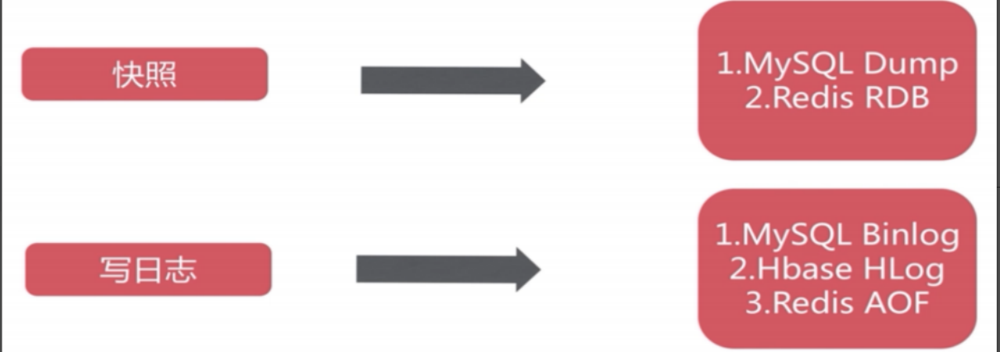


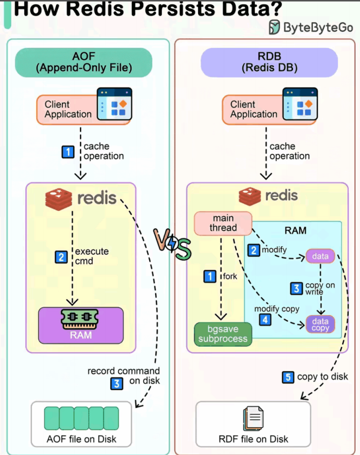

### 2.4.1 RDB

#### 2.4.1.1 RDB 工作原理

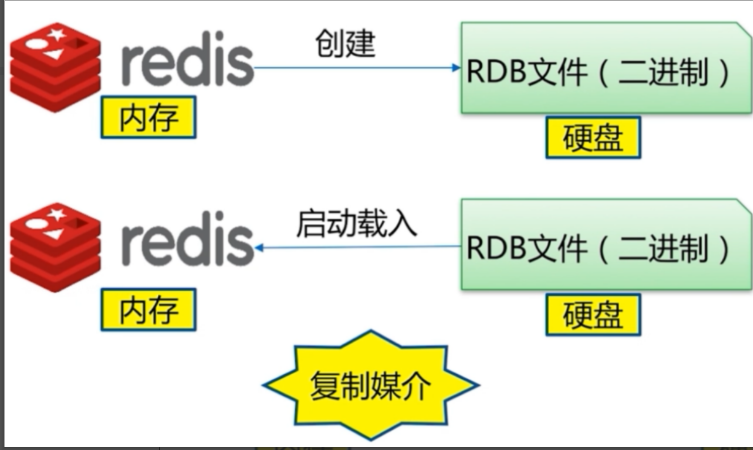

RDB(Redis DataBase)：是基于某个时间点的快照，注意RDB只保留当前最新版本的一个快照相当于MySQL中的完全备份

RDB 持久化功能所生成的 RDB 文件是一个经过压缩的二进制文件，通过该文件可以还原生成该 RDB 文件时数据库的状态。因为 RDB 文件是保存在磁盘中的，所以即便 Redis 服务进程甚至服务器宕机，只要磁盘中 RDB 文件存在，就能将数据恢复

**RDB 支持 save 和 bgsave 两种命令实现数据文件的持久化**

注意： save 指令使用主进程进行备份，而不生成新的子进程，但是也会生成临时文件 temp-<主进程PID>.rdb文件

范例

```bash
#生成临时文件temp-<主进程PID>.rdb文件
[root@centos7 data]#redis-cli -a 123456 save&
[1] 28684
[root@centos7 data]#pstree -p |grep redis ;ll /apps/redis/data
           |-redis-server(28650)-+-{redis-server}(28651)
           |                     |-{redis-server}(28652)
           |                     |-{redis-server}(28653)
           |                     `-{redis-server}(28654)
           |           |                         `-redis-cli(28684)
           |           `-sshd(23494)---bash(23496)---redis-cli(28601)
total 251016
-rw-r--r-- 1 redis redis 189855682 Nov 17 15:02 dump.rdb
-rw-r--r-- 1 redis redis  45674498 Nov 17 15:02 temp-28650.rdb
```

**RDB bgsave** **实现快照的具体过程:**

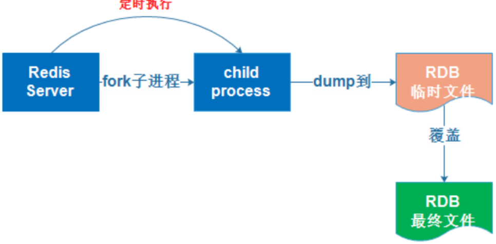


首先从 redis 主进程先 fork 生成一个新的子进程,此子进程负责将 Redis 内存数据保存为一个临时文件 tmp-<子进程pid>.rdb

当数据保存完成后,再将此临时文件改名为 RDB 文件,如果有前一次保存的 RDB 文件则会被替换，最后关闭此子进程

由于 Redis 只保留最后一个版本的 RDB 文件,如果想实现保存多个版本的数据,需要人为实现

```bash
drwxr-xr-x 2 redis redis    4096 Oct 16 18:46 ./
drwxr-xr-x 7 redis redis    4096 Oct 14 13:23 ../
-rw-r--r-- 1 redis redis 1335296 Oct 16 18:46 temp-112820.rdb
           |-redis-server(112820)-+-{redis-server}(112822)
           |                      |-{redis-server}(112823)
           |                      |-{redis-server}(112824)
           |                      `-{redis-server}(112825)
           |-sshd(91677)-+-sshd(100684)---bash(100793)---redis-cli(112912)
total 2012
drwxr-xr-x 2 redis redis    4096 Oct 16 18:46 ./
drwxr-xr-x 7 redis redis    4096 Oct 14 13:23 ../
-rw-r--r-- 1 redis redis 2052096 Oct 16 18:46 temp-112820.rdb

```


#### 2.4.1.2 RDB 相关配置

```bash
#在配置文件中的 save 选项设置多个保存条件，只有任何一个条件满足，服务器都会自动执行 BGSAVE 命令
#Redis7.0以后支持写在一行，如：save 3600 1 300 100 60 10000，此也为默认值
save 900 1         #900s内修改了1个key即触发保存RDB
save 300 10        #300s内修改了10个key即触发保存RDB
save 60 10000      #60s内修改了10000个key即触发保存RDB
dbfilename dump.rdb
dir ./             #编泽编译安装时默认RDB文件存放在Redis的工作目录,此配置可指定保存的数据目录
stop-writes-on-bgsave-error yes  #当快照失败是否仍允许写入,yes为出错后禁止写入,建议为no
rdbcompression yes
rdbchecksum yes


```

#### 2.4.1.3 自动实现 RDB 保存

```bash
[root@ubuntu2004 ~]#redis-cli config get save
1) "save"
2) "3600 1 300 100 60 10000"

#支持动态修改，注意：需要添加双引号
127.0.0.1:6379> config set save "60 3"
OK
127.0.0.1:6379> config get save
1) "save"
2) "60 3"

# 在 60s 内修改三个 key 会触发 bgsave
```

#### 2.4.1.4 实现 RDB 的方法

1. save: 同步,不推荐使用，使用主进程完成快照，因此会阻塞其它命令执行
2. bgsave: 异步后台执行,不影响其它命令的执行，会开启独立的子进程，因此不会阻赛其它命令执行
3. 配置文件实现自动保存: 在配置文件中制定规则,自动执行 bgsave

#### 2.4.1.5 RDB 模式优缺点

##### 2.4.1.4.1 RDB 优点

1. RDB快照只保存某个时间点的数据，恢复的时候直接加载到内存即可，不用做其他处理，这种文件适合用于做灾备处理.可以通过自定义时间点执行redis指令bgsave或者save保存快照，实现多个版本的备份

   比如: 可以在最近的24小时内，每小时备份一次RDB文件，并且在每个月的每一天，也备份一个RDB文件。这样的话，即使遇上问题，也可以随时将数据集还原到指定的不同的版本。

2. RDB在大数据集时恢复的速度比AOF方式要快

##### 2.4.1.4.2 RDB 缺点

1. 不能实时保存数据，可能会丢失自上一次执行RDB备份到当前的内存数据

   如果需要尽量避免在服务器故障时丢失数据，那么RDB并不适合。虽然Redis允许设置不同的保存点（save point）来控制保存RDB文件的频率，但是，因为RDB文件需要保存整个数据集的状态，所以它可能并不是一个非常快速的操作。因此一般会超过5分钟以上才保存一次RDB文件。在这种情况下，一旦发生故障停机，就可能会丢失较长时间的数据。

2. 在数据集比较庞大时，fork()子进程可能会非常耗时，造成服务器在一定时间内停止处理客户端请求,如果数据集非常巨大，并且CPU时间非常紧张的话，那么这种停止时间甚至可能会长达整整一秒或更久。另外子进程完成生成RDB文件的时间也会花更长时间

范例: 手动执行备份RDB

```bash
# 准备 redis 配置文件
root@prometheus-221:~ 18:44:43 # vim /apps/redis/etc/redis.conf
save ""
dbfilename dump_6379.rdb
dir "/data/redis"
appendonly no

# 自动备份脚本
# 在 redis 进行备份时，有一个参数可以作为参考是否备份完成 
# rdb_bgsave_in_progress 为 1 时，表示还未备份完成
# rdb_bgsave_in_progress 为 0 时，表示备份完成
BACKUP=/backup/redis-rdb
DIR=/data/redis
FILE=dump_6379.rdb
PASS=123456
color () {
	RES_COL=60
	MOVE_TO_COL="echo -en \\033[${RES_COL}G"
	SETCOLOR_SUCCESS="echo -en \\033[1;32m"
	SETCOLOR_FAILURE="echo -en \\033[1;31m"
	SETCOLOR_WARNING="echo -en \\033[1;33m"
	SETCOLOR_NORMAL="echo -en \E[0m"
    echo -n "$1" && $MOVE_TO_COL
    echo -n "["
    if [ $2 = "success" -o $2 = "0" ] ;then
        ${SETCOLOR_SUCCESS}
        echo -n $" OK "    
    elif [ $2 = "failure" -o $2 = "1" ] ;then 
        ${SETCOLOR_FAILURE}
        echo -n $"FAILED"
    else
        ${SETCOLOR_WARNING}
        echo -n $"WARNING"
    fi
    ${SETCOLOR_NORMAL}
    echo -n "]"
    echo
}
redis-cli -h 127.0.0.1 -a $PASS --no-auth-warning bgsave 
result=`redis-cli -a $PASS --no-auth-warning info Persistence |grep rdb_bgsave_in_progress| sed -rn 's/.*:([0-9]+).*/\1/p'`
#result=`redis-cli -a $PASS --no-auth-warning info Persistence |awk -F: '/rdb_bgsave_in_progress/{print $2}'`
until [ $result -eq 0 ] ;do
    sleep 1
    result=`redis-cli -a $PASS --no-auth-warning info Persistence |awk -F: '/rdb_bgsave_in_progress/{print $2}'`
done
DATE=`date +%F_%H-%M-%S`
[ -e $BACKUP ] || { mkdir -p $BACKUP ; chown -R redis.redis $BACKUP; }
scp $DIR/$FILE $BACKUP/dump_6379-${DATE}.rdb backup-server:/backup/

color "Backup redis RDB" 0

# 查看 redis 中的数据
root@prometheus-221:~ 18:44:43 # redis-cli -a 123456
Warning: Using a password with '-a' or '-u' option on the command line interface may not be safe.
127.0.0.1:6379> dbsize
(integer) 10100001
127.0.0.1:6379> exit


#执行
[root@centos8 ~]#bash redis_backup_rdb.sh
Background saving started
Backup redis RDB                                           [ OK ]
[root@centos8 ~]#ll /backup/redis-rdb/ -h
total 143M
-rw-r--r-- 1 redis redis 143M Oct 21 11:08 dump_6379-2020-10-21_11-08-47.rdb

```

### 2.4.2 AOF

#### 2.4.2.1 AOF 工作原理

~~~mermaid
graph LR;
redis-client-->|send wrire command|redis-server-->|sync write command|AOF记录文件
~~~

AOF 即 AppendOnlyFile，AOF 和 RDB 都采有 COW 机制

AOF 可以指定不同的保存策略,默认为每秒钟执行一次 fsync,按照操作的顺序地将变更命令追加至指定的 AOF 日志文件尾部

在第一次启用 AOF 功能时，会做一次完全备份，后续将执行增量性备份，相当于完全数据备份+增量变化

如果同时启用 RDB 和 AOF,进行恢复时,默认 AOF 文件优先级高于 RDB 文件,即会使用 AOF 文件进行恢复

在第一次开启 AOF 功能时,会自动备份所有数据到 AOF 文件中,后续只会记录数据的更新指令

**注意: AOF 模式默认是关闭的,第一次开启 AOF 并重启服务生效后，会因为 AOF 的优先级高于 RDB，而采用 AOF 进行备份工作，但是默认没有 AOF 数据文件存在，从而导致所有数据丢失**

范例: 错误开启 AOF 功能,会导致数据丢失

```bash
root@prometheus-221:~ 17:40:50 # grep "^appendonly" /apps/redis/etc/redis.conf
appendonly yes
root@prometheus-221:~ 17:41:01 # systemctl restart redis.service
root@prometheus-221:~ 17:41:13 # redis-cli  -a 123456
Warning: Using a password with '-a' or '-u' option on the command line interface may not be safe.
127.0.0.1:6379> dbsize
(integer) 0
127.0.0.1:6379> config get appendonly
1) "appendonly"
2) "yes"
127.0.0.1:6379>
```

范例: 正确启用 AOF 功能,访止数据丢失

```bash
root@prometheus-221:~ 14:43:37 # redis-cli -a 123456
Warning: Using a password with '-a' or '-u' option on the command line interface may not be safe.
127.0.0.1:6379> config get appendonly
1) "appendonly"
2) "no"
127.0.0.1:6379> config set appendonly yes # 自动触发 AOF 重写,会自动备份所有数据到AOF文件
OK
127.0.0.1:6379> 

root@prometheus-221:~ 14:47:50 # ls -l /apps/redis/data/
total 361840
drwxr-xr-x 2 redis redis      4096 Oct 19 14:47 appendonlydir
-rw-r--r-- 1 redis redis 189855678 Oct 16 18:50 dump_6379.rdb
-rw-r--r-- 1 redis redis 180654080 Oct 19 14:47 temp-rewriteaof-118436.aof
root@prometheus-221:~ 14:47:59 # ls -l /apps/redis/data/
total 185416
drwxr-xr-x 2 redis redis      4096 Oct 19 14:48 appendonlydir
-rw-r--r-- 1 redis redis 189855678 Oct 16 18:50 dump_6379.rdb
root@prometheus-221:~ 14:48:15 # ls -l /apps/redis/data/appendonlydir/
total 185416
-rw-r--r-- 1 redis redis 189855678 Oct 19 14:48 appendonly.aof.2.base.rdb
-rw-r--r-- 1 redis redis         0 Oct 19 14:47 appendonly.aof.2.incr.aof
-rw-r--r-- 1 redis redis        88 Oct 19 14:48 appendonly.aof.manifest
root@prometheus-221:~ 14:48:17 # file  /apps/redis/data/appendonlydir/*
/apps/redis/data/appendonlydir/appendonly.aof.2.base.rdb: Redis RDB file, version 0010
/apps/redis/data/appendonlydir/appendonly.aof.2.incr.aof: empty
/apps/redis/data/appendonlydir/appendonly.aof.manifest:   ASCII text


# 最后修改 redis 配置文件
[root@centos8 ~]#vim /etc/redis.conf
appendonly yes #改为yes

systemctl restart redis.service

127.0.0.1:6379> config get appendonly
1) "appendonly"
2) "yes"
127.0.0.1:6379>
```

范例： Redis 7.0以上版本的AOF是多个文件，Redis6.0以前版本只有一个文件

```bash
# Redis 7.0以上版本
[root@ubuntu2204 ~]#file /apps/redis/data/appendonlydir/*
/apps/redis/data/appendonlydir/appendonly.aof.1.base.rdb: Redis RDB file, version 
0010
/apps/redis/data/appendonlydir/appendonly.aof.1.incr.aof: ASCII text, with CRLF 
line terminators
/apps/redis/data/appendonlydir/appendonly.aof.manifest:   ASCII text

#Redis6.0以前版本只有一个文件
[root@ubuntu2204 ~]#file /var/lib/redis/appendonly.aof
/var/lib/redis/appendonly.aof: Redis RDB file, version 0009
```

#### 2.4.2.2 AOF 相关配置

```bash
appendonly no #是否开启AOF日志记录，默认redis使用的是rdb方式持久化，这种方式在许多应用中已经足够用了，但是redis如果中途宕机，会导致可能有几分钟的数据丢失(取决于dump数据的间隔时间)，根据save来策略进行持久化，Append Only File是另一种持久化方式，可以提供更好的持久化特性，Redis会把每次写入的数据在接收后都写入 appendonly.aof 文件，每次启动时Redis都会先把这个文件的数据读入内存里，先忽略RDB文件。默认不启用此功能

appendfilename "appendonly.aof"  #文本文件AOF的文件名，存放在dir指令指定的目录中，6.x 之前生效
appenddirname "appendonlydir"    #7.X 版指定目录名称
appendfsync everysec        #aof持久化策略的配置
# no表示由操作系统保证数据同步到磁盘,Linux的默认fsync策略是30秒，最多会丢失30s的数据
# always表示每次写入都执行fsync，以保证数据同步到磁盘,安全性高,性能较差
# everysec表示每秒执行一次fsync，可能会导致丢失这1s数据,此为默认值,也生产建议值

dir /path

#rewrite相关
no-appendfsync-on-rewrite yes
auto-aof-rewrite-percentage 100
auto-aof-rewrite-min-size 64mb
aof-load-truncated yes
```

#### 2.4.2.3 AOF rewrite 重写（清理）

将一些重复的,可以合并的,过期的数据重新写入一个新的AOF文件,从而节约AOF备份占用的硬盘空间,也能加速恢复过程

可以手动执行 bgrewriteaof 触发AOF,第一次开启 AOF 功能,或定义自动 rewrite 策略

**AOF rewrite 过程**

父进程生成一个新的子进程负责生成新的AOF文件，同时父进程将新的数据更新同时写入两个缓冲区 aof_buf 和 aof_rewrite_buf

6.X 版本之前新的AOF文件覆盖旧的AOF文件

7.X版本之后版本，新的AOF文件覆盖AOF目录中的RDB文件 appendonly.aof.2.base.rdb，并生成一个新空的 AOF 文件 appendonly.aof.2.incr.aof，此文件的编号会加1，同时更新 appendonly.aof.manifest 中的内容

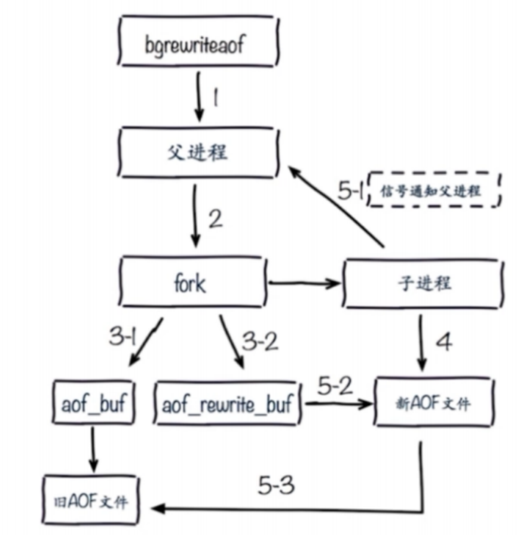

AOF rewrite 重写相关配置

```bash
#同时在执行bgrewriteaof操作和主进程写aof文件的操作，两者都会操作磁盘，而bgrewriteaof往往会涉及大量磁盘操作，这样就会造成主进程在写aof文件的时候出现阻塞的情形,以下参数实现控制
no-appendfsync-on-rewrite no #在aof rewrite期间,是否对aof新记录的append暂缓使用文件同步策略,主要考虑磁盘IO开支和请求阻塞时间。
#默认为no,表示"不暂缓",新的aof记录仍然会被立即同步到磁盘，是最安全的方式，不会丢失数据，但是要忍受阻塞的问题
#为yes,相当于将appendfsync设置为no，这说明并没有执行磁盘操作，只是写入了缓冲区，因此这样并不会造成阻塞（因为没有竞争磁盘），但是如果这个时候redis挂掉，就会丢失数据。丢失多少数据呢？Linux的默认fsync策略是30秒，最多会丢失30s的数据,但由于yes性能较好而且会避免出现阻塞因此比较推荐

#rewrite 即对aof文件进行整理,将空闲空间回收,从而可以减少恢复数据时间
auto-aof-rewrite-percentage 100 #当Aof log增长超过指定百分比例时，重写AOF文件，设置为0表示不自动重写Aof日志，重写是为了使aof体积保持最小，但是还可以确保保存最完整的数据
auto-aof-rewrite-min-size 64mb #触发aof rewrite的最小文件大小
aof-load-truncated yes #是否加载由于某些原因导致的末尾异常的AOF文件(主进程被kill/断电等)，建议yes
```

#### 2.4.2.4 手动执行 AOF 重写 BGREWRITEAOF 命令

```ini
BGREWRITEAOF
时间复杂度： O(N)， N 为要追加到 AOF 文件中的数据数量。
执行一个 AOF文件 重写操作。重写会创建一个当前 AOF 文件的体积优化版本。

即使 BGREWRITEAOF 执行失败，也不会有任何数据丢失，因为旧的 AOF 文件在 BGREWRITEAOF 成功之前不会被修改。

重写操作只会在没有其他持久化工作在后台执行时被触发，也就是说：
如果 Redis 的子进程正在执行快照的保存工作，那么 AOF 重写的操作会被预定(scheduled)，等到保存工作完成之后再执行 AOF 重写。在这种情况下， BGREWRITEAOF 的返回值仍然是 OK ，但还会加上一条额外的信息，说明 BGREWRITEAOF 要等到保存操作完成之后才能执行。在 Redis 2.6 或以上的版本，可以使用 INFO [section] 命令查看 BGREWRITEAOF 是否被预定。

如果已经有别的 AOF 文件重写在执行，那么 BGREWRITEAOF 返回一个错误，并且这个新的 BGREWRITEAOF 请求也不会被预定到下次执行。
从 Redis 2.4 开始， AOF 重写由 Redis 自行触发， BGREWRITEAOF 仅仅用于手动触发重写操作
```

范例: 手动 bgrewriteaof

```bash
127.0.0.1:6379> bgrewriteaof
Background append only file rewriting started
127.0.0.1:6379>

# 7.X 生成一个临时的AOF文件
root@prometheus-221:~ 15:59:17 # ll /apps/redis/data/
总计 83688
drwxr-xr-x 3 redis redis     4096  2月 19 09:41 ./
drwxr-xr-x 7 redis redis     4096  2月  2 11:42 ../
drwxr-xr-x 2 redis redis     4096  2月 19 09:41 appendonlydir/
-rw-r--r-- 1 redis redis       88  2月 19 09:24 dump.rdb
-rw-r--r-- 1 redis redis 85680128  2月 19 09:41 temp-rewriteaof-96239.aof

# 执行完成后incr文件清空，合并到RDB文件中
root@prometheus-221:~ 15:59:17 # ls -l /apps/redis/data/appendonlydir/
total 185416
-rw-r--r-- 1 redis redis 189855678 Oct 19 15:59 appendonly.aof.3.base.rdb
-rw-r--r-- 1 redis redis         0 Oct 19 15:58 appendonly.aof.3.incr.aof
-rw-r--r-- 1 redis redis        88 Oct 19 15:59 appendonly.aof.manifest
root@prometheus-221:~ 15:59:19 #

```

#### 2.4.2.5 AOF 模式优缺点

##### 2.4.2.5.1 AOF 模式优点

- 数据安全性相对较高，根据所使用的fsync策略(fsync是同步内存中redis所有已经修改的文件到存储设备)，默认是appendfsync everysec，即每秒执行一次 fsync,在这种配置下，Redis 仍然可以保持良好的性能，并且就算发生故障停机，也最多只会丢失一秒钟的数据( fsync会在后台线程执行，所以主线程可以继续努力地处理命令请求)

- 由于该机制对日志文件的写入操作采用的是append模式，因此在写入过程中不需要seek, 即使出现宕机现象，也不会破坏日志文件中已经存在的内容。然而如果本次操作只是写入了一半数据就出现了系统崩溃问题，不用担心，在Redis下一次启动之前，可以通过 redis-check-aof 工具来解决数据一致性的问题

- Redis可以在 AOF文件体积变得过大时，自动地在后台对AOF进行重写,重写后的新AOF文件包含了恢复当前数据集所需的最小命令集合。整个重写操作是绝对安全的，因为Redis在创建新 AOF文件的过程中，append模式不断的将修改数据追加到现有的 AOF文件里面，即使重写过程中发生停机，现有的 AOF文件也不会丢失。而一旦新AOF文件创建完毕，Redis就会从旧AOF文件切换到新AOF文件，并开始对新AOF文件进行追加操作。

- AOF包含一个格式清晰、易于理解的日志文件用于记录所有的修改操作。事实上，也可以通过该文件完成数据的重建

  AOF文件有序地保存了对数据库执行的所有写入操作，这些写入操作以Redis协议的格式保存，因此 AOF文件的内容非常容易被人读懂，对文件进行分析(parse)也很轻松。导出（export)AOF文件也非常简单:举个例子，如果不小心执行了FLUSHALL.命令，但只要AOF文件未被重写，那么只要停止服务器，移除 AOF文件末尾的FLUSHAL命令，并重启Redis ,就可以将数据集恢复到FLUSHALL执行之前的状态。

##### 2.4.2.5.2 AOF 模式缺点

- 即使有些操作是重复的也会全部记录，AOF 的文件大小一般要大于 RDB 格式的文件
- AOF 在恢复大数据集时的速度比 RDB 的恢复速度要慢
- 如果 fsync 策略是appendfsync no, AOF保存到磁盘的速度甚至会可能会慢于RDB
- bug 出现的可能性更多

### 2.4.3 RDB 和 AOF 的选择

如果主要充当缓存功能,或者可以承受较长时间,比如数分钟数据的丢失, 通常生产环境一般只需启用RDB即可,此也是默认值

如果一点数据都不能丢失,可以选择同时开启RDB和AOF

==一般不建议只开启AOF==

## 2.5 Redis 常用命令

官网

https://redis.io/commands

### 2.5.1 info

显示当前节点 redis 运行状态信息

```bash
127.0.0.1:6379> info
# Server
redis_version:8.2.1
redis_git_sha1:00000000
redis_git_dirty:1
redis_build_id:28b7a201c4fd458a
redis_mode:standalone
os:Linux 6.8.0-88-generic x86_64
arch_bits:64
monotonic_clock:POSIX clock_gettime
multiplexing_api:epoll
....


# 只显示指定部分的内容
14:59:46 root@redis02:~# redis-cli -a 123456 info server
Warning: Using a password with '-a' or '-u' option on the command line interface may not be safe.
# Server
redis_version:8.2.1
redis_git_sha1:00000000
redis_git_dirty:1
redis_build_id:28b7a201c4fd458a
redis_mode:standalone
os:Linux 6.8.0-88-generic x86_64
arch_bits:64
monotonic_clock:POSIX clock_gettime
multiplexing_api:epoll
atomicvar_api:c11-builtin
gcc_version:13.3.0
process_id:38732
process_supervised:no
run_id:7beeebaf041005b57f81a57ef186a646ab3d6b17
tcp_port:6379
server_time_usec:1764485990698017
uptime_in_seconds:12550
uptime_in_days:0
hz:10
configured_hz:10
lru_clock:2878310
executable:/usr/local/bin/redis-server
config_file:/etc/redis/redis.conf
io_threads_active:0
listener0:name=tcp,bind=0.0.0.0,port=6379

14:59:50 root@redis02:~# redis-cli -a 123456 info cluster
Warning: Using a password with '-a' or '-u' option on the command line interface may not be safe.
# Cluster
cluster_enabled:0
15:00:06 root@redis02:~#
```

### 2.5.2 select

切换数据库，相当于在 MySQL 的 `USE DBNAME` 指令

```bash
root@prometheus-221:~ 16:08:15 # redis-cli -a 123456 
Warning: Using a password with '-a' or '-u' option on the command line interface may not be safe.
127.0.0.1:6379> info cluster
# Cluster
cluster_enabled:0
127.0.0.1:6379> select 0
OK
127.0.0.1:6379> select 1
OK
127.0.0.1:6379[1]> select 3
OK
127.0.0.1:6379[3]> select 15
OK
127.0.0.1:6379[15]> 


# 在 Redis cluster 模式下不支持多个数据库,会出现下面错误
[root@centos8 ~]#redis-cli 
127.0.0.1:6379> info cluster
# Cluster
cluster_enabled:1
127.0.0.1:6379> select 0
OK
127.0.0.1:6379> select 1
(error) ERR SELECT is not allowed in cluster mode
```

### 2.5.3 keys

查看当前库下的所有key，此命令慎用！

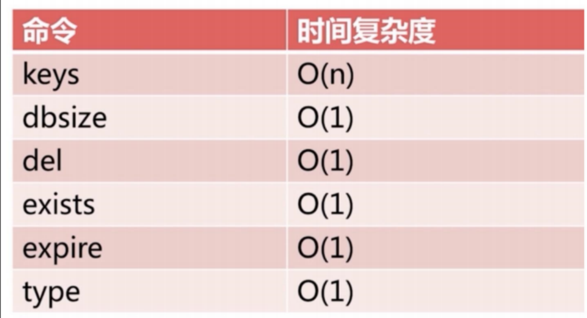

```bash
127.0.0.1:6379[15]> mset one 1 two 2 three 3 four 4  # 一次性设置多个 key
OK
127.0.0.1:6379[15]> keys *   # 匹配数据库中所有的 key
1) "one"
2) "four"
3) "three"
4) "two"
127.0.0.1:6379[15]> keys *o*
1) "one"
2) "four"
3) "two"
127.0.0.1:6379[15]> keys t??
1) "two"
127.0.0.1:6379[15]> keys t*
1) "three"
2) "two"
127.0.0.1:6379[15]>
```

### 2.5.4 bgsave

手动在后台执行RDB持久化操作

```bash
#交互式执行
127.0.0.1:6379[1]> BGSAVE
Background saving started
#非交互式执行
[root@centos8 ~]#ll /var/lib/redis/
total 4
-rw-r--r-- 1 redis redis 326 Feb 18 22:45 dump.rdb
[root@centos8 ~]#redis-cli -h 127.0.0.1 -a '123456' BGSAVE
Warning: Using a password with '-a' or '-u' option on the command line interface 
may not be safe.
Background saving started
[root@centos8 ~]#ll /var/lib/redis/
total 4
-rw-r--r-- 1 redis redis 92 Feb 18 22:54 dump.rdb
```

### 2.5.5 dbsize

返回当前库下的所有 key 数量

```bash
127.0.0.1:6379> DBSIZE
(integer) 4
127.0.0.1:6379> SELECT 1
OK
127.0.0.1:6379[1]> DBSIZE
(integer) 0
```

### 2.5.6 flushdb

强制清空当前库中的所有 key，此命令慎用！

```bash
127.0.0.1:6379[1]> SELECT 0
OK
127.0.0.1:6379> DBSIZE
(integer) 4
127.0.0.1:6379> FLUSHDB
OK
127.0.0.1:6379> DBSIZE
(integer) 0
127.0.0.1:6379>
```

### 2.5.7 flushall

强制清空当前 Redis 服务器所有数据库中的所有 key，即删除所有数据，此命令慎用！

```bash
127.0.0.1:6379> FLUSHALL
OK
#生产建议修改配置使用 rename-command 禁用此命令
vim /etc/redis.conf
rename-command FLUSHALL ""   #flushdb和和AOF功能冲突，需要设置 appendonly no,不区分命令大小写，但和flushall （v7.2.3不冲突）
```

### 2.5.8 shutdown

```bash
可用版本： >= 1.0.0
时间复杂度： O(N)，其中 N 为关机时需要保存的数据库键数量。
SHUTDOWN 命令执行以下操作：
1、关闭 Redis 服务,停止所有客户端连接
2、如果有至少一个保存点在等待，执行 SAVE 命令
3、如果 AOF 选项被打开，更新 AOF 文件
4、关闭 redis 服务器(server)

如果持久化被打开的话， SHUTDOWN 命令会保证服务器正常关闭而不丢失任何数据。
另一方面，假如只是单纯地执行 SAVE 命令，然后再执行 QUIT 命令，则没有这一保证 —— 因为在执行 SAVE 之后、执行 QUIT 之前的这段时间中间，其他客户端可能正在和服务器进行通讯，这时如果执行 QUIT 就会造成数据丢失。

#建议禁用此指令
vim /etc/redis.conf
rename-command shutdown ""
```
### 2.5.9 redis 常用命令进阶整理
>在熟练掌握上面的命令后，在进行后面的命令练习
#### 2.5.9.1 连接与退出命令
| 命令              | 语法               | 作用                     | 示例（结合你的配置）                                                                                                                                                               |
| --------------- | ---------------- | ---------------------- | ------------------------------------------------------------------------------------------------------------------------------------------------------------------------ |
| `redis-cli`     | `redis-cli [选项]` | 启动 Redis 客户端（连接服务）     | 1. 本地普通连接：`redis-cli -h 127.0.0.1 -p 6379 -a StrongPass@2025`<br><br>2. TLS 连接：`redis-cli -h 127.0.0.1 -p 6380 --tls --cacert /etc/redis/ca-cert.pem -a StrongPass@2025` |
| `auth`          | `auth 密码`        | 连接后输入密码（若未在命令行指定 `-a`） | 连接后执行：`auth StrongPass@2025` → 返回 `OK` 表示认证成功                                                                                                                            |
| `quit` / `exit` | `quit` 或 `exit`  | 优雅退出客户端连接              | `127.0.0.1:6379> quit` → 关闭连接                                                                                                                                            |
| `ping`          | `ping [消息]`      | 测试服务连通性（心跳检测）          | `127.0.0.1:6379> ping` → 返回 `PONG`（服务正常）；`ping "hello"` → 返回 `"hello"`                                                                                                   |
#### 2.5.9.2 键（Key）操作命令（高频）
| 命令         | 语法                              | 作用                         | 示例                                                                                         |
| ---------- | ------------------------------- | -------------------------- | ------------------------------------------------------------------------------------------ |
| `keys`     | `keys 模式`                       | 模糊匹配键（支持 `*` `?` `[]` 通配符） | 1. 匹配所有键：`keys *`<br><br>2. 匹配以 `user_` 开头的键：`keys user_*`<br><br>⚠️ 注意：生产环境慎用（遍历所有键，阻塞服务） |
| `exists`   | `exists 键1 [键2 ...]`            | 检查键是否存在（返回存在的数量）           | `exists user_100` → 返回 `1`（存在）/ `0`（不存在）；`exists user_100 product_200` → 返回 `2`            |
| `del`      | `del 键1 [键2 ...]`               | 删除指定键（返回删除成功的数量）           | `del user_100` → 返回 `1`（删除成功）；`del non_exist_key` → 返回 `0`                                 |
| `unlink`   | `unlink 键1 [键2 ...]`            | 异步删除大键（非阻塞，Redis 4.0+）     | `unlink large_key` → 适合删除占用内存大的键（避免阻塞主线程）                                                  |
| `expire`   | `expire 键 秒数`                   | 设置键的过期时间（单位：秒）             | `expire user_100 3600` → 1 小时后自动删除 `user_100`                                              |
| `expireat` | `expireat 键 时间戳`                | 按 Unix 时间戳设置过期时间           | `expireat user_100 1735689600` → 2025-01-01 00:00 自动删除                                     |
| `ttl`      | `ttl 键`                         | 查看键的剩余过期时间（秒）              | 返回值：`-1`（无过期）、`-2`（已过期 / 不存在）、正数（剩余秒数）                                                     |
| `persist`  | `persist 键`                     | 取消键的过期时间（转为永久存在）           | `persist user_100` → 返回 `1`（取消成功）                                                          |
| `rename`   | `rename 原键 新键`                  | 重命名键（若新键存在则覆盖）             | `rename user_100 user_100_new` → 重命名键                                                      |
| `renamenx` | `renamenx 原键 新键`                | 仅当新键不存在时重命名（避免覆盖）          | `renamenx user_100 user_100_new` → 新键不存在返回 `1`，存在返回 `0`                                    |
| `type`     | `type 键`                        | 查看键对应的值类型（字符串 / 哈希 / 列表等）  | `type user_100` → 返回 `string`（字符串类型）、`hash`（哈希类型）等                                         |
| `scan`     | `scan 游标 [MATCH 模式] [COUNT 数量]` | 迭代遍历键（非阻塞，替代 `keys`）       | `scan 0 MATCH user_* COUNT 10` → 从游标 0 开始，匹配 `user_` 开头的键，每次返回 10 个                        |
#### 2.5.9.3 服务器管理命令（运维高频）
用于监控 Redis 状态、调整配置、管理服务：

| 命令               | 语法                  | 作用                      | 示例与说明                                                                                                                                                                                    |
| ---------------- | ------------------- | ----------------------- | ---------------------------------------------------------------------------------------------------------------------------------------------------------------------------------------- |
| `info`           | `info [section]`    | 查看服务器状态信息（支持按模块查询）      | 1. 查看所有信息：`info`<br><br>2. 查看内存信息：`info memory`<br><br>3. 查看持久化信息：`info persistence`<br><br>4. 查看客户端连接：`info clients`                                                                    |
| `config get`     | `config get 配置项`    | 查看配置项当前值（支持 `*` 通配符）    | `config get protected-mode` → 返回 `1) "protected-mode" 2) "0"`（关闭状态）；`config get maxmemory` → 查看最大内存限制                                                                                    |
| `config set`     | `config set 配置项 值`  | 动态修改配置项（无需重启，临时生效）      | `config set loglevel warning` → 日志级别改为警告；`config rewrite` → 持久化到配置文件（永久生效）                                                                                                               |
| `config rewrite` | `config rewrite`    | 将动态修改的配置写入配置文件（永久生效）    | 执行 `config set` 后，必须执行此命令，否则重启后配置失效                                                                                                                                                      |
| `client list`    | `client list`       | 查看所有客户端连接信息（IP、端口、状态等）  | `client list` → 返回每个连接的详细信息（如 `id=123 addr=192.168.1.100:54321 fd=6 name= age=300 idle=0 flags=N db=0 sub=0 psub=0 multi=-1 qbuf=0 qbuf-free=32768 obl=0 oll=0 omem=0 events=r cmd=get`） |
| `client kill`    | `client kill IP:端口` | 强制关闭指定客户端连接             | `client kill 192.168.1.100:54321` → 关闭该 IP: 端口的连接                                                                                                                                        |
| `slowlog`        | `slowlog get [数量]`  | 查看慢查询日志（默认阈值 10 毫秒）     | `slowlog get 10` → 查看最近 10 条慢查询；`slowlog reset` → 清空慢查询日志                                                                                                                                |
| `stats reset`    | `stats reset`       | 重置服务器统计信息（如命令执行次数、连接数等） | `stats reset` → 重置后 `info stats` 中的统计值重新计数                                                                                                                                               |
|                  |                     |                         |                                                                                                                                                                                          |

#### 2.5.9.4 安全命令（适配你的密码配置）
|命令|语法|作用|示例|
|---|---|---|---|
|`requirepass`|`config set requirepass 新密码`|动态修改访问密码（临时生效）|`config set requirepass NewStrongPass@2025` → 修改密码；`config rewrite` → 永久生效|
|`config get requirepass`|`config get requirepass`|查看当前密码（需先认证）|`auth StrongPass@2025` → `config get requirepass` → 返回密码值|
#### 2.5.9.5 持久化命令（控制 RDB/AOF 持久化，避免数据丢失）

|命令|语法|作用|示例与注意事项|
|---|---|---|---|
|`save`|`save`|同步执行 RDB 持久化（阻塞服务）|`save` → 立即生成 RDB 快照（`dump.rdb`）；⚠️ 生产慎用（阻塞主线程，大内存时耗时久）|
|`bgsave`|`bgsave`|异步执行 RDB 持久化（非阻塞）|`bgsave` → 后台生成 RDB 快照（推荐生产使用），返回 `Background saving started`|
|`lastsave`|`lastsave`|查看最后一次 RDB 持久化的时间戳|`lastsave` → 返回 Unix 时间戳（如 `1735689600`），可转换为日期|
|`bgrewriteaof`|`bgrewriteaof`|异步重写 AOF 文件（压缩体积，Redis 2.4+）|启用 AOF 后执行：`bgrewriteaof` → 优化 AOF 文件大小（去除冗余命令）|
|`appendonly`|`config set appendonly yes/no`|动态启用 / 禁用 AOF 持久化（无需重启）|`config set appendonly yes` → 启用 AOF；`config rewrite` → 持久化到配置文件（避免重启失效）|

#### 2.5.9.6 过期时间命令（补充键操作，强化生命周期管理）

| 命令          | 语法                  | 作用                       | 示例                                                   |
| ----------- | ------------------- | ------------------------ | ---------------------------------------------------- |
| `pexpire`   | `pexpire 键 毫秒数`     | 设置过期时间（单位：毫秒，Redis 2.6+） | `pexpire code 60000` → 60 秒（60000 毫秒）过期              |
| `pexpireat` | `pexpireat 键 毫秒时间戳` | 按毫秒时间戳设置过期时间             | `pexpireat code 1735689600000` → 2025-01-01 00:00 过期 |
| `pttl`      | `pttl 键`            | 查看剩余过期时间（毫秒）             | 返回 `12345`（剩余 12.345 秒）、`-1`（无过期）、`-2`（已过期）          |

## 2.6 redis 数据类型

参考资料：http://www.redis.cn/topics/data-types.html

相关命令参考: http://redisdoc.com/


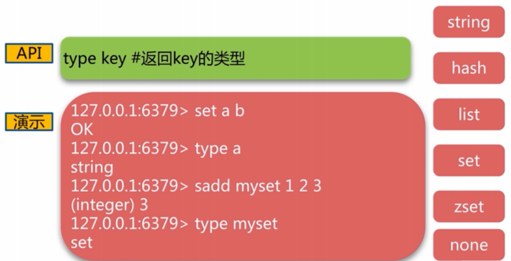

### 2.6.1 字符串 string

字符串是一种最基本的Redis值类型。Redis字符串是二进制安全的，这意味着一个Redis字符串能包含任意类型的数据，例如： 一张JPEG格式的图片或者一个序列化的Ruby对象。一个字符串类型的值最多能存储512M字节的内容。**Redis 中所有 key 都是字符串类型的**。此数据类型最为常用

#### 2.6.1.1 创建一个 key

set 指令可以创建一个key 并赋值, 使用格式

```ini
SET key value [EX seconds] [PX milliseconds] [NX|XX]
时间复杂度： O(1)
将字符串值 value 关联到 key 。

如果 key 已经持有其他值， SET 就覆写旧值， 无视类型。

当 SET 命令对一个带有生存时间（TTL）的键进行设置之后， 该键原有的 TTL 将被清除。从 Redis 2.6.12 版本开始， SET 命令的行为可以通过一系列参数来修改：EX seconds ： 将键的过期时间设置为 seconds 秒。 执行 SET key value EX seconds 的效果等同于执行 SETEX key seconds value 。

PX milliseconds ： 将键的过期时间设置为 milliseconds 毫秒。 执行 SET key value PX milliseconds 的效果等同于执行 PSETEX key milliseconds value 。

NX ： 只在键不存在时， 才对键进行设置操作。 执行 SET key value NX 的效果等同于执行 SETNX key value 。

XX ： 只在键已经存在时， 才对键进行设置操作。
```

```bash
# 不论 key 是否存在都设置
127.0.0.1:6379[15]> set key1 value1
OK
127.0.0.1:6379[15]> get key1
"value1"
127.0.0.1:6379[15]> type key1   # 查看数据类型
string 
127.0.0.1:6379[15]> 

127.0.0.1:6379[15]> set title ceo ex 3  # 设置自动过期时间3s
OK
127.0.0.1:6379[15]> get title
"ceo"
127.0.0.1:6379[15]> get title
"ceo"
127.0.0.1:6379[15]> get title
"ceo"
127.0.0.1:6379[15]> get title
(nil)
127.0.0.1:6379[15]>

# key 大小写敏感
127.0.0.1:6379> get name
(nil)
127.0.0.1:6379> set name xixi
OK
127.0.0.1:6379> get name
"xixi"
127.0.0.1:6379> get NAME
"haha"

# key不存在,才设置,相当于add
127.0.0.1:6379[15]> set title ceo 
OK
127.0.0.1:6379[15]> get title
"ceo"
127.0.0.1:6379[15]> setnx title cto  # 此时 key 存在，不会进行设置 == set title cto nx
(integer) 0
127.0.0.1:6379[15]> get title
"ceo"
127.0.0.1:6379[15]> 


# key存在,才设置,相当于update
127.0.0.1:6379[15]> set title cto  xx
OK
127.0.0.1:6379[15]> get title
"cto"
127.0.0.1:6379[15]> 
```

#### 2.6.1.2 查看 key 值

```bash
127.0.0.1:6379> get key1
"value1"
#get只能查看一个key的值
127.0.0.1:6379> get name age
(error) ERR wrong number of arguments for 'get' command
```

#### 2.6.1.3 删除 key

```bash
127.0.0.1:6379> DEL key1
(integer) 1

# 一次性删除多个 key
127.0.0.1:6379> DEL key1 key2
(integer) 2
```

#### 2.6.1.4 批量设置多个 key

```bash
127.0.0.1:6379[15]> MSET key1 value1 key2 value2
OK
127.0.0.1:6379[15]> get key1
"value1"
127.0.0.1:6379[15]> get key2
"value2"
127.0.0.1:6379[15]>
```

#### 2.6.1.5 批量获取多个 key

```bash
127.0.0.1:6379[15]> mget key1 key2
1) "value1"
2) "value2"
127.0.0.1:6379[15]>

127.0.0.1:6379> KEYS n*
1) "n1"
2) "name"
127.0.0.1:6379> KEYS *
1) "k2"
2) "k1"
3) "key1"
4) "key2"
5) "n1"
6) "name"
7) "k3"
8) "title"
```

#### 2.6.1.6 追加 key 数据

```bash
127.0.0.1:6379[15]> get key1
"value1"
127.0.0.1:6379[15]> append key1 "append new data"
(integer) 21
127.0.0.1:6379[15]> get key1
"value1append new data"
127.0.0.1:6379[15]>
```

#### 2.6.1.7 设置新值并返回旧值

```bash
127.0.0.1:6379[15]> set name zhangsan
OK
127.0.0.1:6379[15]> get name
"zhangsan"
127.0.0.1:6379[15]> getset name lisi
"zhangsan"
127.0.0.1:6379[15]> get name
"lisi"
127.0.0.1:6379[15]> 
```

####  2.6.1.8 返回字符串 key 对应值的字节数

```bash
127.0.0.1:6379[15]> set name zhangsan
OK
127.0.0.1:6379[15]> get name
"zhangsan"
127.0.0.1:6379[15]> strlen name
(integer) 8
127.0.0.1:6379[15]> append name  " is student"
(integer) 19
127.0.0.1:6379[15]> strlen name    # 返回字节数
(integer) 19
127.0.0.1:6379[15]> 


127.0.0.1:6379[15]> set name "张三"
OK
127.0.0.1:6379[15]> get name
"\xe5\xbc\xa0\xe4\xb8\x89"
127.0.0.1:6379[15]> strlen name
(integer) 6
127.0.0.1:6379[15]> 
```

#### 2.6.1.9 判断 key 是否存在

```bash
127.0.0.1:6379[15]> 
127.0.0.1:6379[15]> set name zhangsan ex 10 
OK
127.0.0.1:6379[15]> set age 10
OK
127.0.0.1:6379[15]> exists name   # 0 表示不存在，1 表示存在
(integer) 1
127.0.0.1:6379[15]> exists name
(integer) 0
127.0.0.1:6379[15]> exists age 
(integer) 1
127.0.0.1:6379[15]> exists age name  # 表示有一个存在
(integer) 1
127.0.0.1:6379[15]> set name zhangsan ex 10 
OK
127.0.0.1:6379[15]> exists age name   # 表示两个都存在 
(integer) 2
127.0.0.1:6379[15]>
```

#### 2.6.1.10 获取 key 过期时长

```bash
ttl key #查看key的剩余生存时间,如果key过期后,会自动删除
-1 #返回值表示永不过期，默认创建的key是永不过期，重新对key赋值，也会从有剩余生命周期变成永不过期
-2 #返回值表示没有此key
num #key的剩余有效期  s

127.0.0.1:6379[15]> set name zhangsan ex 10 
OK
127.0.0.1:6379[15]> ttl name
(integer) 7
127.0.0.1:6379[15]> ttl name
(integer) 6
127.0.0.1:6379[15]> ttl name
(integer) 5
127.0.0.1:6379[15]> ttl name
(integer) 2
127.0.0.1:6379[15]> ttl name
(integer) -2
127.0.0.1:6379[15]> ttl age 
(integer) -1
127.0.0.1:6379[15]> 
```

#### 2.6.1.11 重置 key 过期时长

```bash
127.0.0.1:6379[15]> set name zhangsan ex 10 
OK
127.0.0.1:6379[15]> ttl name
(integer) 8
127.0.0.1:6379[15]> expire name 1000
(integer) 1
127.0.0.1:6379[15]> ttl name
(integer) 997
127.0.0.1:6379[15]> 
```

#### 2.6.1.12 取消 key 的期限

```bash
# 即永不过期
127.0.0.1:6379[15]> ttl name
(integer) 955
127.0.0.1:6379[15]> persist name
(integer) 1
127.0.0.1:6379[15]> ttl name
(integer) -1
127.0.0.1:6379[15]> 
```

#### 2.6.1.13 数字递增

利用 INCR 命令簇（INCR, DECR, INCRBY,DECRBY)来把字符串当作原子计数器使用

```bash
127.0.0.1:6379[15]> set num 10
OK
127.0.0.1:6379[15]> incr num
(integer) 11
127.0.0.1:6379[15]> get num
"11"
127.0.0.1:6379[15]> incr num
(integer) 12
127.0.0.1:6379[15]> get num
"12"
127.0.0.1:6379[15]>
```

#### 2.6.1.14 数字递减

```bash
127.0.0.1:6379[15]> get num
"12"
127.0.0.1:6379[15]> decr num
(integer) 11
127.0.0.1:6379[15]> get num
"11"
127.0.0.1:6379[15]> decr num
(integer) 10
127.0.0.1:6379[15]> get num
"10"
127.0.0.1:6379[15]>
```

#### 2.6.1.15 数字增加

将key对应的数字加decrement(可以是负数)。如果key不存在，操作之前，key就会被置为0。如果key的value类型错误或者是个不能表示成数字的字符串，就返回错误。这个操作最多支持64位有符号的正型数字。

```bash
127.0.0.1:6379[15]> set num 10
OK
127.0.0.1:6379[15]> get num
"10"
127.0.0.1:6379[15]> incrby num 5
(integer) 15
127.0.0.1:6379[15]> get num
"15"
127.0.0.1:6379[15]> incrby num -10
(integer) 5
127.0.0.1:6379[15]> get num
"5"
127.0.0.1:6379[15]> 

# 对于不存在的 key
127.0.0.1:6379[15]> get num1
(nil)
127.0.0.1:6379[15]> incrby num1 5
(integer) 5
127.0.0.1:6379[15]> get num1
"5"
127.0.0.1:6379[15]>
```

#### 2.6.1.16 数字减少

decrby 可以减小数值(也可以增加)

```bash
127.0.0.1:6379[15]> set num 10
OK
127.0.0.1:6379[15]> get num
"10"
127.0.0.1:6379[15]> decrby num 3
(integer) 7
127.0.0.1:6379[15]> get num
"7"

# 对于不存在的 key
127.0.0.1:6379[15]> get num2
(nil)
127.0.0.1:6379[15]> decrby num2 3
(integer) -3
127.0.0.1:6379[15]> get num2
"-3"
127.0.0.1:6379[15]>
```

### 2.6.2 列表 list


Redis列表实际就是简单的字符串数组，按照插入顺序进行排序.

支持双向读写,可以添加一个元素到列表的头部（左边）或者尾部（右边），一个列表最多可以包含 2^32-1=4294967295 个元素

每个列表元素用下标来标识,下标 0 表示列表的第一个元素，以 1 表示列表的第二个元素，以此类推。

也可以使用负数下标，以 -1 表示列表的最后一个元素， -2 表示列表的倒数第二个元素，元素值可以重复，常用于存入日志等场景，此数据类型比较常用

列表特点

- 有序
- value可重复
- 左右都可以操作

#### 2.6.2.1 创建列表和数据

LPUSH 和 RPUSH 都可以插入列表

```ini
LPUSH key value [value …]  
时间复杂度： O(1)
将一个或多个值 value 插入到列表 key 的表头


如果有多个 value 值，那么各个 value 值按从左到右的顺序依次插入到表头： 比如说，对空列表 mylist 执行命令 LPUSH mylist a b c ，列表的值将是 c b a ，这等同于原子性地执行 LPUSH mylist a 、 LPUSH mylist b 和 LPUSH mylist c 三个命令。

如果 key 不存在，一个空列表会被创建并执行 LPUSH 操作。
当 key 存在但不是列表类型时，返回一个错误。

RPUSH key value [value …]
时间复杂度： O(1)
将一个或多个值 value 插入到列表 key 的表尾(最右边)。
如果有多个 value 值，那么各个 value 值按从左到右的顺序依次插入到表尾：比如对一个空列表 mylist 执行 RPUSH mylist a b c ，得出的结果列表为 a b c ，等同于执行命令 RPUSH mylist a 、RPUSH mylist b 、 RPUSH mylist c 。

如果 key 不存在，一个空列表会被创建并执行 RPUSH 操作。
当 key 存在但不是列表类型时，返回一个错误。
```

```bash
# 从左边添加数据，已添加的需向右移
# 根据顺序逐个写入 name，最后的 wangwu 会在列表的最左侧。
127.0.0.1:6379[15]> lpush name zhangsan lisi wangwu
(integer) 3

127.0.0.1:6379[15]> type name
list

# 从右边添加数据
127.0.0.1:6379[15]> rpush course linux python java
(integer) 3
127.0.0.1:6379[15]> type course
list
127.0.0.1:6379[15]> 


# 对于不是列表类型的数据，强制改为列表会报错
127.0.0.1:6379[15]> lpush name zhangsan lisi wangwu
(error) WRONGTYPE Operation against a key holding the wrong kind of value
127.0.0.1:6379[15]> get name
"zhangsan"
127.0.0.1:6379[15]> type name
string
127.0.0.1:6379[15]> 
```

#### 2.6.2.2 列表追加新数据

```bash
127.0.0.1:6379[15]> lpush name xxxx 
(integer) 4

127.0.0.1:6379[15]> rpush course go
(integer) 5
127.0.0.1:6379[15]>
```

#### 2.6.2.3 获取列表长度

```bash
127.0.0.1:6379[15]> llen course 
(integer) 5
127.0.0.1:6379[15]> llen name
(integer) 4
127.0.0.1:6379[15]>
```

#### 2.6.2.4 获取列表指定位置数据


```bash
127.0.0.1:6379[15]>  lpush list1 a b c d
(integer) 4
127.0.0.1:6379[15]> lindex list1 0  # 获取编号为 0  的元素
"d" 
127.0.0.1:6379[15]> lindex list1 1  # 获取编号为 1 的元素
"c"
127.0.0.1:6379[15]> lindex list1 3
"a"
127.0.0.1:6379[15]>

# 元素从0开始编号
127.0.0.1:6379[15]>  lpush list1 a b c d
(integer) 4
127.0.0.1:6379[15]> lrange list1 1 3
1) "c"
2) "b"
3) "a"
127.0.0.1:6379[15]> 
127.0.0.1:6379[15]> lrange list1 0 3  # 获取所有元素
1) "d"
2) "c"
3) "b"
4) "a"
127.0.0.1:6379[15]> lrange list1 0 -1
1) "d"
2) "c"
3) "b"
4) "a"
127.0.0.1:6379[15]> 
```

#### 2.6.2.5 修改指定列表所有值

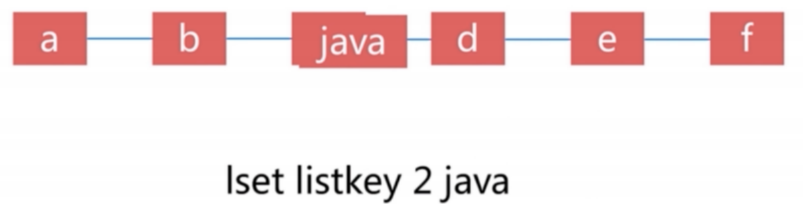

```bash
127.0.0.1:6379[15]>  lpush list1 a b c d
(integer) 4
127.0.0.1:6379[15]> lset list1 1 cccc
OK

127.0.0.1:6379[15]> lindex list1 1
"cccc"
127.0.0.1:6379[15]> 
```

#### 2.6.2.6 删除列表数据

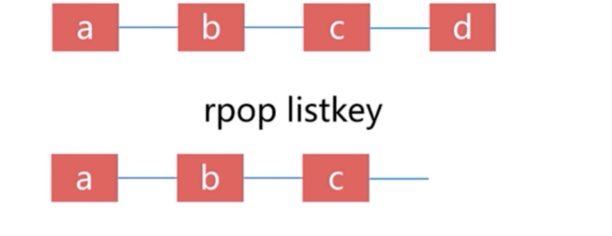

```bash
127.0.0.1:6379[15]> lrange list1 0 -1
1) "d"
2) "cccc"
3) "b"
4) "a" 
127.0.0.1:6379[15]> lpop list1     # 弹出左边第一个元素，即删除第一个
"d"
127.0.0.1:6379[15]> lrange list1 0 -1
1) "cccc"
2) "b"
3) "a"
127.0.0.1:6379[15]> 


127.0.0.1:6379[15]> rpop list1 
"a"
127.0.0.1:6379[15]> lrange list1 0 -1  # 弹出右边第一个元素，即删除最后一个
1) "cccc"
2) "b"
127.0.0.1:6379[15]> 


# LTRIM 对一个列表进行修剪(trim)，让列表只保留指定区间内的元素，不在指定区间之内的元素都将被删除
127.0.0.1:6379[15]> lpush list1 a b c d
(integer) 4
127.0.0.1:6379[15]> lrange list1 0 -1
1) "d"
2) "c"
3) "b"
4) "a"
127.0.0.1:6379[15]> ltrim list1 1 3
OK
127.0.0.1:6379[15]> lrange list1 0 -1
1) "c"
2) "b"
3) "a"
127.0.0.1:6379[15]> 

# 删除 list
127.0.0.1:6379[15]> del list1
(integer) 1
127.0.0.1:6379[15]> lrange list1 0 -1
(empty array)
127.0.0.1:6379[15]>
```

### 2.6.3 集合 set


Set 是一个无序的字符串合集

同一个集合中的每个元素是唯一无重复的

支持在两个不同的集合中对数据进行逻辑处理，常用于取交集,并集,统计等场景,例如: 实现共同的朋友

集合特点

- 无序
- 无重复
- 集合间操作

#### 2.6.3.1 创建集合

```bash
127.0.0.1:6379[15]> sadd set1 value1
(integer) 1
127.0.0.1:6379[15]> sadd set2 v2 v3
(integer) 2
127.0.0.1:6379[15]> type set1
set
127.0.0.1:6379[15]> type set2
set
127.0.0.1:6379[15]> 

```

#### 2.6.3.2 集合中追加数据

```bash
# 追加时，只能追加不存在的数据，不能追加已经存在的数值
127.0.0.1:6379[15]> sadd set1 v2 v3 v4
(integer) 3
127.0.0.1:6379[15]> sadd set2 v2 v3 v4  # set2 中已经有 v2 v3 了，所以只追加 v4
(integer) 1
127.0.0.1:6379[15]>
```

#### 2.6.3.3 获取集合中所有数据

```bash
127.0.0.1:6379[15]> smembers set1
1) "v4"
2) "v2"
3) "value1"
4) "v3"
127.0.0.1:6379[15]> smembers set2
1) "v4"
2) "v2"
3) "v3"
127.0.0.1:6379[15]>
```

#### 2.6.3.4 删除集合中的元素

```bash
127.0.0.1:6379[15]> sadd goods mobile laptop car
(integer) 3
127.0.0.1:6379[15]> srem goods car
(integer) 1
127.0.0.1:6379[15]> smembers goods
1) "mobile"
2) "laptop"
127.0.0.1:6379[15]>
```

#### 2.6.3.5 取集合交集

交集：同时属于集合A且属于集合B的元素

可以实现共同的朋友

```bash
127.0.0.1:6379[15]> smembers set1
1) "v4"
2) "v2"
3) "value1"
4) "v3"
127.0.0.1:6379[15]> smembers set2
1) "v4"
2) "v2"
3) "v3"
127.0.0.1:6379[15]> sinter set1 set2
1) "v4"
2) "v2"
3) "v3"
127.0.0.1:6379[15]>
```

#### 2.6.3.6 取集合并集

并集：属于集合A或者属于集合B的元素

```bash
127.0.0.1:6379[15]> sunion set1 set2
1) "v4"
2) "v2"
3) "value1"
4) "v3"
127.0.0.1:6379[15]>
```

#### 2.6.3.7 取集合差集

差集：属于集合A但不属于集合B的元素

可以实现我的朋友的朋友

```bash
127.0.0.1:6379[15]> sdiff set1 set2
1) "value1"
127.0.0.1:6379[15]> sdiff set2 set1
(empty array)
127.0.0.1:6379[15]>
```

### 2.6.4 有序集合 sorted set

Redis有序集合和Redis集合类似，是不包含相同字符串的合集。

它们的差别是，每个有序集合的成员都关联着一个双精度浮点型的评分

这个评分用于把有序集合中的成员按最低分到最高分排序。

有序集合的成员不能重复,但评分可以重复,一个有序集合中最多的成员数为 2^32 - 1=4294967295个，经常用于排行榜的场景


有序集合特点

- 有序
- 无重复元素
- 每个元素是由score和value组成
- score 可以重复
- value 不可以重复

#### 2.6.4.1 创建有序集合

```bash
127.0.0.1:6379[15]> zadd zset1 1 v1   # 分数为 1
(integer) 1
127.0.0.1:6379[15]> zadd zset1 2 v2
(integer) 1
127.0.0.1:6379[15]> zadd zset1 2 v3  # 分数可以重复，但是值不能重复
(integer) 1
127.0.0.1:6379[15]> zadd zset1 3 v4
(integer) 1
127.0.0.1:6379[15]> zadd zset1 3 v4
(integer) 0
127.0.0.1:6379[15]>
```

#### 2.6.4.2 实现排名

```bash
127.0.0.1:6379[15]> ZADD course 90 linux 99 go 60 python 50 cloud
(integer) 4
127.0.0.1:6379[15]> zrange course 0 -1  # 正序排序后显示集合内所有的key,按score从小到大显示
1) "cloud"
2) "python"
3) "linux"
4) "go"
127.0.0.1:6379[15]> zrevrange course 0 -1  # 倒序排序后显示集合内所有的key,score从大到小显示
1) "go"
2) "linux"
3) "python"
4) "cloud"
127.0.0.1:6379[15]>

# 正序显示指定集合内所有key和得分情况
127.0.0.1:6379[15]> zrange course 0 -1 withscores
1) "cloud"
2) "50"
3) "python"
4) "60"
5) "linux"
6) "90"
7) "go"
8) "99"
# 倒序显示指定集合内所有key和得分情况
127.0.0.1:6379[15]> zrevrange course 0 -1 withscores
1) "go"
2) "99"
3) "linux"
4) "90"
5) "python"
6) "60"
7) "cloud"
8) "50"
127.0.0.1:6379[15]> 
```

#### 2.6.4.3 查看集合的成员个数

```bash
127.0.0.1:6379[15]> zcard course
(integer) 4
127.0.0.1:6379[15]> zcard zset1
(integer) 4
127.0.0.1:6379[15]>
```

#### 2.6.4.4 基于索引查找数据

```bash
127.0.0.1:6379[15]> zrange course 0 2
1) "cloud"
2) "python"
3) "linux"
127.0.0.1:6379[15]> zrange course 0 10  # 超出索引范围不会报错
1) "cloud"
2) "python"
3) "linux"
4) "go"
127.0.0.1:6379[15]>
```

#### 2.6.4.5 查询指定数据的排名

```bash
127.0.0.1:6379[15]>  ZADD course 90 linux 99 go 60 python 50 cloud
(integer) 4
127.0.0.1:6379[15]> zrank course go
(integer) 3
127.0.0.1:6379[15]> zrank course cloud
(integer) 0
127.0.0.1:6379[15]>
```

#### 2.6.4.6 获取分数

```bash
127.0.0.1:6379[15]> zscore course cloud
"50"

```

#### 2.6.4.7 删除元素

```bash
127.0.0.1:6379[15]> zrange course 0 -1
1) "cloud"
2) "python"
3) "linux"
4) "go"
127.0.0.1:6379[15]> zrem course cloud
(integer) 1
127.0.0.1:6379[15]> zrange course 0 -1
1) "python"
2) "linux"
3) "go"
127.0.0.1:6379[15]>
```

### 2.6.5 哈希 hash

hash 即字典, 用于保存字符串字段field和字符串值value之间的映射，即key/value做为数据部分

hash特别适合用于存储对象场景.

一个hash最多可以包含 2^32-1 个key/value键值对

哈希特点

- 无序
- K/V 对
- 适用于存放相关的数据

#### 2.6.5.1 创建 hash

```ini
HSET hash field value
时间复杂度： O(1)
将哈希表 hash 中域 field 的值设置为 value 。
如果给定的哈希表并不存在， 那么一个新的哈希表将被创建并执行 HSET 操作。
如果域 field 已经存在于哈希表中， 那么它的旧值将被新值 value 覆盖。
```

```bash
# 创建 hash
127.0.0.1:6379[15]> hset 9527 name xixi age 20
(integer) 2
127.0.0.1:6379[15]> type 9527  # 查看类型
hash
127.0.0.1:6379[15]> hgetall 9527  # 获取类型
1) "name"
2) "xixi"
3) "age"
4) "20"

# 追加数据
127.0.0.1:6379[15]> hset 9527 gender male
(integer) 1
127.0.0.1:6379[15]> hgetall 9527
1) "name"
2) "xixi"
3) "age"
4) "20"
5) "gender"
6) "male"
127.0.0.1:6379[15]>
```

#### 2.6.5.2 查看 hash 的指定 field 的 value

```bash
127.0.0.1:6379[15]> hget 9527 name
"xixi"
127.0.0.1:6379[15]> hget 9527 gender
"male"
127.0.0.1:6379[15]> 
```

#### 2.6.5.3 删除 hash 的指定的 field/value

```bash
127.0.0.1:6379[15]> hdel 9527 age 
(integer) 1
127.0.0.1:6379[15]> hgetall 9527
1) "name"
2) "xixi"
3) "gender"
4) "male"
127.0.0.1:6379[15]>
```

#### 2.6.5.4 批量设置 hash key 的多个 field 和 value

```bash
127.0.0.1:6379[15]>  HMSET 9527  age 50 city hongkong
OK
127.0.0.1:6379[15]> hgetall 9527
1) "name"
2) "xixi"
3) "gender"
4) "male"
5) "age"
6) "50"
7) "city"
8) "hongkong"
127.0.0.1:6379[15]> 
```

#### 2.6.5.5 查看 hash 所有的 field

```bash
127.0.0.1:6379[15]> hkeys 9527
1) "name"
2) "gender"
3) "age"
4) "city"
127.0.0.1:6379[15]>
```

#### 2.6.5.6 查看 hash 所有的 value

```bash
127.0.0.1:6379[15]> hvals 9527
1) "xixi"
2) "male"
3) "50"
4) "hongkong"
127.0.0.1:6379[15]>
```

#### 2.6.5.7 删除 hash

```bash
127.0.0.1:6379[15]> del 9527
(integer) 1
127.0.0.1:6379[15]> hvals 9527
(empty array)
127.0.0.1:6379[15]> HMGET 9527 name city
1) (nil)
2) (nil)
127.0.0.1:6379[15]> exists 9527
(integer) 0
127.0.0.1:6379[15]> 

```

## 2.7 消息队列

消息队列: 把要传输的数据放在队列中,从而实现应用之间的数据交换

常用功能: 可以实现多个应用系统之间的解耦,异步,削峰/限流等

常用的消息队列应用: Kafka,RabbitMQ,Redis


消息队列分为两种

- 生产者/消费者模式: Producer/Consumer
- 发布者/订阅者模式: Publisher/Subscriber

### 2.7.1 生产者消费者模式

#### 2.7.1.1 模式说明

生产者消费者模式下，多个消费者同时监听一个频道(redis用队列实现)，但是生产者产生的一个消息只能被最先抢到消息的一个消费者消费一次,队列中的消息由可以多个生产者写入，也可以有不同的消费者取出进行消费处理.此模式应用广泛

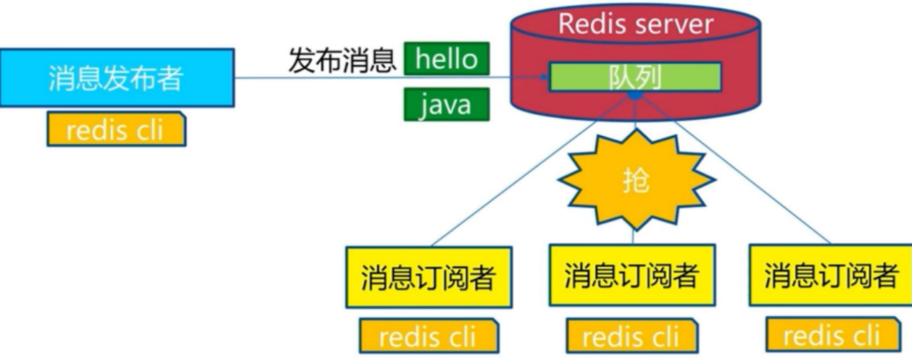

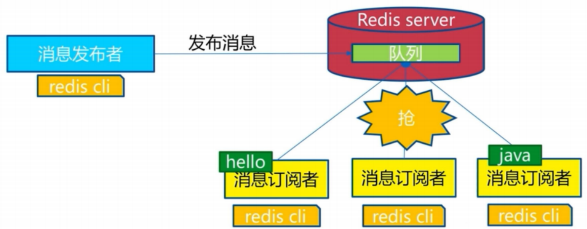

#### 2.7.1.2 生产者生成消息

```bash
127.0.0.1:6379> lpush channel1 message1
(integer) 1
127.0.0.1:6379> lpush channel1 message2
(integer) 2
127.0.0.1:6379> lpush channel1 message3
(integer) 3
127.0.0.1:6379> lpush channel1 message4
(integer) 4
127.0.0.1:6379> lpush channel1 message5
(integer) 5
127.0.0.1:6379> lpush channel1 message6
(integer) 6
127.0.0.1:6379> 

```

#### 2.7.1.3 获取所有消息

```bash
127.0.0.1:6379> lrange channel1 0 -1
1) "message6"
2) "message5"
3) "message4"
4) "message3"
5) "message2"
6) "message1"
127.0.0.1:6379> 
```

#### 2.7.1.4 消费者消费消息

```bash
127.0.0.1:6379> rpop channel1   # 基于实现消息队列的先进先出原则，从管道的右侧消费
"message1"
127.0.0.1:6379> rpop channel1
"message2"
127.0.0.1:6379> rpop channel1
"message3"
127.0.0.1:6379> rpop channel1
"message4"
127.0.0.1:6379> rpop channel1
"message5"
127.0.0.1:6379> rpop channel1
"message6"
127.0.0.1:6379> rpop channel1
(nil)
127.0.0.1:6379> rpop channel1
(nil)
127.0.0.1:6379>
```

#### 2.7.1.5 验证消息队列消费完成

```bash
127.0.0.1:6379> lrange channel1 0 -1
(empty array)
127.0.0.1:6379>
```

### 2.7.2 发布者订阅模式

#### 2.7.2.1 模式说明

在发布者订阅者 Publisher/Subscriber 模式下，发布者 Publisher 将消息发布到指定的频道 channel，事先监听此 channel 的一个或多个订阅者 Subscriber都会收到相同的消息。即一个消息可以由多个订阅者获取到. 对于社交应用中的群聊、群发、群公告等场景适用于此模式。

#### 2.7.2.2 订阅者订阅频道

```bash
127.0.0.1:6379> subscribe channel1
Reading messages... (press Ctrl-C to quit)
1) "subscribe"
2) "channel1"
3) (integer) 1

```

#### 2.7.2.3 发布者发布消息

```bash
127.0.0.1:6379> publish channel1 message1
(integer) 2
127.0.0.1:6379> publish channel1 message2
(integer) 2
127.0.0.1:6379> 
```

#### 2.7.2.4 各个订阅者都能收到消息

```bash
Reading messages... (press Ctrl-C to quit)
1) "subscribe"
2) "channel1"
3) (integer) 1
1) "message"
2) "channel1"
3) "message1"
1) "message"
2) "channel1"
3) "message1"
1) "message"
2) "channel1"
3) "message2"

```

#### 2.7.2.5 订阅多个频道

```bash
#订阅指定的多个频道
127.0.0.1:6379> SUBSCRIBE channel01 channel02
```

#### 2.7.2.6 订阅所有频道

```bash
127.0.0.1:6379> SUBSCRIBE *
```

#### 2.7.2.7 订阅匹配的频道

```bash
127.0.0.1:6379> SUBSCRIBE channel*
```

#### 2.7.2.8 取消订阅频道

```bash
127.0.0.1:6379> unsubscribe channel1
1) "unsubscribe"
2) "channel1"
3) (integer) 0
127.0.0.1:6379>
```

# 三、redis 集群和高可用

Redis 单机服务存在数据和服务的单点问题,而且单机性能也存在着上限,可以利用Redis的集群相关技术来解决这些问题

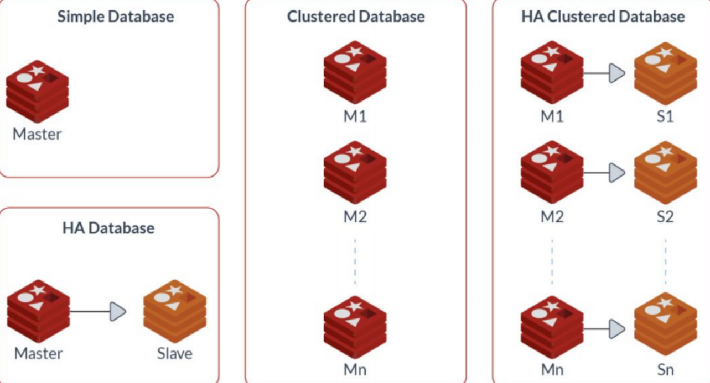

## 3.1 redis 主从复制

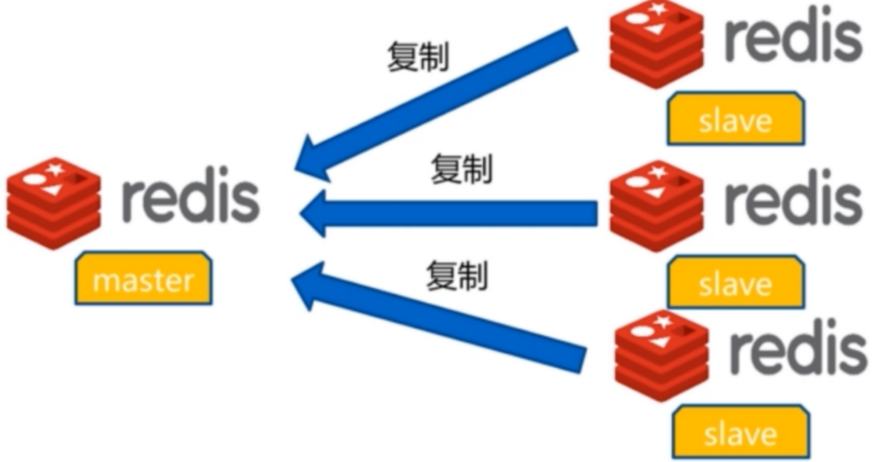

### 3.1.1 主从复制架构

Redis和MySQL的主从模式类似，也支持主从模式（master/slave），可以实现Redis数据的跨主机的远程备份

常见客户端连接主从的架构:

程序APP先连接到高可用性 LB 集群提供的虚拟IP，再由LB调度将用户的请求至后端Redis 服务器来真正提供服务

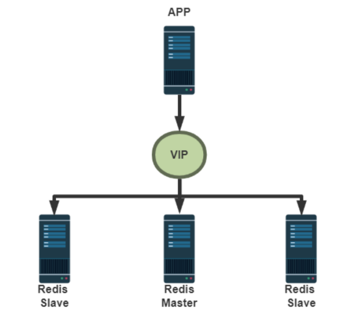

**主从复制特点**

- 一个master可以有多个slave
- 一个slave只能有一个master
- 数据流向是从master到slave单向的
- master 可读可写
- slave 只读

### 3.1.2 主从复制实现

当master出现故障后,可以自动提升一个slave节点变成新的Mster,因此 Redis Slave 需要设置和master相同的连接密码

此外当一个Slave提升为新的master时需要通过持久化实现数据的恢复

当配置 Redis 复制功能时，强烈建议打开主服务器的持久化功能。否则主节点 Redis 服务应该要避免自动启动。

参考案例: 导致主从服务器数据全部丢失

- 假设节点A为主服务器，并且关闭了持久化。并且节点B和节点C从节点A复制数据
- 节点A崩溃，然后由自动拉起服务重启了节点A.由于节点A的持久化被关闭了，所以重启之后没有任何数据
- 节点B和节点C将从节点A复制数据，但是A的数据是空的，于是就把自身保存的数据副本删除。

在关闭主服务器上的持久化，并同时开启自动拉起进程的情况下，即便使用Sentinel来实现Redis的高可用性，也是非常危险的。因为主服务器可能拉起得非常快，以至于Sentinel在配置的心跳时间间隔内没有检测到主服务器已被重启，然后还是会发生上面描述的情况,导致数据丢失。

无论何时，数据安全都是极其重要的，所以应该禁止主服务器关闭持久化的同时自动启动。

#### 3.1.2.1 主从命令配置

##### 3.1.2.1.1 启动主从同步

Redis Server 默认为 master 节点，如果要配置为从节点,需要指定 master 服务器的 IP，端口及连接密码

在从节点执行 REPLICAOF MASTER_IP PORT 指令可以启用主从同步复制功能,早期版本使用 SLAVEOF 指令

```bash
127.0.0.1:6379> REPLICAOF MASTER_IP PORT #新版推荐使用
127.0.0.1:6379> SLAVEOF MasterIP Port   #旧版使用，将被淘汰
127.0.0.1:6379> CONFIG SET masterauth <masterpass>
```

```bash
127.0.0.1:6379> info replication
# Replication
role:master
connected_slaves:0
master_failover_state:no-failover
master_replid:0ab85a3451e0a991e2cd69748a9a5c01045f5609
master_replid2:0000000000000000000000000000000000000000
master_repl_offset:0
second_repl_offset:-1
repl_backlog_active:0
repl_backlog_size:1048576
repl_backlog_first_byte_offset:0
repl_backlog_histlen:0
127.0.0.1:6379>


# 以下在 slave 上执行
# 默认角色都是 master
127.0.0.1:6379> role
1) "master"
2) (integer) 0
3) (empty array)
127.0.0.1:6379> 
# 默认数据库大小
127.0.0.1:6379> dbsize
(integer) 0
127.0.0.1:6379>

# 配置 slave
127.0.0.1:6379> replicaof 192.168.121.221 6379
OK
127.0.0.1:6379> config set masterauth 123456
OK
127.0.0.1:6379> info replication
# Replication
# Replication   #角色变为 slave
role:slave
master_host:192.168.121.221  # 指向 master
master_port:6379
master_link_status:down
master_last_io_seconds_ago:-1
master_sync_in_progress:0
slave_read_repl_offset:0
slave_repl_offset:0
master_link_down_since_seconds:-1
slave_priority:100
slave_read_only:1
replica_announced:1
connected_slaves:0
master_failover_state:no-failover
master_replid:4bcf46622d1ccccde65d24a201c80afd98a702bf
master_replid2:0000000000000000000000000000000000000000
master_repl_offset:0
second_repl_offset:-1
repl_backlog_active:0
repl_backlog_size:1048576
repl_backlog_first_byte_offset:0
repl_backlog_histlen:0


# 同步成功
127.0.0.1:6379> info replication
# Replication
role:slave
master_host:192.168.121.221
master_port:6379
master_link_status:up
master_last_io_seconds_ago:2
master_sync_in_progress:0    # 该值变为 0 
slave_read_repl_offset:112
slave_repl_offset:112
slave_priority:100
slave_read_only:1
replica_announced:1
connected_slaves:0
master_failover_state:no-failover
master_replid:396a7025f3cc383424b54549b1a7c9305faed419
master_replid2:0000000000000000000000000000000000000000
master_repl_offset:112
second_repl_offset:-1
repl_backlog_active:1
repl_backlog_size:1048576
repl_backlog_first_byte_offset:1
repl_backlog_histlen:112
127.0.0.1:6379> dbsize
(integer) 10100001


# 在 master 上查看 slave 信息
127.0.0.1:6379> info replication
# Replication
role:master
connected_slaves:1
slave0:ip=192.168.121.112,port=6379,state=online,offset=0,lag=1
master_failover_state:no-failover
master_replid:396a7025f3cc383424b54549b1a7c9305faed419
master_replid2:0000000000000000000000000000000000000000
master_repl_offset:84
second_repl_offset:-1
repl_backlog_active:1
repl_backlog_size:1048576
repl_backlog_first_byte_offset:1
repl_backlog_histlen:84

```

##### 3.1.2.1.2 删除主从同步

在从节点执行 REPLICAOF NO ONE 或 SLAVEOF NO ONE 指令可以取消主从复制

取消复制 会断开和master的连接而不再有主从复制关联, 但不会清除slave上已有的数据

```bash
# 新版
127.0.0.1:6379> REPLICAOF NO ONE
# 旧版
127.0.0.1:6379> SLAVEOF NO ONE
```

#### 3.1.2.2 验证同步

##### 3.1.2.2.1 在 master 上观察日志

```bash
root@prometheus-221:~ 18:53:28 # tail /apps/redis/log/redis_6379.log
120043:C 20 Oct 2025 17:08:22.410 * Fork CoW for RDB: current 1 MB, peak 1 MB, average 1 MB
120036:M 20 Oct 2025 17:08:22.412 # Diskless rdb transfer, done reading from pipe, 1 replicas still up.
120036:M 20 Oct 2025 17:08:22.550 * Background RDB transfer terminated with success
120036:M 20 Oct 2025 17:08:22.551 * Streamed RDB transfer with replica 192.168.121.112:6379 succeeded (socket). Waiting for REPLCONF ACK from slave to enable streaming
120036:M 20 Oct 2025 17:08:22.554 * Synchronization with replica 192.168.121.112:6379 succeeded
120036:M 20 Oct 2025 17:11:35.083 * 100 changes in 300 seconds. Saving...
120036:M 20 Oct 2025 17:11:35.098 * Background saving started by pid 120046
120046:C 20 Oct 2025 17:12:12.067 * DB saved on disk
120046:C 20 Oct 2025 17:12:12.106 * Fork CoW for RDB: current 0 MB, peak 0 MB, average 0 MB
120036:M 20 Oct 2025 17:12:12.152 * Background saving terminated with success

```

##### 3.1.2.2.2 在 slave 上观察日志

```bash
117446:S 20 Oct 2025 17:08:22.488 * MASTER <-> REPLICA sync: Flushing old data
117446:S 20 Oct 2025 17:08:22.489 * MASTER <-> REPLICA sync: Loading DB in memory
117446:S 20 Oct 2025 17:08:22.523 * Loading RDB produced by version 7.0.0
117446:S 20 Oct 2025 17:08:22.524 * RDB age 27 seconds
117446:S 20 Oct 2025 17:08:22.524 * RDB memory usage when created 821.63 Mb
117446:S 20 Oct 2025 17:09:12.493 * Done loading RDB, keys loaded: 10100001, keys expired: 0.
117446:S 20 Oct 2025 17:09:12.494 * MASTER <-> REPLICA sync: Finished with success

```

#### 3.1.2.3 修改 slave 节点配置文件

```bash
[root@centos8 ~]#vim /etc/redis.conf 
 .......
# replicaof <masterip> <masterport>
replicaof 192.168.121.221 6379 #指定master的IP和端口号
......
# masterauth <master-password>
masterauth 123456     #如果密码需要设置
requirepass 123456    #和masterauth保持一致，用于将来从节点提升主后使用
.......
[root@centos8 ~]#systemctl restart redis
```

#### 3.1.2.4 master 和 salve 查看状态

```bash
#在master上查看状态
127.0.0.1:6379> info replication
# Replication
role:master
connected_slaves:1
slave0:ip=10.0.0.18,port=6379,state=online,offset=1104403,lag=0
master_replid:b2517cd6cb3ad1508c516a38caed5b9d2d9a3e73
master_replid2:0000000000000000000000000000000000000000
master_repl_offset:1104403
second_repl_offset:-1
repl_backlog_active:1
repl_backlog_size:1048576
repl_backlog_first_byte_offset:55828
repl_backlog_histlen:1048576
127.0.0.1:6379>

127.0.0.1:6379> INFO replication
# Replication
role:slave
master_host:10.0.0.8
master_port:6379
master_link_status:up
master_last_io_seconds_ago:6   #如果主从复制通信正常，每10秒重新从0计数，此值无法修改，如
果无法通信，当计数到60时，master_link_status显示为down
master_sync_in_progress:0      #0表示同步完成，1表示正在同步
slave_repl_offset:1104431
slave_priority:100
slave_read_only:1
connected_slaves:0
master_replid:b2517cd6cb3ad1508c516a38caed5b9d2d9a3e73
master_replid2:0000000000000000000000000000000000000000
master_repl_offset:1104431
second_repl_offset:-1
repl_backlog_active:1
repl_backlog_size:1048576
repl_backlog_first_byte_offset:55856
repl_backlog_histlen:1048576
127.0.0.1:6379>
```

#### 3.1.2.5 slave 只读状态

验证Slave节点为只读状态, 不支持写入

```bash
127.0.0.1:6379> set a 1
(error) READONLY You can't write against a read only replica.
127.0.0.1:6379> 
```

### 3.1.3 主从复制故障恢复

#### 3.1.3.1 主从复制故障恢复过程介绍

##### 3.1.3.1.1 slave 节点故障和恢复

当 slave 节点故障时，将Redis Client指向另一个 slave 节点即可,并及时修复故障从节点

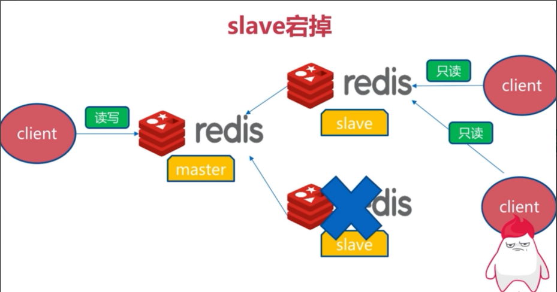

##### 3.1.3.1.2 master 节点故障和恢复

当 master 节点故障时，需要提升现存的 slave 为新的 master

master 故障后，当前还只能手动提升一个 slave 为新 master，不能自动切换。

之后将其它的 slave 节点重新指定新的 master 为 master 节点

Master 的切换会导致 master_replid 发生变化，slave 之前的 master_replid 就和当前 master 不一致从而会引发所有 slave 的全量同步。

#### 3.1.3.2 主从复制过程实现

```bash
# 查看当前 10.0.0.18 节点的状态为 slave,master 指向10.0.0.8
127.0.0.1:6379> INFO replication
# Replication
role:slave
master_host:10.0.0.8
master_port:6379
master_link_status:up
master_last_io_seconds_ago:1
master_sync_in_progress:0
slave_repl_offset:3794
slave_priority:100
slave_read_only:1
connected_slaves:0
master_replid:8e8279e461fdf0f1a3464ef768675149ad4b54a3
master_replid2:0000000000000000000000000000000000000000
master_repl_offset:3794
second_repl_offset:-1
repl_backlog_active:1
repl_backlog_size:1048576
repl_backlog_first_byte_offset:3781
repl_backlog_histlen:14
127.0.0.1:6379>

# 停止 slave 同步并提升为新的 master
#将当前 slave 节点提升为 master 角色
127.0.0.1:6379> REPLICAOF NO ONE   #旧版使用 SLAVEOF no one
OK
(5.04s)
127.0.0.1:6379> info replication
# Replication
role:master
connected_slaves:0
master_replid:94901d6b8ff812ec4a4b3ac6bb33faa11e55c274
master_replid2:0083e5a9c96aa4f2196934e10b910937d82b4e19
master_repl_offset:3514
second_repl_offset:3515
repl_backlog_active:1
repl_backlog_size:1048576
repl_backlog_first_byte_offset:3431
repl_backlog_histlen:84
127.0.0.1:6379>

# 测试能否写入数据
127.0.0.1:6379> set keytest1 vtest1
OK

# 修改所有 slave 指向新的 master 节点
#修改10.0.0.28节点指向新的master节点10.0.0.18
127.0.0.1:6379> SLAVEOF 10.0.0.18 6379
OK
127.0.0.1:6379> set key100 v100
(error) READONLY You can't write against a read only replica
#查看日志
[root@centos8 ~]#tail -f /var/log/redis/redis.log 
1762:S 20 Feb 2020 13:28:21.943 # Connection with master lost.
1762:S 20 Feb 2020 13:28:21.943 * Caching the disconnected master state.
1762:S 20 Feb 2020 13:28:21.943 * REPLICAOF 10.0.0.18:6379 enabled (user request 
from 'id=5 addr=127.0.0.1:59668 fd=9 name= age=149 idle=0 flags=N db=0 sub=0 
psub=0 multi=-1 qbuf=41 qbuf-free=32727 obl=0 oll=0 omem=0 events=r 
cmd=slaveof')
1762:S 20 Feb 2020 13:28:21.966 * Connecting to MASTER 10.0.0.18:6379
1762:S 20 Feb 2020 13:28:21.966 * MASTER <-> REPLICA sync started
1762:S 20 Feb 2020 13:28:21.967 * Non blocking connect for SYNC fired the event.
1762:S 20 Feb 2020 13:28:21.968 * Master replied to PING, replication can 
continue...
1762:S 20 Feb 2020 13:28:21.968 * Trying a partial resynchronization (request 
8e8279e461fdf0f1a3464ef768675149ad4b54a3:3991).
1762:S 20 Feb 2020 13:28:21.969 * Successful partial resynchronization with 
master.
1762:S 20 Feb 2020 13:28:21.9

# 在新的 master 可以看到 slave
#在新master节点10.0.0.18上查看状态
127.0.0.1:6379> INFO replication
# Replication
role:master
connected_slaves:1
slave0:ip=10.0.0.28,port=6379,state=online,offset=4606,lag=0
master_replid:8e8279e461fdf0f1a3464ef768675149ad4b54a3
master_replid2:0000000000000000000000000000000000000000
master_repl_offset:4606
second_repl_offset:-1
repl_backlog_active:1
repl_backlog_size:1048576
repl_backlog_first_byte_offset:1
repl_backlog_histlen:4606
127.0.0.1:6379>
```

### 3.1.4 实现 redis 级联复制

即实现基于 Slave 节点的 Slave

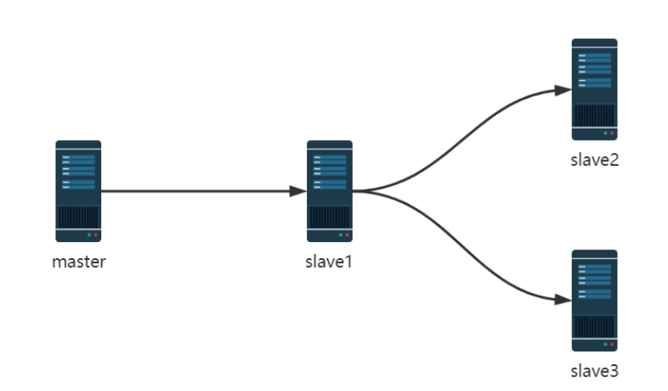

master 和 slave1 节点无需修改,只需要修改 slave2 及 slave3 指向 slave1 做为 master 即可

```bash
# 在 slave2 和 slave3 上执行下面指令
127.0.0.1:6379> REPLICAOF 10.0.0.18 6379
OK
127.0.0.1:6379> CONFIG SET masterauth 123456

# 在 master 设置 key,观察是否同步
#在 master 新建 key
127.0.0.1:6379> set key2 v2
OK
127.0.0.1:6379> get key2
"v2"
#在 slave1 和 slave2 验证 key
127.0.0.1:6379> get key2
"v2"
#在 slave1 和 slave2 都无法新建 key
127.0.0.1:6379> set key3 v3
(error) READONLY You can't write against a read only replica.


# 在中间那个slave1查看状态
127.0.0.1:6379> INFO replication
# Replication
role:slave
master_host:10.0.0.8
master_port:6379
master_link_status:up
master_last_io_seconds_ago:8 #最近一次与master通信已经过去多少秒。
master_sync_in_progress:0  #是否正在与master通信。
slave_repl_offset:4312  #当前同步的偏移量
slave_priority:100   #slave优先级，master故障后值越小越优先同步。
slave_read_only:1
connected_slaves:1
slave0:ip=10.0.0.28,port=6379,state=online,offset=4312,lag=0 #slave的slave节点
master_replid:8e8279e461fdf0f1a3464ef768675149ad4b54a3
master_replid2:0000000000000000000000000000000000000000
master_repl_offset:4312
second_repl_offset:-1
repl_backlog_active:1
repl_backlog_size:1048576
repl_backlog_first_byte_offset:1
repl_backlog_histlen:4312
```

### 3.1.5 主从复制优化

#### 3.1.5.1 主从复制过程

Redis 主从复制分为全量同步和增量同步

Redis 的主从同步是非阻塞的，即同步过程不会影响主服务器的正常访问.

注意:主节点重启会导致全量同步,从节点重启只会导致增量同步

从 redis 2.8 版本以前，并不支持部分同步，当主从服务器之间的连接断掉之后，master 服务器和 slave 服务器之间都是进行全量数据同步

从redis 2.8开始，开始引入了部分同步，即使主从连接中途断掉，也不需要进行全量同步

##### 3.1.5.1.1 全量复制过程 full resync

4.0之前版本的复制：run_id和复制偏移量来判断进行全量复制还是部分复制

4.0之后版本的复制：根据master_replid和复制偏移量来判断进行全量复制还是部分复制

主从关系建立后 master_replid 保存的是当前主节点的 master_replid，master_replid2 保存的是上一个主节点的master_replid

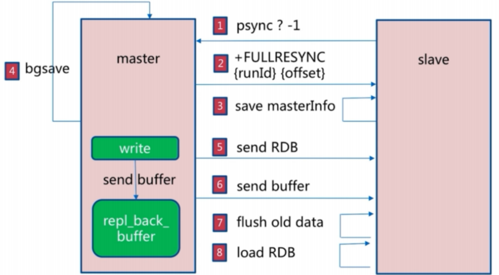

- 主从节点建立连接,验证身份后,从节点向主节点发送 PSYNC(2.8版本之前是SYNC) 命令
- 主节点向从节点发送 FULLRESYNC 命令,包括 master_replid(runID) 和 offset
- 从节点保存主节点信息
- 主节点执行 BGSAVE 保存 RDB 文件,同时记录新的记录到 buffer 中
- 主节点发送 RDB 文件给从节点
- 主节点将新收到 buffer 中的记录发送至从节点
- 从节点删除本机的旧数据
- 从节点加载 RDB
- 从节点同步主节点的 buffer 信息

全量复制发生在下面情况

- 从节点首次连接主节点(无master_replid/run_id)
- 从节点的复制偏移量不在复制积压缓冲区内
- 从节点无法连接主节点超过一定的时间

范例: 查看 master_replid

```bash
# 注意：单机时重启服务master_replid会变化
[root@ubuntu2204 ~]#redis-cli -a 123456 info replication
Warning: Using a password with '-a' or '-u' option on the command line interface 
may not be safe.
# Replication
role:master
connected_slaves:0
master_failover_state:no-failover
master_replid:2ae72114c992424bad89b58ed6eb1b34bf039e0e
master_replid2:0000000000000000000000000000000000000000
master_repl_offset:0
second_repl_offset:-1
repl_backlog_active:0
repl_backlog_size:1048576
repl_backlog_first_byte_offset:0
repl_backlog_histlen:0
```

范例：查看 RUNID

```bash
# Redis 重启服务后，RUNID会发生变化
127.0.0.1:6379> info server
# Server
redis_version:7.0.5
redis_git_sha1:00000000
redis_git_dirty:0
redis_build_id:77bd58d092d1d003
redis_mode:standalone
os:Linux 5.4.0-124-generic x86_64
arch_bits:64
monotonic_clock:POSIX clock_gettime
multiplexing_api:epoll
atomicvar_api:c11-builtin
gcc_version:9.4.0
process_id:16407
process_supervised:systemd
run_id:9e954950c255644ef291f6be0c579ae893c16aad
tcp_port:6379
server_time_usec:1667276559043301
uptime_in_seconds:3463
uptime_in_days:0
hz:10
configured_hz:10
lru_clock:6332175
executable:/apps/redis/bin/redis-server
config_file:/apps/redis/etc/redis.conf
io_threads_active:0


```

##### 3.1.5.1.2 增量复制过程  partial resynchronization

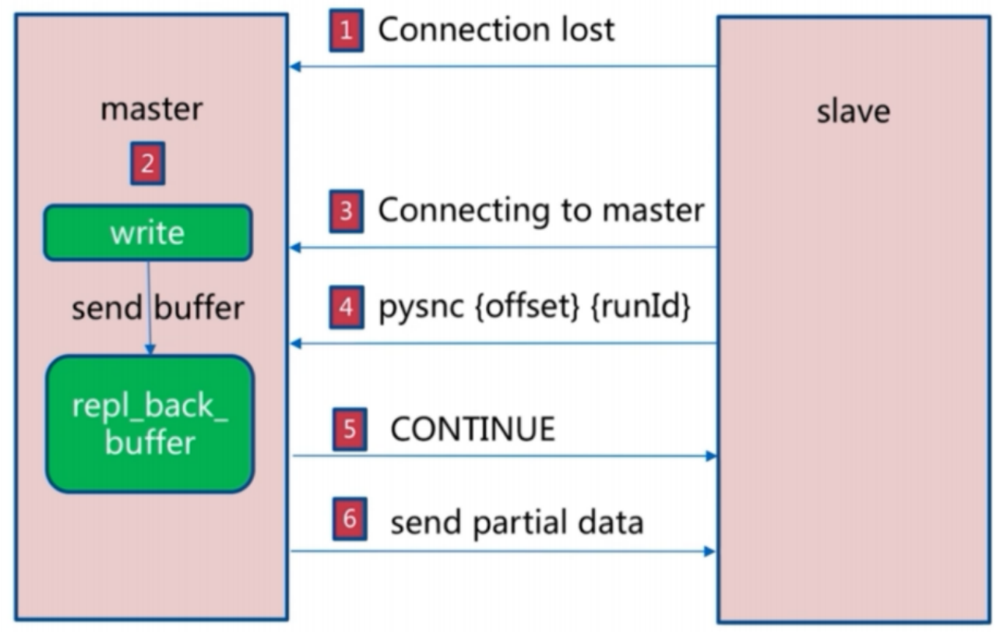

在主从复制首次完成全量同步之后再次需要同步时,从服务器只要发送当前的offset位置(类似于MySQL的binlog的位置)给主服务器，然后主服务器根据相应的位置将之后的数据(包括写在缓冲区的积压数据)发送给从服务器,再次将其保存到从节点内存即可。

即首次全量复制,之后的复制基本增量复制实现

##### 3.1.5.1.3 主从同步完整过程

主从同步完整过程如下：

1. slave发起连接master，验证通过后,发送PSYNC命令
2. master接收到PSYNC命令后，执行BGSAVE命令将全部数据保存至RDB文件中,并将后续发生的写操作记录至buffer中
3. master向所有slave发送RDB文件
4. master向所有slave发送后续记录在buffer中写操作
5. slave收到快照文件后丢弃所有旧数据
6. slave加载收到的RDB到内存
7. slave 执行来自master接收到的buffer写操作
8. 当slave完成全量复制后,后续master只会先发送slave_repl_offset信息
9. 以后slave比较自身和master的差异,只会进行增量复制的数据即可

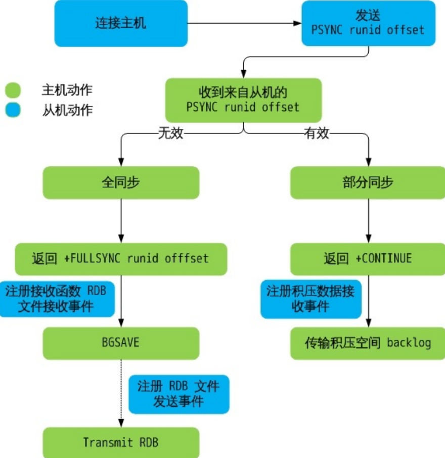

复制缓冲区(环形队列)配置参数

```bash
#master的写入数据缓冲区，用于记录自上一次同步后到下一次同步过程中间的写入命令，计算公式：replbacklog-size = 允许从节点最大中断时长 * 主实例offset每秒写入量，比如:master每秒最大写入64mb，最大允许60秒，那么就要设置为64mb*60秒=3840MB(3.8G),建议此值是设置的足够大，默认值为1M
repl-backlog-size 1mb 
#如果一段时间后没有slave连接到master，则backlog size的内存将会被释放。如果值为0则表示永远不释放这部份内存。
repl-backlog-ttl   3600
```


##### 3.1.5.1.4 避免全量复制

- 第一次全量复制不可避免,后续的全量复制可以利用小主节点(内存小),业务低峰时进行全量
- 节点RUN_ID不匹配:主节点重启会导致RUN_ID变化,可能会触发全量复制,可以利用config命令动态修改配置，故障转移例如哨兵或集群选举新的主节点也不会全量复制,而从节点重启动,不会导致全量复制,只会增量复制
- 复制积压缓冲区不足: 当主节点生成的新数据大于缓冲区大小,从节点恢复和主节点连接后,会导致全量复制.解决方法将repl-backlog-size 调大

##### 3.1.5.1.5 避免复制风暴

- 单主节点复制风暴

  当主节点重启，多从节点复制

  解决方法:更换复制拓扑

  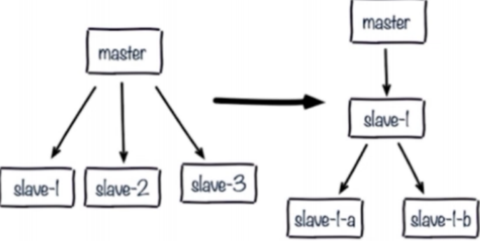

- 单机器多实例复制风暴

  机器宕机后，大量全量复制

  解决方法:主节点分散多机器

  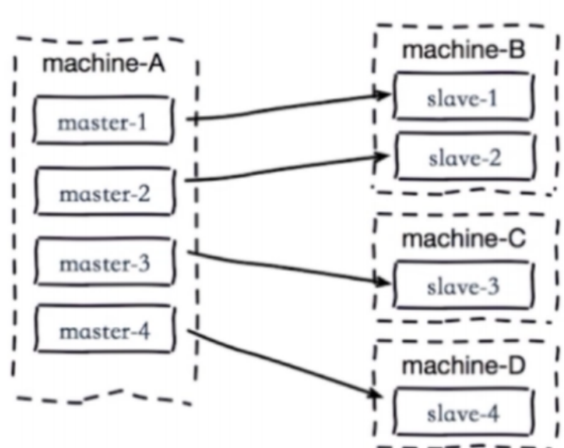

#### 3.1.5.2 主从复制优化

Redis在2.8版本之前没有提供增量部分复制的功能，当网络闪断或者slave Redis重启之后会导致主从之间的全量同步，即从2.8版本开始增加了部分复制的功能。

**性能相关配置**

```bash
repl-diskless-sync no # 是否使用无盘方式进行同步RDB文件，默认为no(编译安装默认为yes)，no表示不使用无盘，需要将RDB文件保存到磁盘后再发送给slave，yes表示使用无盘，即RDB文件不需要保存至本地磁盘，而且直接通过网络发送给slave
repl-diskless-sync-delay 5 #无盘时复制的服务器等待的延迟时间
repl-ping-slave-period 10 #slave向master发送ping指令的时间间隔，默认为10s
repl-timeout 60 #指定ping连接超时时间,超过此值无法连接,master_link_status显示为down状态,并记录错误日志
repl-disable-tcp-nodelay no #是否启用TCP_NODELAY
#设置成yes，则redis会合并多个小的TCP包成一个大包再发送,此方式可以节省带宽，但会造成同步延迟时长的增加，导致master与slave数据短期内不一致
#设置成no，则master会立即同步数据
repl-backlog-size 1mb #master的写入数据缓冲区，用于记录自上一次同步后到下一次同步前期间的写入命令，计算公式：repl-backlog-size = 允许slave最大中断时长 * master节点offset每秒写入量，如:master每秒最大写入量为32MB，最长允许中断60秒，就要至少设置为32*60=1920MB,建议此值是设置的足够大,如果此值太小,会造成全量复制
repl-backlog-ttl 3600 #指定多长时间后如果没有slave连接到master，则backlog的内存数据将会过期。如果值为0表示永远不过期。
slave-priority 100 #slave参与选举新的master的优先级，此整数值越小则优先级越高。当master故障时将会按照优先级来选择slave端进行选举新的master，如果值设置为0，则表示该slave节点永远不会被选为master节点。
min-replicas-to-write 1 #指定master的可用slave不能少于个数，如果少于此值,master将无法执行写操作,默认为0,生产建议设为1,
min-slaves-max-lag 20 #指定至少有min-replicas-to-write数量的slave延迟时间都大于此秒数时，master将不能执行写操作,默认为10s
```

### 3.1.6 主从复制常见故障

#### 3.1.6.1 主从软件和硬件配置不一致

主从节点的maxmemory不一致,主节点内存大于从节点内存,主从复制可能丢失数据

rename-command 命令不一致,如在主节点启用flushdb,从节点禁用此命令,结果在master节点执行flushdb后,导致slave节点不同步

```bash
#在从节点定义rename-command flushall "",但是在主节点没有此配置,则当在主节点执行flushall时,会在从节点提示下面同步错误
10822:S 16 Oct 2020 20:03:45.291 # == CRITICAL == This replica is sending an 
error to its master: 'unknown command `flushall`, with args beginning with: ' 
after processing the command '<unknown>'
#master有一个rename-command flushdb "wang",而slave没有这个配置,则同步时从节点可以看到以下同步错误
3181:S 21 Oct 2020 17:34:50.581 # == CRITICAL == This replica is sending an 
error to its master: 'unknown command `wang`, with args beginning with: ' after 
processing the command '<unknown>'
```

#### 3.1.6.2 master 节点密码错误

如果slave节点配置的master密码错误，导致验证不通过,自然将无法建立主从同步关系。

```bash
[root@centos8 ~]#tail -f /var/log/redis/redis.log 
24930:S 20 Feb 2020 13:53:57.029 * Connecting to MASTER 10.0.0.8:6379
24930:S 20 Feb 2020 13:53:57.030 * MASTER <-> REPLICA sync started
24930:S 20 Feb 2020 13:53:57.030 * Non blocking connect for SYNC fired the 
event.
24930:S 20 Feb 2020 13:53:57.030 * Master replied to PING, replication can 
continue...
24930:S 20 Feb 2020 13:53:57.031 # Unable to AUTH to MASTER: -ERR invalid 
password
```

#### 3.1.6.3 redis 版本不一致

不同的redis 版本之间尤其是大版本间可能会存在兼容性问题，如：Redis 3,4,5,6之间因此主从复制的所有节点应该使用相同的版本

#### 3.1.6.4 保护（安全）模式下无法远程连接

如果开启了安全模式，并且没有设置bind地址和密码,会导致无法远程连接

```bash
[root@centos8 ~]#vim /etc/redis.conf 
#bind 127.0.0.1   #将此行注释
[root@centos8 ~]#systemctl restart redis
```

## 3.2 redis 哨兵 sentinel

### 3.2.1 redis 集群介绍

主从架构和MySQL的主从复制一样,无法实现master和slave角色的自动切换，即当master出现故障时,不能实现自动的将一个slave 节点提升为新的master节点,即主从复制无法实现自动的故障转移功能,如果想实现转移,则需要手动修改配置,才能将 slave 服务器提升新的master节点.此外只有一个主节点支持写操作,所以业务量很大时会导致Redis服务性能达到瓶颈

需要解决的主从复制以下存在的问题：

- master和slave角色的自动切换，且不能影响业务
- 提升Redis服务整体性能，支持更高并发访问

### 3.2.2 哨兵 sentinel 工作原理

哨兵Sentinel从Redis2.6版本开始引用，Redis 2.8版本之后稳定可用。生产环境如果要使用此功能建议使用Redis的2.8版本以上版本

#### 3.2.2.1 sentinel 架构和故障转移机制

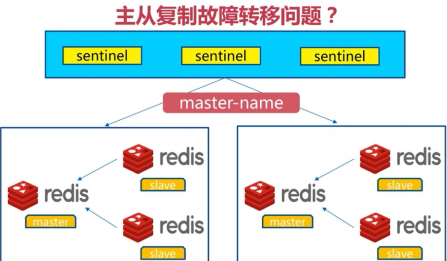


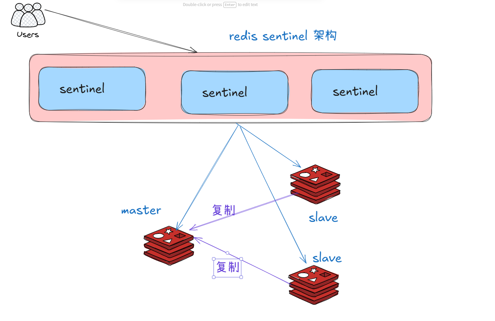

**Sentinel 故障转移**

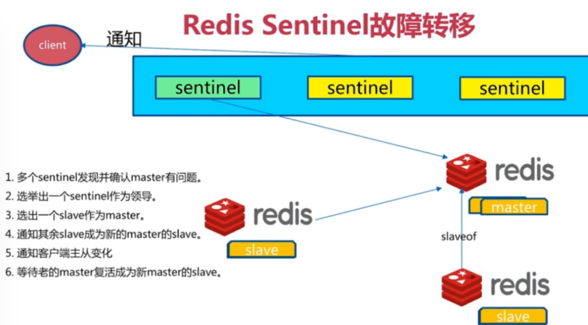


专门的Sentinel 服务进程是用于监控redis集群中Master工作的状态，当Master主服务器发生故障的时候，可以实现Master和Slave的角色的自动切换，从而实现系统的高可用性

Sentinel是一个分布式系统,即需要在多个节点上各自同时运行一个sentinel进程，Sentienl 进程通过流言协议(gossip protocols)来接收关于Master是否下线状态，并使用投票协议(Agreement Protocols)来决定是否执行自动故障转移,并选择合适的Slave作为新的Master

每个Sentinel进程会向其它Sentinel、Master、Slave定时发送消息，来确认对方是否存活，如果发现某个节点在指定配置时间内未得到响应，则会认为此节点已离线，即为主观宕机Subjective Down，简称为 SDOWN

如果哨兵集群中的多数Sentinel进程认为Master存在SDOWN，共同利用 is-master-down-by-addr 命令互相通知后，则认为客观宕机Objectively Down， 简称 ODOWN

接下来利用投票算法，从所有slave节点中，选一台合适的slave将之提升为新Master节点，然后自动修改其它slave相关配置，指向新的master节点,最终实现故障转移failover

Redis Sentinel中的Sentinel节点个数应该为大于等于3且最好为奇数

客户端初始化时连接的是Sentinel节点集合，不再是具体的Redis节点，即 Sentinel只是配置中心不是代理。

Redis Sentinel 节点与普通 Redis 没有区别,要实现读写分离依赖于客户端程序

Sentinel 机制类似于MySQL中的MHA功能,只解决master和slave角色的自动故障转移问题，但单个Master 的性能瓶颈问题并没有解决

Redis 3.0 之前版本中,生产环境一般使用哨兵模式较多,Redis 3.0后推出Redis cluster功能,可以支持更大规模的高并发环境

#### 3.2.2.2 Sentinel 中的三个定时任务

- 每10 秒每个sentinel 对master和slave执行info

  发现slave节点

  确认主从关系

- 每2秒每个sentinel通过master节点的channel交换信息(pub/sub)

  通过sentinel__:hello频道交互

  交互对节点的“看法”和自身信息

- 每1秒每个sentinel对其他sentinel和redis执行ping

### 3.2.3 实现哨兵架构

以下案例实现一主两从的基于哨兵的高可用Redis架构

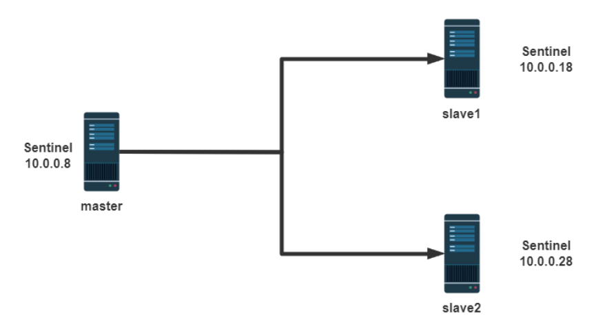

#### 3.2.3.1 哨兵需要先实现主从复制

哨兵的前提是已经实现了Redis的主从复制

**注意: 包括master和slave在内的所有节点的 masterauth 和requirepassslave 密码都必须相同所有主从节点的 redis.conf 中关健配置**

范例: 准备主从环境配置

```bash
#所有节点的masterauth和requirepass必须相同
[root@centos8 ~]#vim /etc/redis.conf
bind 0.0.0.0
masterauth "123456"
requirepass "123456"
#或者非交互执行
[root@centos8 ~]#sed -i -e 's/bind 127.0.0.1/bind 0.0.0.0/' -e 's/^# masterauth 
.*/masterauth 123456/' -e 's/^# requirepass .*/requirepass 123456/' 
/etc/redis.conf
#在所有从节点执行
[root@centos8 ~]#echo "replicaof 10.0.0.8 6379" >> /etc/redis.conf
#在所有主从节点执行
[root@centos8 ~]#systemctl enable --now redis
```

**master 服务器状态**

```
[root@redis-master ~]#redis-cli -a 123456
Warning: Using a password with '-a' or '-u' option on the command line interface 
may not 
127.0.0.1:6379> INFO replication
# Replication
role:master
connected_slaves:2
slave0:ip=10.0.0.28,port=6379,state=online,offset=112,lag=1
slave1:ip=10.0.0.18,port=6379,state=online,offset=112,lag=0
master_replid:8fdca730a2ae48fb9c8b7e739dcd2efcc76794f3
master_replid2:0000000000000000000000000000000000000000
master_repl_offset:112
second_repl_offset:-1
repl_backlog_active:1
repl_backlog_size:1048576
repl_backlog_first_byte_offset:1
repl_backlog_histlen:112
127.0.0.1:6379>
```

**配置 slave1**

```
[root@redis-slave1 ~]#redis-cli -a 123456
Warning: Using a password with '-a' or '-u' option on the command line interface 
may not be safe.
127.0.0.1:6379> REPLICAOF 10.0.0.8 6379
OK
127.0.0.1:6379> CONFIG SET masterauth "123456"
OK
127.0.0.1:6379> INFO replication
# Replication
role:slave
master_host:10.0.0.8
master_port:6379
master_link_status:up
master_last_io_seconds_ago:4
master_sync_in_progress:0
slave_repl_offset:140
slave_priority:100
slave_read_only:1
connected_slaves:0
master_replid:8fdca730a2ae48fb9c8b7e739dcd2efcc76794f3
master_replid2:0000000000000000000000000000000000000000
master_repl_offset:140
second_repl_offset:-1
repl_backlog_active:1
repl_backlog_size:1048576
repl_backlog_first_byte_offset:99
repl_backlog_histlen:42
```

**配置 slave2**

```
[root@redis-slave2 ~]#redis-cli -a 123456
Warning: Using a password with '-a' or '-u' option on the command line interface 
may not be safe.
127.0.0.1:6379> REPLICAOF 10.0.0.8 6379
OK
127.0.0.1:6379> CONFIG SET masterauth "123456"
OK
127.0.0.1:6379> INFO replication
# Replication
role:slave
master_host:10.0.0.8
master_port:6379
master_link_status:up
master_last_io_seconds_ago:3
master_sync_in_progress:0
slave_repl_offset:182
slave_priority:100
slave_read_only:1
connected_slaves:0
master_replid:8fdca730a2ae48fb9c8b7e739dcd2efcc76794f3
master_replid2:0000000000000000000000000000000000000000
master_repl_offset:182
second_repl_offset:-1
repl_backlog_active:1
repl_backlog_size:1048576
repl_backlog_first_byte_offset:15
repl_backlog_histle
```

#### 3.2.3.2 编辑 sentinel 哨兵配置

Sentinel实际上是一个特殊的redis服务器,有些redis指令支持,但很多指令并不支持.默认监听在 26379/tcp 端口.

哨兵服务可以和 Redis 服务器分开部署在不同主机，但为了节约成本一般会部署在一起

所有 redis 节点使用相同的以下示例的配置文件

```bash
# 如果是编译安装，在源码目录有 sentinel.conf，复制到安装目录即可
root@prometheus-221:~ 15:54:52 # cp redis-7.0.0/sentinel.conf /apps/redis/etc/
root@prometheus-221:~ 15:55:09 # ll /apps/redis/etc/sentinel.conf 
-rw-r--r-- 1 root root 13924 Oct 28 15:55 /apps/redis/etc/sentinel.conf
root@prometheus-221:~ 15:55:13 # 

# 包安装修改配置文件
[root@centos8 ~]#vim /etc/redis-sentinel.conf 
bind 0.0.0.0
port 26379
daemonize yes
pidfile "redis-sentinel.pid"
logfile "sentinel_26379.log"
dir "/tmp"  #工作目录
sentinel monitor mymaster 10.0.0.8 6379 2
# mymaster是集群的名称，此行指定当前mymaster集群中master服务器的地址和端口
# 2为法定人数限制(quorum)，即有几个sentinel认为master down了就进行故障转移，一般此值是所有sentinel节点(一般总数是>=3的 奇数,如:3,5,7等)的一半以上的整数值，比如，总数是3，即3/2=1.5，取整为2,是master的ODOWN客观下线的依据
sentinel auth-pass mymaster 123456
# mymaster集群中 master 的密码，注意此行要在上面行的下面,注意：要求这组 redis 主从复制所有节点的密
码是一样的
sentinel down-after-milliseconds mymaster 30000
# 判断mymaster集群中所有节点的主观下线(SDOWN)的时间，单位：毫秒，建议3000
sentinel parallel-syncs mymaster 1 #发生故障转移后，可以同时向新master同步数据的slave的数量，数字越小总同步时间越长，但可以减轻新 master 的负载压力
sentinel failover-timeout mymaster 180000
# 所有 slaves 指向新的 master 所需的超时时间，单位：毫秒
sentinel deny-scripts-reconfig yes #禁止修改脚本
logfile /var/log/redis/sentinel.log
```

**三个哨兵服务器的配置都如下**

```bash
root@prometheus-221:~ 16:01:41 # grep -Ev "^$|^#" /apps/redis/etc/sentinel.conf
protected-mode no
port 26379
daemonize no
pidfile /var/run/redis-sentinel.pid
logfile ""
dir /tmp
sentinel monitor mymaster 192.168.121.221 6379 2
sentinel auth-pass mymaster 123456
sentinel down-after-milliseconds mymaster 3000
acllog-max-len 128
sentinel parallel-syncs mymaster 1
sentinel failover-timeout mymaster 180000
sentinel deny-scripts-reconfig yes
SENTINEL resolve-hostnames no
SENTINEL announce-hostnames no
SENTINEL master-reboot-down-after-period mymaster 0

```

#### 3.2.3.3 编写 service 文件

```bash
[Unit]
Description=Redis Sentinel
After=network.target
[Service]
ExecStart=/apps/redis/bin/redis-sentinel /apps/redis/etc/sentinel.conf --supervised systemd
ExecStop=/bin/kill -s QUIT $MAINPID
User=redis
Group=redis
RuntimeDirectory=redis
Mode=0755
[Install]
WantedBy=multi-user.target


#注意所有节点的目录权限,否则无法启动服务
[root@redis-master ~]#chown -R redis.redis /apps/redis/
[root@redis-master ~]#systemctl daemon-reload
[root@redis-master ~]#systemctl enable --now redis-sentinel.service
```

#### 3.2.3.4 验证 sentinel 服务

##### 3.2.3.4.1 查看 sentinel 服务端口

```bash
[root@redis-master ~]#ss -ntl
State   Recv-Q Send-Q Local Address:Port Peer Address:Port        
LISTEN  0       128          0.0.0.0:22         0.0.0.0:*           
LISTEN  0       128          0.0.0.0:26379      0.0.0.0:*           
LISTEN  0       128          0.0.0.0:6379       0.0.0.0:*           
LISTEN  0       128             [::]:22           [::]:*           
LISTEN  0       128             [::]:26379         [::]:*           
LISTEN  0       128             [::]:6379         [::]:*
```

##### 3.2.3.4.2 查看日志

```bash
# master sentinel log
[root@redis-master ~]#tail -f /var/log/redis/sentinel.log 
38028:X 20 Feb 2020 17:13:08.702 # oO0OoO0OoO0Oo Redis is starting oO0OoO0OoO0Oo
38028:X 20 Feb 2020 17:13:08.702 # Redis version=5.0.3, bits=64, commit=00000000, modified=0, pid=38028, just started
38028:X 20 Feb 2020 17:13:08.702 # Configuration loaded
38028:X 20 Feb 2020 17:13:08.702 * supervised by systemd, will signal readiness
38028:X 20 Feb 2020 17:13:08.703 * Running mode=sentinel, port=26379.
38028:X 20 Feb 2020 17:13:08.703 # WARNING: The TCP backlog setting of 511 cannot be enforced because /proc/sys/net/core/somaxconn is set to the lower value of 128.
38028:X 20 Feb 2020 17:13:08.704 # Sentinel ID is 50547f34ed71fd48c197924969937e738a39975b
38028:X 20 Feb 2020 17:13:08.704 # +monitor master mymaster 10.0.0.8 6379 quorum 2
38028:X 20 Feb 2020 17:13:08.709 * +slave slave 10.0.0.28:6379 10.0.0.28 6379 @ mymaster 10.0.0.8 6379
38028:X 20 Feb 2020 17:13:08.709 * +slave slave 10.0.0.18:6379 10.0.0.18 6379 @ mymaster 10.0.0.8 6379
```

```bash
# slave sentinel log
[root@redis-slave1 ~]#tail -f /var/log/redis/sentinel.log 
25509:X 20 Feb 2020 17:13:27.435 * Removing the pid file.
25509:X 20 Feb 2020 17:13:27.435 # Sentinel is now ready to exit, bye bye...
25572:X 20 Feb 2020 17:13:27.448 # oO0OoO0OoO0Oo Redis is starting oO0OoO0OoO0Oo
25572:X 20 Feb 2020 17:13:27.448 # Redis version=5.0.3, bits=64, commit=00000000, modified=0, pid=25572, just started
25572:X 20 Feb 2020 17:13:27.448 # Configuration loaded
25572:X 20 Feb 2020 17:13:27.448 * supervised by systemd, will signal readiness
25572:X 20 Feb 2020 17:13:27.449 * Running mode=sentinel, port=26379.
25572:X 20 Feb 2020 17:13:27.449 # WARNING: The TCP backlog setting of 511 cannot be enforced because /proc/sys/net/core/somaxconn is set to the lower value of 128.
25572:X 20 Feb 2020 17:13:27.449 # Sentinel ID is 50547f34ed71fd48c197924969937e738a39975b
25572:X 20 Feb 2020 17:13:27.449 # +monitor master mymaster 10.0.0.8 6379 quorum 2
```

##### 3.2.3.4.3 当前 sentinel 状态

在sentinel状态中尤其是最后一行，涉及到masterIP是多少，有几个slave，有几个sentinels，必须是符合全部服务器数量

```bash
[root@redis-master ~]#redis-cli -p 26379
127.0.0.1:26379> INFO sentinel
# Sentinel
sentinel_masters:1
sentinel_tilt:0
sentinel_running_scripts:0
sentinel_scripts_queue_length:0
sentinel_simulate_failure_flags:0
master0:name=mymaster,status=ok,address=10.0.0.8:6379,slaves=2,sentinels=3 
#两个slave,三个sentinel服务器,如果sentinels值不符合,检查myid可能冲突
```

#### 3.2.3.5 停止 master 节点实现故障转移

##### 3.2.3.5.1 停止 master 节点

```
[root@redis-master ~]#killall redis-server

# 查看个节点上哨兵的信息
[root@redis-master ~]#redis-cli -p 26379
Warning: Using a password with '-a' or '-u' option on the command line interface 
may not be safe.
127.0.0.1:26379> INFO sentinel
# Sentinel
sentinel_masters:1
sentinel_tilt:0
sentinel_running_scripts:0
sentinel_scripts_queue_length:0
sentinel_simulate_failure_flags:0
master0:name=mymaster,status=ok,address=10.0.0.18:6379,slaves=2,sentinels=3
```

##### 3.2.3.5.2 验证故障转移

故障转移后redis.conf中的replicaof行的master IP会被修改

```bash
[root@redis-slave2 ~]#grep ^replicaof /etc/redis.conf 
replicaof 10.0.0.18 6379
```

哨兵配置文件的sentinel monitor IP 同样也会被修改

```bash
[root@redis-slave1 ~]#grep "^[a-Z]" /etc/redis-sentinel.conf
port 26379
daemonize no
pidfile "/var/run/redis-sentinel.pid"
logfile "/var/log/redis/sentinel.log"
dir "/tmp"
sentinel myid 50547f34ed71fd48c197924969937e738a39975b
sentinel deny-scripts-reconfig yes
sentinel monitor mymaster 10.0.0.18 6379 2  #自动修改此行

[root@redis-slave2 ~]#grep "^[a-Z]" /etc/redis-sentinel.conf
port 26379
daemonize no
pidfile "/var/run/redis-sentinel.pid"
logfile "/var/log/redis/sentinel.log"
dir "/tmp"
sentinel myid 50547f34ed71fd48c197924969937e738a39975d
sentinel deny-scripts-reconfig yes
sentinel monitor mymaster 10.0.0.18 6379 2  #自动修改此行
```

##### 3.2.3.5.3 验证 redis 各节点状态

新的 master 状态

```bash
[root@redis-slave1 ~]#redis-cli -a 123456
Warning: Using a password with '-a' or '-u' option on the command line interface 
may not be safe.
127.0.0.1:6379> INFO replication
# Replication
role:master   #提升为master
connected_slaves:1
slave0:ip=10.0.0.28,port=6379,state=online,offset=56225,lag=1
master_replid:75e3f205082c5a10824fbe6580b6ad4437140b94
master_replid2:b2fb4653bdf498691e5f88519ded65b6c000e25c
master_repl_offset:56490
second_repl_offset:46451
repl_backlog_active:1
repl_backlog_size:1048576
repl_backlog_first_byte_offset:287
repl_backlog_histlen:56204

# 另一个 slave 指向新的 master
[root@redis-slave2 ~]#redis-cli -a 123456
127.0.0.1:6379> INFO replication
# Replication
role:slave
master_host:10.0.0.18  #指向新的master
master_port:6379
```

#### 3.2.3.6 原 master 重新加入 redis 集群

```bash
[root@redis-master ~]#cat /etc/redis.conf 
#sentinel会自动修改下面行指向新的master
replicaof 10.0.0.18 6379      
```

在原 master上观察状态

```bash
[root@redis-master ~]#redis-cli -a 123456
Warning: Using a password with '-a' or '-u' option on the command line interface 
may not be safe.
127.0.0.1:6379> INFO replication
# Replication
role:slave
master_host:10.0.0.18
master_port:6379
master_link_status:up
master_last_io_seconds_ago:0
master_sync_in_progress:0
slave_repl_offset:764754
slave_priority:100
slave_read_only:1
connected_slaves:0
master_replid:75e3f205082c5a10824fbe6580b6ad4437140b94
master_replid2:b2fb4653bdf498691e5f88519ded65b6c000e25c
master_repl_offset:764754
second_repl_offset:46451
repl_backlog_active:1
repl_backlog_size:1048576
repl_backlog_first_byte_offset:46451
repl_backlog_histlen:718304
[root@redis-master ~]#redis-cli -p 26379
127.0.0.1:26379> INFO sentinel
# Sentinel
sentinel_masters:1
sentinel_tilt:0
sentinel_running_scripts:0
sentinel_scripts_queue_length:0
sentinel_simulate_failure_flags:0
master0:name=mymaster,status=ok,address=10.0.0.18:6379,slaves=2,sentinels=3
127.0.0.1:26379>
```

### 3.2.4 sentinel 运维

在 Sentinel 主机手动触发故障切换

```bash
#redis-cli   -p 26379
127.0.0.1:26379> sentinel failover <masterName>
```

范例: 手动故障转移

```bash
[root@centos8 ~]#vim /etc/redis.conf
replica-priority 10 #指定优先级,值越小sentinel会优先将之选为新的master,默为值为100
[root@centos8 ~]#systemctl restart redis
#或者动态修改
[root@centos8 ~]#redis-cli -a 123456
Warning: Using a password with '-a' or '-u' option on the command line interface 
may not be safe.
127.0.0.1:6379> CONFIG GET replica-priority
1) "replica-priority"
2) "100"
127.0.0.1:6379> CONFIG SET replica-priority 99
OK
127.0.0.1:6379> CONFIG GET replica-priority
1) "replica-priority"
2) "99"
[root@centos8 ~]#redis-cli   -p 26379
127.0.0.1:26379> sentinel failover mymaster  #原主节点自动变成从节点
OK
```

### 3.2.5 应用程序连接 sentinel

Redis 官方支持多种开发语言的客户端：https://redis.io/clients

#### 3.2.5.1 客户端连接 sentinel 原理

1. 客户端获取 Sentinel 节点集合,选举出一个 Sentinel
2. 由这个sentinel 通过masterName 获取master节点信息,客户端通过sentinel get-master-addr-byname master-name这个api来获取对应主节点信息
3. 客户端发送role指令确认master的信息,验证当前获取的“主节点”是真正的主节点，这样的目的是为了防止故障转移期间主节点的变化
4.  客户端保持和Sentinel节点集合的联系，即订阅Sentinel节点相关频道，时刻获取关于主节点的相关信息,获取新的master 信息变化,并自动连接新的master

#### 3.2.5.2 Java 连接 sentinel 

Java 客户端连接Redis：https://github.com/xetorthio/jedis/blob/master/pom.xml

```xml
#jedis/pom.xml 配置连接redis 
<properties>
    <redis-hosts>localhost:6379,localhost:6380,localhost:6381,localhost:6382,localhost:6383,localhost:6384,localhost:6385</redis-hosts>
    <sentinel-hosts>localhost:26379,localhost:26380,localhost:26381</sentinel-hosts>
    <cluster-hosts>localhost:7379,localhost:7380,localhost:7381,localhost:7382,localhost:7383,localhost:7384,localhost:7385</cluster-hosts>
    <github.global.server>github</github.global.server>
</properties>
```

java客户端连接单机的redis是通过Jedis来实现的，java代码用的时候只要创建Jedis对象就可以建多个Jedis连接池来连接redis，应用程序再直接调用连接池即可连接Redis。而Redis为了保障高可用,服务一般都是Sentinel部署方式，当Redis服务中的主服务挂掉之后,会仲裁出另外一台Slaves服务充当Master。这个时候,我们的应用即使使用了Jedis 连接池,如果Master服务挂了,应用将还是无法连接新的Master服务，为了解决这个问题, Jedis也提供了相应的Sentinel实现,能够在Redis Sentinel主从切换时候,通知应用,把应用连接到新的Master服务。

Redis Sentinel的使用也是十分简单的,只是在JedisPool中添加了Sentinel和MasterName参数，JRedis Sentinel底层基于Redis订阅实现Redis主从服务的切换通知，当Reids发生主从切换时，Sentinel会发送通知主动通知Jedis进行连接的切换，JedisSentinelPool在每次从连接池中获取链接对象的时候,都要对连接对象进行检测,如果此链接和Sentinel的Master服务连接参数不一致,则会关闭此连接,重新获取新的Jedis连接对象。

#### 3.2.5.3 python 连接 sentinel

```python
#!/usr/bin/python3
import redis
from redis.sentinel import Sentinel
#连接哨兵服务器(主机名也可以用域名)
sentinel = Sentinel([('10.0.0.8', 26379),
                     ('10.0.0.18', 26379),
                     ('10.0.0.28', 26379)],
                    socket_timeout=0.5)
redis_auth_pass = '123456'
#mymaster 是配置哨兵模式的redis集群名称，此为默认值,实际名称按照个人部署案例来填写
#获取主服务器地址
master = sentinel.discover_master('mymaster')
print(master)
#获取从服务器地址
slave = sentinel.discover_slaves('mymaster')
print(slave)
#获取主服务器进行写入
master = sentinel.master_for('mymaster', socket_timeout=0.5, 
password=redis_auth_pass, db=0)
w_ret = master.set('name', 'wang') #输出：True
#获取从服务器进行读取（默认是round-roubin）
slave = sentinel.slave_for('mymaster', socket_timeout=0.5, 
password=redis_auth_pass, db=0)
r_ret = slave.get('name')
print(r_ret)
#输出：wang
```

## 3.3 redis cluster


### 3.3.1 redis cluster 介绍

使用哨兵 Sentinel 只能解决Redis高可用问题，实现Redis的自动故障转移,但仍然无法解决 Redis Master 单节点的性能瓶颈问题

为了解决单机性能的瓶颈，提高 Redis 服务整体性能，可以使用分布式集群的解决方案

早期 Redis 分布式集群部署方案：

- 客户端分区：由客户端程序自己实现写入分配、高可用管理和故障转移等,对客户端的开发实现较为复杂
- 代理服务：客户端不直接连接Redis,而先连接到代理服务，由代理服务实现相应读写分配，当前代理服务都是第三方实现.此方案中客户端实现无需特殊开发,实现容易,但是代理服务节点仍存有单点故障和性能瓶颈问题。比如：Twitter开源Twemproxy,豌豆荚开发的 codis

Redis 3.0 版本之后推出无中心架构的 Redis Cluster ，支持多个master节点并行写入和故障的自动转移功能

### 3.3.2 redis cluster 架构

#### 3.3.2.1 redis cluster 架构

Redis cluster 需要至少 3个master节点才能实现,slave节点数量不限,当然一般每个master都至少对应的有一个slave节点

如果有三个主节点采用哈希槽 hash slot 的方式来分配16384个槽位 slot 

此三个节点分别承担的slot 区间可以是如以下方式分配

```bash
节点M1 0－5460
节点M2 5461－10922
节点M3 10923－16383
```

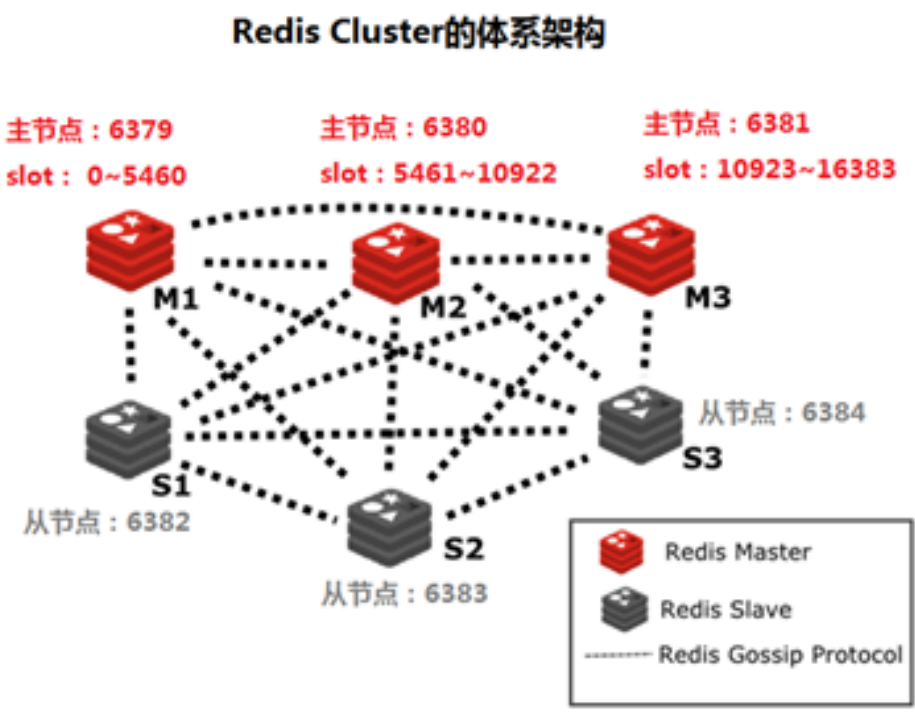

#### 3.3.2.2 redis cluster 工作原理

##### 3.3.2.2.1 数据分区

如果是单机存储的话，直接将数据存放在单机redis就行了。但是如果是集群存储，就需要考虑到数据分区了。

数据分区通常采取顺序分布和hash分布。

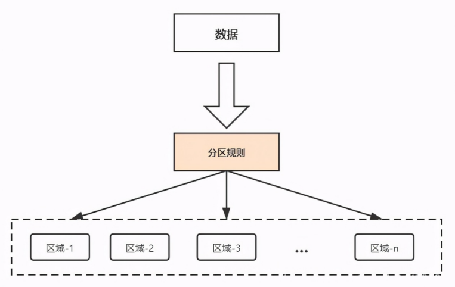

| 分布方式   | 顺序分布 |
| ---------- | -------- |
| 数据分散度 | 分布倾斜 |
| 顺序访问   | 支持     |

顺序分布保障了数据的有序性，但是离散性低，可能导致某个分区的数据热度高，其他分区数据的热度低，分区访问不均衡。

哈希分布也分为多种分布方式，比如区域哈希分区，一致性哈希分区等。而redis cluster采用的是虚拟槽分区的方式。

**虚拟槽分区**

redis cluster设置有0~16383的槽，每个槽映射一个数据子集，通过hash函数，将数据存放在不同的槽位中，每个集群的节点保存一部分的槽。

每个key存储时，先经过算法函数CRC16(key)得到一个整数，然后整数与16384取余，得到槽的数值，然后找到对应的节点，将数据存放入对应的槽中。

**CRC16** **算法**

```bash
CRC16（Cyclic Redundancy Check 16）是一种错误检测码，而不是严格意义上的哈希算法。CRC16主要用于检测数据传输或存储过程中的错误，它通过在数据块上执行一系列数学运算来生成一个检验值（校验码），以便在接收端验证数据的完整性。
确定性是哈希函数和校验码算法的一个重要特性，确保相同的输入始终产生相同的输出，这样可以在需要时进行可靠的数据验证。与哈希函数类似，CRC算法也有这个属性，但它们在设计和应用上有一些关键的区别。
```

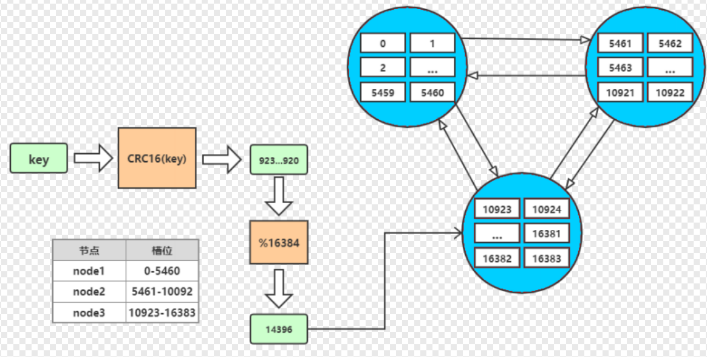

**集群通信**

但是寻找槽的过程并不是一次就命中的，比如上图key将要存放在14396槽中，但是并不是一下就锁定了node3节点，可能先去询问node1，然后才访问node3。

而集群中节点之间的通信，保证了最多两次就能命中对应槽所在的节点。因为在每个节点中，都保存了其他节点的信息，知道哪个槽由哪个节点负责。这样即使第一次访问没有命中槽，但是会通知客户端，该槽在哪个节点，这样访问对应节点就能精准命中。


1. 节点A对节点B发送一个meet操作，B返回后表示A和B之间能够进行沟通。
2. 节点A对节点C发送meet操作，C返回后，A和C之间也能进行沟通。
3. 然后B根据对A的了解，就能找到C，B和C之间也建立了联系。
4. 直到所有节点都能建立联系。

这样每个节点都能互相知道对方负责哪些槽

##### 3.3.2.2.2 集群伸缩

集群并不是建立之后，节点数就固定不变的，也会有新的节点加入集群或者集群中的节点下线，这就是集群的扩容和缩容。但是由于集群节点和槽息息相关，所以集群的伸缩也对应了槽和数据的迁移

**集群扩容**

当有新的节点准备好加入集群时，这个新的节点还是孤立节点，加入有两种方式。一个是通过集群节点执行命令来和孤立节点握手，另一个则是使用脚本来添加节点。

1. cluster_node_ip:port: cluster meet ip port new_node_ip:port

2. redis-trib.rb add-node new_node_ip:port cluster_node_ip:port

通常这个新的节点有两种身份，要么作为主节点，要么作为从节点：

主节点：分摊槽和数据

从节点：作故障转移备份

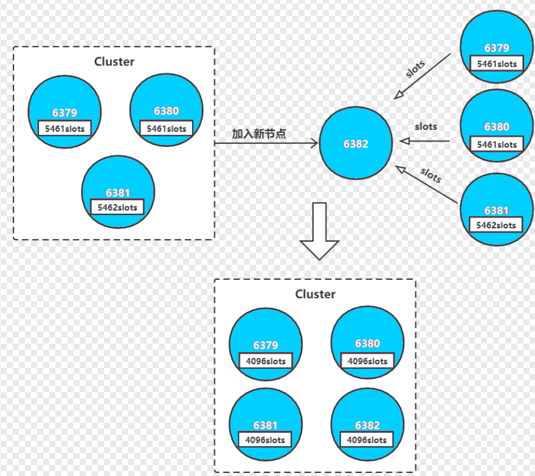

**其中槽的迁移有以下步骤：**


**集群缩容**

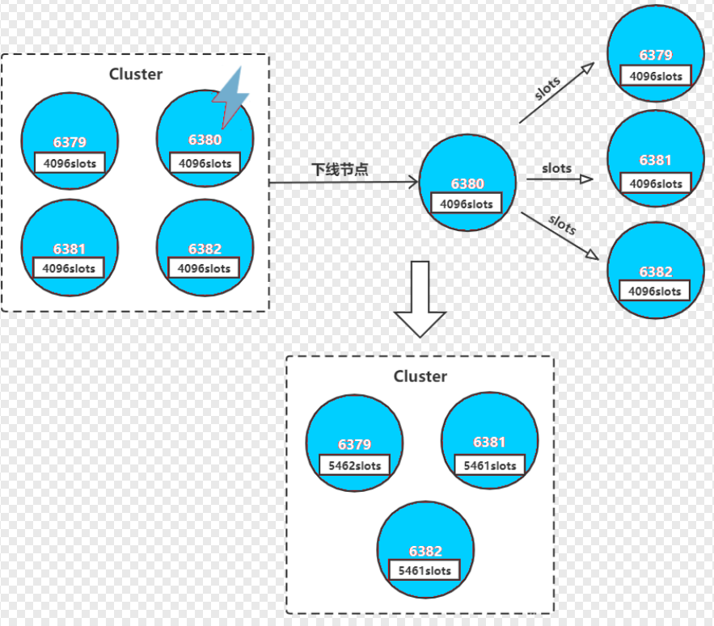

**下线节点的流程如下：**

1. 判断该节点是否持有槽，如果未持有槽就跳转到下一步，持有槽则先迁移槽到其他节点

2. 通知其他节点（**cluster forget**）忘记该下线节点

3. 关闭下线节点的服务

需要注意的是如果先下线主节点，再下线从节点，会进行故障转移，所以要先下线从节点。

##### 3.3.2.2.3 故障转移

**除了手动下线节点外，也会面对突发故障。**下面提到的主要是主节点的故障，因为从节点的故障并不影响主节点工作，对应的主节点只会记住自己哪个从节点下线了，并将信息发送给其他节点。故障的从节点重连后，继续官复原职，复制主节点的数据。

只有主节点才需要进行故障转移。在之前学习主从复制时，我们需要使用redis sentinel来实现故障转移。而redis cluster则不需要redis sentinel，其自身就具备了故障转移功能。根据前面我们了解到，节点之间是会进行通信的，节点之间通过ping/pong交互消息，所以借此就能发现故障。集群节点发现故障同样是有主观下线和客观下线的

**主观下线**

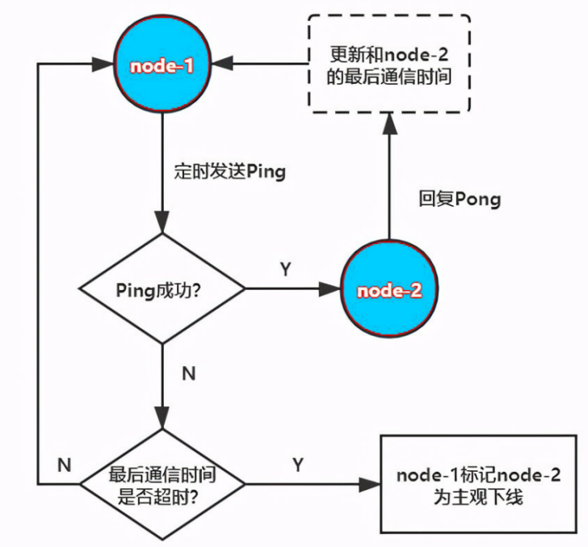

对于每个节点有一个故障列表，故障列表维护了当前节点接收到的其他所有节点的信息。当半数以上的持有槽的主节点都标记某个节点主观下线，就会尝试客观下线。

**客观下线**

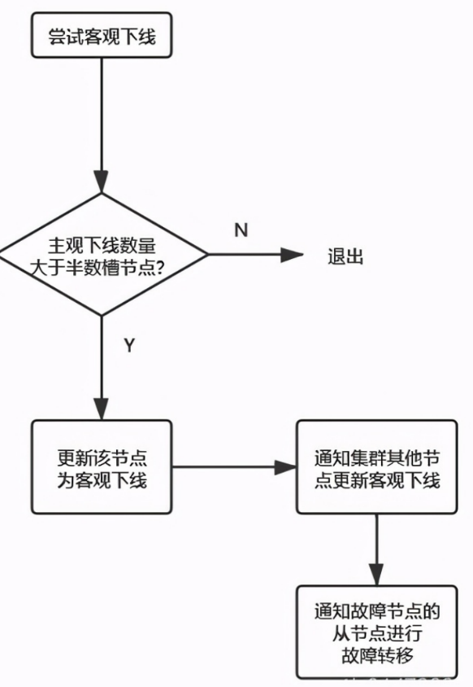

**故障转移**

集群同样具备了自动转移故障的功能，和哨兵有些类似，在进行客观下线之后，就开始准备让故障节点的从节点“上任”了。

首先是进行**资格检查**，只有具备资格的从节点才能参加选举：

- 故障节点的所有从节点检查和故障主节点之间的断线时间
- 超过cluster-node-timeout * cluster-slave-validati-factor(默认10)则取消选举资格

然后是准备**选举顺序**，不同偏移量的节点，参与选举的顺位不同。offset最大的slave节点，选举顺位最高，最优先选举。而offset较低的slave节点，要延迟选举。

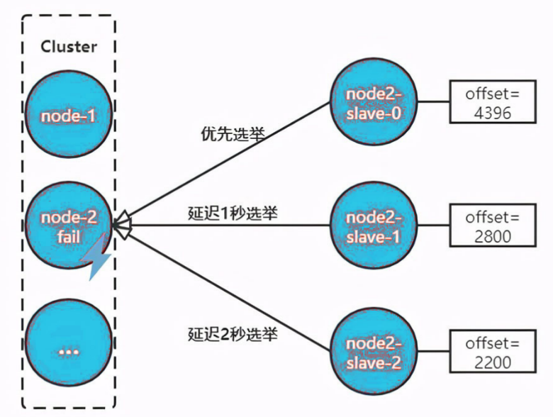

当有从节点参加选举后，主节点收到信息就开始投票。偏移量最大的节点，优先参与选举就更大可能获得最多的票数，称为主节点。

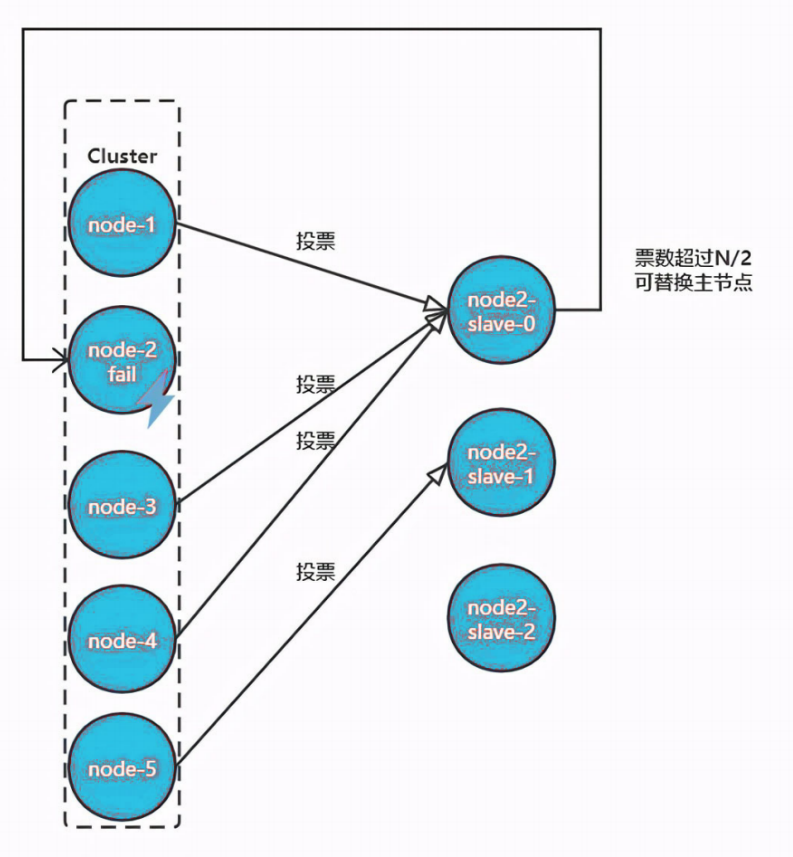

当从节点走马上任变成主节点之后，就要开始进行**替换主节点**：

1. 让该slave节点执行slaveof no one变为master节点

2. 将故障节点负责的槽分配给该节点

3. 向集群中其他节点广播Pong消息，表明已完成故障转移

4. 故障节点重启后，会成为new_master的slave节点

#### 3.3.2.3 redis cluster 部署架构说明

**注意: 建立Redis Cluster 的节点需要清空数据，另外网络中不要有Redis哨兵的主从，否则也可能会干扰集群的创建及扩缩容**
测试环境：3台服务器，每台服务器启动6379和6380两个redis 服务实例，适用于测试环境

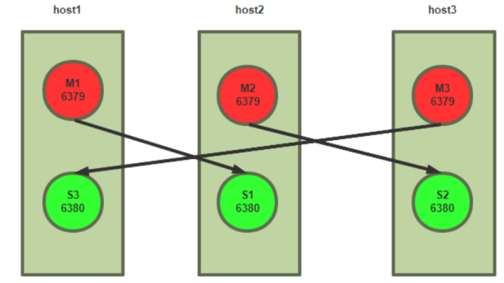

生产环境：6台服务器，分别是三组master/slave，适用于生产环境


**说明：Redis 5.X 和之前版本相比有较大变化，以下分别介绍两个版本5.X和4.X的配置**

#### 3.3.2.4 部署方式

redis cluster 有多种部署方法

- 原生命令安装

  理解Redis Cluster架构

  生产环境不使用

- 官方工具安装

  高效、准确

  生产环境可以使用

- 自主研发

  可以实现可视化的自动化部署

### 3.3.3 基于 Redis 5 以上版本的 Redis Cluster 部署

官方文档：https://redis.io/topics/cluster-tutorial

**redis cluster** **相关命令**

范例: 查看 --cluster 选项帮助

```
[root@centos8 ~]#redis-cli --cluster help
Cluster Manager Commands:
 create         host1:port1 ... hostN:portN
                 --cluster-replicas <arg>
 check         host:port
                 --cluster-search-multiple-owners
 info           host:port
 fix           host:port
                 --cluster-search-multiple-owners
 reshard       host:port
                 --cluster-from <arg>
                 --cluster-to <arg>
                 --cluster-slots <arg>
                 --cluster-yes
                 --cluster-timeout <arg>
                 --cluster-pipeline <arg>
                 --cluster-replace
 rebalance     host:port
                 --cluster-weight <node1=w1...nodeN=wN>
                 --cluster-use-empty-masters
                 --cluster-timeout <arg>
                 --cluster-simulate
                 --cluster-pipeline <arg>
                 --cluster-threshold <arg>
                 --cluster-replace
 add-node       new_host:new_port existing_host:existing_port
                 --cluster-slave
                 --cluster-master-id <arg>
 del-node       host:port node_id
 call           host:port command arg arg .. arg
 set-timeout   host:port milliseconds
 import         host:port
                 --cluster-from <arg>
                 --cluster-copy
....
```

#### 3.3.3.1 创建 Redis Cluster 集群的环境准备

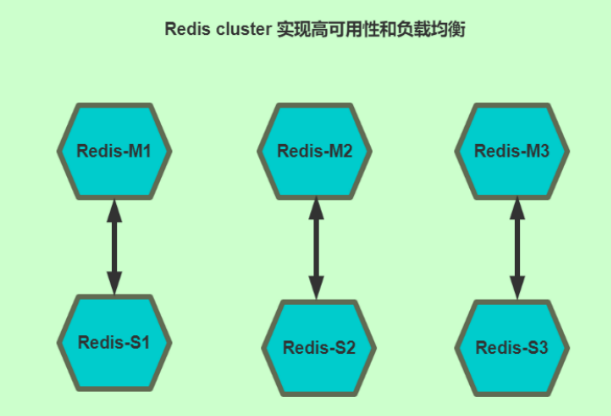

每个Redis 节点采用相同的相同的Redis版本、相同的密码、硬件配置

所有Redis服务器必须没有任何数据

准备六台主机，地址如下：

```
192.168.121.11
192.168.121.12
192.168.121.13
192.168.121.111
192.168.121.113
192.168.121.221
```

#### 3.3.3.2 启用 redis cluster 配置

```bash
#手动修改配置文件
[root@redis-node1 ~]vim /etc/redis.conf
bind 0.0.0.0
masterauth 123456   #建议配置，否则后期的master和slave主从复制无法成功，还需再配置
requirepass 123456
cluster-enabled yes #取消此行注释,必须开启集群，开启后 redis 进程会有cluster标识
cluster-config-file nodes-6379.conf #取消此行注释,此为集群状态数据文件,记录主从关系及slot范围信息,由redis cluster 集群自动创建和维护
cluster-require-full-coverage no   #默认值为yes,设为no可以防止一个节点不可用导致整个cluster不可用
```

#### 3.3.3.3 创建集群

```bash
#下面命令在集群节点或任意集群外节点执行皆可，命令redis-cli的选项 --cluster-replicas 1 表示每个master对应一个slave节点,注意：所有节点数据必须清空
[root@redis-node1 ~]#redis-cli -a 123456 --cluster create 10.0.0.8:6379   10.0.0.18:6379   10.0.0.28:6379   10.0.0.38:6379   10.0.0.48:6379   10.0.0.58:6379 --cluster-replicas 1 
Warning: Using a password with '-a' or '-u' option on the command line interface 
may not be safe.
>>> Performing hash slots allocation on 6 nodes...
Master[0] -> Slots 0 - 5460
Master[1] -> Slots 5461 - 10922
Master[2] -> Slots 10923 - 16383
Adding replica 10.0.0.38:6379 to 10.0.0.8:6379
Adding replica 10.0.0.48:6379 to 10.0.0.18:6379
Adding replica 10.0.0.58:6379 to 10.0.0.28:6379
M: cb028b83f9dc463d732f6e76ca6bbcd469d948a7 10.0.0.8:6379 #带M的为master
   slots:[0-5460] (5461 slots) master #当前master的槽位起始和结束位
M: 99720241248ff0e4c6fa65c2385e92468b3b5993 10.0.0.18:6379
   slots:[5461-10922] (5462 slots) master
M: d34da8666a6f587283a1c2fca5d13691407f9462 10.0.0.28:6379
   slots:[10923-16383] (5461 slots) master
S: f9adcfb8f5a037b257af35fa548a26ffbadc852d 10.0.0.38:6379  #带S的slave
   replicates cb028b83f9dc463d732f6e76ca6bbcd469d948a7      
S: d04e524daec4d8e22bdada7f21a9487c2d3e1057 10.0.0.48:6379
   replicates 99720241248ff0e4c6fa65c2385e92468b3b5993
S: 9875b50925b4e4f29598e6072e5937f90df9fc71 10.0.0.58:6379
   replicates d34da8666a6f587283a1c2fca5d13691407f9462
Can I set the above configuration? (type 'yes' to accept): yes #输入yes自动创建集群
>>> Nodes configuration updated
>>> Assign a different config epoch to each node
>>> Sending CLUSTER MEET messages to join the cluster
Waiting for the cluster to join
....
>>> Performing Cluster Check (using node 10.0.0.8:6379)
M: cb028b83f9dc463d732f6e76ca6bbcd469d948a7 10.0.0.8:6379
   slots:[0-5460] (5461 slots) master #已经分配的槽位
   1 additional replica(s)   #分配了一个slave
S: 9875b50925b4e4f29598e6072e5937f90df9fc71 10.0.0.58:6379
   slots: (0 slots) slave   #slave没有分配槽位
   replicates d34da8666a6f587283a1c2fca5d13691407f9462  #对应的master的10.0.0.28的
ID
S: f9adcfb8f5a037b257af35fa548a26ffbadc852d 10.0.0.38:6379
   slots: (0 slots) slave
   replicates cb028b83f9dc463d732f6e76ca6bbcd469d948a7 #对应的master的10.0.0.8的ID
S: d04e524daec4d8e22bdada7f21a9487c2d3e1057 10.0.0.48:6379
   slots: (0 slots) slave
   replicates 99720241248ff0e4c6fa65c2385e92468b3b5993 #对应的master的10.0.0.18的
ID
M: 99720241248ff0e4c6fa65c2385e92468b3b5993 10.0.0.18:6379
   slots:[5461-10922] (5462 slots) master
   1 additional replica(s)
M: d34da8666a6f587283a1c2fca5d13691407f9462 10.0.0.28:6379
   slots:[10923-16383] (5461 slots) master
   1 additional replica(s)
[OK] All nodes agree about slots configuration.  #所有节点槽位分配完成
>>> Check for open slots... #检查打开的槽位
>>> Check slots coverage... #检查插槽覆盖范围
[OK] All 16384 slots covered. #所有槽位(16384个)分配完成
#观察以上结果，可以看到3组master/slave
master:10.0.0.8---slave:10.0.0.38
master:10.0.0.18---slave:10.0.0.48
master:10.0.0.28---slave:10.0.0.58


#如果节点少于3个会出下面提示错误
[root@node1 ~]#redis-cli -a 123456 --cluster create 10.0.0.8:6379   
10.0.0.18:6379 
Warning: Using a password with '-a' or '-u' option on the command line interface 
may not be safe.
*** ERROR: Invalid configuration for cluster creation.
*** Redis Cluster requires at least 3 master nodes.
*** This is not possible with 2 nodes and 0 replicas per node.
*** At least 3 nodes are required.


```

#### 3.3.3.4 验证集群状态

##### 3.3.3.4.1 查看主从状态

```bash
[root@redis-node1 ~]#redis-cli -a 123456 -c INFO replication
Warning: Using a password with '-a' or '-u' option on the command line interface 
may not be safe.
# Replication
role:master
connected_slaves:1
slave0:ip=10.0.0.38,port=6379,state=online,offset=896,lag=1
master_replid:3a388865080d779180ff240cb75766e7e57877da
master_replid2:0000000000000000000000000000000000000000
master_repl_offset:896
second_repl_offset:-1
repl_backlog_active:1
repl_backlog_size:1048576
repl_backlog_first_byte_offset:1
repl_backlog_histlen:896
[root@redis-node2 ~]#redis-cli -a 123456 INFO replication
Warning: Using a password with '-a' or '-u' option on the command line interface 
may not be safe.
# Replication
role:master
connected_slaves:1
slave0:ip=10.0.0.48,port=6379,state=online,offset=980,lag=1
master_replid:b9066d3cbf0c5fecc7f4d1d5cb2433999783fa3f
master_replid2:0000000000000000000000000000000000000000
master_repl_offset:980
second_repl_offset:-1
repl_backlog_active:1
repl_backlog_size:1048576
repl_backlog_first_byte_offset:1
repl_backlog_histlen:980
[root@redis-node3 ~]#redis-cli -a 123456 INFO replication
Warning: Using a password with '-a' or '-u' option on the command line interface 
may not be safe.
# Replication
role:master
connected_slaves:1
slave0:ip=10.0.0.58,port=6379,state=online,offset=980,lag=0
master_replid:53208e0ed9305d721e2fb4b3180f75c689217902
master_replid2:0000000000000000000000000000000000000000
master_repl_offset:980
second_repl_offset:-1
repl_backlog_active:1
repl_backlog_size:1048576
repl_backlog_first_byte_offset:1
repl_backlog_histlen:980
[root@redis-node4 ~]#redis-cli -a 123456 INFO replication
Warning: Using a password with '-a' or '-u' option on the command line interface 
may not be safe.
# Replication
role:slave
master_host:10.0.0.8
master_port:6379
master_link_status:up
master_last_io_seconds_ago:1
master_sync_in_progress:0
slave_repl_offset:1036
slave_priority:100
slave_read_only:1
connected_slaves:0
master_replid:3a388865080d779180ff240cb75766e7e57877da
master_replid2:0000000000000000000000000000000000000000
master_repl_offset:1036
second_repl_offset:-1
repl_backlog_active:1
repl_backlog_size:1048576
repl_backlog_first_byte_offset:1
repl_backlog_histlen:1036
[root@redis-node5 ~]#redis-cli -a 123456 INFO replication
Warning: Using a password with '-a' or '-u' option on the command line interface 
may not be safe.
# Replication
role:slave
master_host:10.0.0.18
master_port:6379
master_link_status:up
master_last_io_seconds_ago:2
master_sync_in_progress:0
slave_repl_offset:1064
slave_priority:100
slave_read_only:1
connected_slaves:0
master_replid:b9066d3cbf0c5fecc7f4d1d5cb2433999783fa3f
master_replid2:0000000000000000000000000000000000000000
master_repl_offset:1064
second_repl_offset:-1
repl_backlog_active:1
repl_backlog_size:1048576
repl_backlog_first_byte_offset:1
repl_backlog_histlen:1064
[root@redis-node6 ~]#redis-cli -a 123456 INFO replication
Warning: Using a password with '-a' or '-u' option on the command line interface 
may not be safe.
# Replication
role:slave
master_host:10.0.0.28
master_port:6379
master_link_status:up
master_last_io_seconds_ago:7
master_sync_in_progress:0
slave_repl_offset:1078
slave_priority:100
slave_read_only:1
connected_slaves:0
master_replid:53208e0ed9305d721e2fb4b3180f75c689217902
master_replid2:0000000000000000000000000000000000000000
master_repl_offset:1078
second_repl_offset:-1
repl_backlog_active:1
repl_backlog_size:1048576
repl_backlog_first_byte_offset:

```

范例: 查看指定master节点的slave节点信息

```bash
[root@centos8 ~]#redis-cli -a 123456 cluster nodes 
4f146b1ac51549469036a272c60ea97f065ef832 10.0.0.28:6379@16379 master - 0
1602571565772 12 connected 10923-16383
779a24884dbe1ceb848a685c669ec5326e6c8944 10.0.0.48:6379@16379 slave 
97c5dcc3f33c2fc75c7fdded25d05d2930a312c0 0 1602571565000 11 connected
97c5dcc3f33c2fc75c7fdded25d05d2930a312c0 10.0.0.18:6379@16379 master - 0
1602571564000 11 connected 5462-10922
07231a50043d010426c83f3b0788e6b92e62050f 10.0.0.58:6379@16379 slave 
4f146b1ac51549469036a272c60ea97f065ef832 0 1602571565000 12 connected
a177c5cbc2407ebb6230ea7e2a7de914bf8c2dab 10.0.0.8:6379@16379 myself,master - 0
1602571566000 10 connected 0-5461
cb20d58870fe05de8462787cf9947239f4bc5629 10.0.0.38:6379@16379 slave 
a177c5cbc2407ebb6230ea7e2a7de914bf8c2dab 0 1602571566780 10 connected
#以下命令查看指定master节点的slave节点信息,其中
#a177c5cbc2407ebb6230ea7e2a7de914bf8c2dab 为master节点的ID
[root@centos8 ~]#redis-cli -a 123456 cluster slaves 
a177c5cbc2407ebb6230ea7e2a7de914bf8c2dab
1) "cb20d58870fe05de8462787cf9947239f4bc5629 10.0.0.38:6379@16379 slave 
a177c5cbc2407ebb6230ea7e2a7de914bf8c2dab 0 1602571574844 10 connected"
```

##### 3.3.3.4.2 验证集群状态

```bash
[root@redis-node1 ~]#redis-cli -a 123456 CLUSTER INFO
Warning: Using a password with '-a' or '-u' option on the command line interface 
may not be safe.
cluster_state:ok
cluster_slots_assigned:16384
cluster_slots_ok:16384
cluster_slots_pfail:0
cluster_slots_fail:0
cluster_known_nodes:6  #节点数
cluster_size:3                        #三个集群
cluster_current_epoch:6
cluster_my_epoch:1
cluster_stats_messages_ping_sent:837
cluster_stats_messages_pong_sent:811
cluster_stats_messages_sent:1648
cluster_stats_messages_ping_received:806
cluster_stats_messages_pong_received:837
cluster_stats_messages_meet_received:5
cluster_stats_messages_received:1648
#查看任意节点的集群状态
[root@redis-node1 ~]#redis-cli -a 123456 --cluster info 10.0.0.38:6379
Warning: Using a password with '-a' or '-u' option on the command line interface 
may not be safe.
10.0.0.18:6379 (99720241...) -> 0 keys | 5462 slots | 1 slaves.
10.0.0.28:6379 (d34da866...) -> 0 keys | 5461 slots | 1 slaves.
10.0.0.8:6379 (cb028b83...) -> 0 keys | 5461 slots | 1 slaves.
[OK] 0 keys in 3 masters.
0.00 keys per slot on average.
```

#### 3.3.3.5 测试集群写入数据

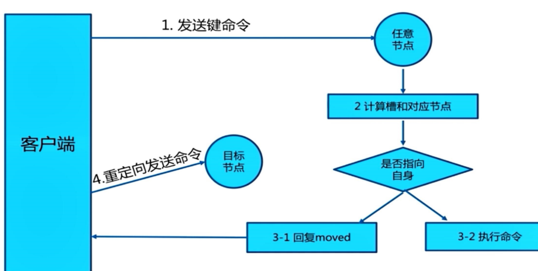

##### 3.3.3.5.1 redis cluster 写入 key

```bash
#经过算法计算，当前key的槽位需要写入指定的node
[root@redis-node1 ~]#redis-cli -a 123456 -h 10.0.0.8 SET key1 values1
Warning: Using a password with '-a' or '-u' option on the command line interface may not be safe.
(error) MOVED 9189 10.0.0.18:6379    #槽位不在当前node所以无法写入
#指定槽位对应node可写入
[root@redis-node1 ~]#redis-cli -a 123456 -h 10.0.0.18 SET key1 values1
Warning: Using a password with '-a' or '-u' option on the command line interface may not be safe.
OK
[root@redis-node1 ~]#redis-cli -a 123456 -h 10.0.0.18 GET key1
Warning: Using a password with '-a' or '-u' option on the command line interface may not be safe.
"values1"
#对应的slave节点可以KEYS *,但GET key1失败,可以到master上执行GET key1
[root@redis-node1 ~]#redis-cli -a 123456 -h 10.0.0.48 KEYS "*"
Warning: Using a password with '-a' or '-u' option on the command line interface may not be safe.
1) "key1"
[root@redis-node1 ~]#redis-cli -a 123456 -h 10.0.0.48 GET key1
Warning: Using a password with '-a' or '-u' option on the command line interface may not be safe.
(error)
```

#####  3.3.3.5.2 redis cluster 计算key所属的slot

```bash
[root@centos8 ~]#redis-cli -h 10.0.0.8 -a 123456 --no-auth-warning cluster 
nodes
4f146b1ac51549469036a272c60ea97f065ef832 10.0.0.28:6379@16379 master - 0
1602561649000 12 connected 10923-16383
779a24884dbe1ceb848a685c669ec5326e6c8944 10.0.0.48:6379@16379 slave 
97c5dcc3f33c2fc75c7fdded25d05d2930a312c0 0 1602561648000 11 connected
97c5dcc3f33c2fc75c7fdded25d05d2930a312c0 10.0.0.18:6379@16379 master - 0
1602561650000 11 connected 5462-10922
07231a50043d010426c83f3b0788e6b92e62050f 10.0.0.58:6379@16379 slave 
4f146b1ac51549469036a272c60ea97f065ef832 0 1602561650229 12 connected
a177c5cbc2407ebb6230ea7e2a7de914bf8c2dab 10.0.0.8:6379@16379 myself,master - 0
1602561650000 10 connected 0-5461
cb20d58870fe05de8462787cf9947239f4bc5629 10.0.0.38:6379@16379 slave 
a177c5cbc2407ebb6230ea7e2a7de914bf8c2dab 0 1602561651238 10 connected
#计算得到hello对应的slot
[root@centos8 ~]#redis-cli -h 10.0.0.8 -a 123456 --no-auth-warning cluster 
keyslot hello
(integer) 866
[root@centos8 ~]#redis-cli -h 10.0.0.8 -a 123456 --no-auth-warning set hello 
wange
OK
[root@centos8 ~]#redis-cli -h 10.0.0.8 -a 123456 --no-auth-warning cluster 
keyslot name 
(integer) 5798
[root@centos8 ~]#redis-cli -h 10.0.0.8 -a 123456 --no-auth-warning set name 
wang
(error) MOVED 5798 10.0.0.18:6379
[root@centos8 ~]#redis-cli -h 10.0.0.18 -a 123456 --no-auth-warning set name 
wang
OK
[root@centos8 ~]#redis-cli -h 10.0.0.18 -a 123456 --no-auth-warning get name
"wang"
#使用选项-c 以集群模式连接
[root@centos8 ~]#redis-cli -c -h 10.0.0.8 -a 123456 --no-auth-warning 
10.0.0.8:6379> cluster keyslot linux
(integer) 12299
10.0.0.8:6379> set linux love
-> Redirected to slot [12299] located at 10.0.0.28:6379
OK
10.0.0.28:6379> get linux 
"love"
10.0.0.28:6379> exit
[root@centos8 ~]#redis-cli -h 10.0.0.28 -a 123456 --no-auth-warning get linux
"love"
```

#### 3.3.3.6 python 实现 redis cluster 访问

```bash
[root@ubuntu2204 ~]#apt -y install python3-pip 
[root@ubuntu2204 ~]#pip3 install redis-py-cluster
[root@redis-node1 ~]#dnf -y install python3
[root@redis-node1 ~]#pip3 install redis-py-cluster
[root@redis-node1 ~]#vim redis_cluster_test.py
[root@redis-node1 ~]#cat ./redis_cluster_test.py 
#!/usr/bin/env python3
from rediscluster  import RedisCluster
startup_nodes = [
   {"host":"10.0.0.8", "port":6379},
   {"host":"10.0.0.18", "port":6379},
   {"host":"10.0.0.28", "port":6379},
   {"host":"10.0.0.38", "port":6379},
   {"host":"10.0.0.48", "port":6379},
   {"host":"10.0.0.58", "port":6379} ]
redis_conn= RedisCluster(startup_nodes=startup_nodes,password='123456', 
decode_responses=True)
for i in range(0, 10000):
    redis_conn.set('key'+str(i),'value'+str(i))
    print('key'+str(i)+':',redis_conn.get('key'+str(i)))
[root@redis-node1 ~]#chmod +x redis_cluster_test.py
[root@redis-node1 ~]#./redis_cluster_test.py
......
key9998: value9998
key9999: value9999


#验证数据
[root@redis-node1 ~]#redis-cli -a 123456 -h 10.0.0.8
Warning: Using a password with '-a' or '-u' option on the command line interface
may not be safe.
10.0.0.8:6379> DBSIZE
(integer) 3331
10.0.0.8:6379> GET key1
(error) MOVED 9189 10.0.0.18:6379
10.0.0.8:6379> GET key2
"value2"
10.0.0.8:6379> GET key3
"value3"
10.0.0.8:6379> KEYS *
......
3329) "key7832"
3330) "key2325"
3331) "key2880"
10.0.0.8:6379> [root@redis-node1 ~]#redis-cli -a 123456 -h 10.0.0.18 DBSIZE
Warning: Using a password with '-a' or '-u' option on the command line interface may not be safe. (integer) 3340
[root@redis-node1 ~]#redis-cli -a 123456 -h 10.0.0.18 GET key1
Warning: Using a password with '-a' or '-u' option on the command line interface may not be safe.
"value1"
[root@redis-node1 ~]#redis-cli -a 123456 -h 10.0.0.28 DBSIZE
Warning: Using a password with '-a' or '-u' option on the command line interface may not be safe. (integer) 3329
[root@redis-node1 ~]#redis-cli -a 123456 -h 10.0.0.18 GET key5
Warning: Using a password with '-a' or '-u' option on the command line interface may not be safe.
"value5"
[root@redis-node1 ~]#
```

#### 3.3.3.7 模拟实现故障转移

```bash
#模拟node2节点出故障,需要相应的数秒故障转移时间
[root@redis-node2 ~]#tail -f /var/log/redis/redis.log  
[root@redis-node2 ~]#redis-cli -a 123456
Warning: Using a password with '-a' or '-u' option on the command line interface 
may not be safe.
127.0.0.1:6379> shutdown
not connected> exit
[root@redis-node2 ~]#ss -ntl
State       Recv-Q       Send-Q Local Address:Port Peer Address:Port        
LISTEN       0             128           0.0.0.0:22         0.0.0.0:*           
LISTEN       0             100         127.0.0.1:25         0.0.0.0:*           
LISTEN       0             128             [::]:22           [::]:*           
LISTEN       0             100             [::1]:25           [::]:*   
[root@redis-node2 ~]# redis-cli -a 123456 --cluster info 10.0.0.8:6379
Warning: Using a password with '-a' or '-u' option on the command line interface 
may not be safe.
Could not connect to Redis at 10.0.0.18:6379: Connection refused
10.0.0.8:6379 (cb028b83...) -> 3331 keys | 5461 slots | 1 slaves.
10.0.0.48:6379 (d04e524d...) -> 3340 keys | 5462 slots | 0 slaves. #10.0.0.48为新
的master
10.0.0.28:6379 (d34da866...) -> 3329 keys | 5461 slots | 1 slaves.
[OK] 10000 keys in 3 masters.
0.61 keys per slot on average.
[root@redis-node2 ~]# redis-cli -a 123456 --cluster check 10.0.0.8:6379
Warning: Using a password with '-a' or '-u' option on the command line interface 
may not be safe.
Could not connect to Redis at 10.0.0.18:6379: Connection refused
10.0.0.8:6379 (cb028b83...) -> 3331 keys | 5461 slots | 1 slaves.
10.0.0.48:6379 (d04e524d...) -> 3340 keys | 5462 slots | 0 slaves.
10.0.0.28:6379 (d34da866...) -> 3329 keys | 5461 slots | 1 slaves.
[OK] 10000 keys in 3 masters.
0.61 keys per slot on average.
>>> Performing Cluster Check (using node 10.0.0.8:6379)
M: cb028b83f9dc463d732f6e76ca6bbcd469d948a7 10.0.0.8:6379
   slots:[0-5460] (5461 slots) master
   1 additional replica(s)
S: 9875b50925b4e4f29598e6072e5937f90df9fc71 10.0.0.58:6379
   slots: (0 slots) slave
   replicates d34da8666a6f587283a1c2fca5d13691407f9462
S: f9adcfb8f5a037b257af35fa548a26ffbadc852d 10.0.0.38:6379
   slots: (0 slots) slave
   replicates cb028b83f9dc463d732f6e76ca6bbcd469d948a7
M: d04e524daec4d8e22bdada7f21a9487c2d3e1057 10.0.0.48:6379
   slots:[5461-10922] (5462 slots) master
M: d34da8666a6f587283a1c2fca5d13691407f9462 10.0.0.28:6379
   slots:[10923-16383] (5461 slots) master
   1 additional replica(s)
[OK] All nodes agree about slots configuration.
>>> Check for open slots...
>>> Check slots coverage...
[OK] All 16384 slots covered.
[root@redis-node2 ~]#redis-cli -a 123456 -h 10.0.0.48
Warning: Using a password with '-a' or '-u' option on the command line interface 
may not be safe.
10.0.0.48:6379> INFO replication
# Replication
role:master
connected_slaves:0
master_replid:0000698bc2c6452d8bfba68246350662ae41d8fd
master_replid2:b9066d3cbf0c5fecc7f4d1d5cb2433999783fa3f
master_repl_offset:2912424
second_repl_offset:2912425
repl_backlog_active:1
repl_backlog_size:1048576
repl_backlog_first_byte_offset:1863849
repl_backlog_histlen:1048576
10.0.0.48:6379> 
#恢复故障节点node2自动成为slave节点
[root@redis-node2 ~]#systemctl start redis
#查看自动生成的配置文件，可以查看node2自动成为slave节点
[root@redis-node2 ~]#cat /var/lib/redis/nodes-6379.conf
99720241248ff0e4c6fa65c2385e92468b3b5993 10.0.0.18:6379@16379 myself,slave 
d04e524daec4d8e22bdada7f21a9487c2d3e1057 0 1582352081847 2 connected
f9adcfb8f5a037b257af35fa548a26ffbadc852d 10.0.0.38:6379@16379 slave 
cb028b83f9dc463d732f6e76ca6bbcd469d948a7 1582352081868 1582352081847 4 connected
cb028b83f9dc463d732f6e76ca6bbcd469d948a7 10.0.0.8:6379@16379 master -
1582352081868 1582352081847 1 connected 0-5460
9875b50925b4e4f29598e6072e5937f90df9fc71 10.0.0.58:6379@16379 slave 
d34da8666a6f587283a1c2fca5d13691407f9462 1582352081869 1582352081847 3 connected
d04e524daec4d8e22bdada7f21a9487c2d3e1057 10.0.0.48:6379@16379 master -
1582352081869 1582352081847 7 connected 5461-10922
d34da8666a6f587283a1c2fca5d13691407f9462 10.0.0.28:6379@16379 master -
1582352081869 1582352081847 3 connected 10923-16383
vars currentEpoch 7 lastVoteEpoch 0
[root@redis-node2 ~]#redis-cli -a 123456 -h 10.0.0.48
Warning: Using a password with '-a' or '-u' option on the command line interface 
may not be safe.
10.0.0.48:6379> INFO replication
# Replication
role:master
connected_slaves:1
slave0:ip=10.0.0.18,port=6379,state=online,offset=2912564,lag=1
master_replid:0000698bc2c6452d8bfba68246350662ae41d8fd
master_replid2:b9066d3cbf0c5fecc7f4d1d5cb2433999783fa3f
master_repl_offset:2912564
second_repl_offset:2912425
repl_backlog_active:1
repl_backlog_size:1048576
repl_backlog_first_byte_offset:1863989
repl_backlog_histlen:1048576
10.0.0.48:6379>
```

### 3.3.4基于 Redis 5 以上版本的 Redis Cluster 部署

### 3.3.5 redis cluster 管理

#### 3.3.5.1 集群扩容

扩容适用场景：
当前客户量激增，现有的Redis cluster架构已经无法满足越来越高的并发访问请求，为解决此问题,新购置两台服务器，要求将其动态添加到现有集群，但不能影响业务的正常访问。
新版支持集群中有旧数据的情况进行扩容
注意: 生产环境一般建议master节点为奇数个,比如:3,5,7,以防止脑裂现象

##### 3.3.5.1.1 扩容准备

增加Redis 新节点，需要与之前的Redis node版本和配置一致，然后分别再启动两台Redis node，应为一主一从。

```bash
#配置node7节点
[root@redis-node7 ~]#dnf -y install redis
[root@redis-node7 ~]#sed -i.bak -e 's/bind 127.0.0.1/bind 0.0.0.0/' -e '/masterauth/a masterauth 123456' -e '/# requirepass/a requirepass 123456' -e '/# cluster-enabled yes/a cluster-enabled yes' -e '/# cluster-config-file nodes-6379.conf/a cluster-config-file nodes-6379.conf' -e '/cluster-require-full-coverage yes/c cluster-require-full-coverage no' /etc/redis.conf 
#编译安装执行下面操作
[root@redis-node7 ~]#sed -i.bak -e '/masterauth/a masterauth 123456' -e '/# cluster-enabled yes/a cluster-enabled yes' -e '/# cluster-config-file nodes-6379.conf/a cluster-config-file nodes-6379.conf' -e '/cluster-require-full-coverage yes/c cluster-require-full-coverage no' /apps/redis/etc/redis.conf;systemctl restart redis
[root@redis-node7 ~]#systemctl enable --now redis

```

##### 3.3.5.1.2  添加新的master节点到集群

使用以下命令添加新节点，要添加的新redis节点IP和端口添加到的已有的集群中任意节点的IP:端口

```bash
add-node new_host:new_port existing_host:existing_port [--slave --master-id<arg>]
#说明：
new_host:new_port #指定新添加的主机的IP和端口
existing_host:existing_port #指定已有的集群中任意节点的IP和端口
```

Redis 3/4 版本的添加命令：

```bash
#把新的Redis 节点10.0.0.37添加到当前Redis集群当中。
[root@redis-node1 ~]#redis-trib.rb add-node 10.0.0.37:6379 10.0.0.7:6379
[root@redis-node1 ~]#redis-trib.rb info 10.0.0.7:6379
10.0.0.7:6379 (29a83275...) -> 3331 keys | 5461 slots | 1 slaves.
10.0.0.37:6379 (12ca273a...) -> 0 keys | 0 slots | 0 slaves.
10.0.0.27:6379 (90b20613...) -> 3329 keys | 5461 slots | 1 slaves.
10.0.0.17:6379 (fb34c3a7...) -> 3340 keys | 5462 slots | 1 slaves.
[OK] 10000 keys in 4 masters.
0.61 keys per slot on average.
```

Redis 5 以上版本的添加命令：

```bash
#将一台新的主机10.0.0.68加入集群,以下示例中10.0.0.58可以是任意存在的集群节点
[root@redis-node1 ~]#redis-cli -a 123456 --cluster add-node 10.0.0.68:6379 <当前任意集群节点>:6379
Warning: Using a password with '-a' or '-u' option on the command line interface 
may not be safe.
>>> Adding node 10.0.0.68:6379 to cluster 10.0.0.58:6379
>>> Performing Cluster Check (using node 10.0.0.58:6379)
S: 9875b50925b4e4f29598e6072e5937f90df9fc71 10.0.0.58:6379
   slots: (0 slots) slave
   replicates d34da8666a6f587283a1c2fca5d13691407f9462
M: d04e524daec4d8e22bdada7f21a9487c2d3e1057 10.0.0.48:6379
   slots:[5461-10922] (5462 slots) master
   1 additional replica(s)
M: d34da8666a6f587283a1c2fca5d13691407f9462 10.0.0.28:6379
   slots:[10923-16383] (5461 slots) master
   1 additional replica(s)
S: 99720241248ff0e4c6fa65c2385e92468b3b5993 10.0.0.18:6379
   slots: (0 slots) slave
   replicates d04e524daec4d8e22bdada7f21a9487c2d3e1057
S: f9adcfb8f5a037b257af35fa548a26ffbadc852d 10.0.0.38:6379
   slots: (0 slots) slave
   replicates cb028b83f9dc463d732f6e76ca6bbcd469d948a7
M: cb028b83f9dc463d732f6e76ca6bbcd469d948a7 10.0.0.8:6379
   slots:[0-5460] (5461 slots) master
   1 additional replica(s)
[OK] All nodes agree about slots configuration.
>>> Check for open slots...
>>> Check slots coverage...
[OK] All 16384 slots covered.
>>> Send CLUSTER MEET to node 10.0.0.68:6379 to make it join the cluster.
[OK] New node added correctly.
#观察到该节点已经加入成功，但此节点上没有slot位,也无从节点，而且新的节点是master
[root@redis-node1 ~]#redis-cli -a 123456 --cluster info 10.0.0.8:6379
Warning: Using a password with '-a' or '-u' option on the command line interface 
may not be safe.
10.0.0.8:6379 (cb028b83...) -> 6672 keys | 5461 slots | 1 slaves.
10.0.0.68:6379 (d6e2eca6...) -> 0 keys | 0 slots | 0 slaves.
10.0.0.48:6379 (d04e524d...) -> 6679 keys | 5462 slots | 1 slaves.
10.0.0.28:6379 (d34da866...) -> 6649 keys | 5461 slots | 1 slaves.
[OK] 20000 keys in 5 masters.
1.22 keys per slot on average.
[root@redis-node1 ~]#redis-cli -a 123456 --cluster check 10.0.0.8:6379
Warning: Using a password with '-a' or '-u' option on the command line interface 
may not be safe.
10.0.0.8:6379 (cb028b83...) -> 6672 keys | 5461 slots | 1 slaves.
10.0.0.68:6379 (d6e2eca6...) -> 0 keys | 0 slots | 0 slaves.
10.0.0.48:6379 (d04e524d...) -> 6679 keys | 5462 slots | 1 slaves.
10.0.0.28:6379 (d34da866...) -> 6649 keys | 5461 slots | 1 slaves.
[OK] 20000 keys in 5 masters.
1.22 keys per slot on average.
>>> Performing Cluster Check (using node 10.0.0.8:6379)
M: cb028b83f9dc463d732f6e76ca6bbcd469d948a7 10.0.0.8:6379
   slots:[0-5460] (5461 slots) master
   1 additional replica(s)
M: d6e2eca6b338b717923f64866bd31d42e52edc98 10.0.0.68:6379
   slots: (0 slots) master
S: 9875b50925b4e4f29598e6072e5937f90df9fc71 10.0.0.58:6379
   slots: (0 slots) slave
   replicates d34da8666a6f587283a1c2fca5d13691407f9462
S: f9adcfb8f5a037b257af35fa548a26ffbadc852d 10.0.0.38:6379
   slots: (0 slots) slave
   replicates cb028b83f9dc463d732f6e76ca6bbcd469d948a7
M: d04e524daec4d8e22bdada7f21a9487c2d3e1057 10.0.0.48:6379
   slots:[5461-10922] (5462 slots) master
   1 additional replica(s)
S: 99720241248ff0e4c6fa65c2385e92468b3b5993 10.0.0.18:6379
   slots: (0 slots) slave
   replicates d04e524daec4d8e22bdada7f21a9487c2d3e1057
M: d34da8666a6f587283a1c2fca5d13691407f9462 10.0.0.28:6379
   slots:[10923-16383] (5461 slots) master
   1 additional replica(s)
[OK] All nodes agree about slots configuration.
>>> Check for open slots...
>>> Check slots coverage...
[OK] All 16384 slots covered.
[root@redis-node1 ~]#cat /var/lib/redis/nodes-6379.conf
d6e2eca6b338b717923f64866bd31d42e52edc98 10.0.0.68:6379@16379 master - 0
1582356107260 8 connected
9875b50925b4e4f29598e6072e5937f90df9fc71 10.0.0.58:6379@16379 slave 
d34da8666a6f587283a1c2fca5d13691407f9462 0 1582356110286 6 connected
f9adcfb8f5a037b257af35fa548a26ffbadc852d 10.0.0.38:6379@16379 slave 
cb028b83f9dc463d732f6e76ca6bbcd469d948a7 0 1582356108268 4 connected
d04e524daec4d8e22bdada7f21a9487c2d3e1057 10.0.0.48:6379@16379 master - 0
1582356105000 7 connected 5461-10922
99720241248ff0e4c6fa65c2385e92468b3b5993 10.0.0.18:6379@16379 slave 
d04e524daec4d8e22bdada7f21a9487c2d3e1057 0 1582356108000 7 connected
d34da8666a6f587283a1c2fca5d13691407f9462 10.0.0.28:6379@16379 master - 0
1582356107000 3 connected 10923-16383
cb028b83f9dc463d732f6e76ca6bbcd469d948a7 10.0.0.8:6379@16379 myself,master - 0
1582356106000 1 connected 0-5460
vars currentEpoch 8 lastVoteEpoch 7 #和上面显示结果一样
[root@redis-node1 ~]#redis-cli -a 123456 CLUSTER NODES
Warning: Using a password with '-a' or '-u' option on the command line interface 
may not be safe.
d6e2eca6b338b717923f64866bd31d42e52edc98 10.0.0.68:6379@16379 master - 0
1582356313200 8 connected
9875b50925b4e4f29598e6072e5937f90df9fc71 10.0.0.58:6379@16379 slave 
d34da8666a6f587283a1c2fca5d13691407f9462 0 1582356311000 6 connected
f9adcfb8f5a037b257af35fa548a26ffbadc852d 10.0.0.38:6379@16379 slave 
cb028b83f9dc463d732f6e76ca6bbcd469d948a7 0 1582356314208 4 connected
d04e524daec4d8e22bdada7f21a9487c2d3e1057 10.0.0.48:6379@16379 master - 0
1582356311182 7 connected 5461-10922
99720241248ff0e4c6fa65c2385e92468b3b5993 10.0.0.18:6379@16379 slave 
d04e524daec4d8e22bdada7f21a9487c2d3e1057 0 1582356312000 7 connected
d34da8666a6f587283a1c2fca5d13691407f9462 10.0.0.28:6379@16379 master - 0
1582356312190 3 connected 10923-16383
cb028b83f9dc463d732f6e76ca6bbcd469d948a7 10.0.0.8:6379@16379 myself,master - 0
1582356310000 1 connected 0-5460
#查看集群状态
[root@redis-node1 ~]#redis-cli -a 123456 CLUSTER INFO
Warning: Using a password with '-a' or '-u' option on the command line interface 
may not be safe.
cluster_state:ok
cluster_slots_assigned:16384
cluster_slots_ok:16384
cluster_slots_pfail:0
cluster_slots_fail:0
cluster_known_nodes:7
cluster_size:3
cluster_current_epoch:8
cluster_my_epoch:1
cluster_stats_messages_ping_sent:17442
cluster_stats_messages_pong_sent:13318
cluster_stats_messages_fail_sent:4
cluster_stats_messages_auth-ack_sent:1
cluster_stats_messages_sent:30765
cluster_stats_messages_ping_received:13311
cluster_stats_messages_pong_received:13367
cluster_stats_messages_meet_received:7
cluster_stats_messages_fail_received:1
cluster_stats_messages_auth-req_received:1
```

##### 3.3.5.1.3 在新的master上重新分配槽位

新的node节点加到集群之后,默认是master节点，但是没有slots，需要重新分配,否则没有槽位将无法访问
注意: 旧版本重新分配槽位需要清空数据,所以需要先备份数据,扩展后再恢复数据,新版支持有数据直接扩容
Redis 3/4 版本命令:

```bash
[root@redis-node1 ~]# redis-trib.rb check 10.0.0.67:6379 #当前状态
[root@redis-node1 ~]# redis-trib.rb reshard <任意节点>:6379 #重新分片
[root@redis-node1 ~]# redis-trib.rb fix 10.0.0.67:6379 #如果迁移失败使用此命令修复集群
```

Redis 5以上版本命令：

```bash
[root@redis-node1 ~]#redis-cli -a 123456 --cluster reshard <当前任意集群节点>:6379
Warning: Using a password with '-a' or '-u' option on the command line interface may not be safe.
>>> Performing Cluster Check (using node 10.0.0.68:6379)
M: d6e2eca6b338b717923f64866bd31d42e52edc98 10.0.0.68:6379
   slots: (0 slots) master
M: d34da8666a6f587283a1c2fca5d13691407f9462 10.0.0.28:6379
   slots:[10923-16383] (5461 slots) master
   1 additional replica(s)
M: d04e524daec4d8e22bdada7f21a9487c2d3e1057 10.0.0.48:6379
   slots:[5461-10922] (5462 slots) master
   1 additional replica(s)
M: cb028b83f9dc463d732f6e76ca6bbcd469d948a7 10.0.0.8:6379
   slots:[0-5460] (5461 slots) master
   1 additional replica(s)
S: 99720241248ff0e4c6fa65c2385e92468b3b5993 10.0.0.18:6379
   slots: (0 slots) slave
   replicates d04e524daec4d8e22bdada7f21a9487c2d3e1057
M: f67f1c02c742cd48d3f48d8c362f9f1b9aa31549 10.0.0.78:6379
   slots: (0 slots) master
S: f9adcfb8f5a037b257af35fa548a26ffbadc852d 10.0.0.38:6379
   slots: (0 slots) slave
   replicates cb028b83f9dc463d732f6e76ca6bbcd469d948a7
S: 9875b50925b4e4f29598e6072e5937f90df9fc71 10.0.0.58:6379
   slots: (0 slots) slave
   replicates d34da8666a6f587283a1c2fca5d13691407f9462
[OK] All nodes agree about slots configuration.
>>> Check for open slots...
>>> Check slots coverage...
[OK] All 16384 slots covered.
How many slots do you want to move (from 1 to 16384)?4096 #新分配多少个槽位
=16384/master个数
What is the receiving node ID? d6e2eca6b338b717923f64866bd31d42e52edc98 #新的
master的ID
Please enter all the source node IDs.
 Type 'all' to use all the nodes as source nodes for the hash slots.
 Type 'done' once you entered all the source nodes IDs.
Source node #1: all #输入all,将哪些源主机的槽位分配给新的节点，all是自动在所有的redis 
node选择划分，如果是从redis cluster删除某个主机可以使用此方式将指定主机上的槽位全部移动到别的
redis主机
......
Do you want to proceed with the proposed reshard plan (yes/no)?  yes #确认分配
......
Moving slot 12280 from 10.0.0.28:6379 to 10.0.0.68:6379: .
Moving slot 12281 from 10.0.0.28:6379 to 10.0.0.68:6379: .
Moving slot 12282 from 10.0.0.28:6379 to 10.0.0.68:6379: 
Moving slot 12283 from 10.0.0.28:6379 to 10.0.0.68:6379: ..
Moving slot 12284 from 10.0.0.28:6379 to 10.0.0.68:6379: 
Moving slot 12285 from 10.0.0.28:6379 to 10.0.0.68:6379: .
Moving slot 12286 from 10.0.0.28:6379 to 10.0.0.68:6379: 
Moving slot 12287 from 10.0.0.28:6379 to 10.0.0.68:6379: ..
[root@redis-node1 ~]# #确定slot分配成功
[root@redis-node1 ~]#redis-cli -a 123456 --cluster check 10.0.0.8:6379
Warning: Using a password with '-a' or '-u' option on the command line interface may not be safe.
10.0.0.8:6379 (cb028b83...) -> 5019 keys | 4096 slots | 1 slaves.
10.0.0.68:6379 (d6e2eca6...) -> 4948 keys | 4096 slots | 0 slaves.
10.0.0.48:6379 (d04e524d...) -> 5033 keys | 4096 slots | 1 slaves.
10.0.0.28:6379 (d34da866...) -> 5000 keys | 4096 slots | 1 slaves.
[OK] 20000 keys in 5 masters.
1.22 keys per slot on average.
>>> Performing Cluster Check (using node 10.0.0.8:6379)
M: cb028b83f9dc463d732f6e76ca6bbcd469d948a7 10.0.0.8:6379
   slots:[1365-5460] (4096 slots) master
   1 additional replica(s)
M: d6e2eca6b338b717923f64866bd31d42e52edc98 10.0.0.68:6379
   slots:[0-1364],[5461-6826],[10923-12287] (4096 slots) master #可看到4096个slots
S: 9875b50925b4e4f29598e6072e5937f90df9fc71 10.0.0.58:6379
   slots: (0 slots) slave
   replicates d34da8666a6f587283a1c2fca5d13691407f9462
S: f9adcfb8f5a037b257af35fa548a26ffbadc852d 10.0.0.38:6379
   slots: (0 slots) slave
   replicates cb028b83f9dc463d732f6e76ca6bbcd469d948a7
M: d04e524daec4d8e22bdada7f21a9487c2d3e1057 10.0.0.48:6379
   slots:[6827-10922] (4096 slots) master
   1 additional replica(s)
S: 99720241248ff0e4c6fa65c2385e92468b3b5993 10.0.0.18:6379
   slots: (0 slots) slave
   replicates d04e524daec4d8e22bdada7f21a9487c2d3e1057
M: d34da8666a6f587283a1c2fca5d13691407f9462 10.0.0.28:6379
   slots:[12288-16383] (4096 slots) master
   1 additional replica(s)
[OK] All nodes agree about slots configuration.
>>> Check for open slots...
>>> Check slots coverage...
[OK] All 16384 slots covered.
```

##### 3.3.5.1.4 为新的master指定新的slave节点

当前Redis集群中新的master节点存单点问题,还需要给其添加一个对应slave节点，实现高可用功能有两种方式：
方法1：在新加节点到集群时，直接将之设置为slave
Redis 3/4 添加命令：

```bash
redis-trib.rb   add-node --slave --master-id 
750cab050bc81f2655ed53900fd43d2e64423333 10.0.0.77:6379 <任意集群节点>:6379
```

Redis 5 以上版本添加命令：

```
redis-cli -a 123456 --cluster add-node 10.0.0.78:6379 <任意集群节点>:6379 --cluster-slave --cluster-master-id d6e2eca6b338b717923f64866bd31d42e52edc98
```

```bash
#查看当前状态
[root@redis-node1 ~]#redis-cli -a 123456 --cluster check 10.0.0.8:6379
Warning: Using a password with '-a' or '-u' option on the command line interface 
may not be safe.
10.0.0.8:6379 (cb028b83...) -> 5019 keys | 4096 slots | 1 slaves.
10.0.0.68:6379 (d6e2eca6...) -> 4948 keys | 4096 slots | 0 slaves.
10.0.0.48:6379 (d04e524d...) -> 5033 keys | 4096 slots | 1 slaves.
10.0.0.28:6379 (d34da866...) -> 5000 keys | 4096 slots | 1 slaves.
[OK] 20000 keys in 4 masters.
1.22 keys per slot on average.
>>> Performing Cluster Check (using node 10.0.0.8:6379)
M: cb028b83f9dc463d732f6e76ca6bbcd469d948a7 10.0.0.8:6379
   slots:[1365-5460] (4096 slots) master
   1 additional replica(s)
M: d6e2eca6b338b717923f64866bd31d42e52edc98 10.0.0.68:6379
   slots:[0-1364],[5461-6826],[10923-12287] (4096 slots) master
S: 9875b50925b4e4f29598e6072e5937f90df9fc71 10.0.0.58:6379
   slots: (0 slots) slave
   replicates d34da8666a6f587283a1c2fca5d13691407f9462
S: f9adcfb8f5a037b257af35fa548a26ffbadc852d 10.0.0.38:6379
   slots: (0 slots) slave
   replicates cb028b83f9dc463d732f6e76ca6bbcd469d948a7
M: d04e524daec4d8e22bdada7f21a9487c2d3e1057 10.0.0.48:6379
   slots:[6827-10922] (4096 slots) master
   1 additional replica(s)
S: 99720241248ff0e4c6fa65c2385e92468b3b5993 10.0.0.18:6379
   slots: (0 slots) slave
   replicates d04e524daec4d8e22bdada7f21a9487c2d3e1057
M: d34da8666a6f587283a1c2fca5d13691407f9462 10.0.0.28:6379
   slots:[12288-16383] (4096 slots) master
   1 additional replica(s)
[OK] All nodes agree about slots configuration.
>>> Check for open slots...
>>> Check slots coverage...
[OK] All 16384 slots covered.
#直接加为slave节点
[root@redis-node1 ~]#redis-cli -a 123456 --cluster add-node 10.0.0.78:6379 
10.0.0.8:6379 --cluster-slave --cluster-master-id 
d6e2eca6b338b717923f64866bd31d42e52edc98
#验证是否成功
[root@redis-node1 ~]#redis-cli -a 123456 --cluster check 10.0.0.8:6379
Warning: Using a password with '-a' or '-u' option on the command line interface 
may not be safe.
10.0.0.8:6379 (cb028b83...) -> 5019 keys | 4096 slots | 1 slaves.
10.0.0.68:6379 (d6e2eca6...) -> 4948 keys | 4096 slots | 1 slaves.
10.0.0.48:6379 (d04e524d...) -> 5033 keys | 4096 slots | 1 slaves.
10.0.0.28:6379 (d34da866...) -> 5000 keys | 4096 slots | 1 slaves.
[OK] 20000 keys in 4 masters.
1.22 keys per slot on average.
>>> Performing Cluster Check (using node 10.0.0.8:6379)
M: cb028b83f9dc463d732f6e76ca6bbcd469d948a7 10.0.0.8:6379
   slots:[1365-5460] (4096 slots) master
   1 additional replica(s)
M: d6e2eca6b338b717923f64866bd31d42e52edc98 10.0.0.68:6379
   slots:[0-1364],[5461-6826],[10923-12287] (4096 slots) master
   1 additional replica(s)
S: 36840d7eea5835ba540d9b64ec018aa3f8de6747 10.0.0.78:6379
   slots: (0 slots) slave
   replicates d6e2eca6b338b717923f64866bd31d42e52edc98
S: 9875b50925b4e4f29598e6072e5937f90df9fc71 10.0.0.58:6379
   slots: (0 slots) slave
   replicates d34da8666a6f587283a1c2fca5d13691407f9462
S: f9adcfb8f5a037b257af35fa548a26ffbadc852d 10.0.0.38:6379
   slots: (0 slots) slave
   replicates cb028b83f9dc463d732f6e76ca6bbcd469d948a7
M: d04e524daec4d8e22bdada7f21a9487c2d3e1057 10.0.0.48:6379
   slots:[6827-10922] (4096 slots) master
   1 additional replica(s)
S: 99720241248ff0e4c6fa65c2385e92468b3b5993 10.0.0.18:6379
   slots: (0 slots) slave
   replicates d04e524daec4d8e22bdada7f21a9487c2d3e1057
M: d34da8666a6f587283a1c2fca5d13691407f9462 10.0.0.28:6379
   slots:[12288-16383] (4096 slots) master
   1 additional replica(s)
[OK] All nodes agree about slots configuration.
>>> Check for open slots...
>>> Check slots coverage...
[OK] All 16384 slots covered.
[root@centos8 ~]#redis-cli -a 123456 -h 10.0.0.8 --no-auth-warning cluster info
cluster_state:ok
cluster_slots_assigned:16384
cluster_slots_ok:16384
cluster_slots_pfail:0
cluster_slots_fail:0
cluster_known_nodes:8   #8个节点
cluster_size:4          #4组主从
cluster_current_epoch:11
cluster_my_epoch:10
cluster_stats_messages_ping_sent:1810
cluster_stats_messages_pong_sent:1423
```

方法2：先将新节点加入集群，再修改为slave
为新的master添加slave节点
Redis 3/4 版本命令：

```
[root@redis-node1 ~]#redis-trib.rb add-node 10.0.0.78:6379 10.0.0.8:6379
```

Redis 5 以上版本命令：

```
#把10.0.0.78:6379添加到集群中：
[root@redis-node1 ~]#redis-cli -a 123456 --cluster add-node 10.0.0.78:6379 10.0.0.8:6379
```

更改新节点更改状态为slave：
需要手动将其指定为某个master的slave，否则其默认角色为master。

```bash
[root@redis-node1 ~]#redis-cli -h 10.0.0.78 -p 6379 -a 123456 #登录到新添加节点
10.0.0.78:6380> CLUSTER NODES #查看当前集群节点，找到目标master 的ID
10.0.0.78:6380> CLUSTER REPLICATE 886338acd50c3015be68a760502b239f4509881c #将其设置slave，命令格式为cluster replicate MASTERID
10.0.0.78:6380> CLUSTER NODES #再次查看集群节点状态，验证节点是否已经更改为指定master 的slave
```

#### 3.3.5.2 集群缩容

支持集群中有旧数据的情况进行缩容
缩容适用场景：
随着业务萎缩用户量下降明显,和领导商量决定将现有Redis集群的8台主机中下线两台主机挪做它用,缩容后性能仍能满足当前业务需求
删除节点过程：
扩容时是先添加node到集群，然后再分配槽位，而缩容时的操作相反，是先将被要删除的node上的槽位迁移到集群中的其他node上，然后 才能再将其从集群中删除，如果一个node上的槽位没有被完全迁移空，删除该node时也会提示有数据出错导致无法删除。

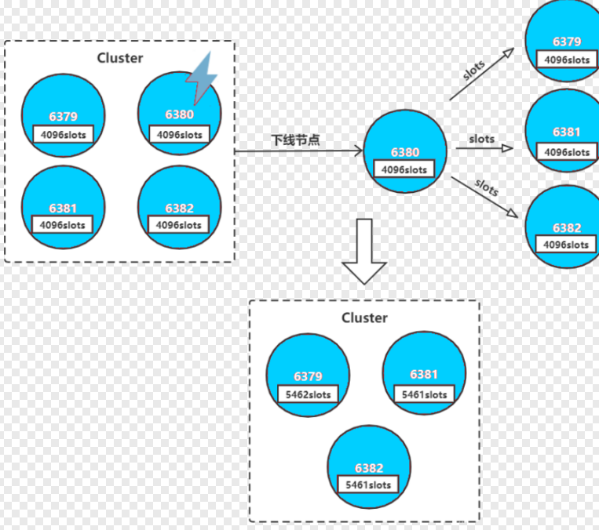

##### 3.3.5.2.1 迁移要删除的master节点上面的槽位到其它master

注意: 被迁移Redis master源服务器必须保证没有数据，否则迁移报错并会被强制中断。
Redis 3/4 版本命令

```
[root@redis-node1 ~]# redis-trib.rb reshard 10.0.0.8:6379
[root@redis-node1 ~]# redis-trib.rb fix 10.0.0.8:6379 #如果迁移失败使用此命令修复集群
```

Redis 5+ 版本命令

```bash
#查看当前状态
[root@redis-node1 ~]#redis-cli -a 123456 --cluster check 10.0.0.8:6379
Warning: Using a password with '-a' or '-u' option on the command line interface 
may not be safe.
10.0.0.8:6379 (cb028b83...) -> 5019 keys | 4096 slots | 1 slaves.
10.0.0.68:6379 (d6e2eca6...) -> 4948 keys | 4096 slots | 1 slaves.
10.0.0.48:6379 (d04e524d...) -> 5033 keys | 4096 slots | 1 slaves.
10.0.0.28:6379 (d34da866...) -> 5000 keys | 4096 slots | 1 slaves.
[OK] 20000 keys in 4 masters.
1.22 keys per slot on average.
>>> Performing Cluster Check (using node 10.0.0.8:6379)
M: cb028b83f9dc463d732f6e76ca6bbcd469d948a7 10.0.0.8:6379
   slots:[1365-5460] (4096 slots) master
   1 additional replica(s)
M: d6e2eca6b338b717923f64866bd31d42e52edc98 10.0.0.68:6379
   slots:[0-1364],[5461-6826],[10923-12287] (4096 slots) master
   1 additional replica(s)
#连接到任意集群节点，#最后1365个slot从10.0.0.8移动到第一个master节点10.0.0.28上
[root@redis-node1 ~]#redis-cli -a 123456 --cluster reshard 10.0.0.18:6379
Warning: Using a password with '-a' or '-u' option on the command line interface 
may not be safe.
>>> Performing Cluster Check (using node 10.0.0.18:6379)
S: 99720241248ff0e4c6fa65c2385e92468b3b5993 10.0.0.18:6379
   slots: (0 slots) slave
   replicates d04e524daec4d8e22bdada7f21a9487c2d3e1057
S: f9adcfb8f5a037b257af35fa548a26ffbadc852d 10.0.0.38:6379
   slots: (0 slots) slave
   replicates cb028b83f9dc463d732f6e76ca6bbcd469d948a7
S: 36840d7eea5835ba540d9b64ec018aa3f8de6747 10.0.0.78:6379
   slots: (0 slots) slave
   replicates d6e2eca6b338b717923f64866bd31d42e52edc98
M: cb028b83f9dc463d732f6e76ca6bbcd469d948a7 10.0.0.8:6379
   slots:[1365-5460] (4096 slots) master
   1 additional replica(s)
M: d6e2eca6b338b717923f64866bd31d42e52edc98 10.0.0.68:6379
   slots:[0-1364],[5461-6826],[10923-12287] (4096 slots) master
   1 additional replica(s)
S: 9875b50925b4e4f29598e6072e5937f90df9fc71 10.0.0.58:6379
   slots: (0 slots) slave
   replicates d34da8666a6f587283a1c2fca5d13691407f9462
M: d04e524daec4d8e22bdada7f21a9487c2d3e1057 10.0.0.48:6379
   slots:[6827-10922] (4096 slots) master
   1 additional replica(s)
M: d34da8666a6f587283a1c2fca5d13691407f9462 10.0.0.28:6379
   slots:[12288-16383] (4096 slots) master
   1 additional replica(s)
[OK] All nodes agree about slots configuration.
>>> Check for open slots...
>>> Check slots coverage...
[OK] All 16384 slots covered.
How many slots do you want to move (from 1 to 16384)? 1365 #共4096/3分别给其它三个master节点
What is the receiving node ID? d34da8666a6f587283a1c2fca5d13691407f9462 #master 
10.0.0.28
Please enter all the source node IDs.
 Type 'all' to use all the nodes as source nodes for the hash slots.
 Type 'done' once you entered all the source nodes IDs.
Source node #1: cb028b83f9dc463d732f6e76ca6bbcd469d948a7 #输入要删除节点10.0.0.8的ID
Source node #2: done
Ready to move 1356 slots.
 Source nodes:
   M: cb028b83f9dc463d732f6e76ca6bbcd469d948a7 10.0.0.8:6379
       slots:[1365-5460] (4096 slots) master
       1 additional replica(s)
 Destination node:
   M: d34da8666a6f587283a1c2fca5d13691407f9462 10.0.0.28:6379
       slots:[12288-16383] (4096 slots) master
       1 additional replica(s)
 Resharding plan:
   Moving slot 1365 from cb028b83f9dc463d732f6e76ca6bbcd469d948a7
......
 Moving slot 2719 from cb028b83f9dc463d732f6e76ca6bbcd469d948a7
   Moving slot 2720 from cb028b83f9dc463d732f6e76ca6bbcd469d948a7
Do you want to proceed with the proposed reshard plan (yes/no)? yes #确定
......
Moving slot 2718 from 10.0.0.8:6379 to 10.0.0.28:6379: ..
Moving slot 2719 from 10.0.0.8:6379 to 10.0.0.28:6379: .
Moving slot 2720 from 10.0.0.8:6379 to 10.0.0.28:6379: ..
#非交互式方式
#再将1365个slot从10.0.0.8移动到第二个master节点10.0.0.48上
[root@redis-node1 ~]#redis-cli -a 123456 --cluster reshard 10.0.0.18:6379 --
cluster-slots 1365 --cluster-from cb028b83f9dc463d732f6e76ca6bbcd469d948a7 --
cluster-to d04e524daec4d8e22bdada7f21a9487c2d3e1057 --cluster-yes
#最后的slot从10.0.0.8移动到第三个master节点10.0.0.68上
[root@redis-node1 ~]#redis-cli -a 123456 --cluster reshard 10.0.0.18:6379 --
cluster-slots 1375 --cluster-from cb028b83f9dc463d732f6e76ca6bbcd469d948a7 --
cluster-to d6e2eca6b338b717923f64866bd31d42e52edc98 --cluster-yes
#确认10.0.0.8的所有slot都移走了，上面的slave也自动删除，成为其它master的slave 
[root@redis-node1 ~]#redis-cli -a 123456 --cluster check 10.0.0.8:6379
Warning: Using a password with '-a' or '-u' option on the command line interface 
may not be safe.
10.0.0.8:6379 (cb028b83...) -> 0 keys | 0 slots | 0 slaves.
10.0.0.68:6379 (d6e2eca6...) -> 6631 keys | 5471 slots | 2 slaves.
10.0.0.48:6379 (d04e524d...) -> 6694 keys | 5461 slots | 1 slaves.
10.0.0.28:6379 (d34da866...) -> 6675 keys | 5452 slots | 1 slaves.
[OK] 20000 keys in 4 masters.
1.22 keys per slot on average.
>>> Performing Cluster Check (using node 10.0.0.8:6379)
M: cb028b83f9dc463d732f6e76ca6bbcd469d948a7 10.0.0.8:6379
   slots: (0 slots) master
M: d6e2eca6b338b717923f64866bd31d42e52edc98 10.0.0.68:6379
   slots:[0-1364],[4086-6826],[10923-12287] (5471 slots) master
   2 additional replica(s)
S: 36840d7eea5835ba540d9b64ec018aa3f8de6747 10.0.0.78:6379
   slots: (0 slots) slave
#原有的10.0.0.38自动成为10.0.0.68的slave
[root@redis-node1 ~]#redis-cli -a 123456 -h 10.0.0.68 INFO replication
Warning: Using a password with '-a' or '-u' option on the command line interface 
may not be safe.
# Replication
role:master
connected_slaves:2
slave0:ip=10.0.0.78,port=6379,state=online,offset=129390,lag=0
slave1:ip=10.0.0.38,port=6379,state=online,offset=129390,lag=0
master_replid:43e3e107a0acb1fd5a97240fc4b2bd8fc85b113f
master_replid2:0000000000000000000000000000000000000000
master_repl_offset:129404
second_repl_offset:-1
repl_backlog_active:1
repl_backlog_size:1048576
repl_backlog_first_byte_offset:1
repl_backlog_histlen:129404
[root@centos8 ~]#redis-cli -a 123456 -h 10.0.0.8 --no-auth-warning cluster info
cluster_state:ok
cluster_slots_assigned:16384
cluster_slots_ok:16384
cluster_slots_pfail:0
cluster_slots_fail:0
cluster_known_nodes:8  #集群中8个节点
cluster_size:3         #少了一个主从的slot
cluster_current_epoch:16
cluster_my_epoch:13
cluster_stats_messages_ping_sent:3165
cluster_stats_messages_pong_sent:2489
cluster_stats_messages_fail_sent:6
cluster_stats_messages_auth-req_sent:5
cluster_stats_messages_auth-ack_sent:1
cluster_stats_messages_update_sent:27
cluster_stats_messages_sent:5693
cluster_stats_messages_ping_received:2483
```

##### 3.3.5.2.2 从集群中删除服务器

上面步骤完成后,槽位已经迁移走，但是节点仍然还属于集群成员，因此还需从集群删除该节点

注意: 删除服务器前,必须清除主机上面的槽位,否则会删除主机失败

Redis 3/4命令

```bash
[root@s~]#redis-trib.rb del-node <任意集群节点的IP>:6379 dfffc371085859f2858730e1f350e9167e287073
#dfffc371085859f2858730e1f350e9167e287073 是删除节点的ID
>>> Removing node dfffc371085859f2858730e1f350e9167e287073 from cluster
192.168.7.102:6379
>>> Sending CLUSTER FORGET messages to the cluster...
>>> SHUTDOWN the node.
```

Redis 5以上版本命令：

```bash
[root@redis-node1 ~]#redis-cli -a 123456 --cluster del-node <任意集群节点的IP>:6379 cb028b83f9dc463d732f6e76ca6bbcd469d948a7
#cb028b83f9dc463d732f6e76ca6bbcd469d948a7是删除节点的ID
Warning: Using a password with '-a' or '-u' option on the command line interface 
may not be safe.
>>> Removing node cb028b83f9dc463d732f6e76ca6bbcd469d948a7 from cluster 
10.0.0.8:6379
>>> Sending CLUSTER FORGET messages to the cluster...
>>> SHUTDOWN the node. #删除节点后,redis进程自动关闭
#删除节点信息
[root@redis-node1 ~]#rm -f /var/lib/redis/nodes-6379.conf
```

##### 3.3.5.2.3 删除多余的slave节点验证结果

```bash
#验证删除成功
[root@redis-node1 ~]#ss -ntl
State       Recv-Q       Send-Q   Local Address:Port     Peer Address:Port     
   
LISTEN       0             128            0.0.0.0:22             0.0.0.0:*       
    
LISTEN       0             128               [::]:22               [::]:*  
[root@redis-node1 ~]#redis-cli -a 123456 --cluster check 10.0.0.18:6379 
Warning: Using a password with '-a' or '-u' option on the command line interface may not be safe.
10.0.0.68:6379 (d6e2eca6...) -> 6631 keys | 5471 slots | 2 slaves.
10.0.0.48:6379 (d04e524d...) -> 6694 keys | 5461 slots | 1 slaves.
10.0.0.28:6379 (d34da866...) -> 6675 keys | 5452 slots | 1 slaves.
[OK] 20000 keys in 3 masters.
1.22 keys per slot on average.
>>> Performing Cluster Check (using node 10.0.0.18:6379)
S: 99720241248ff0e4c6fa65c2385e92468b3b5993 10.0.0.18:6379
   slots: (0 slots) slave
   replicates d04e524daec4d8e22bdada7f21a9487c2d3e1057
S: f9adcfb8f5a037b257af35fa548a26ffbadc852d 10.0.0.38:6379
   slots: (0 slots) slave
   replicates d6e2eca6b338b717923f64866bd31d42e52edc98
S: 36840d7eea5835ba540d9b64ec018aa3f8de6747 10.0.0.78:6379
   slots: (0 slots) slave
   replicates d6e2eca6b338b717923f64866bd31d42e52edc98
M: d6e2eca6b338b717923f64866bd31d42e52edc98 10.0.0.68:6379
   slots:[0-1364],[4086-6826],[10923-12287] (5471 slots) master
   2 additional replica(s)
S: 9875b50925b4e4f29598e6072e5937f90df9fc71 10.0.0.58:6379
   slots: (0 slots) slave
   replicates d34da8666a6f587283a1c2fca5d13691407f9462
M: d04e524daec4d8e22bdada7f21a9487c2d3e1057 10.0.0.48:6379
   slots:[2721-4085],[6827-10922] (5461 slots) master
   1 additional replica(s)
M: d34da8666a6f587283a1c2fca5d13691407f9462 10.0.0.28:6379
   slots:[1365-2720],[12288-16383] (5452 slots) master
   1 additional replica(s)
[OK] All nodes agree about slots configuration.
>>> Check for open slots...
>>> Check slots coverage...
[OK] All 16384 slots covered.
#删除多余的slave从节点
[root@redis-node1 ~]#redis-cli -a 123456 --cluster del-node 10.0.0.18:6379 
f9adcfb8f5a037b257af35fa548a26ffbadc852d
Warning: Using a password with '-a' or '-u' option on the command line interface 
may not be safe.
>>> Removing node f9adcfb8f5a037b257af35fa548a26ffbadc852d from cluster 
10.0.0.18:6379
>>> Sending CLUSTER FORGET messages to the cluster...
>>> SHUTDOWN the node. #删除集群文件
[root@redis-node4 ~]#rm -f /var/lib/redis/nodes-6379.conf 
[root@redis-node1 ~]#redis-cli -a 123456 --cluster check 10.0.0.18:6379 
Warning: Using a password with '-a' or '-u' option on the command line interface 
may not be safe.
10.0.0.68:6379 (d6e2eca6...) -> 6631 keys | 5471 slots | 1 slaves.
10.0.0.48:6379 (d04e524d...) -> 6694 keys | 5461 slots | 1 slaves.
10.0.0.28:6379 (d34da866...) -> 6675 keys | 5452 slots | 1 slaves.
[OK] 20000 keys in 3 masters.
1.22 keys per slot on average.
>>> Performing Cluster Check (using node 10.0.0.18:6379)
S: 99720241248ff0e4c6fa65c2385e92468b3b5993 10.0.0.18:6379
   slots: (0 slots) slave
   replicates d04e524daec4d8e22bdada7f21a9487c2d3e1057
S: 36840d7eea5835ba540d9b64ec018aa3f8de6747 10.0.0.78:6379
   slots: (0 slots) slave
   replicates d6e2eca6b338b717923f64866bd31d42e52edc98
M: d6e2eca6b338b717923f64866bd31d42e52edc98 10.0.0.68:6379
[root@redis-node1 ~]#redis-cli -a 123456 --cluster info 10.0.0.18:6379 
Warning: Using a password with '-a' or '-u' option on the command line interface 
may not be safe.
10.0.0.68:6379 (d6e2eca6...) -> 6631 keys | 5471 slots | 1 slaves.
10.0.0.48:6379 (d04e524d...) -> 6694 keys | 5461 slots | 1 slaves.
10.0.0.28:6379 (d34da866...) -> 6675 keys | 5452 slots | 1 slaves.
[OK] 20000 keys in 3 masters.
1.22 keys per slot on average.
#查看集群信息
[root@redis-node1 ~]#redis-cli -a 123456 -h 10.0.0.18 CLUSTER INFO
Warning: Using a password with '-a' or '-u' option on the command line interface 
may not be safe.
cluster_state:ok
cluster_slots_assigned:16384
cluster_slots_ok:16384
cluster_slots_pfail:0
cluster_slots_fail:0
cluster_known_nodes:6  #只有6个节点
cluster_size:3
cluster_current_epoch:11
cluster_my_epoch:10
cluster_stats_messages_ping_sent:12147
cluster_stats_messages_pong_sent:12274
cluster_stats_messages_update_sent:14
cluster_stats_messages_sent:24435
cluster_stats_messages_ping_received:12271
cluster_stats_messages_pong_received:12147
cluster_stats_messages_meet_received:3
cluster_stats_messages_update_received:28
cluster_stats_messages_received:24449
```


# 面试题

## 1 Redis 应用场景

- 缓存：缓存RDBMS中数据,比如网站的查询结果、商品信息、微博、新闻、消息
- Session 共享：实现Web集群中的多服务器间的session共享
- 计数器：商品访问排行榜、浏览数、粉丝数、关注、点赞、评论等和次数相关的数值统计场景
- 社交：朋友圈、共同好友、可能认识他们等
- 地理位置: 基于地理信息系统GIS（Geographic Information System)实现摇一摇、附近的人、外卖等功能
- 消息队列：ELK等日志系统缓存、业务的订阅/发布系统

## 2 支持哪些备份机制？简单陈述RBD和AOF的区别？

- RDB
  - RDB 机制是生成一个压缩过后的二进制文件，可以通过该 rdb 文件将数据还原。因为 rdb 文件是存储在硬盘中，所以即使 redis 宕机，数据也可以恢复
  - RDB 机制支持 `save` 和 `bgsave` 两个命令去进行备份
    - `save` 是阻塞性机制，在备份没有完成时不会处理其他的请求
    - `bgsave` 会 fork 一个子进程去处理备份工作，其他请求依旧可以被处理
- AOF
  - 在第一次启动 AOF 时，是完全备份，后续采用的是增量备份
  - 在同时开启 RDB 和 AOF 时，AOF 的优先级高于 RDB
  - AOF 默认每秒执行一次 fsync，将命令同步到 AOF 文件中


## 3 简单陈述下Redis主从同步的逻辑？

1. redis 中采用读写分离来实现主从同步
2. 主节点支持数据写入和数据读取，从节点只支持数据读取
3. 所有节点在最初默认都是 master，需要在从节点上通过命令设置为 slave，指定 master 的地址和端口，并设置 master 密码

## 4 简单陈述下Redis的哨兵模式工作机制？


## 5 简单陈述下Redis Cluster模式，数据是如何存储的？

## 6 MySQL 和 redis 区别

1. MySQL 是关系型数据库，Redis 是非关系型数据库
2. 
## 7 redis 优化
